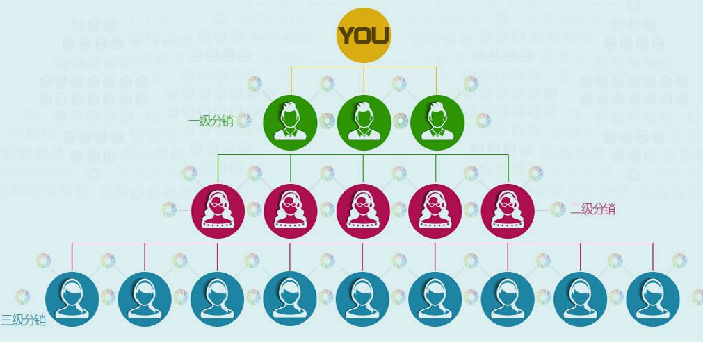
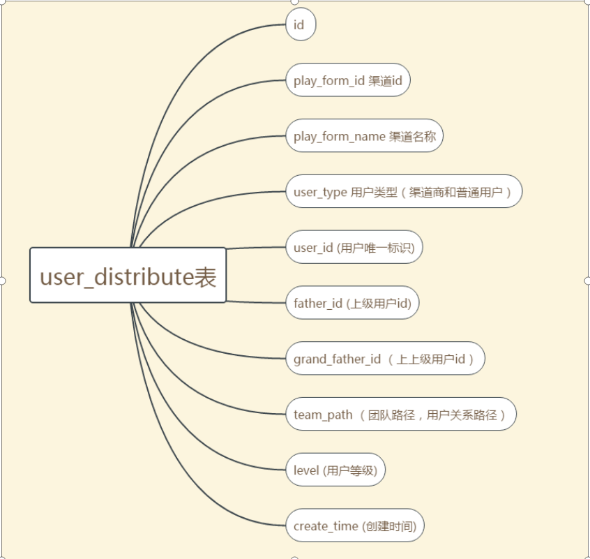
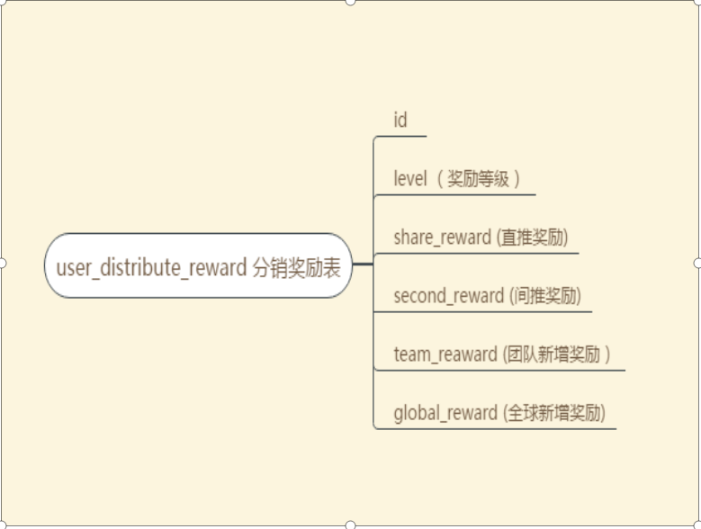
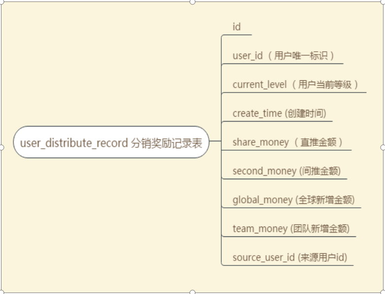
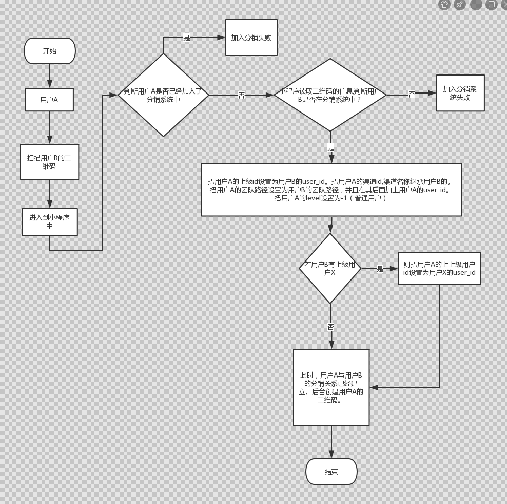
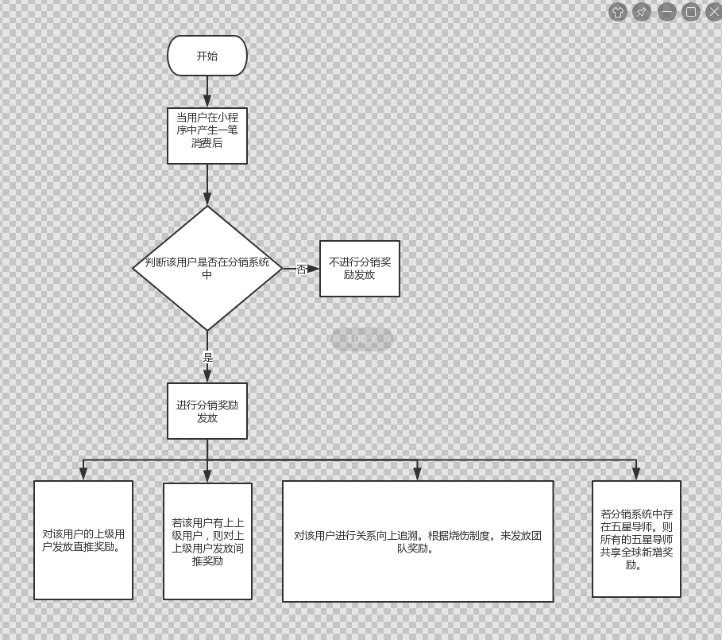

# 分销系统（简化版本）

## 1.介绍：

在分销系统中，有一个最上级用户(根用户)，其他用户都是该用户直接下级用户或间接下级用户。类似于下图：

这个简化版本的分销系统主要是通过以扫描二维码的方式来发展下级用户。==例如分销系统中的根用户是公司。每一个用户只有通过微信扫描公司或者别人的二维码，才能加入到分销系统中。并且在微信小程序中拥有一个专属的二维码。==

## 2.表的设计

user_distribute分销关系表字段介绍：
1. user_type:用户类型。0表示普通用户。1表示渠道商。
2. level:用户等级。-1表示普通用户。0表示为vip用户。1~5分别为1-5星导师用户。
3. father_id: 上级用户id。 若A是B的下级用户。则A的father_id 就是 B的user_id.
4. grand_father_id :上上级用户id。与father_id 同理。
5. team_path:用户关系路径。
例如： 用户A的team_path 是 A/ 。现在用户B是用户A的下级用户。则用户B			的team_path是 A/B/

user_distribute_reward表（A->B->C）：
1. level 奖励等级 ：分销系统中不同等级的用户，在分销系统中得到的奖励也不同。
2. share_reward 直推奖励：当用户B在小程序中产生一笔消费后，则用户B的上级用户（用户A）,得到一笔直推奖励。
3. seconf_reward 间推奖励：当用户C在小程序中产生一笔消费后，则用户C的上上级用户（用户A）得到一笔间推奖励。
4. team_reward 团队新增奖励：当某个团队中的用户产生一笔消费后，该团队中的一些特殊等级的用户（如导师），会得到一笔团队奖励。
5. global_reward 全球新增奖励：当整个分销系统中每产生一笔费用后,分销系统中所有等级最高的用户（五星导师，level5）会共享一笔费用。这个费用就是全球新增奖励。

user_distribute_record表：
1. 某个user_id 的用户在当前等级（current_level）下，在当前时间（create_time）下，得到一笔金额奖励（直推/间推/团队/全球）,该金额是来源于另一个用户（source_user_id）。

## 3.流程图：

### 1.加入分销系统的流程图

### 2.得到分销奖励流程图

