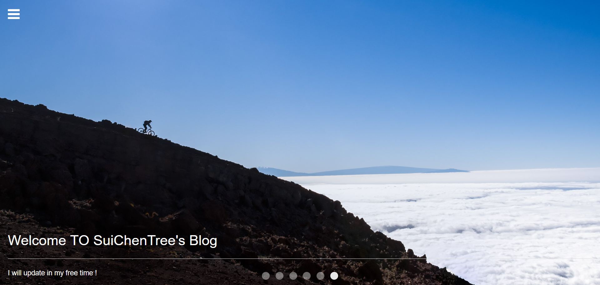
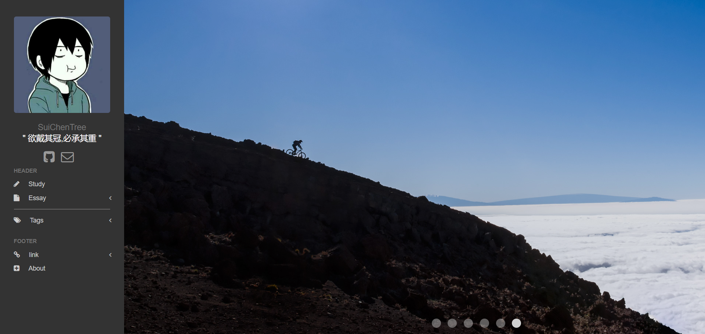
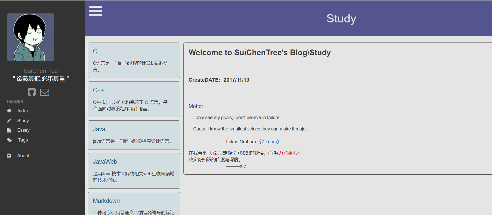

# SuichenTree.github.io
个人学习知识平台

# 2018 4-7 之前使用 Bootstrap 编写页面。
# 2018 4-7 使用Ulkit替换Boostrap 编写页面。

## 主页：

<h3>

1. 编写这个功能不全的bolg，应该算是知识文档。单纯的只是把自己在求学的道路上所学到的知识，系统的整理起来，形成一个知识文档。

2. 同样也是，在日后重新温习这些知识的过程中图个方便.免得查来查去

3. 里面的知识或许不全，个人能力有限，请见谅。里面也有我对这些知识是理解与看法。

4. 若内容有错误或者措辞不当的地方，欢迎 issues,顺便点个 star。
</h3>