[toc]
# 数据结构：
## 1. 基本概念与术语：

**数据**： 所有能被输入到计算机中并被计算机程序处理的符号的总称。如图像，声音，字符等可以通过编码处理的数据。
**数据项：** 是数据的不可分割的最小单位。<font color="red">多个数据项构成一个数据元素。</font>
**数据元素：** 数据的基本单位,在计算机中也被称为记录。
**数据对象：** 性质相同的数据元素的集合，是数据的子集。
**数据结构：** <font color="red">是相互之间存在的一种或多种特定关系的数据元素的集合。</font>
    <font color="blue">数据结构其通常分为四种基本结构：
    1. 集合 
    2. 线性结构（一对一关系） 
    3. 树形结构（一对多关系） 
    4. 图状结构或网状结构（多对多关系）</font>

## 2. 算法：
**算法：** <font color="red">指的是对特定问题求解步骤的一种描述。</font>
    <font color="blue">
    算法通常分为5个特性：
    1. 有穷性：一个算法的执行时间是有限度的。
    2. 确定性：算法中的每一条指令是有确切的含义。
    3. 可行性：算法是可执行到结束的，无问题。
    4. 输入：有零个或多个输入。
    5. 输出：有零个或多个输出。
    </font>

**算法设计要求：**
    1.正确性：满足问题的需求。
    2.可读性：便于阅读，帮助人更好理解算法。
    3.健壮性：当输入数据不合法时，算法能做出相关处理。
    4.时间效率高与空间低存储量需求：效率高，存储量低。

**算法效率的度量方法：** 
    1.事后统计法。
    2.事前分析估计法: <font color="red">时间复杂度，空间复杂度</font>
  


---


## 3.线性表-零个或多个数据元素的有限序列：

<font color="red">线性表中数据元素之间的关系是一对一的关系，即除了第一个和最后一个数据元素之外，其它数据元素都是首尾相接的。</font>


### 1.线性表的顺序存储结构：
    其指的是用一段连续的存储的存储单元依次存储线性表的数据元素。

<font color="red">其可以用数组实现。</font>
    
### 2.线性表的链式存储结构-单链表：
    其指的是用一组任意的存储单元存储线性表的数据。这组存储单元可以是连续的，也可以是不连续的。


<font color="red">链表的第一个结点叫做头结点。头节点不存储数据。</font>

链表结点的存储结构：
```c
struct node{
    int data;  //存储该节点的数据
    struct node *next;   //next指针存放下一个结点的地址信息。
}linklist;
```

> ①：链表的创建：

头插法-逆序（始终让新结点在开头的位置），尾插法-顺序（始终让新结点在链表结尾）

头插法图解：


```c
#include<stdio.h>
#include<stdlib.h>
typedef struct node{
	int data;
	struct node *next;
}linklist;
void Createlinklist(linklist *head,int n){    //尾插法(新节点始终在链表结尾)
	linklist *p,*q;
	p=head;                  
	for(int i=0;i<n;i++){
		q=(linklist*)malloc(sizeof(linklist));  //创建一个节点给q
		q->data=i;     
		p->next=q;
		p=q;
	}
}

void Createlinklist2(linklist *head,int n){    //头插法(新创建的节点始终在链表开头)
	linklist *q;
	head->next=NULL;
	for(int i=0;i<n;i++){
		q=(linklist*)malloc(sizeof(linklist));  
		q->data=i;    
		q->next=head->next;
		head->next=q;
	}
}

void main(){
	int n;
	scanf("%d",&n);
	linklist *head,*k;
	head=(linklist*)malloc(sizeof(linklist));    //创建头节点
	
	Createlinklist(head,n);    //顺序建立链表
	k=head->next;             //k指向第一个结点
	for(int i=0;i<n;i++){
		printf("%d\n",k->data);
		k=k->next;
	}

	printf("-----------"); 

	Createlinklist2(head,n);   //逆序建立链表
	k=head->next;             //k指向第一个结点
	for(int i=0;i<n;i++){
		printf("%d\n",k->data);
		k=k->next;
	}
}
```

> ②：链表的插入与删除：

**删除指定节点数据为k的节点：**

```c
void deletepoint(linklist *head,int k){   //删除指定节点
	linklist *p,*q;
	p=head;
	while(p&&p->data!=k){    //找到指定节点k的前一个节点
		q=p;p=p->next;
	}
	if(p!=NULL){             //若指定节点存在
		q->next=p->next;	 //断开指定节点的前后链接
		free(p);			 //删除指定节点
		p=q->next;				
	}	
}
```
//创建节点a,插入到k节点之前


```c
void insertpoint(linklist *head,int a,int k){    //创建节点a,插入到k节点之前
	linklist *t,*p,*q;
	p=head;

	t=(linklist*)malloc(sizeof(linklist));
	t->data=a;

	while(p&&p->data!=k){    //找到指定节点k的前一个节点
		q=p;p=p->next;
	}
	if(p!=NULL){             //若节点k存在,则q指向节点k
		t->next=p;	         //新节点的下一个节点是节点k
		q->next=t;			 //新节点的上一个节点是节点q，即节点k的上一个节点。
	}
}
```

> ③：链表的整表删除：

思路：
1. 声明指针p,q.
2. 把第一个节点给p。
3. 循环： 把下一个节点给p -> 释放p -> 让p指向q（p=q;）
```c
void deleteAll(linklist *head){   //删除链表的全部节点，不包括头节点
	linklist *p,*q;               
	p=head->next;					//p指第一个节点
	while(p){
		q=p->next;				//q指向第二个节点
		free(p);				//删除第一个节点
		p=q;
	}
}
```

### 3.循环链表：

<font color="red">
定义： 把单链表的最后一个节点的指针域从空指针改为头节点，使整个单链表形成一个环。这种头尾相连的链表称为循环链表。
</font>


循环链表的创建与遍历：
```c
#include<stdio.h>
#include<stdlib.h>
typedef struct node{
	int data;
	struct node *next;
	
}linklist;

//创建循环链表
void Createlinklist3(linklist *head,int n){   
	linklist *p,*q,*rear; 
	q=head;
	for(int i=0;i<n;i++){    //这个循环创建链表
		p=(linklist*)malloc(sizeof(linklist));
		p->data=i;
		q->next=p;
		q=p;
	}
	//当循环结束，此时p,q均指向最后一个节点，设置尾指针，并把尾指针指向头节点
	rear=p;
	rear->next=head;

}

void main(){
	int n;
	scanf("%d",&n);
	linklist *head,*k;
	head=(linklist*)malloc(sizeof(linklist));    //创建头节点
	head->data=NULL;     //给头节点设置空值

	Createlinklist3(head,n);             //此时包括头节点，共有n+1个节点
	printf("------------");
	k=head->next;    //k指向第一个节点
	while(k!=head){                  //遍历循环链表,当k不为头节点，表示遍历未完成
		printf("%d",k->data);
		k=k->next;
	}
}
```


### 4.双向链表：

<font color="red">
定义： 在单链表的每个节点中，设计一个指向其上一个节点的指针域。
</font>


双向链表的存储结构：
```c
typedef struct node{
	int data;
	struct node *next;
	struct node *prior;
}linklist;
```

创建双向链表
```c
//创建双向链表：
void Createlinklist4(linklist *head,int n){     
	linklist *p,*q;
	q=head;
	for(int i=0;i<n;i++){
		p=(linklist*)malloc(sizeof(linklist));
		p->data=i;
		p->prior=q;        //新节点prior指向上一个节点（后面接前面）
		q->next=p;			//前面接后面
		q=p;
	}
}
```

//在双向链表中插入新节点t，插在数值为k的节点之前


```c
//在双向链表中插入新节点t，插在数值为k的节点之前：
void insertlinklist(linklist *head,linklist *t,int k){
	linklist *p,*q;    //p为始终为q的上一个节点
	q=head->next;        
	while(q&&q->data!=k){
		p=q;
		q=q->next;
	}

	//循环后，p指向数值为k的节点的上一个节点：
	s->prior=p;				
	s->next=p->next;
	p->next->prior=s;
	p->next=s;

	/* 或者
		t->prior=p;        //新节点的上一个节点为p;
		t->next=q;		  //新节点的下一个节点为q,即数值为k的节点
		q->prior=t;      //数值为k的节点q的上一个节点为新节点
		p->next=t;		//p节点的下一个节点为新节点
	*/
}
```

//在双向链表中删除数值为k的节点：

```c

void deletelinklist(linklist *head,int k){
	linklist *p;    
	p=head->next;        
	while(p&&p->data!=k){    //找到数值为k的节点
		p=p->next;
	}
	//for循环后，p指向目标节点或者目标节点不存在
	if(p){
		p->prior->next=p->next;      //目标的节点p的上一个节点指向p的下一个节点
		p->next->prior=p->prior;	 //p的下一个节点的前一个节点指向p的上一个节点
	}
}
```

---

## 4.栈：

<font color="red">栈是一种特殊的线性表，其仅在表尾进行插入和删除操作。栈中的元素始终遵循后进先出的顺序</font>

**栈顶与栈底：** 栈顶是线性表允许插入和删除的一端，另一端称为栈底。
**入栈，进栈:** 在栈顶一端进行的插入操作。
**出栈：** 在栈顶一端进行的删除操作。


### 1.栈的顺序存储结构-顺序栈：

<font color="red">

注意：
1. 空栈的判断条件就是栈顶指针top=-1。
2. 当栈存在一个元素时，栈顶指针top=0.
3. s->top相当与栈内元素在顺序栈中的下标位置(例如：当s->top为1时，表示栈顶元素在下标为1的数组位置上)。

</font>

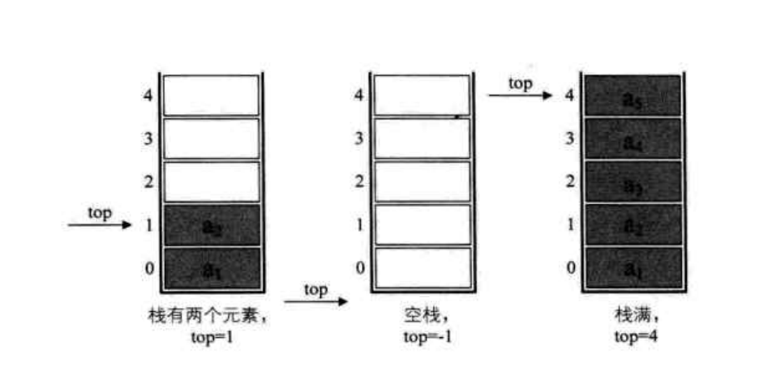

> ①顺序栈的存储结构：

```c
typedef struct stack{
	int data[100];  //int,100可修改
	int top;        //栈顶指针
}stack;
```

> ②初始化栈：

```c
//初始化栈,返回一个栈指针
stack* initStack(){
	stack *s;
	s=(stack*)malloc(sizeof(stack));   //创建栈的存储空间
	s->top=-1;     //栈顶指针为-1，表示空栈
	return s;
}
```


> ③入栈操作：

思路：

1. 判断当前栈是否栈满。
2. 先把栈顶指针+1。
3. 在把新元素，存储在当前栈顶指针指向的地址。

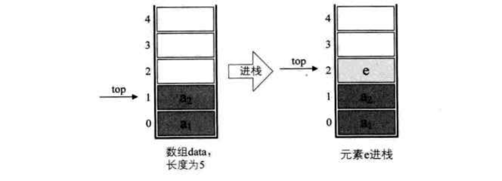

```c
//入栈
int push(stack *s,int a){
	if(s->top==9){
		printf("当前栈满");
		return 0;  //入栈失败
	}else{
		s->top++;  //栈顶指针+1
		s->data[s->top]=a;    //元素a进栈
		return 1;  //入栈成功
	}
}
```

> ④出栈操作：

思路：

1. 判断当前栈是否栈空。
2. 把存储在当前栈顶的元素赋值一个数a。
3. 在把栈顶指针-1。

```c
//出栈，并把栈顶元素赋值给a
int pop(stack *s,int *a){
	if(s->top==-1){
		printf("当前栈空");
		return 0;  //出栈失败
	}else{
		*a=s->data[s->top];      //把当前的栈顶元素赋值给a
		s->top--;
		return 1;   //出栈成功
	}
}
```

> ⑤遍历栈：

思路：

1. 判断当前栈是否栈空。
2. 根据s->top计算当前栈有几个元素，根据元素个数进行for循环。
3. s->top又相当与栈内元素在数组中的下标位置。
4. 要按先进后出的方式遍历栈内元素。

```c
//遍历栈,当栈顶指针为0，表示栈有一个元素。因此 栈中元素=栈顶指针数+1。
void PrintStack(stack *s){
	int t=s->top;
	if(t==-1){
		printf("当前栈空");
	}else{
		for(int i=0;i<s->top+1;i++){         
			printf("%d",s->data[t]);      //输出栈顶元素
			t--;
			printf("\n");
		}
	}
}

```

> ⑥：获取当前栈的长度&判断当前栈是否为空

```c
//获取当前栈的长度
int StackLength(stack *s){
	if(s->top==-1){
		return 0;
	}else{
		return s->top+1;
	}
}

//判断当前栈是否为空
int StackIsEmpty(stack *s){
	if(s->top==-1){
		return 1;      //表示当前栈是空
	}else{
		return 0;
	}
}
```


> ⑦：把当前栈清空&销毁当前栈

```c
//把当前栈清空
int CleanStack(stack *s){
	if(s){
		s->top=-1;
		return 1;           //成功
	}else{
		return 0;
	}
}

//销毁当前栈
int DestroyStack(stack *s){
	if(s){
		free(s);     //释放存储空间
		s=NULL;		//把指针赋值为空
		return 1;    //销毁栈成功
	}
	return 0;
}
```


### 2.栈的链式存储结构-链栈：

<font color="red">

注意在链栈中：
1. 栈顶指针就是头指针，并且不需要头结点。
2. 当 top==NUll 时，表示栈空。
3. 在链栈中，是从 an -> a1,与链表相反.

</font>

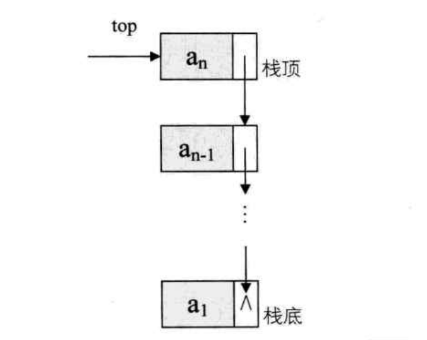

> ①：链栈存储结构：
```c
typedef struct stackNode{
	int data;
	struct stackNode *next;
}stackNode;
typedef struct {
	stackNode *top;
	int count;       //计算链栈的元素个数
}linkstack;

```

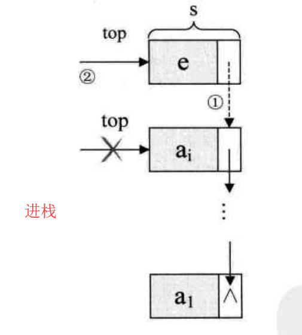
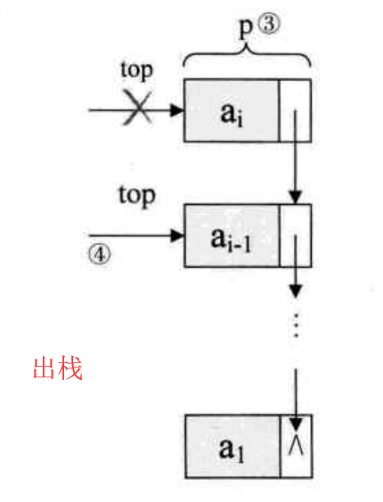


> ②：入栈，出栈：
```c
//进栈
void Push(linkstack *ls,int e){
	stackNode *s=(stackNode*)malloc(sizeof(stackNode));   //创建新的栈节点
	s->data=e;

	if(ls->top==NULL){   //如果链栈一开始为空
		ls->top=s;       //栈顶指针指向新节点
		ls->count=1;
	}else{
		s->next=ls->top;   //把新的节点放在原先的栈顶节点的上面
		ls->top=s;         //栈顶指针指向新节点
		ls->count++;  
	}
}

//出栈
void Pop(linkstack *ls,int *e){
	stackNode *p;
	if(ls==NULL){
		//栈空
	}else{
		*e=ls->top->data;    //把栈顶的数据取出来
		p=ls->top;          //用p指向栈顶节点
		ls->top=ls->top->next;   //栈顶指针向下移
		free(p);            //删除原先p指向的栈顶指针
		ls->count--;
	}
}
```

> ③：获取栈顶数据&获取链栈长度&遍历链栈
```c
//获取栈顶数据
void getTop(linkstack *ls,int *e){
	if(ls==NULL){
		//栈空
	}else{
		*e=ls->top->data;
	}
}

//获取链栈长度
int getLength(linkstack *ls){
	return ls->count;
}

//遍历链栈
void PrintStack(linkstack *ls){
	stackNode *t=ls->top;         //t指针指向栈顶节点
	while(t!=NULL){
		printf("%d\n",t->data);
		t=t->next;          
	}
}
```

> ④：主函数

<font color="red">
注意：在主函数中，不能把三行代码进行封装为初始化函数。

</font>

```c
void main(){
	//下面三行是初始化，注意不能将下面三行封装为函数
	linkstack *ls=(linkstack*)malloc(sizeof(stackNode));   //给ls指针一个指向的地址
	ls->top=NULL;
	ls->count=0;; 
	
	int e=0;
	int a[5]={5,6,7,8,9};
	for(int i=0;i<5;i++){
		Push(ls,a[i]);
	}
	printf("==\n");
	for(int i=0;i<2;i++){
		Pop(ls,&e);
		printf("%d\n",e);
	}
	printf("==\n");
	PrintStack(ls);
}
```


---

## 5.队列：

<font color="red">队列是只允许在一段进行插入操作，在另一端进行删除操作的线性表。其具有先进先出顺序。</font>

**队头：** 是队列中只允许删除的一端。
**队尾：** 是队列中只允许插入的一端。

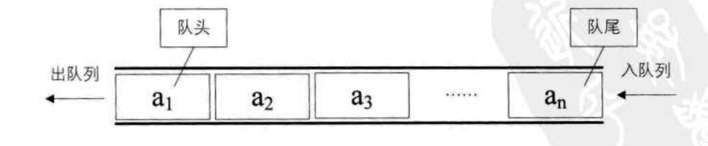


### 1.队列的顺序存储结构-顺序队列：

<font color="red">

注意：
1. 在顺序队列中，空队列的判断条件就是head==rear,队列满是rear ==MAXSIZE。
2. 一开始head与rear的值均为0.
3. rear始终是队尾元素的下一位置，head始终指向队头元素。
4. 入队是先把数据放进rear指向的位置，再把rear++。
5. 出队是把数据先拿出来，在把head++。 

</font>

> ①：顺序队列的存储结构&队列初始化：
```c
#define MAXSIZE 10
typedef struct queue{
	int data[MAXSIZE];   //队列存储空间
	int head;      //队头
	int rear;		//队尾
}queue;

//队列初始化
void InitQueue(queue *q){
	q->head=0;
	q->rear=0;
}

```

> ②：入队，出队：
```c
//入队列操作，先把元素插入到rear的位置上,再把rear++
//rear永远指向最后一个元素的下一个位置
void InQueue(queue *q,int e){
	if(q->rear==(MAXSIZE)){
		   //队列满了
	}else{
		q->data[q->rear]=e;
		q->rear++;
	}
}

//出队列操作，先把head位置的数据取出放到e上，在把head++
void OutQueue(queue *q,int *e){
	if(q->rear==q->head){
		   //队列为空
	}else{
		*e=q->data[q->head];
		q->head++;
		printf("%d\n",*e);
	}
}
```

> ③：求当前队列的长度&清空队列&遍历队列
```c
//求当前队列的长度
int QueueLength(queue *q){
	return (q->rear-q->head+MAXSIZE)%MAXSIZE;      
}

//清空队列
void CleanQueue(queue *q){
	q->head=0;
	q->rear=0;
}

//遍历队列
void PrintQueue(queue *q){
	int t=0;
	t=q->head;
	while(t!=q->rear){
		printf("%d\n",q->data[t]);
		t++;
	}
}
```

> ④：主函数
```c
void main(){
	queue *q=(queue*)malloc(sizeof(queue));   //给队列分配存储空间
	InitQueue(q);  //初始化队列
	int a[5]={6,7,8,9,10};
	int e=0;
	for(int i=0;i<5;i++){
		InQueue(q,a[i]);
	}
	printf("====\n");
	for(int i=0;i<3;i++){
		OutQueue(q,&e);
	}
	printf("====\n");
	printf("head=%d,rear=%d\n",q->head,q->rear);
	printf("length=%d\n",QueueLength(q));
	printf("====\n");
	PrintQueue(q);
}
```


### 2.顺序队列中的循环队列：

<font color="blue">我们把队列的头尾相接的顺序队列称为循环队列。</font>

在普通顺序队列中，入队操作要把尾指针rear后移，出队操作是头指针head后移。像这样进行了一定数量入队和出队操作后，可能会出现这样的情况：==尾指针rear已指到数组的最后一个元素．即rear == MAXLEN-1．此时若再执行入队操作，便会出现队满“溢出”。然而，由于在此之前可能也执行了若干次出队操作．因而数组的前面部分可能还有很多闲置的元素空间，即这种溢出并非是真的没有可用的存储空间，故称这种溢出现象为“假溢出”。== **显然，必须要解决这一假溢出的问题，否则顺序队列就没有太多使用价值.**

<font color="red">为了解决假溢出的问题，可以将数组弄成一个环状，让rear和front指针沿着环走，这样就不会出现无法继续走下去的情况，这样就产生了循环队列。</font>

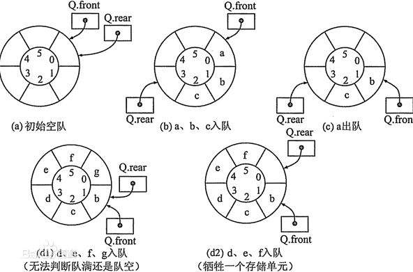


<font color="red">

注意从上图可以看出循环队列：
1. 如图a,队空状态 ：Q.rear == Q.front
2. 如图d2,队满状态： (Q.rear+1)%MAXSIZE == Q.front
3. 入队列是先把数据存放在rear的位置，在rear向后移。出队是先取数据，在把front指针向后移。
4. 计算队列长度公式：(Q.rear-Q.front+MAXSIZE)%MAXSIZE.
5. ==由于循环队列要牺牲一个存储单元来判断队满，因此循环队列最多存储MAXSIZE-1个数据==
6. Q.front = (Q.front + 1) % MAXSIZE; //表示front指针移向后一位置。
7. Q.rear = (Q.rear + 1) % MAXSIZE;   //表示rear指针移向后一位置。

</font>


> ①：循环队列的存储结构&队列初始化：
```c
#define MAXSIZE 10
typedef struct queue{
	int data[MAXSIZE];   //队列存储空间
	int front;      //队头
	int rear;		//队尾
}queue;

void InitQueue(queue *q){
	q->front=0;
	q->rear=0;
}
```

> ②：入队，出队：
```c
//入队列操作
int InQueue(queue *q,int e){
	if((q->rear+1)%MAXSIZE == q->front){
		printf("队列满了\n");
		   return 0; //队列满了
	}else{
		q->data[q->rear]=e;
		q->rear = (q->rear + 1) % MAXSIZE;   //rear指针移向后一位置，不再是rear++
		return 1;
	}
}

//出队列操作
int OutQueue(queue *q,int *e){
	if(q->rear==q->front){
		 printf("队列空了\n");
		 return 0;  //队列为空
	}else{
		*e=q->data[q->front];
		q->front = (q->front + 1) % MAXSIZE; //front指针移向后一位置，不再是front++
	}
}

```

> ③：求当前队列的长度&遍历队列
```c
//求当前队列的长度
int QueueLength(queue *q){
	return (q->rear-q->front+MAXSIZE)%MAXSIZE;      
}

//遍历队列
void PrintQueue(queue *q){
	int t=0;
	t=q->front;
	while(t!=q->rear){
		printf("%d\n",q->data[t]);
		t = (t + 1) % MAXSIZE;
	}
}
```

> ④：主函数
```c
void main(){
	queue *q=(queue*)malloc(sizeof(queue));
	InitQueue(q);  //初始化队列
	int a[6]={6,7,8,9,10,11};
	int e=0;
	for(int i=0;i<6;i++){
		InQueue(q,a[i]);
	}
	for(int i=0;i<7;i++){
		OutQueue(q,&e);
	}
	printf("====\n");
	printf("front=%d,rear=%d\n",q->front,q->rear);
	printf("length=%d\n",QueueLength(q));
	printf("====\n");
	PrintQueue(q);
}
```


### 3.队列的链式存储结构-链队列：

<font color="red">队列的链式存储结构就是线性表的单链表，只不过它只能头进尾出。其中队头指针指向头节点，队尾指针指向终端节点。</font>

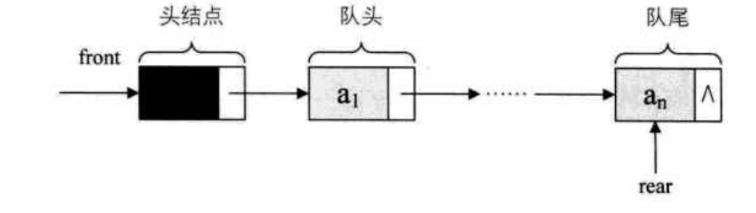


<font color="blue">

注意：
1. 当队头指针与队尾指针相等时，表示为空队。
2. 注意，头节点本身无数据，链队的第一个有效节点是在头节点之后的。

</font>

> ①：链队的存储结构&队列初始化：
```c
//这个是链队的节点
typedef struct queueNode{   
	int data;
	struct queueNode *next;
}queueNode;
//这个是指向链队的队头和队尾指针
typedef struct {      
	queueNode *front;
	queueNode *rear;
}linkqueue;

//链队初始化
void InitQueue(linkqueue *lq){
	lq->front=lq->rear=(queueNode*)malloc(sizeof(queueNode));
	lq->front->next=NULL;
}
```

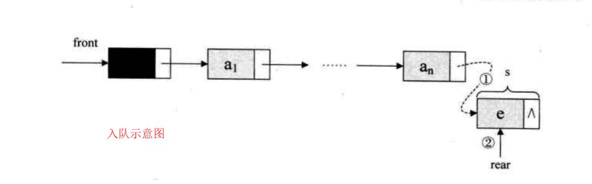
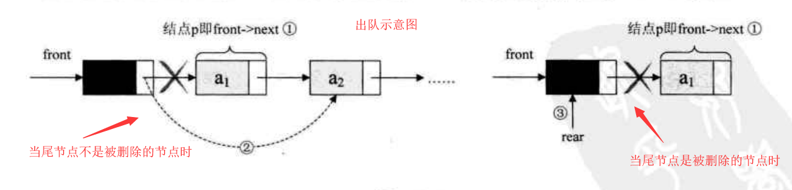

> ②：入队，出队：
```c
//入队操作，就是在链表尾部插入新节点
void Enqueue(linkqueue *lq,int e){
	queueNode *s=(queueNode*)malloc(sizeof(queueNode));  //创建新的队列节点
	s->data=e;
	s->next=NULL;     
	lq->rear->next=s;    //把s指向的节点最为终端节点
	lq->rear=s;			 //让队尾指针指向终端节点
}

//出队操作，就是在链表头部删除一个节点
//注意链队中第一个的有效节点是在头节点之后的
void Outqueue(linkqueue *lq,int *e){
	queueNode *p;
	if(lq->rear==lq->front){
		//空队列
	}else{
		p=lq->front->next;     //把待删除的节点给p
		*e=p->data;   //数据取出来
		lq->front->next=p->next;   //把队头指针后移
		if(lq->rear==p){   //如果被删除节点就是尾节点
			lq->rear=lq->front;     //队尾指针指向队头指针
		}
		free(p);    //删除原头节点
	}
}

```

> ③：遍历队列&获取第一个节点数据
```c
//遍历链队
void PrintQueue(linkqueue *lq){
	queueNode *t=lq->front->next;   //指向第一个节点
	while(t!=lq->rear){			   //遍历第一个节点到尾节点之前
		printf("%d\n",t->data);
		t=t->next;
	}
	printf("%d\n",t->data);  //打印尾节点数据
}
//获取链队的第一个元素(注意头节点本身无数据)
void GetHead(linkqueue *lq,int *e){
	if(lq->rear==lq->front){
		//空队列
	}else{
		*e=lq->front->next->data;  //获取第一个有效的节点的元素
	}
}
```

> ④：主函数
```c
void main(){
	int a[5]={5,6,7,8,9};
	int e=0;
	linkqueue *lq=(linkqueue*)malloc(sizeof(linkqueue));
	InitQueue(lq);
	lq->front->data=NULL;                //头节点无数据
	for(int i=0;i<5;i++){
		Enqueue(lq,a[i]);
	}

	printf("=====\n");
	GetHead(lq,&e);
	printf("%d\n",e);
}
```


---

## 6.树：

### 1.树基本概念：

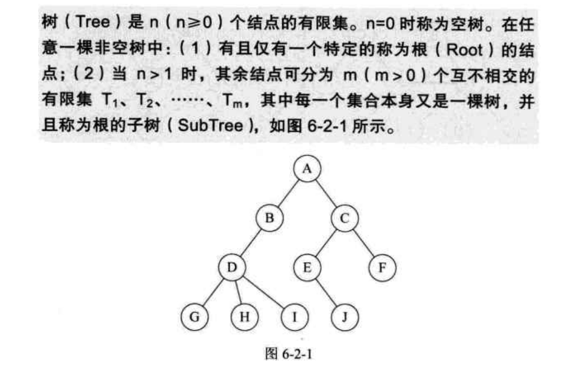

<font color="red">
在图6-2-1中：

1. A结点是整个树的根结点。
2. BDGHI 是A结点下的一个子树，CEFJ是A结点下的另一个子树。

</font>

> 关于树结构的基本术语（图6-2-1）：
> ① 度：结点拥有的子树数目，如A的度是2，B的度是1，F的度是0，<font color="red"> 树的度是树内各结点的度的最大值</font>。
> ② 叶子结点（终端结点）：度为0的结点。
> ③ 树的深度：根结点作为第一层，如上图的树的深度为4。

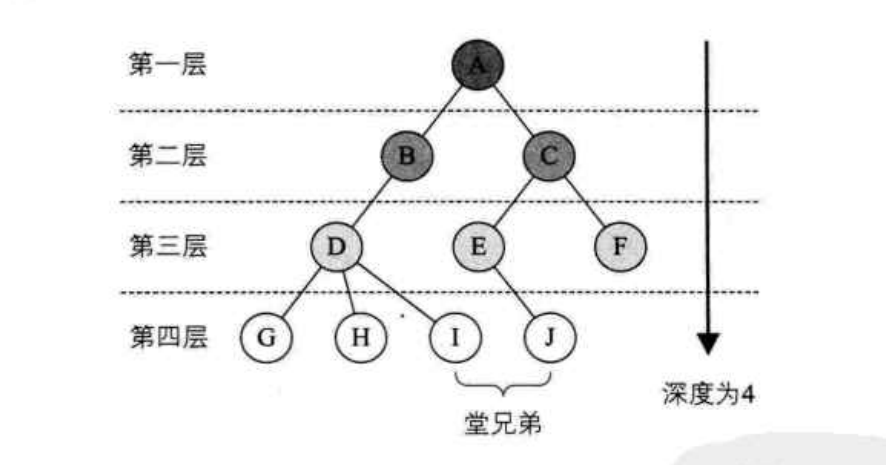

> 关于树中结点间的关系：
> ①：某个结点的子树的根称为该结点的孩子结点，如：B是A的孩子结点。同理，A是B的双亲结点。
> ②：拥有同一个双亲的结点之间是兄弟结点，如EF是兄弟结点。

<font color="red">
PS:

1. 若把树中的结点的各子树看成从左至右是有次序的（即不能互换），则称该树为有序树，否则为无序树。
2. 森林：其是n个互不相交的树的集合。对根结点来说，其子树之间的集合就是森林。

</font>

### 2.二叉树：

#### 1. 二叉树的定义：
> 二叉树是一种树型结构，它的特点是每个结点至多有两个子结点，并且二叉树的子树（子结点）有左右之分，其次序不能任意颠倒。

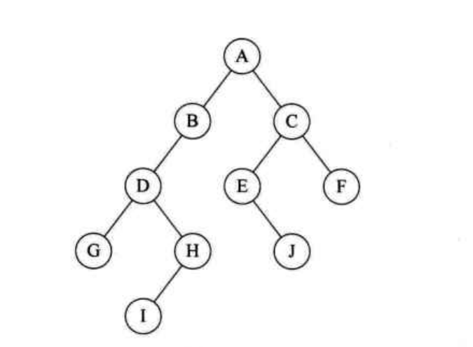

<font color="red">
二叉树的五种基本形态：

①：空二叉树。
②：只有一个根结点的二叉树。
③：只有左子树的二叉树。
④：只有右子树的二叉树。
⑤：左右子树都有的二叉树。

</font>


#### 2. 特殊的二叉树：

>① 斜树：只有左子树的左斜树，只有右子树的右斜树。
>② 满二叉树：
	在一个二叉树中,除叶子结点之外的结点都有左右两个子结点（子树），且叶子结点都在同一层上。
> <font color="red"> 满二叉树的特点：
> 1. 叶子节点只能在最下一层。
> 2. 非叶子节点的度只能是2.
> 3. 在同样深度的二叉树中,满二叉树的结点最多，叶子数最多。
> </font>

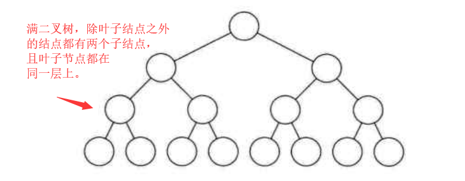

> ③ 完全二叉树：

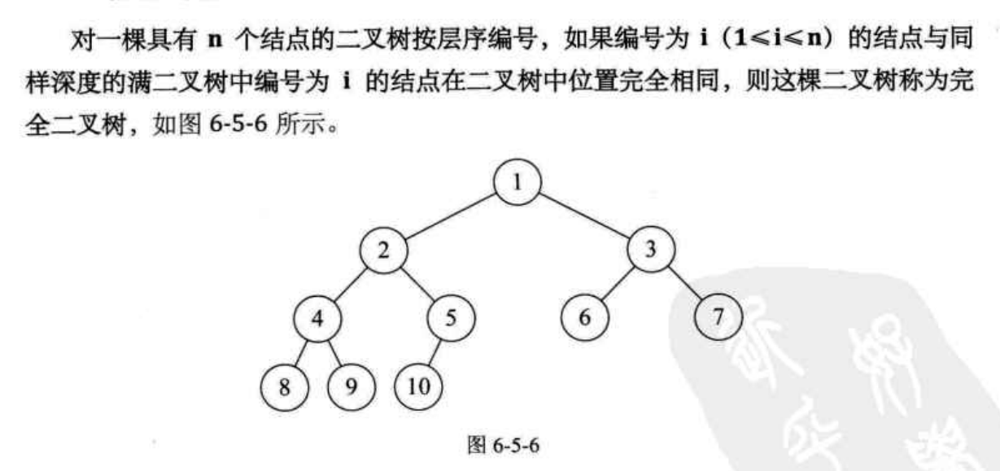
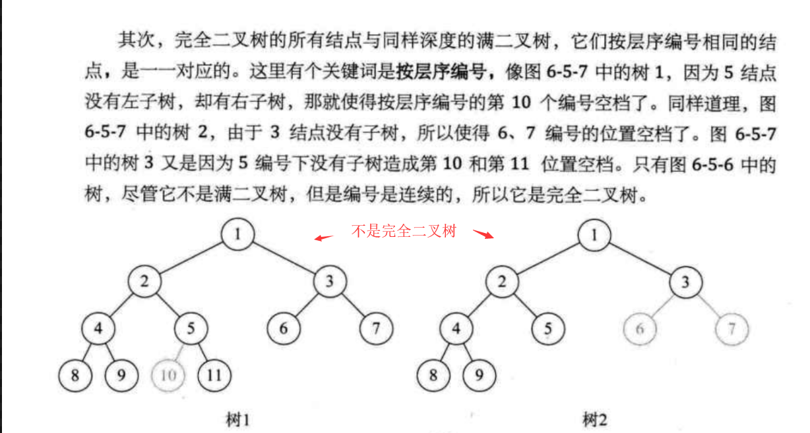
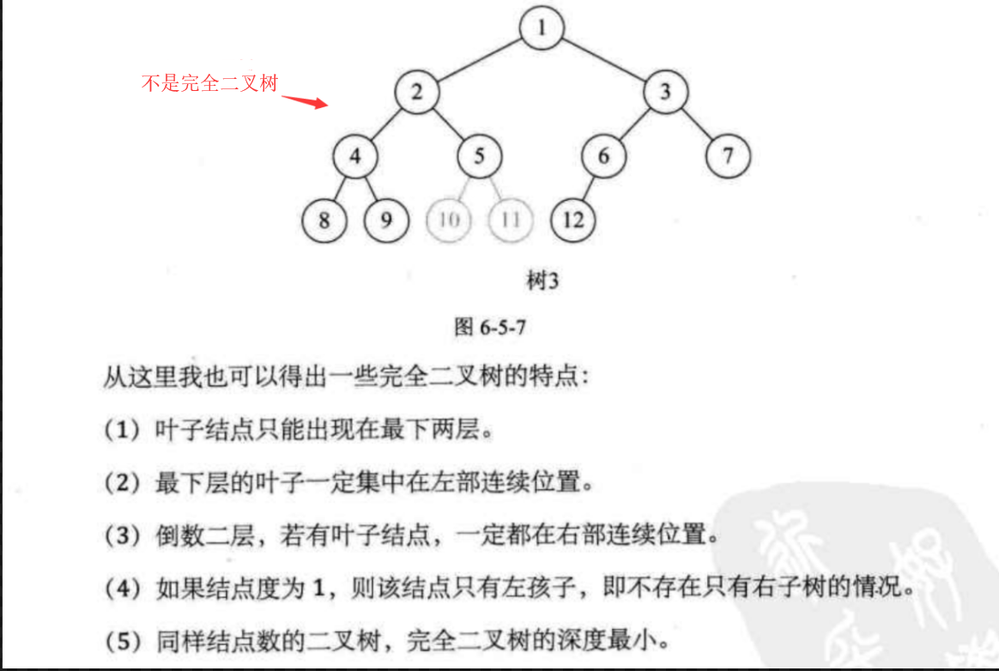

<font color="red">
PS：

1. 满二叉树是一个完全二叉树，但完全二叉树不一定是满二叉树。
2. 判断完全二叉树的方法：
	看着树的示意图，给每个结点按照满二叉树的结构逐层顺序编号，若编号出现空档,则表示不是完全二叉树。

</font>


#### 3. 二叉树的性质：

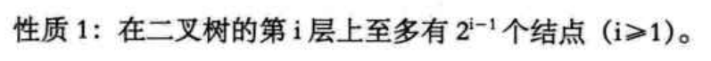
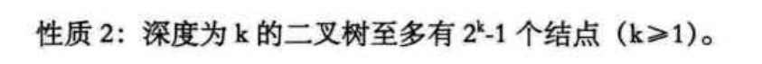
> <font color="red">性质3： 对任何一个二叉树，若叶子结点数为a,度为2的结点数为b,则a=b+1.</font>

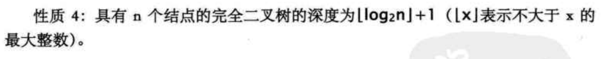
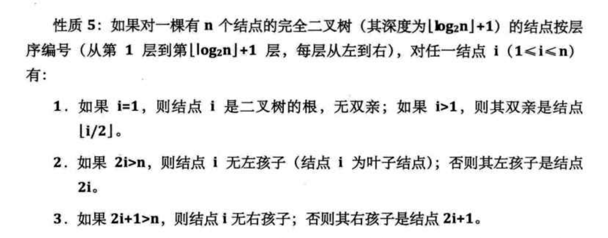


#### 4. 二叉树的存储结构：