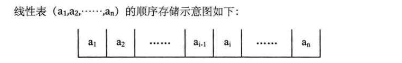
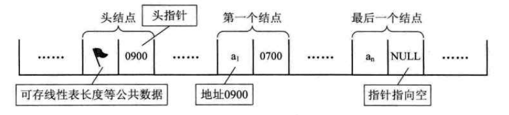
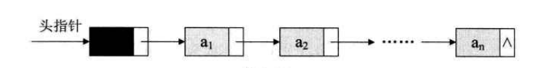
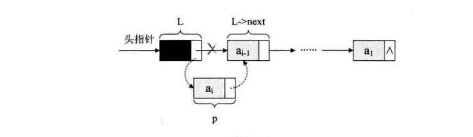
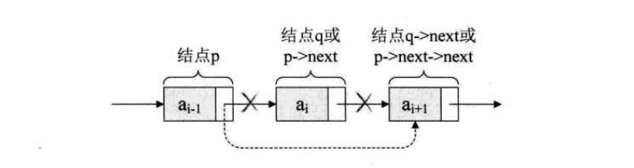
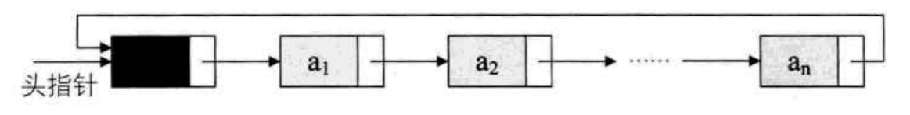
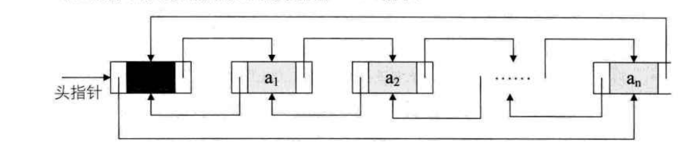
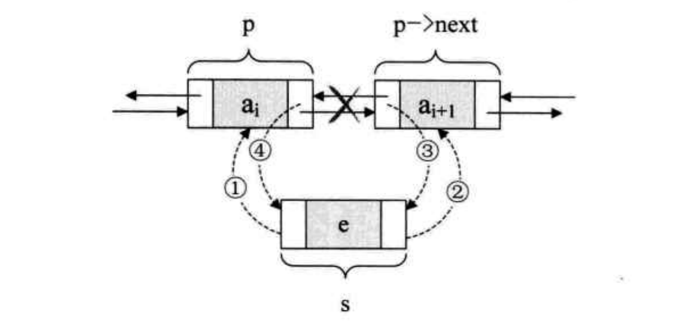
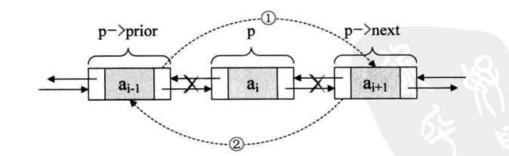
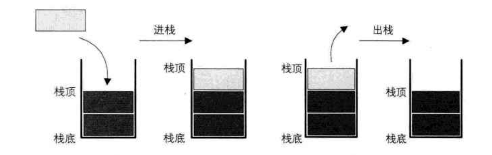

[toc]
# 数据结构：
## 1. 基本概念与术语：

**数据**： 所有能被输入到计算机中并被计算机程序处理的符号的总称。如图像，声音，字符等可以通过编码处理的数据。
**数据项：** 是数据的不可分割的最小单位。<font color="red">多个数据项构成一个数据元素。</font>
**数据元素：** 数据的基本单位,在计算机中也被称为记录。
**数据对象：** 性质相同的数据元素的集合，是数据的子集。
**数据结构：** <font color="red">是相互之间存在的一种或多种特定关系的数据元素的集合。</font>
    <font color="blue">数据结构其通常分为四种基本结构：
    1. 集合 
    2. 线性结构（一对一关系） 
    3. 树形结构（一对多关系） 
    4. 图状结构或网状结构（多对多关系）</font>

## 2. 算法：
**算法：** <font color="red">指的是对特定问题求解步骤的一种描述。</font>
    <font color="blue">
    算法通常分为5个特性：
    1. 有穷性：一个算法的执行时间是有限度的。
    2. 确定性：算法中的每一条指令是有确切的含义。
    3. 可行性：算法是可执行到结束的，无问题。
    4. 输入：有零个或多个输入。
    5. 输出：有零个或多个输出。
    </font>

**算法设计要求：**
    1.正确性：满足问题的需求。
    2.可读性：便于阅读，帮助人更好理解算法。
    3.健壮性：当输入数据不合法时，算法能做出相关处理。
    4.时间效率高与空间低存储量需求：效率高，存储量低。

**算法效率的度量方法：** 
    1.事后统计法。
    2.事前分析估计法: <font color="red">时间复杂度，空间复杂度</font>
  


---


## 3.线性表-零个或多个数据元素的有限序列：

<font color="red">线性表中数据元素之间的关系是一对一的关系，即除了第一个和最后一个数据元素之外，其它数据元素都是首尾相接的。</font>


### 1.线性表的顺序存储结构：
    其指的是用一段连续的存储的存储单元依次存储线性表的数据元素。

<font color="red">其可以用数组实现。</font>
    
### 2.线性表的链式存储结构-单链表：
    其指的是用一组任意的存储单元存储线性表的数据。这组存储单元可以是连续的，也可以是不连续的。


<font color="red">链表的第一个结点叫做头结点。头节点不存储数据。</font>

链表结点的存储结构：
```c
struct node{
    int data;  //存储该节点的数据
    struct node *next;   //next指针存放下一个结点的地址信息。
}linklist;
```

> ①：链表的创建：

头插法-逆序（始终让新结点在开头的位置），尾插法-顺序（始终让新结点在链表结尾）

头插法图解：


```c
#include<stdio.h>
#include<stdlib.h>
typedef struct node{
	int data;
	struct node *next;
}linklist;
void Createlinklist(linklist *head,int n){    //尾插法(新节点始终在链表结尾)
	linklist *p,*q;
	p=head;                  
	for(int i=0;i<n;i++){
		q=(linklist*)malloc(sizeof(linklist));  //创建一个节点给q
		q->data=i;     
		p->next=q;
		p=q;
	}
}

void Createlinklist2(linklist *head,int n){    //头插法(新创建的节点始终在链表开头)
	linklist *q;
	head->next=NULL;
	for(int i=0;i<n;i++){
		q=(linklist*)malloc(sizeof(linklist));  
		q->data=i;    
		q->next=head->next;
		head->next=q;
	}
}

void main(){
	int n;
	scanf("%d",&n);
	linklist *head,*k;
	head=(linklist*)malloc(sizeof(linklist));    //创建头节点
	
	Createlinklist(head,n);    //顺序建立链表
	k=head->next;             //k指向第一个结点
	for(int i=0;i<n;i++){
		printf("%d\n",k->data);
		k=k->next;
	}

	printf("-----------"); 

	Createlinklist2(head,n);   //逆序建立链表
	k=head->next;             //k指向第一个结点
	for(int i=0;i<n;i++){
		printf("%d\n",k->data);
		k=k->next;
	}
}
```

> ②：链表的插入与删除：

**删除指定节点数据为k的节点：**

```c
void deletepoint(linklist *head,int k){   //删除指定节点
	linklist *p,*q;
	p=head;
	while(p&&p->data!=k){    //找到指定节点k的前一个节点
		q=p;p=p->next;
	}
	if(p!=NULL){             //若指定节点存在
		q->next=p->next;	 //断开指定节点的前后链接
		free(p);			 //删除指定节点
		p=q->next;				
	}	
}
```
//创建节点a,插入到k节点之前


```c
void insertpoint(linklist *head,int a,int k){    //创建节点a,插入到k节点之前
	linklist *t,*p,*q;
	p=head;

	t=(linklist*)malloc(sizeof(linklist));
	t->data=a;

	while(p&&p->data!=k){    //找到指定节点k的前一个节点
		q=p;p=p->next;
	}
	if(p!=NULL){             //若节点k存在,则q指向节点k
		t->next=p;	         //新节点的下一个节点是节点k
		q->next=t;			 //新节点的上一个节点是节点q，即节点k的上一个节点。
	}
}
```

> ③：链表的整表删除：

思路：
1. 声明指针p,q.
2. 把第一个节点给p。
3. 循环： 把下一个节点给p -> 释放p -> 让p指向q（p=q;）
```c
void deleteAll(linklist *head){   //删除链表的全部节点，不包括头节点
	linklist *p,*q;               
	p=head->next;					//p指第一个节点
	while(p){
		q=p->next;				//q指向第二个节点
		free(p);				//删除第一个节点
		p=q;
	}
}
```

### 3.循环链表：

<font color="red">
定义： 把单链表的最后一个节点的指针域从空指针改为头节点，使整个单链表形成一个环。这种头尾相连的链表称为循环链表。
</font>



循环链表的创建与遍历：
```c
#include<stdio.h>
#include<stdlib.h>
typedef struct node{
	int data;
	struct node *next;
	
}linklist;

//创建循环链表
void Createlinklist3(linklist *head,int n){   
	linklist *p,*q,*rear; 
	q=head;
	for(int i=0;i<n;i++){    //这个循环创建链表
		p=(linklist*)malloc(sizeof(linklist));
		p->data=i;
		q->next=p;
		q=p;
	}
	//当循环结束，此时p,q均指向最后一个节点，设置尾指针，并把尾指针指向头节点
	rear=p;
	rear->next=head;

}

void main(){
	int n;
	scanf("%d",&n);
	linklist *head,*k;
	head=(linklist*)malloc(sizeof(linklist));    //创建头节点
	head->data=NULL;     //给头节点设置空值

	Createlinklist3(head,n);             //此时包括头节点，共有n+1个节点
	printf("------------");
	k=head->next;    //k指向第一个节点
	while(k!=head){                  //遍历循环链表,当k不为头节点，表示遍历未完成
		printf("%d",k->data);
		k=k->next;
	}
}
```


### 4.双向链表：

<font color="red">
定义： 在单链表的每个节点中，设计一个指向其上一个节点的指针域。
</font>



双向链表的存储结构：
```c
typedef struct node{
	int data;
	struct node *next;
	struct node *prior;
}linklist;
```

创建双向链表
```c
//创建双向链表：
void Createlinklist4(linklist *head,int n){     
	linklist *p,*q;
	q=head;
	for(int i=0;i<n;i++){
		p=(linklist*)malloc(sizeof(linklist));
		p->data=i;
		p->prior=q;        //新节点prior指向上一个节点（后面接前面）
		q->next=p;			//前面接后面
		q=p;
	}
}
```

//在双向链表中插入新节点t，插在数值为k的节点之前



```c
//在双向链表中插入新节点t，插在数值为k的节点之前：
void insertlinklist(linklist *head,linklist *t,int k){
	linklist *p,*q;    //p为始终为q的上一个节点
	q=head->next;        
	while(q&&q->data!=k){
		p=q;
		q=q->next;
	}

	//循环后，p指向数值为k的节点的上一个节点：
	s->prior=p;				
	s->next=p->next;
	p->next->prior=s;
	p->next=s;

	/* 或者
		t->prior=p;        //新节点的上一个节点为p;
		t->next=q;		  //新节点的下一个节点为q,即数值为k的节点
		q->prior=t;      //数值为k的节点q的上一个节点为新节点
		p->next=t;		//p节点的下一个节点为新节点
	*/
}
```

//在双向链表中删除数值为k的节点：

```c

void deletelinklist(linklist *head,int k){
	linklist *p;    
	p=head->next;        
	while(p&&p->data!=k){    //找到数值为k的节点
		p=p->next;
	}
	//for循环后，p指向目标节点或者目标节点不存在
	if(p){
		p->prior->next=p->next;      //目标的节点p的上一个节点指向p的下一个节点
		p->next->prior=p->prior;	 //p的下一个节点的前一个节点指向p的上一个节点
	}
}
```

---

## 4.栈：

<font color="red">栈是一种特殊的线性表，其仅在表尾进行插入和删除操作。栈中的元素始终遵循后进先出的顺序</font>

**栈顶与栈底：** 栈顶是线性表允许插入和删除的一端，另一端称为栈底。
**入栈，进栈:** 在栈顶一端进行的插入操作。
**出栈：** 在栈顶一端进行的删除操作。




