[toc]

# Java设计模式

Java、C#、C++等编程语言，Eclipse、Visual Studio等开发工具，JSP、ASP.net等开发技术，Struts、Hibernate、JBPM等框架技术，都可以认为是招式；而数据结构、算法、设计模式、重构、软件工程等则为内功。


设计模式的一般定义如下：==设计模式是一套被反复使用、多数人知晓的、经过分类编目的、代码设计经验的总结。==

使用设计模式的目的：==使用设计模式是为了可重用代码、让代码更容易被他人理解并且保证代码可靠性。==

>学习设计模式的好处？
>让你知道，如何将代码分散在几个不同的类中？为什么要有“接口”？什么是对抽象编程？何时不应该使用继承？如果不修改源代码增加新功能？同时还让你能够更好地阅读和理解现有类库（如JDK）与其他系统中的源代码。

# 1. 单例模式-Singleton Pattern---用于确保对象的唯一性

为了节约系统资源，有时系统中某个类只有唯一一个实例。当这个唯一实例创建成功之后，我们无法再创建一个同类型的其他对象，所有的操作都只能基于这个唯一实例。为了确保对象的唯一性，我们可以通过单例模式来实现。

>用单例模式实现某个类（单例类）：
>①：禁止类的外部直接使用new来创建对象，因此需要将类的构造函数的可见性改为private。
>②：在类的内部，创建唯一的类的实例对象。
>③：在类的内部编写方法，让外界能够访问这个唯一的类的实例对象。

==总结：1. 私有构造函数；2.私有静态类变量；3.公有静态成员方法，返回唯一实例。==

==设置static 可以保证直接通过类名调用变量和方法，而不需要通过创建对象来调用。==

```java

public class Singleton {
	private static Singleton singleton=null;   	//单例类的唯一的实例对象
	private Singleton() {} 						//禁止使用new创建实例对象
	
	//第一次调用getSingleton()方法时将创建唯一实例，再次调用时将返回第一次创建的实例，从而确保实例对象的唯一性。
	public static Singleton getSingleton() {
		if(singleton==null) {
			singleton = new Singleton();    	
		}
		return singleton;
	}
}

```

## 1.饿汉式写法：

```java

public class Singleton {  
    private static Singleton instance = new Singleton();  
    private Singleton (){}  
    public static Singleton getSingleton() {  
    return instance;  
    }  
}

```

当类被加载时，静态变量instance会被初始化，此时类的私有构造函数会被调用，单例类的唯一实例将被创建。


## 2.懒汉式写法（线程安全）：

懒汉式写法就是普通写法的方法上加上synchronized进行线程锁。

```java

public class Singleton {  
    private static Singleton instance=null;  
    private Singleton (){}  
    public static synchronized Singleton getSingleton() {  
        if (instance == null) {  
            instance = new Singleton();  
        }  
        return instance;  
    }  
}

```

## 3.静态内部类写法：

==饿汉式写法不管将来用不用始终占据内存；懒汉式写法线程安全控制烦琐，而且性能受影响。因此出现饿汉式写法与懒汉式写法合一的写法---静态内部类写法。==

在单例类中增加一个静态内部类，在该内部类中创建单例对象，并通过方法返回给外部使用。

```java

public class Singleton {  
    //静态内部类
    private static class SingletonHolder {  
        private static final Singleton instance = new Singleton();  
    }  
    private Singleton (){}  
    //方法中调用内部类
    public static final Singleton getInstance() {  
        return SingletonHolder.instance;  
    }  
}

```

---

# 2.简单工厂模式-Simple Factory Pattern

简单工厂模式：定义一个工厂类，它可以根据参数的不同返回不同类的实例，被创建的实例通常都具有共同的父类。

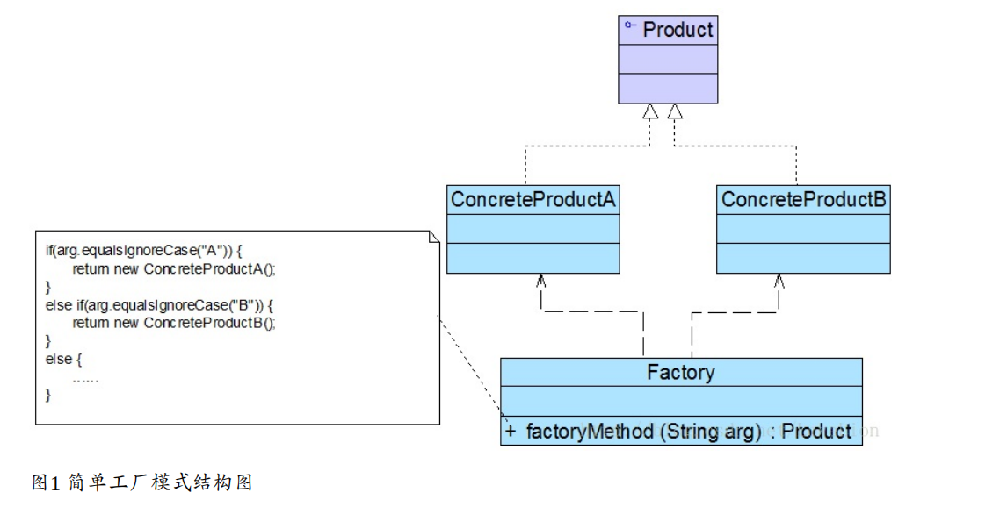

>简单工厂模式的使用方法：
>①：编写一个产品类接口。
>②：编写多个继承产品类的具体产品类。
>③：编写工厂类，根据传入的参数不同，生产不同的产品。

```java

public interface Animal {
	public void say();
}

---

public class Cat implements Animal {
	@Override
	public void say() {
		System.out.println("喵喵");
	}
}

---

public class Dog implements Animal {
	@Override
	public void say() {
		System.out.println("旺旺");
	}
}

---

public class Factory {
	//创建工厂类，通过输入的参数不同，生产不同的类实例
	public static Animal getAnimal(String str) {
		Animal animal=null;
		if(str.equals("Cat")) {
			animal=new Cat();				//父类引用指向子类对象
		}else if(str.equals("Dog")) {
			animal=new Dog();
		}
		return animal;
	}
}

---

public class Test {
	public static void main(String[] args) {
		//根据传入的数据不同，创建不同的类实例
		Animal a=Factory.getAnimal("Cat");
		a.say();
		Animal b=Factory.getAnimal("Dog");
		b.say();
	}
}

```

# 3.工厂方法模式-Factory Method Pattern

简单工厂模式的缺点：==系统扩展不灵活，工厂类过于庞大==。当系统中需要引入新产品时，由于通过所传入参数的不同来创建不同的产品，这必定要修改工厂类的源代码，这违反了“开闭原则”。如何实现增加新产品而不影响已有代码？工厂方法模式应运而生。

<font color="red">工厂方法模式不再提供一个统一的工厂类来创建所有的产品对象，而是提供一个抽象工厂接口，由其实现类来具体实现不同的工厂方法。与简单工厂模式相比，最重要的区别是引入了抽象工厂，抽象工厂可以是接口，也可以是抽象类或者具体类，</font>

<font color="blue">工厂方法模式：有四个类，抽象工厂类，抽象工厂实现类，抽象产品类，抽象产品实现类。不再是由一个工厂类去实例化所有的具体产品，而是由不同的抽象工厂实现类去实例化不同的具体产品。</font>

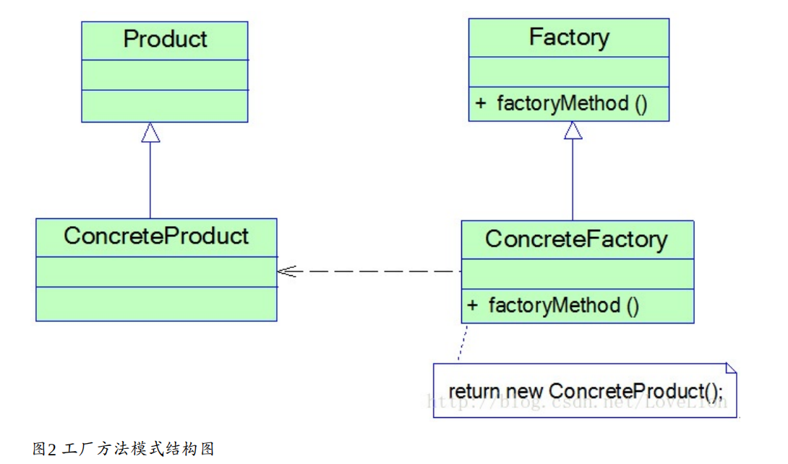

```java
//抽象产品类
public interface Animal {
	public void say();
}
//抽象工厂类
public interface Factory {
	public Animal createAnimal();
}
//具体产品类
public class Cat implements Animal {
	@Override
	public void say() {
		System.out.println("喵喵");
	}
}
//具体产品类
public class Dog implements Animal {
	@Override
	public void say() {
		System.out.println("旺旺");
	}
}
//具体工厂类
public class CatFactory implements Factory{
	//实现抽象工厂类，生产某个具体的产品
	@Override
	public Animal createAnimal() {
		return new Cat();
	}
}
//具体工厂类
public class DogFactory implements Factory{
	//实现抽象工厂类，生产某个具体的产品
	@Override
	public Animal createAnimal() {
		return new Dog();
	}
}
//test
public class Test {
	public static void main(String[] args) {
		//创建具体产品的工厂类
		Factory cf=new CatFactory();
		//通过该类创建某个具体的产品，并用父类引用指向子类对象
		Animal a=cf.createAnimal();
		a.say();
		
		Factory df=new DogFactory();
		Animal b=df.createAnimal();
		b.say();
	}
}
```

>总结：
> 1.优点：在系统中加入新产品时，无须修改抽象工厂和抽象产品提供的接口，无须修改其他的具体工厂和具体产品，而只要添加一个具体工厂和具体产品就可以了。系统的可扩展性也就变得非常好，完全符合“开闭原则”。
> 2.缺点：在添加新产品时，需要编写新的具体产品类，和与之对应的具体工厂类，系统中类的个数将成对增加。

---

# 4.抽象工厂模式-Abstract Factory Pattern

抽象工厂模式为创建一组对象提供了一种解决方案。==与工厂方法模式相比，抽象工厂模式中的具体工厂不只是创建一种产品，它负责创建一系列产品。== 每一个具体工厂都提供了多个方法用于产生多种不同类型的产品。

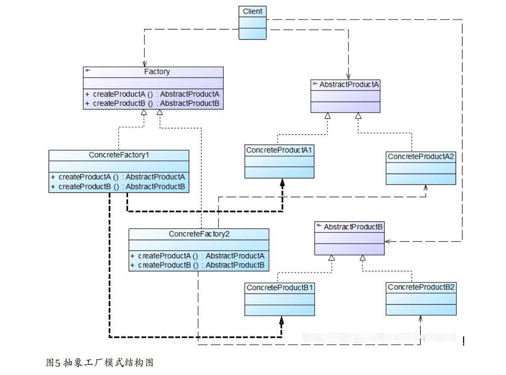

```java
//抽象动物类
public interface Animal {
	public void say();
}
//具体动物类
public class Cat implements Animal {
	@Override
	public void say() {
		System.out.println("喵喵");
	}
}
//具体动物类
public class Dog implements Animal {
	@Override
	public void say() {
		System.out.println("旺旺");
	}
}
//抽象工厂类
public interface Factory {
	public Animal createCat();
	public Animal createDog();
}
//具体工厂类
public class concentrateFactory implements Factory {
	@Override
	public Animal createCat() {
		return new Cat();
	}
	@Override
	public Animal createDog() {
		return new Dog();
	}
}
//测试类
public class Test {
	public static void main(String[] args) {
		Factory factory=new concentrateFactory();
		Animal cat = factory.createCat();
		Animal dog = factory.createDog();
		cat.say();
		dog.say();
	}
}

```

>总结：
> 1.优点：增加新的产品很方便，无须修改已有系统结构。
> 2.缺点：增加新的产品类的方法麻烦，需要对原有系统进行较大的修改，甚至需要修改接口层代码。

---

# 5.原型模式（克隆模式,用于对象的克隆）-Prototype Pattern

==原型模式：可以通过一个原型对象克隆出多个一模一样的对象。== 创建克隆对象的工厂就是原型类自身。

<font color="red">

1.注意的是通过克隆方法所创建的对象是全新的对象，它们在内存中拥有新的地址。
2.注意的是被克隆的Java类必须实现一个标识接口Cloneable，表示这个Java类支持被复制。如果一个类没有实现这个接口但是调用了clone()方法，Java编译器将抛出一个CloneNotSupportedException异常。

</font>

> 原型模式分为浅克隆与深克隆方式。
>1. 浅克隆:若被复制对象是基本数据类型，则复制一份给克隆对象。若是引用数据类型，则把地址复制一份给克隆对象，使原型对象和克隆对象指向相同的内存地址。
>2. 深克隆:无论原型对象的成员变量是值类型还是引用类型，都将复制一份给克隆对象。除了原型对象本身被复制外，原型对象包含的所有成员变量也将复制。

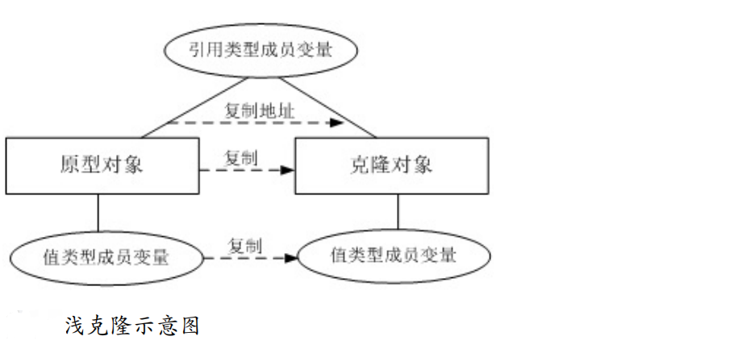
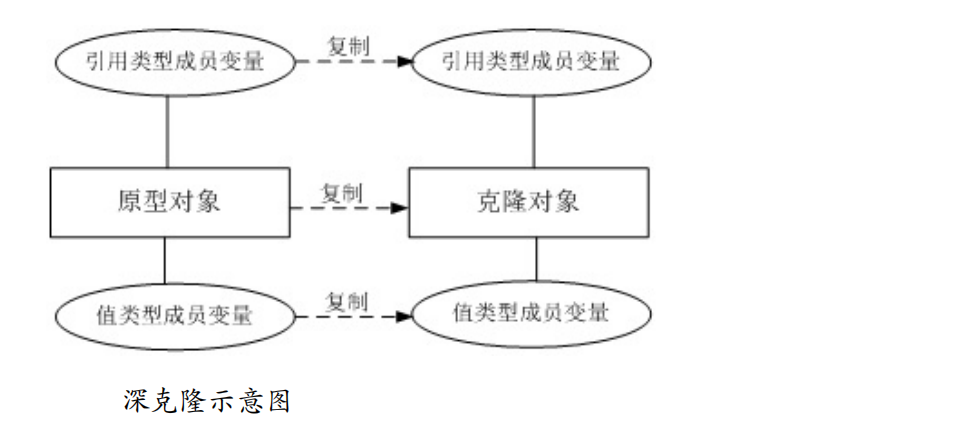


①：浅克隆：

```java
public class Person implements Cloneable {
	private String name;
	private int age;
	
	//当clone()方法出现问题，会出现CloneNotSupportedException异常
	public Person Clone() throws CloneNotSupportedException{
		Object object=super.clone();
		return (Person)object;
	}
}
```

①：深克隆：
在Java语言中，如果需要实现深克隆，有两个方法。①：对原型对象附属引用类型也进行clone方法。 ②：可以通过序列化(Serialization)等方式来实现，==即原型类以及附属的引用类型需要实现Serializable接口。==

```java

//第一种方式
public class Person implements Cloneable {
	private String name;
	private int age;
	private Child child; 
	
	public Object DeepClone() throws CloneNotSupportedException{
		Object obj = super.clone();  //直接调用object对象的clone()方法！
        Person person = (Person) obj;
        person.child = (Child)this.child.clone(); //把属性类child也进行克隆
        return obj;
	}
	
}

class Child implements Cloneable{
	private String childname;
	
	public void brith() {
		System.out.println("小孩子的生日");
	}
	protected Object clone() throws CloneNotSupportedException {
        return super.clone();
    }
}


//第二种方式
public class Person implements Serializable {
	private String name;
	private int age;
	private Child child; 
	
	public Person DeepClone() throws IOException,ClassNotFoundException{
		/* 写入当前对象的二进制流 */ 
		ByteArrayOutputStream bos = new ByteArrayOutputStream(); 
		ObjectOutputStream oos = new ObjectOutputStream(bos); 
		oos.writeObject(this); 
		/* 读出二进制流产生的新对象 */ 
		ByteArrayInputStream bis = new ByteArrayInputStream(bos.toByteArray()); 
		ObjectInputStream ois = new ObjectInputStream(bis); 
		return (Person) ois.readObject(); 
	}
}

class Child implements Serializable{
	private String childname;
	public void brith() {
		System.out.println("小孩子需要过生日");
	}
}

```

# 6.建造者模式（用于复杂对象的组装与创建）-Builder Pattern

==建造者模式：将一个复杂对象的构建与它的表现分离，使得同样的构建过程可以创建不同的表现。==
建造者模式一步一步创建一个复杂的对象，它允许用户只通过指定复杂对象的类型和内容就可以构建它们，用户不需要知道内部的具体构建细节。

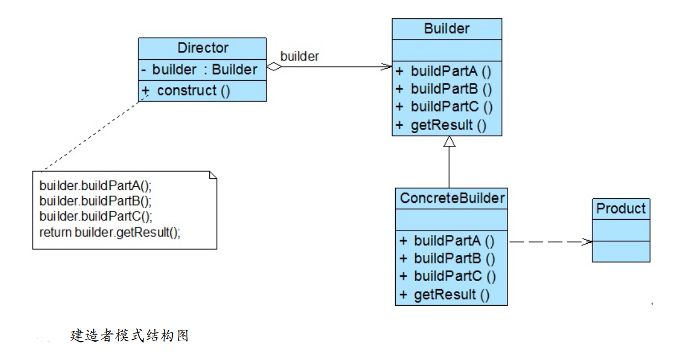

>在建造者模式中存在以下4个角色：
>1. builder:==类似于抽象工厂==。为创建一个产品Product对象的各个部件指定抽象接口，一般声明两类方法，一是buildPartX()，它们用于创建复杂对象的各个部件；另一方法是getProduct()，它们用于返回复杂对象。
>2. ConcreteBuilder:==类似于具体工厂==。实现了Builder接口，实现各个方法，也可以提供一个方法返回创建好的复杂产品对象。
>3. Director:==类似于工厂里的工程师==。它负责安排复杂产品的建造次序。
>4. Product:是产品，包含多个组成部件。

```java

//Product，把房子当作产品
public class Product {
	private String basic;//地基
    private String wall;//墙
    private String roofed;//楼顶
    
	public String getBasic() {
		return basic;
	}
	public void setBasic(String basic) {
		this.basic = basic;
	}
	public String getWall() {
		return wall;
	}
	public void setWall(String wall) {
		this.wall = wall;
	}
	public String getRoofed() {
		return roofed;
	}
	public void setRoofed(String roofed) {
		this.roofed = roofed;
	}
	@Override
	public String toString() {
		return "Product [basic=" + basic + ", wall=" + wall + ", roofed=" + roofed + "]";
	}
}

//builder
public interface Build {
	public void build_basic();//建造地基
	public void build_wall();
	public void build_roofed();
	public Product getProduct(); //返回具体产品
}

//ConcreteBuilder
public class ConcreteBuilder implements Build {
	private Product p;

	@Override
	public void build_basic() {
		p.setBasic("建造地基");
	}

	@Override
	public void build_wall() {
		p.setWall("建造围墙");
	}

	@Override
	public void build_roofed() {
		p.setRoofed("建造屋顶");
	}

	@Override
	public Product getProduct() {
		return p;
	}
}

//Director
public class Director {
	private Build builder;
	public Product construct() {
		builder.build_basic();   //先建造地基
		builder.build_roofed();  //再建造屋顶
		builder.build_wall();	 //再建造围墙
		return builder.getProduct();
	}
}

```

>建造者模式优点缺点：
>1. 优点：可以更加精细地控制产品的创建过程。将复杂产品的创建步骤分解在不同的方法中。
>2. 缺点：①：建造者模式创建的产品一般有较多的共同点，如果产品之间的差异性很大，例如很多组成部分都不相同，不适合使用建造者模式。②：同样，如果产品的内部变化复杂会导致需要定义很多具体建造者类来实现这种变化，导致系统变得很庞大。

---

# 7.适配器模式（用于不兼容结构的协调）-Adapter Pattern

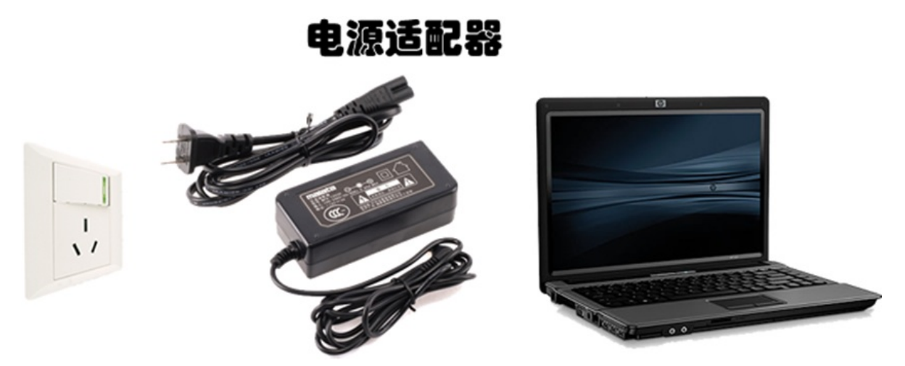

适配器模式：==在软件开发中，有时也存在类似这种不兼容的情况，我们也可以像引入一个电源适配器一样引入一个称之为适配器的角色来协调这些存在不兼容的结构。==

适配器模式有三种：类适配器、对象适配器、接口适配器。==在对象适配器中，适配器与适配者之间是关联关系；在类适配器中，适配器与适配者之间是继承（或实现）关系。==

>在适配器中包含如下角色：
>1. Target（目标抽象类）：用来定义客户所需接口，可以是一个抽象类或接口，也可以是具体类。
>2. Adaptee（适配者类）：被适配的角色，它定义了一个需要被适配的接口，适配者类一般是一个具体类，包含了客户希望使用的业务方法。在某些情况下可能没有适配者类的源代码。
>3. Adapter（适配器类）：适配器可以作为一个转换器，对Adaptee和Target进行适配。==在对象适配器中，它通过继承Target并关联一个Adaptee对象使二者产生联系。==


## 1.类适配器

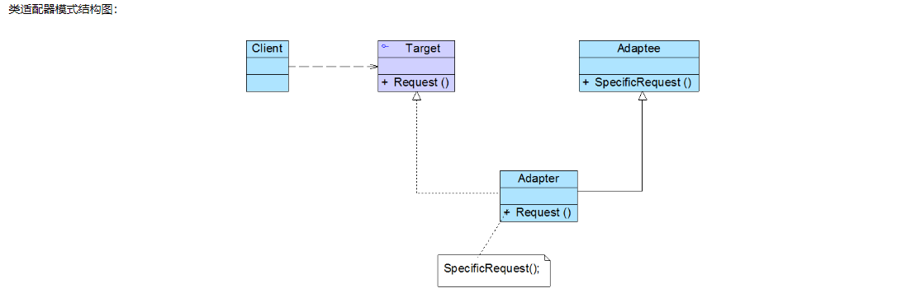

```java
// 已存在的、具有特殊功能、但不符合我们既有的标准接口的类  
class Adaptee {  
    public void specificRequest() {  
        System.out.println("被适配类具有 特殊功能...");  
    }  
}  
// 目标接口，或称为标准接口  
interface Target {  
    public void request();  
}  
// 具体目标类，只提供普通功能  
class ConcreteTarget implements Target {  
    public void request() {  
        System.out.println("普通类 具有 普通功能...");  
    }  
}   
// 适配器类，继承了被适配类，同时实现标准接口  
class Adapter extends Adaptee implements Target{  
    public void request() {  
        super.specificRequest();  
    }  
}   
// 测试类  
public class Client {  
    public static void main(String[] args) {  
        // 使用普通功能类  
        Target concreteTarget = new ConcreteTarget();  
        concreteTarget.request();  
        // 使用特殊功能类，即适配类  
        Target adapter = new Adapter();  
        adapter.request();  
    }  
}  

```

>测试结果：
普通类 具有 普通功能...
被适配类具有 特殊功能... 

## 2.对象适配器

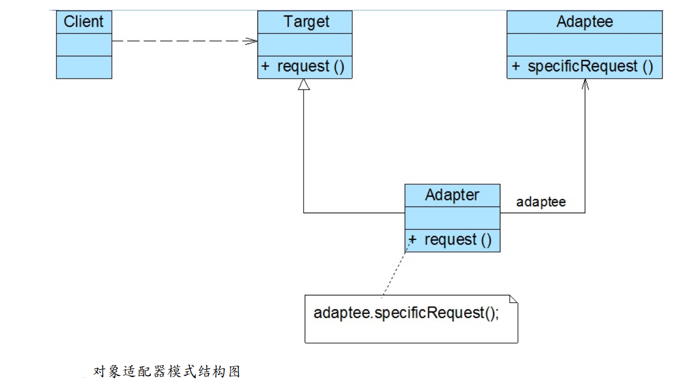

```java

// 适配器类，直接关联被适配类，同时实现标准接口  
class Adapter implements Target{  
    // 直接关联被适配类  
    private Adaptee adaptee;  
    // 可以通过构造函数传入具体需要适配的被适配类对象  
    public Adapter (Adaptee adaptee) {  
        this.adaptee = adaptee;  
    }  
    public void request() {  
        // 这里是使用委托的方式完成特殊功能  
        this.adaptee.specificRequest();  
    }  
}  
// 测试类  
public class Client {  
    public static void main(String[] args) {  
        // 使用普通功能类  
        Target concreteTarget = new ConcreteTarget();  
        concreteTarget.request();  
        
		// 使用特殊功能类，即适配类，  
        // 需要先创建一个被适配类的对象作为参数  
        Target adapter = new Adapter(new Adaptee());  
        adapter.request();  
    }  
}  
```

>测试结果：
普通类 具有 普通功能...
被适配类具有 特殊功能... 

---

# 8.桥接模式-Bridge Pattern

[参考链接](http://www.jasongj.com/design_pattern/bridge/)

==桥接模式：将可抽象部分与它的可实现部分分离，使它们都可以独立地变化==。

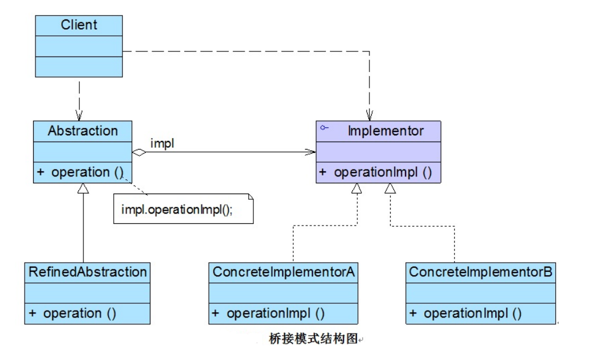

<h3>举例：</h3>

汽车可按品牌分（BMT，BenZ，LandRover），也可按手动档、自动档来分。如果对于每一种车都实现一个具体类，则一共要实现3*3=9个类。

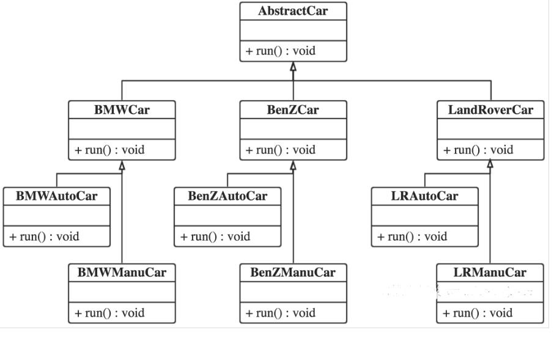

> <font color="red">当对这个继承结构图使用桥接模式重新设计后：</font>

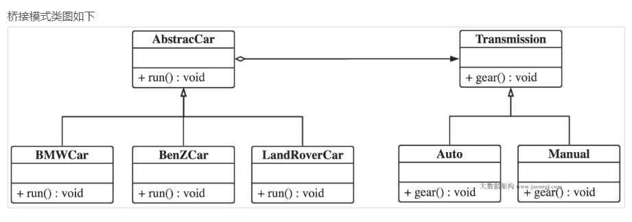

<font color="blue">图中把整个结构图分为品牌和驾驶方式两个部分，当增加车品牌时和增加车的驾驶方式时，方便后续的更新。</font>

```java

//车的品牌抽象类
public abstract class AbstractCar {
	protected Tranmisson tranmisson;  //方便子类继承该属性
	
	public Tranmisson getTranmisson() {
		return tranmisson;
	}
	public void setTranmisson(Tranmisson tranmisson) {
		this.tranmisson = tranmisson;
	}
	public abstract void run();
}
//
public class BenZCar extends AbstractCar {
	@Override
	public void run() {
		System.out.println("这是BenZCar");
	}
}
//
public class BMWCar extends AbstractCar {
	@Override
	public void run() {
		System.out.println("这是BMW 车");
	}
}
//.....
//车的驾驶方式抽象类
public abstract class Tranmisson {
	protected AbstractCar abstractCar;   //方便子类继承该属性

	public AbstractCar getAbstractCar() {
		return abstractCar;
	}
	public void setAbstractCar(AbstractCar abstractCar) {
		this.abstractCar = abstractCar;
	}
	public abstract void gear();
}
//
public class Manual extends Tranmisson {
	@Override
	public void gear() {
		System.out.println("这是手动档");
	}
}
//
public class Auto extends Tranmisson {
	@Override
	public void gear() {
		System.out.println("这是自动挡");
	}
}


//
public class Test {
	public static void main(String[] args) {
		AbstractCar benz=new BenZCar();
		AbstractCar bmw=new BMWCar();
		AbstractCar landr=new LandRoverCar();
		Tranmisson auto=new Auto();
		Tranmisson manual=new Manual();
		
		benz.setTranmisson(auto);   //设置奔驰车的驾驶方式为自动档
		benz.run();
		
		bmw.setTranmisson(manual); //设置宝马为手动档
		bmw.run();
	}
}


```

---

# 9.组合模式（用于树形结构的处理）-Composite Pattern

树形结构在软件中随处可见，例如操作系统中的目录结构、应用软件中的菜单、办公系统中的公司组织结构等等，组合模式为处理树形结构提供了一种较为完美的解决方案。

组合模式：组合多个对象形成树形结构以表示具有“整体—部分”关系的层次结构。

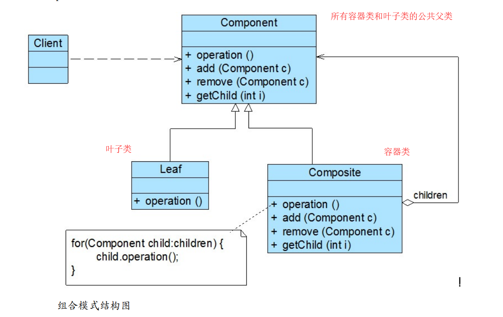

>组合模式结构图中包含如下几个角色:
>1. Component：它可以是接口或抽象类，为叶子构件和容器构件公共父类或接口，在该角色中可以包含所有子类共有行为的声明和实现。如增加子构件、删除子构件、获取子构件等。
>2. Leaf：表示叶子节点对象，叶子节点没有子节点，它实现了Component中定义的行为。对于那些访问及管理子构件的方法，可以通过异常等方式进行处理。
>3. Composite（容器构件）：表示容器节点对象，它提供一个集合用于存储子节点，它实现了Component中定义的行为，包括那些访问及管理子构件的方法.

```java
//根节点
public interface Component {
	public  void add(Component c); //增加成员
	public  void remove(Component c); //删除成员
	public  Component getChild(int i); //获取成员
	public  void operation(); //业务方法
}
//容器节点
public class Composite implements Component{
	private ArrayList<Component> list = new ArrayList<Component>();  //容器中可以存在容器或叶子节点
	
	@Override
	public void add(Component c) {
		list.add(c);
	}
	@Override
	public void remove(Component c) {
		list.remove(c);
	}
	@Override
	public Component getChild(int i) {
		return (Component)list.get(i);
	}
	@Override
	public void operation() {
		for(Object obj:list) {
			((Component)obj).operation();
		}
	}
}
//叶子节点
public class Leaf implements Component {
	public void add(Component c) {
		System.out.println("增加节点");
	}
	public void remove(Component c) {
		System.out.println("移除节点");
	}
	public Component getChild(int i) {
		return null;
	}
	public void operation() {
		System.out.println("操作节点");
	}
}

```

>优点缺点：
>1. 优点：①在组合模式中增加新的容器构件和叶子构件都很方便，无须对现有类库进行任何修改，②通过叶子对象和容器对象的递归组合，可以形成复杂的树形结构，但对树形结构的控制却非常简单。
>2. 缺点：增加新构件时很难对容器中的构件类型进行限制。

---

# 10.装饰模式（用于扩展对象功能）-Decorator Pattern

装饰模式是处理如何让系统中的类可以进行扩展但是又不会导致类数目的急剧增加的问题。
==装饰模式可以在不改变一个对象本身功能的基础上给对象增加额外的新行为。可以在不需要创造更多子类的情况下，将对象的功能加以扩展。==

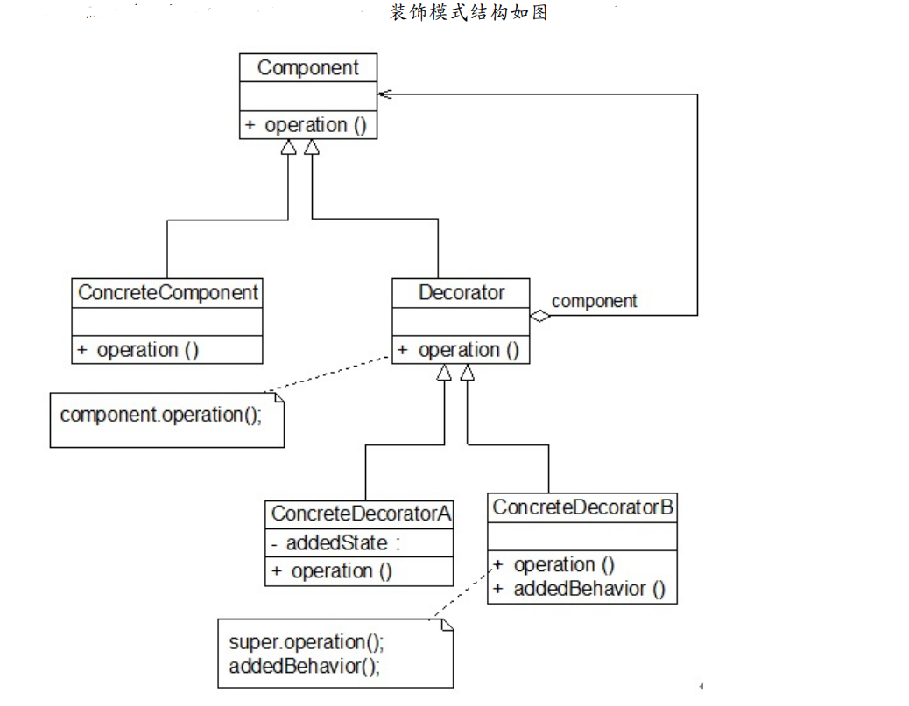


>在装饰模式结构图中包含如下几个角色：
>1. Component（抽象构件）：它是具体构件和抽象装饰类的共同父类，声明了在具体构件中实现的业务方法。
>2. ConcreteComponent（具体构件）：用于定义具体的构件对象，实现了在抽象构件中声明的方法，装饰器可以给它增加额外的职责（方法）。
>3. Decorator（抽象装饰类）：用于给具体构件增加职责，但是具体方法在其子类中实现。它有一个指向父类的引用，通过该引用可以调用构件对象，并通过其子类扩展该方法，以达到装饰的目的。
>4. ConcreteDecorator（具体装饰类）：负责向构件添加新的装饰。每一个具体装饰类都定义了一些新的行为，它可以调用在父类中定义的方法，并可以增加新的方法用以扩充对象的行为。

<h3>举例：人类是可以跑的，但是不能飞。现在，给人类进行装饰，要人类会飞。</h3>

```java
//被装饰对象的抽象接口
public interface Human {
	public void run();
}

//具体的被装饰对象
public class Man implements Human {
	@Override
	public void run() {
		System.out.println("人会跑步");
	}
}

//抽象装饰类
public abstract class AbstractDecorator implements Human{
	//被装饰对象的引用 
	private Human human;
	//构造函数注入被装饰者
	public AbstractDecorator(Human human) {
		this.human = human;
	}
	//调用被装饰对象的方法
	@Override
	public void run() {
		human.run();
	}
}

//具体装饰类
public class ManDecorator extends AbstractDecorator {
	public ManDecorator(Human human) {
		//调用父类的构造方法
		super(human);
	}
	//装饰类增加的功能
	private void fly() {
		System.out.println("人可以飞");
	}
	//增强了功能的run方法
	@Override
	public void run() {
		super.run();
		fly();
	}
}

//测试
public class Test {
	public static void main(String[] args) {
		//创建被装饰的类
		Human human = new Man();
		
		//创建装饰的类，并添加被装饰类的引用
		Human superMan = new ManDecorator(human);
		
		//执行增强后的run方法
		superMan.run();
	}
}
```

---

# 11.外观模式-Facade Pattern

==外观模式又称为门面模式，为子系统中的提供一个统一的入口。这个入口使得这一子系统更加容易使用。子系统类通常是一些业务类，实现了一些具体的、独立的业务功能。==

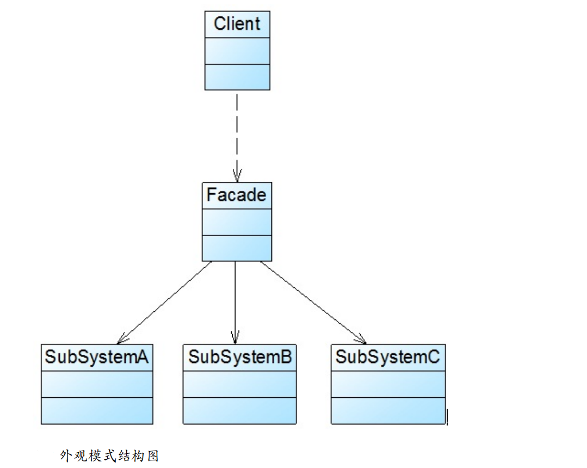

>外观模式包含如下两个角色：
>(1) Facade（外观角色）：==其可以是普通类，也可以是接口==。用户可以调用它的方法，在外观角色中可以知道子系统的功能和责任；在正常情况下，它将所有从客户端发来的请求委派到相应的子系统去，传递给相应的子系统对象处理。
>(2) SubSystem（子系统角色）：可以有一个或者多个子系统角色，每一个子系统可以不是一个单独的类，而是一个类的集合，它实现子系统的功能；每一个子系统都可以被客户端直接调用，或者被外观角色调用，==它处理由外观类传过来的请求；子系统并不知道外观的存在，对于子系统而言，外观角色仅仅是另外一个客户端而已。==

```java

//子系统A
class SubSystemA
{   
	public void MethodA(){
	//业务实现代码
	}
}
//子系统B
class SubSystemB
{   
	public void MethodB(){
	//业务实现代码
	}
}
//子系统C
class SubSystemC
{
	public void MethodC(){
	//业务实现代码
	}
}

//外观类
class Facade
{
	private SubSystemA obj1 = new SubSystemA();
	private SubSystemB obj2 = new SubSystemB();
	private SubSystemC obj3 = new SubSystemC();
	public void Method(){
	obj1.MethodA();
	obj2.MethodB();
	obj3.MethodC();
	}
}

//测试
class Program
{
	static void Main(string[] args){
		Facade facade = new Facade();
		facade.Method();
	}
}

```

>外观模式的优缺点：
>优点：实现了子系统与客户端之间的松耦合关系，一个子系统的修改对其他子系统没有任何影响，而且子系统内部变化也不会影响到外观对象。
>缺点：不能很好地限制客户端直接使用子系统类。如果设计不当，增加新的子系统可能需要修改外观类的源代码，违背了开闭原则。

---

# 12.享元模式（用于节约内存使用空间）-Flyweight Pattern

==享元模式主要实现对同或者相似对象的共享访问，从而节约内存使用空间。==

<h3>举例</h3>
一个文本字符串中存在很多重复的字符，若每个字符代表一个对象，将会出现大量的对象，从而浪费系统资源？而享元模式通过建立享元池来解决这个问题。

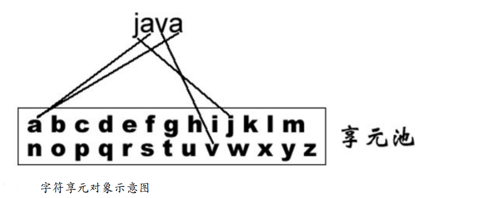

>享元对象能做到共享的关键是区分了内部状态和外部状态.
>1. 内部状态：是存储在享元对象内部并且不会随环境改变而改变的状态，内部状态可以共享。==例如字符内容。==
>2. 外部状态：是随环境改变而改变的、不可以共享的状态。其通常由客户端保存，并在享元对象被创建之后，需要使用的时候再传入到享元对象内部。==例如字符大小与颜色。==

<font color="red">

享元模式的实现过程：
1. 将具有相同内部状态的对象存储在享元池中.
2. 需要的时候就将对象从享元池中取出，实现对象的复用。
3. 通过向取出的对象注入不同的外部状态，可以得到一系列相似的对象,而这些对象在内存中实际上只存储一份。

</font>

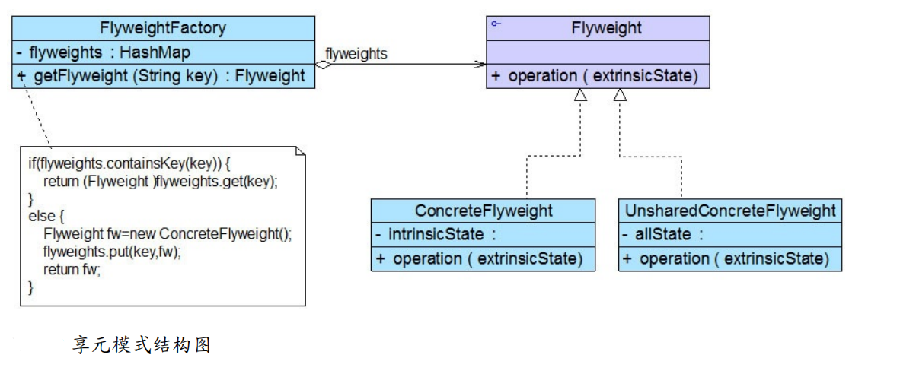

>享元模式角色划分
FlyWeightFactory 享元工厂类，将各种类型的具体享元对象存储在一个享元池中
FlyWeight 享元接口或者（抽象享元类），声明了具体享元类公共的方法
ConcreteFlyWeight 具体享元类，其实例称为享元对象
UnSharedConcreteFlyWeight 非共享享元实现类

```java
//享元工厂
class FlyweightFactory {
	//定义一个HashMap用于存储享元对象，实现享元池
	private HashMap flyweights = new HashMap();
	
	public Flyweight getFlyweight(String key){
		//如果对象存在，则直接从享元池获取
		if(flyweights.containsKey(key)){
			return(Flyweight)flyweights.get(key);
		}else {
			//如果对象不存在，先创建一个新的对象添加到享元池中，然后返回

			Flyweight fw = new ConcreteFlyweight();
			flyweights.put(key,fw);
			return fw;
		}
	}
}

//
public interface FlyWeight {
  void operation(String externalState);
}

//
public class ConcreteFlyWeight implements FlyWeight {
		//内部状态intrinsicState作为成员变量，同一个享元对象其内部状态是一致的
		private String intrinsicState;
		
		public Flyweight(String intrinsicState) {
		this.intrinsicState=intrinsicState;
		}
		
		//外部状态extrinsicState在使用时由外部设置，不保存在享元对象中，即使是同一个对象，在每一次调用时也可以传入不同的外部状态
		public void operation(String extrinsicState) {
				....
		}
}

```

>享元模式的优缺点：
>优点：极大减少内存中对象的数量，使得相同或相似对象在内存中只保存一份。
>缺点：使得系统变得复杂，需要分离出内部状态和外部状态。

---

# 13.代理模式-Proxy Pattern

==代理模式：给某一个对象提供一个代理或占位符，并由代理对象来控制对原对象的访问。代理对象起到中介的作用，它可以为客户去掉一些服务或者增添额外的服务。==

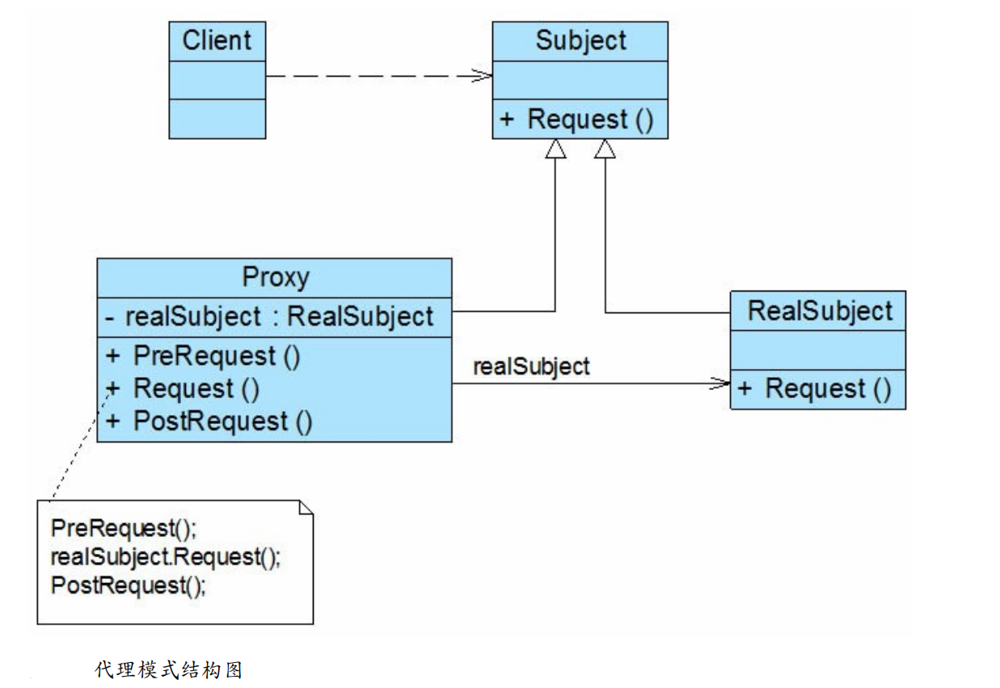

>代理模式角色划分
(1) Subject（抽象角色）：是代理角色和真实角色的父接口。
(2) Proxy（代理角色）：==它包含了对真实角色的引用==，
(3) RealSubject（真实角色）：它定义了代理角色所代表的真实对象，在真实角色中实现了真实的业务操作，客户可以通过代理角色间接调用真实角色。

```java

abstract class Subject
{
	public abstract void Request();
}
//
class RealSubject extends Subject
{
	public override void Request()
	{
		//业务方法具体实现代码
	}
}
//代理类
class Proxy extends Subject
{
		private RealSubject realSubject = new RealSubject(); //维持一个对真实主题对象的引用
		public void PreRequest(){    //代理类添加的多余方法
			…...
		}
		public override void Request(){
			PreRequest();
			realSubject.Request(); //调用真实对象的方法，执行目标对象的方法
			PostRequest();
		}
		public void PostRequest(){  //代理类添加的多余方法
			……
		}
}

//测试
public class Client {
	public static void main(String[] args) {
		Subject subject = new Proxy();  //父类引用指向子类对象
		subject.Request();      		//这个方法被代理进行修饰
	}
}
```

>代理模式的优缺点：
>优点：协调调用者和被调用者，在一定程度上降低了系统的耦合度。
>缺点：代理模式可能会造成请求的处理速度变慢。