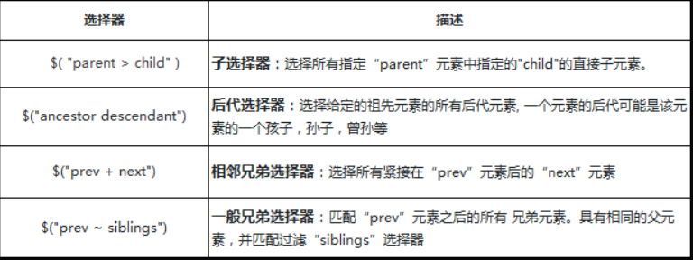
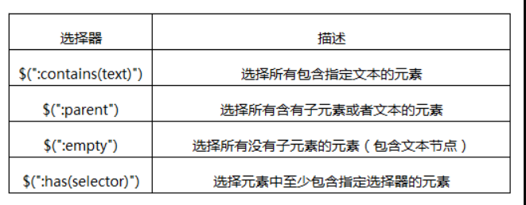
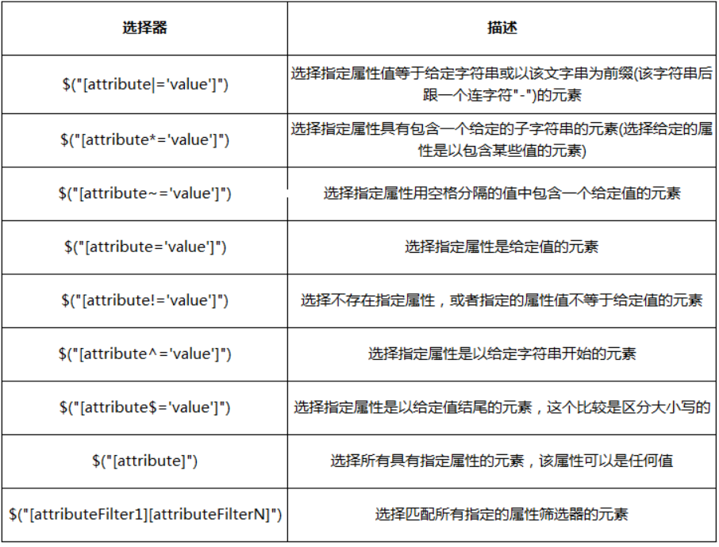
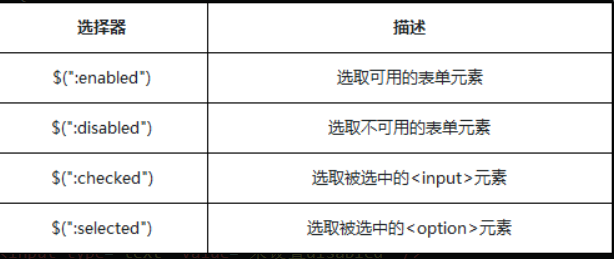

[toc]
# Jquery
jQuery是一个轻量级的JavaScript库。

## 1. Jquery 的引用：

```html
<head>
    <script src="https://cdn.bootcss.com/jquery/3.3.1/jquery.min.js">
    </script>
    <!--这里使用的是在线的jquery库-->
</head> 
```

## 2.jQuery基础

### 1.基础语法

==$是jQuery的简写。==

```js
$(selector).action();   //也可以写出jQuery(selector).action();
```

（1）$定义jQuery,将被选的DOM对象转换成jQuery对象。
（2）selector是选择器，类似于CSS选择器。
（3）action()是执行的操作

### 2.jquery对象和DOM对象 

jquery对JS中的大量方法进行封装，从而让我们操作更加便利，也规避了很多浏览器兼容问题。

<font color="red">通过jQuery选择器获取的对象就是jQuery对象</font>

>①jquery对象转化为DOM对象：

```html
<div>元素一</div>
<div>元素二</div>
<div>元素三</div>
```

```js
var $div = $('div') // 用jQuery找到所有的div元素（3个），为数组结构
var div = $div[0] //  通过数组下标索引，获取数组中的第一个div元素，返回DOM对象
div.style.color = 'red' //操作dom对象的属性
```

<font color="red">jQuery对象自身提供一个.get() 方法允许我们直接访问jQuery对象中相关的DOM节点，get方法中提供一个元素的索引：</font>


>②DOM对象转换为Jquery对象：

`var a = $(被转换的dom对象);   //将普通的dom对象加工成jQuery对象a`  

```js
var odiv=document.getElementById("#ant");   //返回dom对象
var $div = $(odiv);                     //把dom对象转换为jq对象
```

### 3. `$(document).ready(function(){...})` 与 `$(function(){...})`

```js
$(document).ready(function(){
  // 文档就绪
})

//这是上面代码的简写
$(function(){
  // 文档就绪
});
```

作用就是等文档结构加载完成后再去执行function中的代码。
功能类似于window.onload事件,与DOMContentLoaded事件功能相同。

### 4.$()或jQuery()

```js
jQuery([selector,[context]]);   //接收一个包含CSS选择器的字符串，然后用这个字符串去匹配一组元素
```

注意：
1. 如果没有指定context，$()将在当前的HTML document中查找DOM元素；
2. 如果指定了context参数，如一个DOM元素集或jQuery对象，那就会在这个context中查找。

```js
$("li", $("#box")).css("color","blue");   //在id=box的标签中，把li标签的字体颜色设置为蓝色
```

### 5.jQuery length属性

```js
$(selector).length;    //length属性获取jQuery元素集合中元素的个数。
```

---

## 3.选择器


### 1.#id选择器

<font color="red">id选择器：一个用来查找标签的ID，即元素的id属性</font>

```js
$( "#id" );   //$("#id_1")
```

### 2. .class选择器

<font color="red">类选择器，顾名思义，通过class样式类名来获取节点</font>

```js
$( ".class" );   //$(".class_1")
```

### 3.element选择器

<font color="red">元素选择器：根据给定（html）标记名称选择所有的元素，有原生方法getElementsByTagName()函数支持</font>
```js
$("element");   //如 $("span")
```

==搜索指定元素标签名的所有节点，这个是一个合集的操作，产生数组对象。==

### 4.全（*）选择器：

jQuery中我们也可以通过传递*选择器来选中文档页面中的元素
```js
$( "*" );    //使用document.getElementsByTagName()中传递"*"同样可以做到
```

### 5.分组选择器

```js
$( "selector1, selector2, selectorN" );  //如：$("p,div,.ant");选择p标签,div标签,class="ant"的标签
```


### 5.层级选择器：
把文档树当作一个家谱，那么节点与节点直接就会存在父子，兄弟，祖孙的关系了。
通过一个列表，显示层级选择器



### 6.筛选选择器：
jQuery提供了一系列的筛选选择器用来更快捷的找到所需的DOM元素。
筛选选择器的用法与CSS中的伪元素相似，选择器用冒号“：”开头.

==1.基本筛选器的描述：==


<font color="red">注意事项：</font>
**注意jQuery合集都是从0开始索引**.

==2.内容筛选选择器==
通过内容来过滤，内容筛选选择器，其规则也会体现在它所包含的子元素或者文本内容上。




<font color="red">注意事项：</font>
:contains与:has都有查找的意思，但是contains查找包含“指定文本”的元素，has查找包含“指定元素”的元素
:parent与:empty是相反的，两者所涉及的子元素，包括文本节点

==3.可见性筛选选择器:==
元素有显示状态与隐藏状态，jQuery根据元素的状态扩展了可见性筛选选择器:visible与:hidden.


<font color="red">:hidden选择器，不仅仅包含样式是display="none"的元素，还包括隐藏表单、visibility等等</font>


隐藏一个元素的几种方式：
1. CSS display的值是none。
2. type="hidden"的表单元素。
3. 宽度和高度都显式设置为0。
4. 一个祖先元素是隐藏的，该元素是不会在页面上显示
6. CSS visibility的值是hidden
7. CSS opacity的指是0


==4.属性筛选选择器==
属性选择器让你可以基于属性来定位一个元素。可以只指定该元素的某个属性，



<font color="red">

注意：
[attr="value"]能帮我们定位不同类型的元素，特别是表单form元素的操作，比如说input[type="text"],input[type="checkbox"]等
</font>


==5.表单元素选择器==
表单选择器能够极其方便地获取到某个类型的表单元素


注意事项：
除了input筛选选择器，几乎每个表单类别筛选器都对应一个input元素的type值。大部分表单类别筛选器可以使用属性筛选器替换。比如 `$(':password') == $('[type=password]')`


==6.表单元素选择器2==
主要功能是对所选择的表单元素进行筛选.



注意事项：
选择器适用于复选框和单选框，对于下拉框元素, 使用 :selected 选择器
在某些浏览器中，选择器:checked可能会错误选取到`<option>`元素，所以保险起见换用选择器input:checked，确保只会选取`<input>`元素

