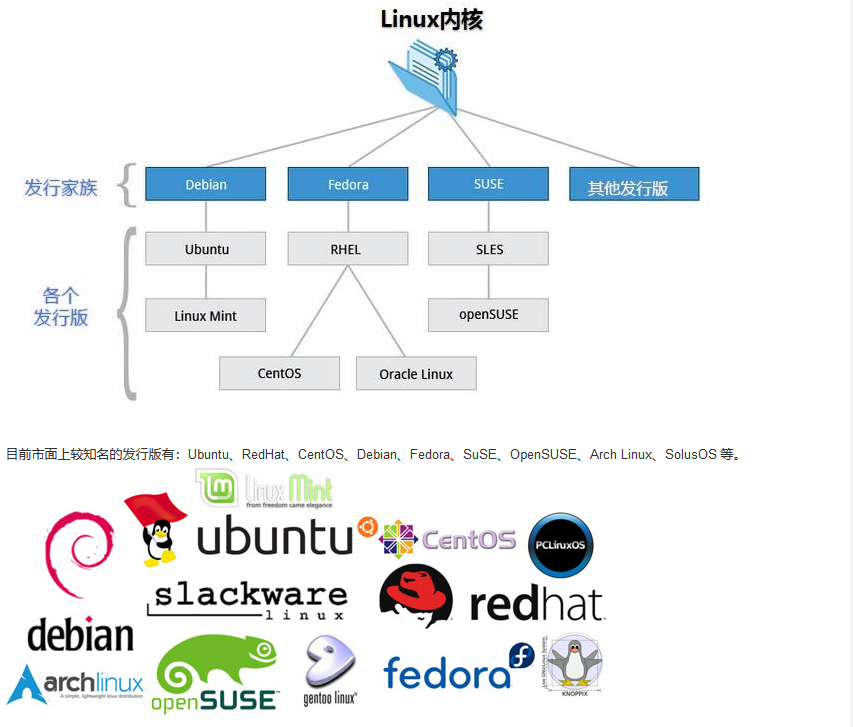
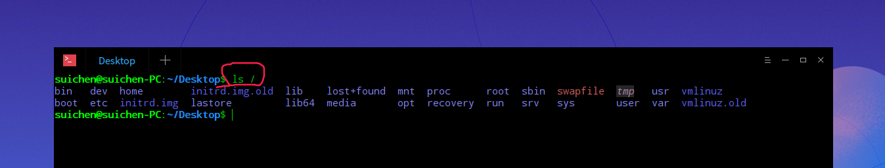
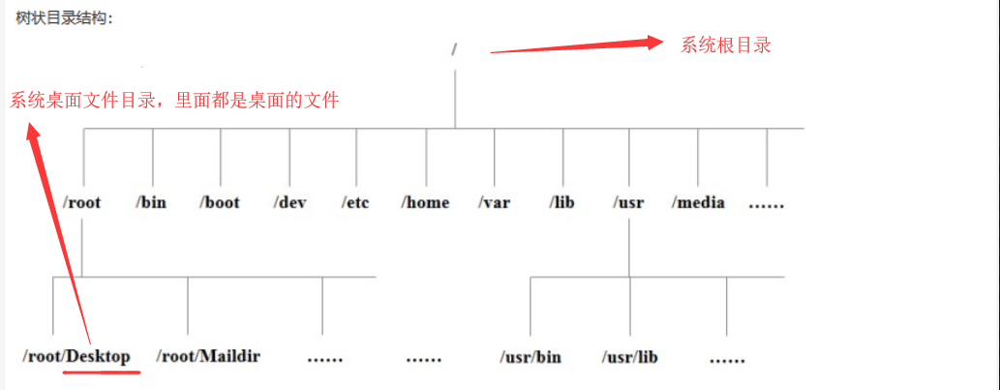
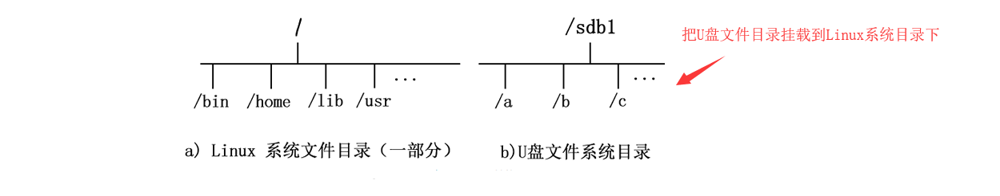
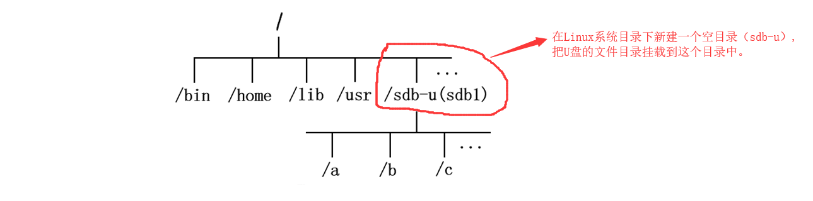
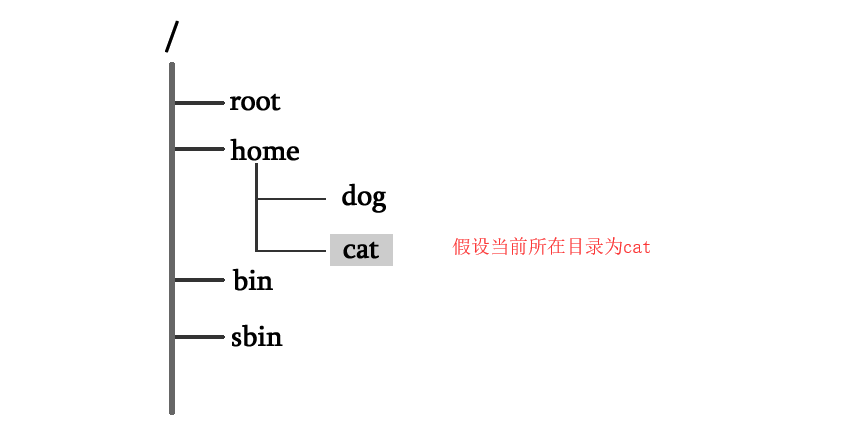
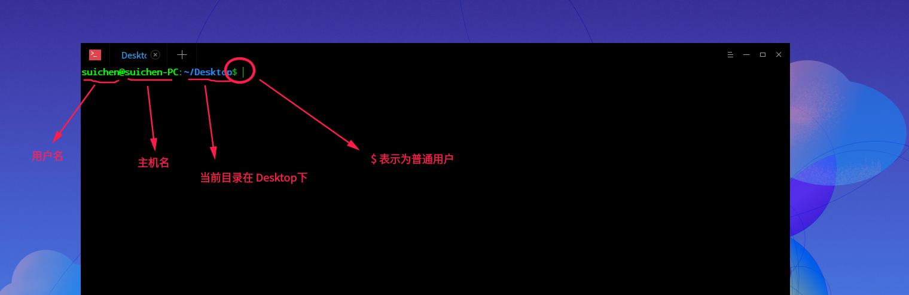
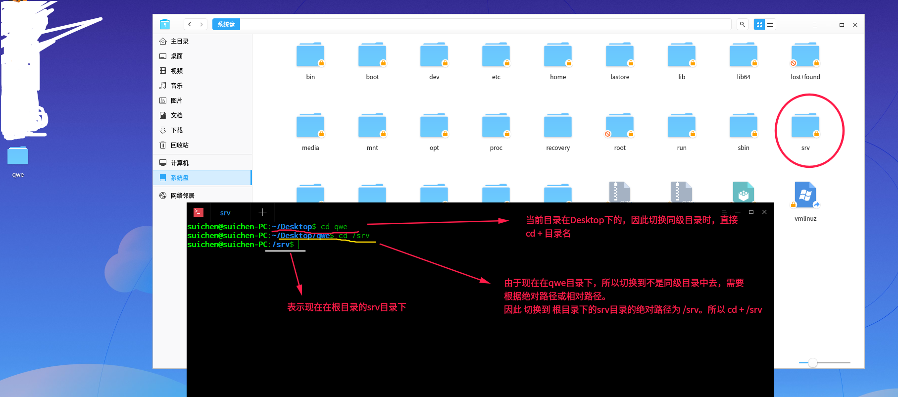
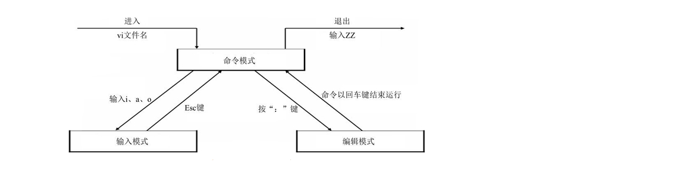
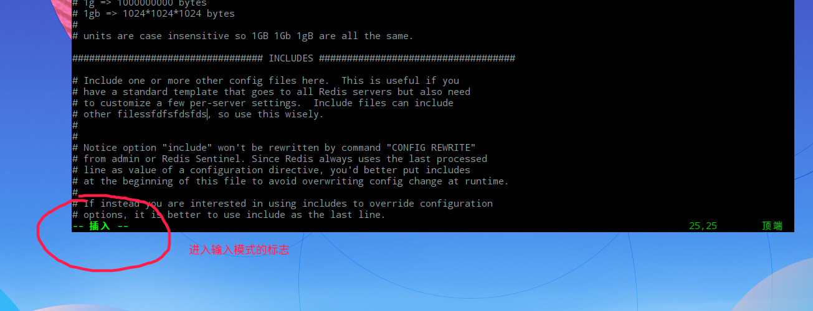

[TOC]

# Linux 

[参考链接](http://c.biancheng.net/linux_tutorial/)

# 1.Linux 简介

Linux是一套免费使用和自由传播的类Unix操作系统，是一个基于POSIX和UNIX的多用户、多任务、支持多线程和多CPU的操作系统。Linux存在着许多不同的Linux版本，但它们都使用了Linux内核。Linux可安装在各种计算机硬件设备中。

# 2.Linux 的各个发行版

Linux 本质上只是一个内核。内核指的是一个提供设备驱动、文件系统、进程管理、网络通信等功能的系统软件，它只是操作系统的核心。==一些组织或厂商将 Linux 内核与各种软件和文档包装起来，并提供系统安装界面和系统配置、设定与管理工具，就构成了 Linux 的发行版本。==

<font color="red">Linux 的发行版说简单点就是将 Linux 内核与应用软件做一个打包。</font>

>Linux 的发行版本可以大体分为两类：
商业公司维护的发行版本，以著名的 Red Hat 为代表；
社区组织维护的发行版本，以 Debian 为代表。

<h3>几款常用的 Linux 发行版本:</h3>

①：Red Hat Linux

Red Hat 公司是目前世界上资深的 Linux 厂商。产品主要包括 RHEL 和 CentOS 、Fedora Core。

②：Ubuntu Linux

==Ubuntu 基于知名的 Debian Linux 发展而来==，界面友好，容易上手，对硬件的支持非常全面，是目前最适合做桌面系统的 Linux 发行版本。

③：其他 Linux 发行版

 版本名称 | 特 点 | 软件包管理器
 ------ | ------ | ------ 
 Debian Linux  | 开放的开发模式，且易于进行软件包升级 | apt
 CentOS |CentOS 是对 RHEL 源代码再编译的产物| rpm
 Fedora Core |	拥有数量庞人的用户，优秀的社区技术支持. 并且有许多创新 | up2date（rpm），yum （rpm）
 Ubuntu |	优秀已用的桌面环境，基于 Debian 构建 |  apt



---

# 3.Linux vs Windows

**目前国内 Linux 更多的是应用于服务器上，而桌面操作系统更多使用的是 Windows。**

 比较 | Windows | Linux 
 ------ | ------ | ------ 
 界面  | 界面统一 | 图形界面风格依发布版不同而不同，基本命令和操作方法也几乎一致。
 驱动程序 | 驱动程序丰富，版本更新频繁。 | 由志愿者开发，由 Linux 核心开发小组发布。
 使用 |	使用比较简单，容易入门。| 图形界面使用简单，容易入门。文字界面，需要学习才能掌握。
 系统 |	系统构造复杂,变化频繁 | 系统构造简单、稳定，且知识、技能传承性好，深入学习相对容易。
 软件 |	每一种特定功能可能都需要商业软件的支持，需要购买相应的授权。 | 大部分软件都可以自由获取，同样功能的软件选择较少。
 
---

# 4.Linux 使用注意事项

<h4>1. Linux 严格区分大小写</h4>

==和 Windows 不同，Linux 是严格区分大小写的。==
例如，在 Linux 系统中，Demo 文件和 demo 文件可以位于同一目录下。

<h4>2. Windows 下的程序不能直接在 Linux 中使用</h4>

Linux 和 Windows 是不同的操作系统，两者的安装软件不能混用。

<h4>3. Linux 不靠扩展名区分文件类型</h4>

在Windows中是依赖扩展名区分文件类型的，比如，".txt" 是文本文件、".exe" 是执行文件".mp4" 是视频等。
在Linux 系统中，常见的文件类型只有普通文件、目录、链接文件、块设备文件、字符设备文件等几种。Linux 的可执行文件不过就是普通文件被赋予了可执行权限而已。

==但是Linux 中的一些特殊文件还是有 "扩展名" 的：==

>压缩包：Linux 下常见的压缩文件名有 " .gz "," .bz2 "," .zip "," .tar.gz "," .tar.bz2 "," .tgz " 等。如果不写清楚扩展名，那么管理员不容易判断压缩包的格式，虽然有命令可以帮助判断，但是直观一点更加方便。

>二进制软件包：CentOS 中所使用的二进制安装包是 RPM 包，所有的 RPM 包都用".rpm"扩展名结尾，目的同样是让管理员一目了然。

>程序文件：Shell 脚本一般用 ".sh" 扩展名结尾，其他还有用 ".c" 扩展名结尾的 C 语言文件等。

>网页文件：网页文件一般使用 ".php" 等结尾，不过这是网页服务器的要求，而不是 Linux 的要求。

<h4>4. Linux 中所有内容（包括硬件设备）以文件形式保存---Linux一切皆文件</h4>

Windows 是通过设备管理器来管理硬件的。Linux 中所有内容都是以文件的形式保存和管理的（硬件设备也是文件）。比如说，Linux 的设备文件保存在 /dev/ 目录中，硬盘文件是 /dev/sd[a-p]，光盘文件是 /dev/hdc 等。

<h4>5. Linux中所有存储设备都必须在挂载之后才能使用</h4>

Linux 中所有的存储设备都有自己的设备文件名，这些设备文件必须在挂载之后才能使用，包括硬盘、U 盘和光盘。
==挂载其实就是给这些存储设备分配盘符==。只不过 Windows 中的盘符用英文字母表示，而 Linux 中的盘符则是一个已经建立的空目录。我们把这些空目录叫作挂载点（可以理解为 Windows 的盘符），把设备文件（如 /dev/sdb）和挂载点（已经建立的空目录）连接的过程叫作挂载。这个过程是通过挂载命令实现的，具体的挂载命令后续会讲。

---

# 5.Linux文件目录结构

## 1.Linux 根目录（/）

>Linux 系统的根目录（/）最为重要，其原因有以下 2 点：
所有目录都是由根目录衍生出来的；
根目录与系统的开机、修复、还原密切相关；

>在系统命令窗口下输入命令：" ls / " 

在deepin linux系统环境下：




 一级目录 | 功能（作用）
 ------ | ------ 
 /bin  | bin是Binary的缩写, 这个目录存放着最经常使用的命令。 
 /boot | 存放的是启动Linux时使用的一些核心文件，如内核文件和启动引导程序（grub）文件等
 /dev |	dev是Device(设备)的缩写。存放的是Linux的外部设备，在Linux中访问设备的方式和访问文件的方式是相同的。
 /etc |	==存放所有的系统管理所需要的配置文件和子目录==。 
 /home | 普通用户的主目录，每个用户都有一个自己的目录，一般该目录名是以用户的账号命名的。
 /lib | 系统调用的函数库保存位置，几乎所有的应用程序都需要用到这些函数库。
 /media | 挂载目录。系统建议用来挂载媒体设备，如软盘和光盘
 /mnt |	挂载目录。系统建议这个目录用来挂载额外的设备，如 U 盘、移动硬盘和其他操作系统的分区。
 /opt |	第三方安装的软件保存位置。这个目录是放置和安装其他软件的位置
 /root | 系统管理员的用户主目录。普通用户主目录在 /home/ 下
 /sbin | 存放的是系统管理员使用的系统管理程序。
 /srv |	服务数据目录。一些系统服务启动之后，可以在这个目录中保存所需要的数据
 /tmp |	临时目录。系统存放临时文件的目录。建议此目录中不能保存重要数据
 /lost+found |	当系统意外崩溃或意外关机时，产生的一些文件碎片会存放在这里。在系统启动的过程中会检查这里，并修复已经损坏的文件系统。例如，/lost+found 就是根分区的备份恢复目录，/boot/lost+found 就是 /boot 分区的备份恢复目录
/proc |虚拟文件系统。该目录中的数据并不保存在硬盘上，而是保存到内存中。主要保存系统的内核、进程、外部设备状态和网络状态等。如 /proc/cpuinfo 是保存 CPU 信息的，/proc/devices 是保存设备驱动的列表的，/proc/filesystems 是保存文件系统列表的，/proc/net 是保存网络协议信息的......
/sys |	虚拟文件系统。和 /proc 目录相似，该目录中的数据都保存在内存中，主要保存与内核相关的信息。
/run | 是一个临时文件系统，存储系统启动以来的信息。当系统重启时，这个目录下的文件应该被删掉或清除。
/usr | ==这是一个非常重要的目录==，用户的很多应用程序和文件都放在这个目录下，类似于windows下的program files目录。
/var | ==这个目录存储动态数据，例如缓存、日志文件==。


## 2.Linux /usr目录---存放用户的应用程序和文件

usr，全称为 Unix Software Resource。此目录用于存储系统软件资源。==Linux 系统中，所有系统默认的软件都存储在 /usr 目录下。==

子目录 | 功能（作用）
 ------ | ------ 
 /usr/bin |	存放系统命令，这些命令和系统启动无关，在单用户模式下不能执行
/usr/sbin  | 存放系统管理员使用的比较高级的管理程序和系统守护程序
/usr/lib |	应用程序调用的函数库保存位置
/usr/XllR6 | 图形界面系统保存位置
/usr/local | 手工安装的软件保存位置。一般建议源码包软件安装在这个位置
/usr/share | 应用程序的资源文件保存位置，如帮助文档、说明文档和字体目录
/usr/src | 源码包保存位置。手工下载的源码包和内核源码包都可以保存到这里。
/usr/include |	C/C++ 等编程语言头文件的放置目录

## 3.Linux /var 目录

/var 目录用于存储动态数据，例如缓存、日志文件、软件运行过程中产生的文件等。

子目录 | 功能（作用）
------ | ------ 
 /var/lib |	程序运行中需要调用的数据保存位置。如 MySQL 的数据库保存在 /var/lib/mysql/ 目录中
/var/log | 	登陆文件放置的目录，其中包含的文件如 /var/log/messages, /var/log/wtmp 等。
/var/run | 	一些服务和程序运行后，它们的 进程 ID保存位置
/var/spool | 都是一些临时存放，随时会被用户所调用的数据，例如 /var/spool/mail 存放新收到的邮件
/var/www | 	RPM 包安装的 Apache 的网页主目录
/var/tmp |	一些应用程序在安装或执行时，需要在重启后使用的某些文件，此目录能将该类文件暂时存放起来，完成后再行删除。

---

# 6.Linux的文件类型

==Linux中所有内容都是以文件的形式保存和管理的，即一切皆文件，所有文件都放置在以根目录为树根的树形目录结构中==。普通文件是文件，目录（文件夹）是文件，硬件设备（键盘、硬盘）也是文件。

>Linux系统中，文件具体可分为以下几种类型:

>①普通文件
类似 mp4、pdf、html 可直接拿来使用的文件都属于普通文件，用户根据访问权限的不同可以对这些文件进行查看、删除以及更改操作。

>②目录文件(文件夹)
==在Linux 系统中，目录文件包含了此目录中各个文件的文件名以及指向这些文件的指针，打开目录等同于打开目录文件==。只要你有权限,可以随意访问目录中的任何文件。

>③字符设备文件和块设备文件
这些文件通常隐藏在 /dev/ 目录下，当进行设备读取或外设交互时才会被使用。
Linux 系统中的所有设备，要么是块设备文件，要么是字符设备文件。

>④套接字文件（socket）
套接字文件一般隐藏在 /var/run/ 目录下，用于进程间的网络通信。

>⑤符号链接文件（symbolic link）
类似与 Windows 中的快捷方式，是指向另一文件的简介指针（也就是软链接）。

>⑥管道文件（pipe）
主要用于进程间通信。

---

# 7.Linux挂载

在Linux系统中，所有文件都在以根目录为树根的树形目录结构中。而系统中的硬件设备也都是文件，它们各有自己的一套文件系统（文件目录结构）。

==只有将Linux本身的文件目录与硬件设备的文件目录合二为一，Linux 系统才能使用硬件设备。合二为一的过程称为“挂载”。==

>如果不挂载，通过Linux系统中的图形界面系统可以查看找到硬件设备，但命令行方式无法找到硬件设备文件。

<font color="red">挂载的定义：指的就是将设备文件中的顶级目录连接到 Linux 根目录下的某一目录（最好是空目录），访问此目录就等同于访问设备文件。</font>

<font color="blue">并不是根目录下任何一个目录都可以作为挂载点，因为挂载会使得原有目录中文件被隐藏，因此根目录以及系统原有目录都不要作为挂载点，否则会造成系统异常甚至崩溃，挂载点最好是新建的空目录。</font>

<h4>举个例子:</h4>

1. U 盘和 Linux 系统文件分属两个文件系统，还无法使用命令行找到 U 盘文件，需要将两个文件系统进行挂载。



2. U 盘文件系统已经成为 Linux 文件系统目录的一部分，此时访问 /sdb-u/ 就等同于访问 U 盘。




---

# 8.Linux绝对路径和相对路径

>表示目录或文件名位置的方法有两种，分别为绝对路径和相对路径。
绝对路径指的是从根目录（/）开始写起的文件或目录名称，
相对路径则指的是相对于当前路径的写法。



>绝对路径的写法，由根目录 / 写起，例如：/home/cat 这个目录。

>相对路径的写法，例如由 /home/cat 要到 /home/dog 底下时，可以写成:cd ../dog 

---

# 9.Linux命令

## 1.命令的基本格式

==# 表示超级用户，$ 表示普通用户。==

>[root@localhost ~]#

```
[]：这是提示符的分隔符号，没有特殊含义。

root：显示的是当前的登录用户，现在使用的是root用户登录。

@：分隔符号，没有特殊含义。

localhost：当前系统的主机名。

~：代表用户当前所在的目录，此例中用户当前所在的目录是家目录。

#：命令提示符，Linux 用这个符号标识登录的用户权限等级。如果是超级用户，提示符就是 #；如果是普通用户，提示符就是 $。
```

**在deepin系统环境下：**




## 2.cd命令：切换目录

<font color="red">cd 命令，是 Change Directory 的缩写，用来切换工作目录。</font>

>基本格式: cd [相对路径或绝对路径]

==在同级目录下，直接 cd + 文件名（目录名）。==
==在非同级目录下，直接 cd + 绝大路径或相对路径==

例如：当前目录为Desktop,Desktop目录下有一个qwe文件夹。则“cd qwe” ,就到qwe目录下。




**cd 命令后面可以跟一些特殊符号，表达固定的含义：**

cd 命令的特殊符号 | 作 用
------ | ------ 
 ~  | 代表当前登录用户的主目录
~用户名 | 	表示切换至指定用户的主目录
- |	代表上次所在目录
. |	代表当前目录
.. |	代表上级目录

```
[root@localhost vbird]# cd ~   :表示回到当前用户的主目录
[root@localhost vbird]# cd   ：也表示回到当前用户的主目录
[root@localhost ~]# cd ~xiaoming   :表示切换到xiaoming这个用户的主目录，亦即 /home/xiaoming

```

```
[root@localhost ~]# cd .    :表示切换到当前目录 
[root@localhost ~]# cd ..   :表示切换到当前目录的上一级目录
```

```
[root@localhost /]# cd -   ：表示回到刚刚的那个目录
```

---

## 3.pwd命令：显示当前目录的绝对路径

<font color="red">pwd 命令，是 Print Working Directory （打印工作目录）的缩写，功能是显示用户当前所处的工作目录。</font>

>基本格式为：[root@localhost ~]# pwd

---

## 4.ls命令：查看目录下文件或文件夹

<font color="red">ls 命令，list 的缩写，是最常见的目录操作命令，其主要功能是显示当前目录下的内容。</font>

>基本格式为：[root@localhost ~]# ls [选项] 目录名称

==ls 命令不使用任何选项时，默认只会显示非隐藏文件的名称。==

**ls 命令常用的选项以及各自的功能:**

ls 命令的选项 | 作 用
------ | ------ 
-a |	显示全部的文件，包括隐藏文件（开头为 . 的文件）也一起罗列出来，这是最常用的选项之一。
-A | 	显示全部的文件，连同隐藏文件，但不包括 . 与 .. 这两个目录。
-d |	仅列出目录本身，而不是列出目录内的文件数据。
-f |	ls 默认会以文件名排序，使用 -f 选项会直接列出结果，而不进行排序。
-F |	在文件或目录名后加上文件类型的指示符号，例如，* 代表可运行文件，/ 代表目录，= 代表 socket 文件，| 代表 FIFO 文件。
-h |	以人们易读的方式显示文件或目录大小，如 1KB、234MB、2GB 等。
-i |	显示 inode 节点信息。
-l |	使用长格式列出文件和目录信息。
-n |	以 UID 和 GID 分别代替文件用户名和群组名显示出来。
-r |	将排序结果反向输出，比如，若原本文件名由小到大，反向则为由大到小。
-R |	连同子目录内容一起列出来，等於将该目录下的所有文件都显示出来。
-S |	以文件容量大小排序，而不是以文件名排序。
-t |	以时间排序，而不是以文件名排序。
--color=never  |  never 表示不依据文件特性给予颜色显示。
--color=always |  always 表示显示颜色，ls 默认采用这种方式。
--color=auto  |   auto 表示让系统自行依据配置来判断是否给予颜色。
--full-time |	以完整时间模式 （包含年、月、日、时、分）输出
--time={atime,ctime} |	输出 access 时间或改变权限属性时间（ctime），而不是内容变更时间。

>[root@localhost ~]# ls -lh /root/   :表示查看root目录里面的详细信息,并且以易读的方式显示。

==ls -lh 就相当于 -l 和 -h 相加的效果==

---

## 5.mkdir命令：创建目录（文件夹）

<font color="red">mkdir 命令，是 make directories 的缩写，用于创建新目录.</font>

>基本格式为： [root@localhost ~]# mkdir [-mp] 目录名

-m 选项用于配置目录的权限，而不再使用默认权限。
-p 选项用于递归创建所有目录。

<h4>举例1：建立目录</h4>

>[root@localhost ~]# mkdir qwe
[root@localhost ~]# ls
a.html qwe

表示在当前目录下创建qwe文件成功

<h4>举例2：使用-p 选项建立目录</h4>

>[root@localhost ~]# mkdir -p a/b/c

表示在当前目录下创建a目录，在a目录中创建b目录，在b目录中创建c目录

<h4>举例3：使用-m 选项建立目录</h4>

>[root@localhost ~]# mkdir -m 711 test

表示创建 test 时，使用了-m选项，设定711权限值来给予新的目录，默认权限为755.

---

## 6.rmdir命令：删除空目录

<font color="red">rmdir（remove empty directories 的缩写）命令用于删除空目录,一旦目录中有内容，就会报错。</font>

>基本格式为：  [root@localhost ~]# rmdir [-p] 目录名

-p 选项用于递归删除空目录。

<h4>举例1：删除空目录</h4>

>[root@localhost ~]# rmdir qwe

<h4>举例2：-p 选项删除空目录</h4>

>[root@localhost ~]# rmdir -p a/b/c

==先删除最低一层地目录（这里先删除c），然后逐层删除上级目录，删除时也需要保证各级目录是空目录。==

---

## 7.touch命令：创建文件及修改文件时间戳

<font color="red">touch 命令用来创建文件（当文件不存在时，会在当前位置建立一个空文件），==但当文件存在时，会修改此文件的时间参数==。</font>

>基本格式如下：  [root@localhost ~]# touch [选项] 文件名

选项：
-a：只修改文件的访问时间；
-c：仅修改文件的时间参数（3 个时间参数都改变），如果文件不存在，则不建立新文件.
-d：后面可以跟欲修订的日期，而不用当前的日期，即把文件的 访问时间 和 数据修改时间 改为指定的时间。
-m：只修改文件的数据修改时间。
-t：命令后面可以跟欲修订的时间，而不用目前的时间，时间书写格式为 YYMMDDhhmm。

<h4>举例1：创建文件</h4>

>[root@localhost ~]# touch qwe

建立名为 qwe 的空文件

---

## 8.cp命令：复制文件和目录

<font color="red">cp 命令，主要用来复制文件和目录，同时借助某些选项，还可以实现复制整个目录</font>

>基本格式如下： [root@localhost ~]# cp [选项] 源文件 目标文件

选项：
-a：相当于 -d、-p、-r 选项的集合，
-d：如果源文件为软链接（对硬链接无效），则复制出的目标文件也为软链接；
-i：询问，如果目标文件已经存在，则会询问是否覆盖；
-l：把目标文件建立为源文件的硬链接文件，而不是复制源文件；
-s：把目标文件建立为源文件的软链接文件，而不是复制源文件；
-p：复制后目标文件保留源文件的属性（包括所有者、所属组、权限和时间）；
-r：递归复制，用于复制目录；
-u：若目标文件比源文件有差异，则使用该选项可以更新目标文件，此选项可用于对文件的升级和备用。

<h4>举例1：复制文件</h4>

>[root@localhost ~]# touch qwe
[root@localhost ~]# cp qwe /tmp/

把qwe文件==不改名==复制到 /tmp/ 目录下

>[root@localhost ~]# touch qwe
[root@localhost ~]# cp qwe /tmp/abc

把qwe文件==改名==为abc,复制到 /tmp/ 目录下

<h4>举例2：复制目录</h4>

>[root@localhost ~]# mkdir a
[root@localhost ~]# cp -r /root/a/ /tmp/

先创建目录a,把源目录a（/root/a/是目录a的绝对路径）复制到 目标目录tmp中


<h4>如何把目录a中的所有文件复制到目录b中</h4>

>如果dir2目录不存在，则可以直接使用
cp -r a b
即可。
如果dir2目录已存在，则需要使用
cp -r a/. b

---

## 9.rm命令：删除文件或目录

<font color="red">rm 命令，它可以永久性地删除文件系统中指定的文件或目录。在使用 rm 命令删除文件或目录时，系统不会产生任何提示信息。</font>

> 基本格式为： [root@localhost ~]# rm [选项] 文件或目录

选项：
-f：强制删除（force），使用 -f，系统将不再询问，而是直接删除目标文件或目录。
-i：在删除文件或目录之前，系统会给出提示信息，使用 -i 可以有效防止不小心删除有用的文件或目录。
-r：递归删除，主要用于删除目录，可删除指定目录及包含的所有内容，包括所有的子目录和文件。

<h4>举例1：</h4>

rm 命令如果任何选项都不加，则默认执行的是"rm -i 文件名"。

>[root@localhost ~]# touch qwe
[root@localhost ~]# rm qwe
rm:是否删除普通空文件"qwe"?y

<h4>举例2：删除目录</h4>

>[root@localhost ~]# mkdir /test
[root@localhost ~]# rm -r /test

先在根目录下创建test目录，在删除test目录

<h4>举例3：强制删除目录</h4>

>[root@localhost ~]# mkdir /test
[root@localhost ~]# rm -rf /test

==-rf就是 -r 和 -f 效果相加==

---

## 10.mv命令：移动文件或改名

<font color="red">mv 命令（move 的缩写），既可以在不同的目录之间移动文件或目录，也可以对文件和目录进行重命名。</font>

>基本格式如下： [root@localhost ~]# mv 【选项】 源文件 目标文件

选项：
-f：强制覆盖，如果目标文件已经存在，则不询问，直接强制覆盖；
-i：交互移动，如果目标文件已经存在，则询问用户是否覆盖（默认选项）；
-n：如果目标文件已经存在，则不会覆盖移动，而且不询问用户；
-v：显示文件或目录的移动过程；
-u：若目标文件已经存在，但两者相比，源文件更新，则会对目标文件进行升级；

<h4>举例1：移动文件或目录</h4>

==覆盖移动之后，源文件会被删除，类似剪切。不覆盖移动，源文件不会被删除，类似于复制。==

>[root@localhost ~]# touch qwe
[root@localhost ~]# mv qwe /tmp
[root@localhost ~]# mkdir a
[root@localhost ~]# mv a /tmp

把qwe文件移到tmp目录下，把a目录移到tmp目录下。

<h4>举例2.不覆盖移动</h4>

>[root@localhost ~]# touch qwe
[root@localhost ~]# mv -n qwe /tmp

把qwe文件复制到tmp目录下。

<h4>举例3.改名</h4>

==如果源文件和目标文件在同一目录中，那就是改名。==

>[root@localhost ~]# touch qwe
[root@localhost ~]# mv qwe ewq

把 qwe文件 改名为 ewq

<h4>举例4.显示移动过程</h4>

>[root@localhost ~]# touch qwe
[root@localhost ~]# mv -v qwe /tmp
'qwe' -> '/tmp/qwe'

'qwe' -> '/tmp/qwe' 表示qwe文件移动到tmp目录下

---

# 10.Vim文本编辑器

Vim 是一个基于文本界面的编辑工具，使用简单且功能强大。并且，Vim 是所有 Linux 发行版本默认的文本编辑器。

推荐使用 Vim 文本编辑器的原因：

>1. 几乎所有的Linux 发行版都内嵌有 Vim 文本编辑器，而其他的编辑器则不一定存在；
>2. 在使用 Linux 系统过程中，很多软件的编辑接口都会默认调用 Vim 文件编辑器，例如 crontab、Visudo、edquota等命令；
>4. Vim具有编辑程序的能力，会主动利用不同的字体颜色辨别语法的正确性，方便程序设计；
>5. 使用 Vim 文本编辑器，编辑速度会更快。

## 1.Vim 三种模式（命令模式、输入模式和编辑模式）



命令模式： 

>此模式下，可使用方向键（上、下、左、右键）或 k、j、h、i 移动光标的位置，还可以对文件内容进行复制、粘贴、替换、删除等操作。

输入模式：

>输入模式下，Vim 可以对文件执行写操作.进行输入模式的方式是在命令模式状态下输入 i、I、a、A、o、O 等插入命令，==当编辑文件完成后按 Esc 键即可返回命令模式。==

插入命令 | 功能描述
------ | ------ 
i  | 在当前光标所在位置插入随后输入的文本，光标后的文本相应向右移动
I |	在光标所在行的行首插入随后输入的文本，行首是该行的第一个非空白字符，相当于光标移动到行首执行 i 命令
o |	在光标所在行的下面插入新的一行。光标停在空行首，等待输入文本
O |	在光标所在行的上面插入新的一行。光标停在空行的行首，等待输入文本
a |	在当前光标所在位置之后插入随后输入的文本
A |	在光标所在行的行尾插入随后输入的文本，相当于光标移动到行尾再执行a命令




编辑模式:

>编辑模式用于对文件中的指定内容执行保存、查找或替换等操作。切换到编辑模式的方法是在命令模式状态下按“ ：”键.


---

## 2.Vim基本操作

### 1.打开Vim文本编辑器

>在命令行模式下输入  vim  ,就能打开vim编辑器。若输出结果是 “Command not found”，则表示此系统未安装 Vim。

### 2.用Vim打开文件

>[root@localhost ~]# vim /test/vi.test

打开test目录下的vi.test文件

**Vim 打开文件的各种选项**

选项 | 功能描述
------ | ------ 
vim filename |	打开或新建一个文件，并将光标置于第一行的首部
vim -r filename |	恢复上次 vim 打开时崩溃的文件
vim -R filename |	把指定的文件以只读方式放入 Vim 编辑器中
vim + filename |	打开文件，并将光标置于最后一行的首部
vi +n filename |	打开文件，并将光标置于第 n 行的首部
vi +/pattern filename |	打幵文件，并将光标置于第一个与 pattern 匹配的位置
vi -c command filename |	在对文件进行编辑前，先执行指定的命令


### 3.用Vim对文件进行编辑

#### ①：用光标插入文本：在命令模式下使用（按ESC键进入命令模式）

从命令模式进入输入模式进行编辑，可以按下 I、i、O、o、A、a 等键来完成，使用不同的键，光标所处的位置不同。

快捷键 | 功能描述
------ | ------ 
i |	在当前光标所在位置插入随后输入的文本，光标后的文本相应向右移动
I |	在光标所在行的行首插入随后输入的文本，行首是该行的第一个非空白字符，相当于光标移动到行首执行 i 命令
o |	在光标所在行的下面插入新的一行。光标停在空行首，等待输入文本
O |	在光标所在行的上面插入新的一行。光标停在空行的行首，等待输入文本
a |	在当前光标所在位置之后插入随后输入的文本
A |	在光标所在行的行尾插入随后输入的文本，相当于光标移动到行尾再执行 a 命令


#### ②：查找文本：在命令模式下使用（按ESC键进入命令模式）

快捷键 | 功能描述
------ | ------ 
/abc |	从光标所在位置向前查找字符串 abc
/^abc |	查找以 abc 为行首的行
/abc$ |	查找以 abc 为行尾的行
?abc |	从光标所在为主向后查找字符串 abc
n |	向同一方向重复上次的查找指令
N |	向相反方向重复上次的查找指定

#### ③：替换文本，在命令模式下使用（按ESC键进入命令模式）

快捷键 | 功能描述
------ | ------ 
r |	替换光标所在位置的字符
R |	从光标所在位置开始替换字符，其输入内容会覆盖掉后面等长的文本内容，按“Esc”可以结束
: s/a1/a2/g |	将当前光标所在行中的所有 a1 用 a2 替换
:n1,n2s/a1/a2/g |	将文件中 n1 到 n2 行中所有 a1 都用 a2 替换
:g/a1/a2/g |	将文件中所有的 a1 都用 a2 替换


#### ④：删除文本，在命令模式下使用（按ESC键进入命令模式）

快捷键 | 功能描述
------ | ------ 
x |	删除光标所在位置的字符
dd |	删除光标所在行
ndd |	删除当前行（包括此行）后 n 行文本
dG |	删除光标所在行一直到文件末尾的所有内容
D |	删除光标位置到行尾的内容
:a1,a2d |	函数从 a1 行到 a2 行的文本内容


#### ⑤：复制文本，在命令模式下使用（按ESC键进入命令模式）

快捷键 | 功能描述
------ | ------ 
p |	将剪贴板中的内容复制到光标后
P |	将剪贴板中的内容复制到光标前
yy |	将光标所在行复制到剪贴板，此命令前可以加数字 n，可复制多行
yw |	将光标位置的单词复制到剪贴板

#### ⑥：撤销命令,在命令模式下使用（按ESC键进入命令模式）

"u" 键来撤销刚才执行的命令。如果要撤销刚才的多次操作，可以多按几次 "u" 键。

#### ⑦：保存退出文本,在命令模式下使用（按ESC键进入命令模式）

命令 | 功能描述
------ | ------ 
:wq |	保存并退出 Vim 编辑器
:wq! |	保存并强制退出 Vim 编辑器
:q |	不保存就退出 Vim 编辑器
:q! |	不保存，且强制退出 Vim 编辑器
:w |	保存但是不退出 Vim 编辑器
:w! |	强制保存文本
:w filename |	另存到 filename 文件
x！ |	保存文本，并退出 Vim 编辑器，更通用的一个 vim 命令
ZZ |	直接退出 Vim 编辑器


### 4.Vim显示行号

>在命令模式下输入":set nu"即可显示每一行的行号,取消行 号，则再次输入":set nonu"即可。

### 5.移动光标快捷键

<h4>1.Vim快捷方向键</h4>

快捷键 | 功能描述
------ | ------ 
h |	光标向左移动一位
j |	光标向下移动一行（以回车为换行符），也就是光标向下移动
k |	光标向上移动一行（也就是向上移动）
l |	光标向右移动一位

<h4>2.Vim光标以单词为单位移动</h4>

快捷键 | 功能描述
------ | ------ 
w 或 W |	光标移动至下一个单词的单词首
b 或 B |	光标移动至上一个单词的单词首
e 或 E |	光标移动至下一个单词的单词尾
nw 或 nW |	n 为数字，表示光标向右移动 n 个单词
nb 或 nB |	n 为数字，表示光标向左移动 n 个单词


<h4>3.Vim光标移动至指定字符</h4>

快捷键 | 功能描述
------ | ------ 
fx |	光标移动至当前行中下一个 x 字符处
Fx  |	光标移动至当前行中下一个 x 字符处


<h4>4.Vim光标移动至行首或行尾</h4>

快捷键 | 功能描述
------ | ------ 
0 或 ^ |	光标移动至当前行的行首
$ |	光标移动至当前行的行尾
n$ |	光标移动至当前行只有 n 行的行尾，n为数字


<h4>5.Vim光标移动到指定行</h4>

快捷键 | 功能描述
------ | ------ 
gg |	光标移动到文件开头
G |	光标移动至文件末尾
nG |	光标移动到第 n 行，n 为数字
:n |	编辑模式下使用的快捷键，可以将光标快速定义到指定行的行首


<h4>6.Vim光标移动到匹配的括号处</h4>

>将光标先定位在 "{" 处，然后再使用 "％" 命令，就可以使之定位在 "}" 处。 

---

# 11.Linux 软件安装

## 1.Linux软件包（源码包和二进制包）

Linux下的软件包可细分为两种，分别是源码包和二进制包。

<h3>Linux源码包:</h3>

因为源码包就是一大堆源代码程序，所以源码包的安装需要编译器把源码包翻译成二进制语言，让计算机识别并运行。

<font color="red">源码包的编译是很费时间的,因此Linux 软件包的安装出现了使用二进制包的安装方式</font>

<h3>Linux二进制包:</h3>

二进制包，也就是源码包经过成功编译之后产生的包。

目前主要有2 大主流的二进制包管理系统：
>RPM 包管理系统：功能强大，安装、升级、査询和卸载非常简单方便，因此很多 Linux 发行版都默认使用此机制作为软件安装的管理方式，例如 Fedora、CentOS、SuSE 等。

>DPKG 包管理系统：由 Debian Linux 所开发的包管理机制，通过 DPKG 包，Debian Linux 就可以进行软件包管理，主要应用在 Debian 和 Ubuntu 中。
