[TOC]

# Maven
Maven 是一个项目管理工具，可以对 Java 项目进行构建、依赖管理。

# 1.Maven 在 STS 上的搭建

[maven官网:http://maven.apache.org/](http://maven.apache.org/)

1. maven 下载

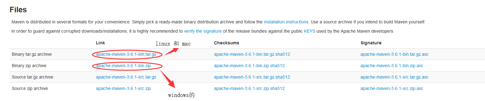

2. 创建maven的本地仓库文件夹，与解压后的文件存放在一个目录下

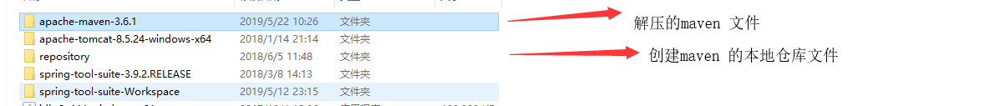

3. 修改maven文件中的核心配置文件,把仓库地址改为之前创建的本地仓库地址。

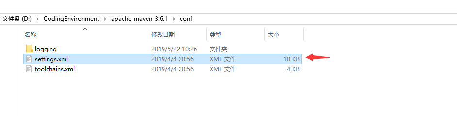

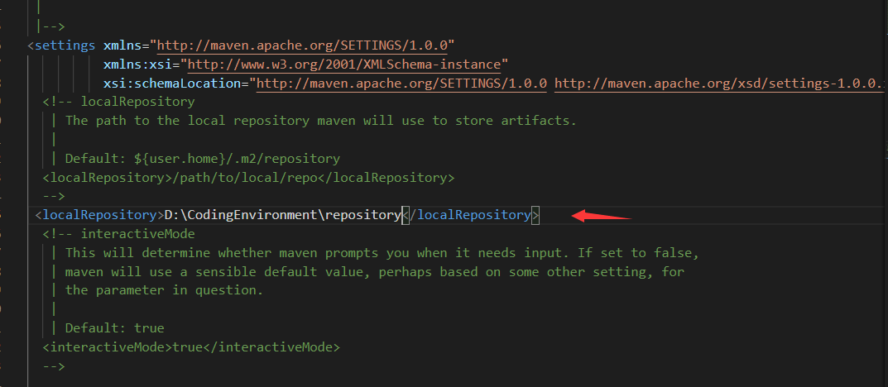

4. 对STS进行设置，window–>preferences –> maven，勾选下载源码和javadoc文档。

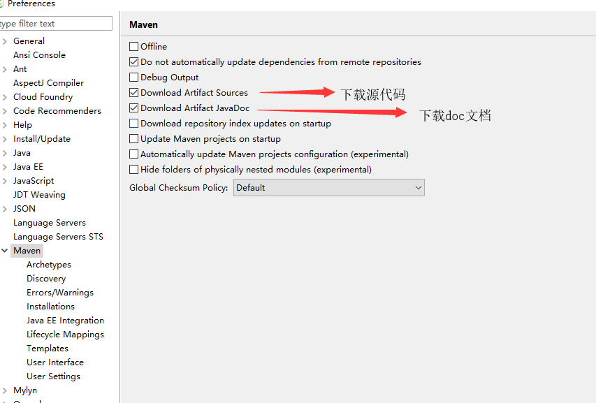

5. 配置本地 maven 环境

**把外部的maven 添加到STS中，不使用STS自带的maven**

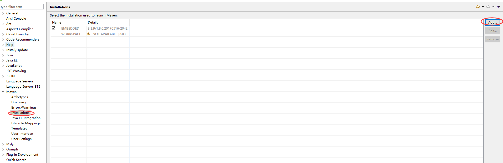

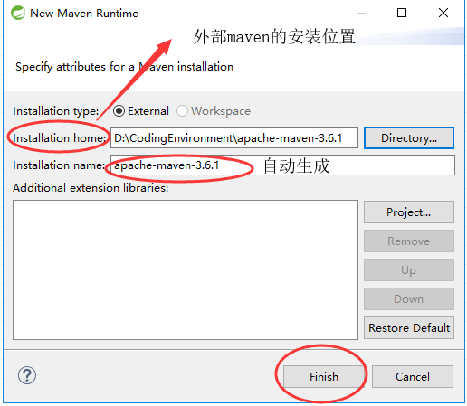

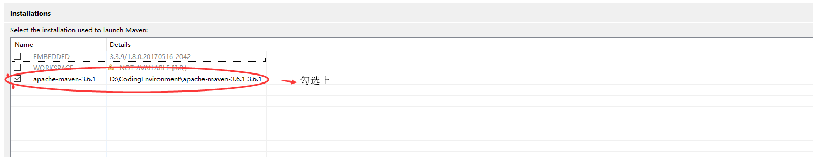

6. 配置 settings.xml 位置,到本地仓库上

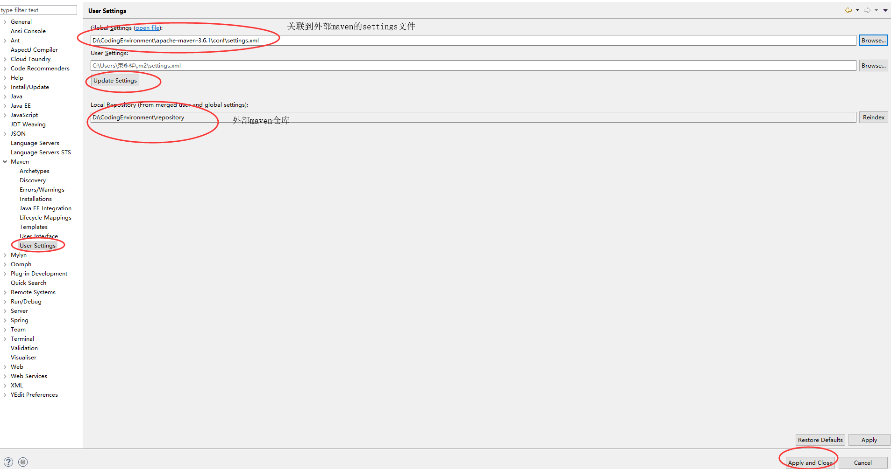

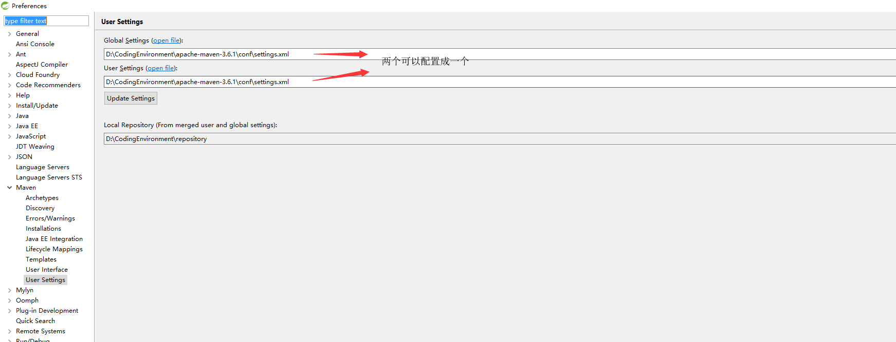

7. 设置本地仓库的索引，才能使用仓库中下载的jar

**选择菜单栏 Window –showView –other - maven - maven repository 打开 maven 仓库管理视图**

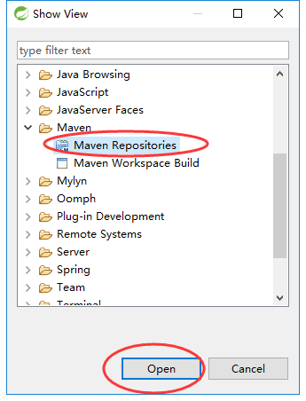

**重建本地仓库索引**

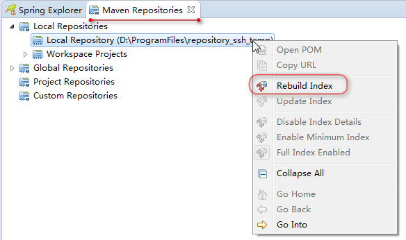

---

# 2.maven更换源

**在maven的settings.xml文件中修改.然后到 window–>preferences –> maven->User settings 点击update settings.**

```xml

<mirrors>
     <!-- 阿里云仓库 -->
    <mirror>
      <id>alimaven</id>
      <mirrorOf>central</mirrorOf>
      <name>aliyun maven</name>
      <url>http://maven.aliyun.com/nexus/content/groups/public/</url>
    </mirror>
    <!-- 中央仓库1 -->
    <mirror>
      <id>uk</id>
      <mirrorOf>central</mirrorOf>
      <name>Human Readable Name for this Mirror.</name>
      <url>http://uk.maven.org/maven2/</url>
    </mirror>
    <!-- 中央仓库2 -->
    <mirror>
      <id>nexus</id>
      <name>internal nexus repository</name>
      <url>http://repo.maven.apache.org/maven2</url>
      <mirrorOf>central</mirrorOf>
    </mirror>
</mirrors>

```

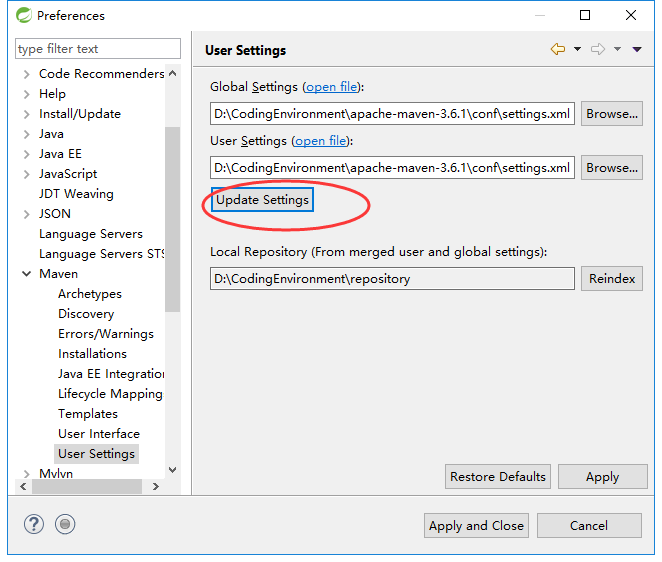