[TOC]

# Nginx

<font color="red">基于当前nginx 1.16.0 版本所述。修改日期-20191223</font>

Nginx是一款轻量级的Web 服务器,==反向代理服务器==,电子邮件（IMAP/POP3）代理服务器

>Nginx的应用场景

1. http服务器。Nginx是一个http服务可以独立提供http服务。可以做网页静态服务器。
2. 虚拟主机。可以实现在一台服务器虚拟出多个网站。例如个人网站使用的虚拟主机。
3. 反向代理，负载均衡。

<h4>Nginx的负载均衡</h4>

>负载：就是Nginx接受请求.
>均衡：Nginx将收到的请求按照一定的规则分发到不同的服务器进行处理。

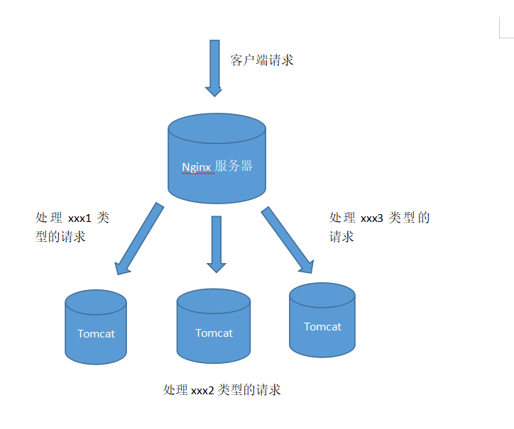

nginx支持的负载均衡调度算法方式如下：

1. weight轮询（默认）：把接收到的请求按照顺序逐一分配到不同的服务器上，即使某一台服务器宕机，nginx会自动将该服务器剔除出队列，请求受理情况不会受到任何影响。 或者可以给不同的后端服务器设置一个权重值（weight），权重数据越大，被分配到请求的几率越大。

2. ip_hash：每个请求按照发起客户端的ip的hash结果进行匹配，这样的算法下一个固定ip地址的客户端总会访问到同一个后端服务器。

3. fair：智能调整调度算法，动态的根据后端服务器的请求处理到响应的时间进行均衡分配，响应时间短处理效率高的服务器分配到请求的概率高，响应时间长处理效率低的服务器分配到的请求少；需要注意的是nginx默认不支持fair算法，如果要使用这种调度算法，请安装upstream_fair模块

4. url_hash：按照访问的url的hash结果分配请求，每个请求的url会指向后端固定的某个服务器，可以在nginx作为静态服务器的情况下提高缓存效率。同样注意nginx默认不支持这种调度算法，要使用的话需要安装nginx的hash软件包


## 1.什么是反向代理？

<h4>正向代理</h4>

当客户端想要间接访问一个目标服务器时。客户端可以找一个可以访问目标服务器的另外一台服务器。这个另外一台服务器就是代理服务器。

正向代理的过程：
1. 客户端把请求发送给代理服务器，再通过代理服务器把请求发送给目标服务器。
2. 代理服务器从目标服务器处获得相应的数据后，再转发给客户端。

==在正向代理的过程中，客户端和代理服务器知道目标服务器的IP地址，而目标服务器只知道代理服务器的IP地址而不知道客户端的IP地址。所以正向代理可以屏蔽或隐藏客户端的信息。所以代理服务器是为客户端作代理人，它是站在客户端这边的==

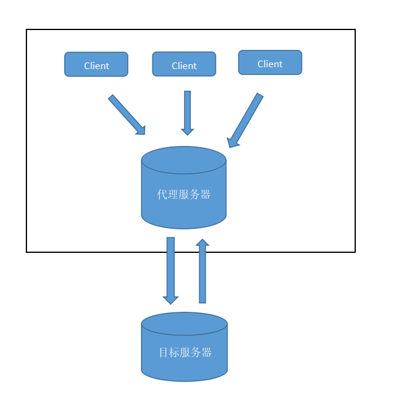

<h4>反向代理</h4>

<font color="red">由于正向代理是代理服务器作为客户端的代理人（客户端与代理是一伙的）。而反向代理是指代理服务器作为服务器的代理人（代理与目标服务器是一伙的）。并且在反向代理过程中，屏蔽或隐藏目标服务器的信息</font>

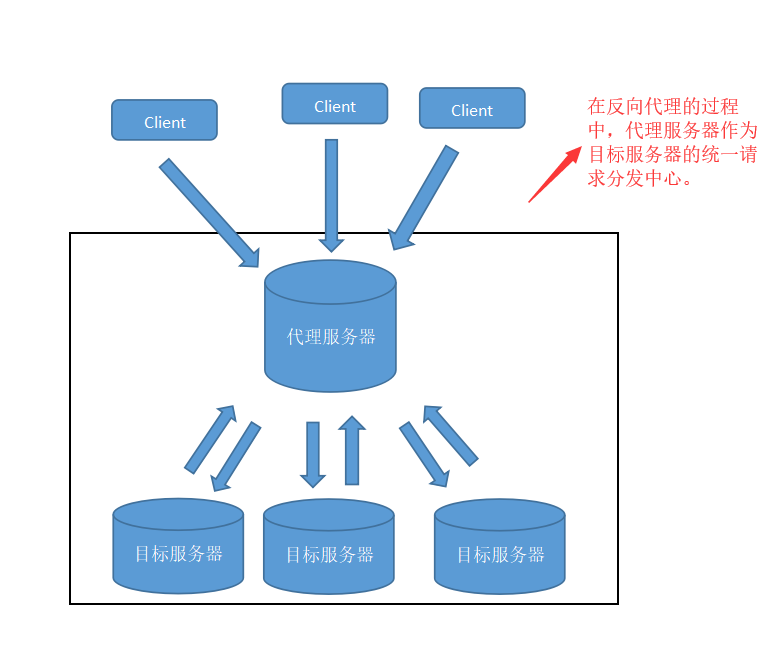


<h4>一般在项目场景中</h4>

在实际项目中，正向代理和反向代理很有可能会存在在一个应用场景中，正向代理代理客户端的请求去访问目标服务器，目标服务器是一个反向单利服务器，反向代理了多台真实的业务处理服务器。

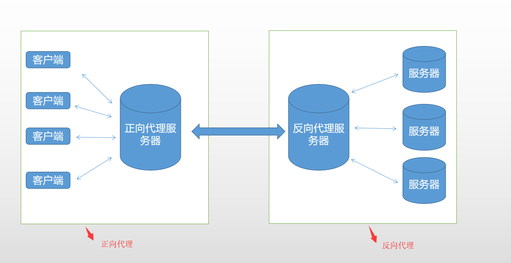


## 2.Nginx 的安装与启动(windows环境下)

Nginx 的优点:

1. 高并发连接：相比 Apache，Nginx 使用更少的资源，支持更多的并发连接，体现更高的效率，能够支持高达 50,000 个并发连接数的响应.

2. 内存消耗少。

3. 配置简单。

>1. nginx的下载

[官网 http://nginx.org](http://nginx.org/)

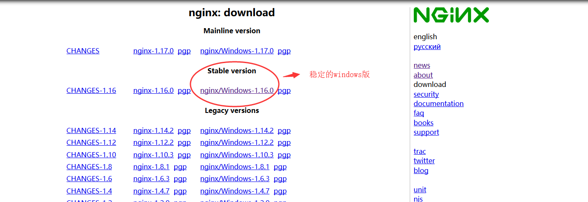

下载nginx-1.16.0.zip压缩包,解压到某个文件夹中。

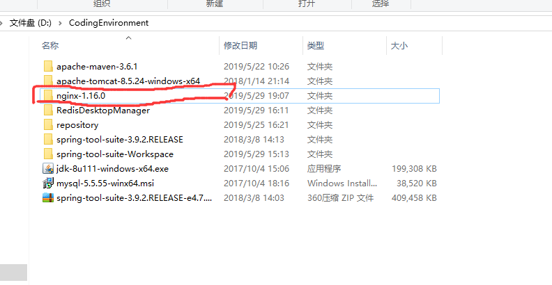

>2. nginx服务器启动

方式①：双击运行nginx.exe，就启动nginx服务器。

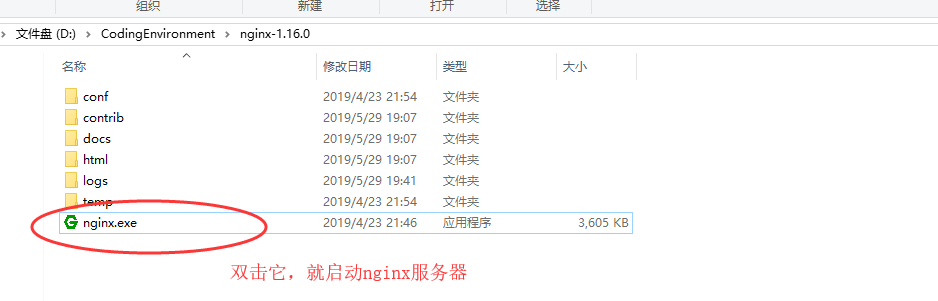

方式②：使用命令行打开nginx服务器。

1. 先使用命令行到nginx文件中：

```
d:     #进入到d盘
cd CodingEnvironment\nginx-1.16.0   #进入到nginx文件夹中

```

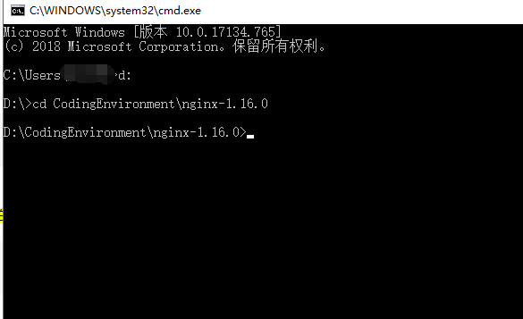

2. 运行命令：

```
start nginx     #启动nginx服务器,这个命令输完后，命令窗口会闪一下。

## 或者直接输入nginx命令，也会启动

nginx

```

3. 在任务管理器，看到nginx服务器的标志，就表示已经启动。

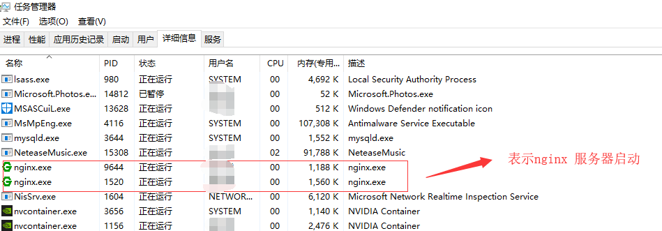

在nginx进程在启动的时候，会附带一个守护进程，用于保护正式进程不被异常终止；如果守护进程一旦返现nginx继承被终止了，会自动重启该进程。


4. 浏览器访问 localhost，即可看到Nginx 欢迎页

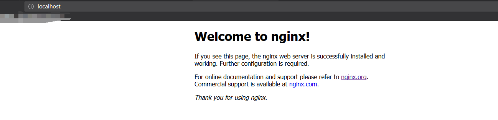

5. 有时需要在==启动前检查nginx配置是否ok==

```
nginx -t -c conf/nginx.conf   #检查nginx配置

```

6. 关闭nginx服务器命令

```
nginx -s stop    #快速关机
nginx -s quit    #优雅的关机
```

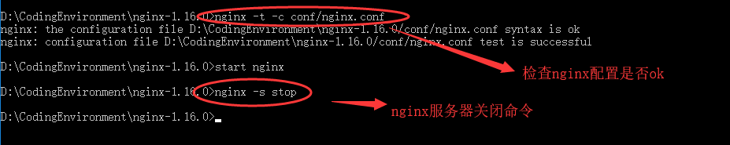

---

## 2-5.Nginx 的安装与启动(Centos环境下)

**Centos环境安装nginx有两种方式：yum安装和源代码安装。下面主要描述源代码安装**

>源代码安装：

1. 安装nginx前，需要安装其他依赖库包

```
1. 安装 gcc 环境
    $ sudo yum -y install gcc gcc-c++ # nginx编译时依赖gcc环境

2. 安装 pcre
    $ sudo yum -y install pcre pcre-devel # 让nginx支持重写功能

3.安装 zlib
    # zlib库提供了很多压缩和解压缩的方式，nginx使用zlib对http包内容进行gzip压缩
    $ sudo yum -y install zlib zlib-devel 

4. 安装 openssl
    # 安全套接字层密码库，用于通信加密
    $ sudo yum -y install openssl openssl-devel

```

2. 开始安装nginx

```
1. 从官网上下载源码包nginx-1.16.1.tar.gz,一般放在/usr/lcoal目录中解压

2. 解压
$ tar -zxvf  nginx-1.16.1.tar.gz 

3. 解压缩后，进入nginx-1.16.1目录进行源码编译安装。
$ cd nginx-1.11.5
$ ./configure --prefix=/usr/local/nginx 
# 将源码配置到usr/local/nginx目录下，并检查安装所需要的环境或依赖库是否齐全

## --prefix=/usr/local/nginx  是nginx编译安装的目录（推荐），安装完后会在此目录下生成相关文件

4. 源码编译并安装nginx
$ make 
# 编译
$ make install 
# 安装
```

==一般都会在/usr/lcoal目录中出现nginx目录，这个就是nginx安装后产生的文件夹==


3. 操作命令

```
启动服务
$ /usr/local/nginx/sbin/nginx

##nginx默认的端口是80，如果占用了80，那么就会出现端口已用错误

重新加载服务
$ /usr/local/nginx/sbin/nginx -s reload

停止服务
$ /usr/local/nginx/sbin/nginx -s stop

查看nginx服务进程
$ ps -ef | grep nginx # 查看服务进程
```

4. 修改nginx的启动端口

```
1.nginx的配置文件的绝对路径/usr/local/nginx/conf/nginx.conf
2.使用vim编辑器修改该配置文件。 
3.修改80端口为8090。
4.重新启动nginx服务
5.在浏览器中输入ip:8090访问
```
---

## 3.Nginx的基本运行命令

> 当nginx启动后,可以通过使用 -s 参数调用可执行文件来控制它。

```
nginx           #启动nginx服务器
start nginx     #启动nginx服务器
nginx -s stop    #强制停止nginx服务器，如果有未处理的数据，丢弃
nginx -s quit    #正常关闭服务器。如果有未处理的数据，等待处理完成之后停止
nginx -s reload  #重新加载配置文件
nginx -s reopen  #重新打开日志文件
nginx -v         #显示 nginx 的版本。
nginx -V         #显示 nginx 的版本，编译器版本和配置参数。
nginx -c filename  #为 Nginx 指定一个配置文件，来代替缺省的.
nginx -t          #不运行，而仅仅测试配置文件，检查配置文件中是否有错。
```

---

## 4.Nginx的配置

nginx使用最多的三个核心功能是反向代理、负载均衡和静态服务器。这三个不同的功能的使用，都要从nginx的配置文件nginx.conf中进行配置。

==完整的配置文件==

```
#user  nobody;
worker_processes  1;

#error_log  logs/error.log;
#error_log  logs/error.log  notice;
#error_log  logs/error.log  info;

#pid        logs/nginx.pid;

events {
    worker_connections  1024;
}

http {
    include       mime.types;
    default_type  application/octet-stream;

    #log_format  main  '$remote_addr - $remote_user [$time_local] "$request" '
    #                  '$status $body_bytes_sent "$http_referer" '
    #                  '"$http_user_agent" "$http_x_forwarded_for"';

    #access_log  logs/access.log  main;

    sendfile        on;
    #tcp_nopush     on;

    #keepalive_timeout  0;
    keepalive_timeout  65;

    #gzip  on;

    server {
        listen       80;
        server_name  localhost;

        #charset koi8-r;

        #access_log  logs/host.access.log  main;

        location / {
            root   html;
            index  index.html index.htm;
        }

        #error_page  404              /404.html;

        # redirect server error pages to the static page /50x.html
        #
        error_page   500 502 503 504  /50x.html;
        location = /50x.html {
            root   html;
        }

        # proxy the PHP scripts to Apache listening on 127.0.0.1:80
        #
        #location ~ \.php$ {
        #    proxy_pass   http://127.0.0.1;
        #}

        # pass the PHP scripts to FastCGI server listening on 127.0.0.1:9000
        #
        #location ~ \.php$ {
        #    root           html;
        #    fastcgi_pass   127.0.0.1:9000;
        #    fastcgi_index  index.php;
        #    fastcgi_param  SCRIPT_FILENAME  /scripts$fastcgi_script_name;
        #    include        fastcgi_params;
        #}

        # deny access to .htaccess files, if Apache's document root
        # concurs with nginx's one
        #
        #location ~ /\.ht {
        #    deny  all;
        #}
    }

    # another virtual host using mix of IP-, name-, and port-based configuration
    #
    #server {
    #    listen       8000;
    #    listen       somename:8080;
    #    server_name  somename  alias  another.alias;

    #    location / {
    #        root   html;
    #        index  index.html index.htm;
    #    }
    #}

    # HTTPS server
    #
    #server {
    #    listen       443 ssl;
    #    server_name  localhost;

    #    ssl_certificate      cert.pem;
    #    ssl_certificate_key  cert.key;

    #    ssl_session_cache    shared:SSL:1m;
    #    ssl_session_timeout  5m;

    #    ssl_ciphers  HIGH:!aNULL:!MD5;
    #    ssl_prefer_server_ciphers  on;

    #    location / {
    #        root   html;
    #        index  index.html index.htm;
    #    }
    #}
}

```

上面的配置文件由5个部分组成：

main模块：用于nginx全局信息的配置,不在event.http括号中的配置信息
events模块：用于nginx工作模式的配置
http模块：用于http协议信息的一些配置
server模块：用于服务器访问信息的配置
location模块：用于进行访问路由的配置


> 1. 全局信息配置（main模块）

```
#user  nobody;              #用来指定nginx进程运行用户以及用户组
worker_processes  1;        #指定nginx要开启的子进程数量.

#error_log  logs/error.log;         #错误日志文件的位置
                                    #错误日志的输出级别[debug / info / notice / warn / error / crit]
#error_log  logs/error.log  notice;
#error_log  logs/error.log  info;

#pid        logs/nginx.pid;     #指定进程id的存储文件的位置

```

> 2. event 模块，主要用于nginx工作模式的配置

```
events {
    worker_connections  1024;   #指定最大同时接收的连接数量。注意最大连接数量是和worker processes共同决定的。
}
```

> 3. http模块，用于http协议信息的一些配置

```
http {
    include       mime.types;                   #指定在当前文件中包含另一个文件的指令
    default_type  application/octet-stream;     #指定默认处理的文件类型可以是二进制

    #log_format  main  '$remote_addr - $remote_user [$time_local] "$request" '
    #                  '$status $body_bytes_sent "$http_referer" '
    #                  '"$http_user_agent" "$http_x_forwarded_for"';

    #access_log  logs/access.log  main;         #设置存储访问记录的日志

    sendfile        on;          #on是让sendfile发挥作用，将文件的回写过程交给数据缓冲去去完成，而不是放在应用中完成，这样的话在性能提升有有好处

    #tcp_nopush     on;          #让nginx在一个数据包中发送所有的头文件，而不是一个一个单独发

    #keepalive_timeout  0;       #给客户端分配连接超时时间，服务器会在这个时间过后关闭连接。
    keepalive_timeout  65;

    #gzip  on;                   #让nginx采用gzip压缩的形式发送数据。这将会减少我们发送的数据量。

    server {                      
        ~
    }
}
```

> 4. server模块是http模块中的一个子模块，用于服务器访问信息的配置

```
server {                      #一个虚拟主机的配置，一个http中可以配置多个server
        listen       80;
        server_name  localhost;    #指定ip地址或者域名，多个配置之间用空格分隔

        #charset koi8-r;              #用于设置www/路径中配置的网页的默认编码格式

        #access_log  logs/host.access.log  main;        #用于指定该虚拟主机服务器中的访问记录日志存放路径

        location / {
            root   html;               #表示整个server虚拟主机内的根目录，所有当前主机中web项目的根目录
            index  index.html index.htm;        #用户访问web网站时的全局首页
        }

        #error_page  404              /404.html;     #错误页面
    }

    # HTTPS server
    #
    #server {
    #    listen       443 ssl;
    #    server_name  localhost;

    #    ssl_certificate      cert.pem;
    #    ssl_certificate_key  cert.key;

    #    ssl_session_cache    shared:SSL:1m;
    #    ssl_session_timeout  5m;

    #    ssl_ciphers  HIGH:!aNULL:!MD5;
    #    ssl_prefer_server_ciphers  on;    #设置协商加密算法时，优先使用我们服务端的加密套件，而不是客户端浏览器的加密套件

    #    location / {
    #        root   html;
    #        index  index.html index.htm;
    #    }
    #}


```

> 5. location模块是server模块中的一个子模块，用于进行访问路由的配置

```
location / {                           # /表示匹配访问根目录
            root   html;               #用于指定访问根目录时，访问虚拟主机的web目录
            index  index.html index.htm;        #在不指定访问具体资源时，默认展示的资源文件列表
        }
```


## 5.Nginx 部署静态页面

1. 创建blog目录，并在其中编写html文件

2. 将blog目录nginx主目录下

3. 修改配置文件
修改nginx的配置文件

```
 server {
        listen      8090;    //访问端口
        server_name  localhost; //ip

        charset utf-8;  

        #access_log  logs/host.access.log  main;

        location / {
            root   blog;    //静态页面所在的文件目录
            index  index.html index.htm;  //首页
        }

        .......
        .......
        .......
 }
```

4. 开启nginx,访问页面
访问： ip:8090/blog/index.html
