[toc]
# Vue.js - version : 2.5.16


## 1. 简介 
Vue 是一套用于构建用户界面的渐进式框架。
Vue 的核心库只关注视图层，不仅易于上手，还便于与第三方库或既有项目整合。


## 2. 引用：

> ①：`<script>引入`

<font color="red">在开发环境下不要使用压缩版本，不然你就失去了所有常见错误相关的警告!</font>

```html
<!-- 开发环境版本，包含了用帮助的命令行警告 -->
<script src="https://cdn.jsdelivr.net/npm/vue/dist/vue.js"></script>
```

或者

```html
<!-- 生产环境版本，优化了尺寸和速度 -->
<script src="https://cdn.jsdelivr.net/npm/vue"></script>
```


> ②:CDN:
```html
<script src="https://cdn.jsdelivr.net/npm/vue@2.5.16/dist/vue.js"></script>
```

> ③:NPM:

在用 Vue 构建大型应用时推荐使用 NPM 安装。NPM 能很好地和诸如 webpack 或 Browserify 模块打包器配合使用。同时 Vue 也提供配套工具来开发单文件组件。

```
# 最新稳定版
$ npm install vue
```
---

## 3. 实例化Vue对象，对象中数据与方法：

<font color="red">PS:先引用vue的js文件.</font>

```html
<!DOCTYPE html>
<html lang="en">
<head>
    <meta charset="UTF-8">
    <meta name="viewport" content="width=device-width, initial-scale=1.0">
    <meta http-equiv="X-UA-Compatible" content="ie=edge">
    <title>Document</title>
    <script src="./vue.js"></script>
 
</head>

<body>
<div id="vue_det">
    <h1>site : {{site}}</h1>    
    <h1>url : {{url}}</h1>
    <h1>方法返回值:{{hanshu()}}</h1>
    <h1>方法返回data内的值:{{hanshu2()}}</h1>
</div>

<script type="text/javascript">
    //创建vue的实例对象
    var vm = new Vue({
        el: '#vue_det',   //el的值表示与之绑定的标签id，例如：<div id="vue_det">
        data: {
            site: "菜鸟教程",   //对于该实例对象对于的标签的数据绑定。
            url: "www.runoob.com"
        },
        methods:{
            hanshu: function() {
                return  "这是vue对象中的hanshu方法的返回值！";
            },
            hanshu2:function(){
                return  this.site;   //this.site指的是data域中的site值
            }
        }
    })
</script>
</body>
</html>
```

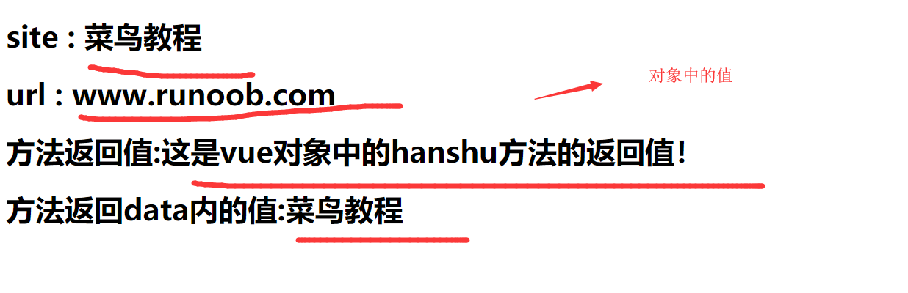

①：每个vue的实例对象都有一个el属性,它的值为标签的id值。
<font color="red">vue的实例对象通过el属性与html标签进行绑定。对该实例对象的改动就会改动对应的标签。该标签外部不受影响。</font>

②：<font color="red">data 用于定义属性</font>，实例中有三个属性分别为：site、url。

③：<font color="red">methods用于定义方法（函数），通过 return 来返回函数值。</font>

==④：{{ }} 用于输出对象属性和函数返回值。==

<font color="blue">⑤：当一个 Vue 实例对象被创建时，它会向 视图中加入了其 data 属性中的值。当这些属性的值发生改变时，视图将也会产生相应的变化。</font>

⑥：值得注意的是只有当vue实例被创建时 data 中存在的属性才是响应式的，实时更新的。


## 5.基础起步：

<font color="red">数据绑定最常见的形式就是使用 {{...}}（双大括号）的文本插值。</font>
=={{ }} 用于输出对象属性和函数返回值。==

### 1. 给标签插入文本值：

```html
<div id="app">
   {{ message }}
</div>
    
<script>
new Vue({
  el: '#app',
  data: {
    message: '菜鸟教程'    //该值与div标签内的message进行数据绑定。
  }
})
</script>
```

=={{ }}支持javascript表达式：==

```html
<div id="app">
    {{5+5}}<br>
    {{ ok ? 'YES' : 'NO' }}<br>
    {{ message.split('').reverse().join('') }}

</div>

<script>
var vm=new Vue({
    el:'#app',
    data:{
        ok:true,
        message:'SUI'
    }
});
</script>
```

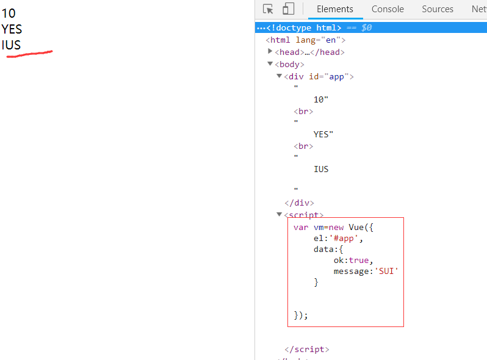


### 2. v-html（给标签插入html代码，并使其生效）

>使用 v-html 指令用于输出 html 代码
```html
<div id="app">
   <div v-html="message"></div>
</div>
    
<script>
new Vue({
  el: '#app',
  data: {
     message: '<h1>菜鸟教程</h1>'
  }
})
</script>
```

### 3.绑定标签属性：v-bind指令

v-bind 主要用于属性绑定，比方你的class属性，style属性，value属性，href属性等等

> v-bind 缩写

```html
<!-- 完整语法 -->
<a v-bind:href="url">...</a>

<!-- 缩写 -->
<a :href="url">...</a>
```

#### 0. v-bind:href,绑定herf属性

```html
<div id="vue_det">
    <a v-bind:href="web">baidu</a>  <!--绑定herf属性-->
</div>

<script type="text/javascript">

    var vm = new Vue({
        el: '#vue_det',   
        data: {
           web:"http:baidu.com"
        }
    })
</script>
```

#### 1. v-bind:class 绑定class属性,以动态地切换class

==方式①：==

```html
<script src="./vue.js"></script>
    <style>
        .box{
            border:1px dashed #f0f;
        }

      .textColor{
          color:blue;
      }
      .textSize{
          font-size:30px;
      }
</style>
</head>

<body>
  <ul class="box" v-bind:class="{'textColor':isColor, 'textSize':isSize}">
    <li>Vue</li>
    <li>Angular</li>
    <li>React</li>
 </ul>
</body>

<script>
var vm= new Vue({
    el:'.box',    //vue实例对象与class=box的标签进行绑定
    data:{
        isColor:true,     //当为true时，ul标签会添加textColor样式
        isSize:true
    }
})
</script>
```

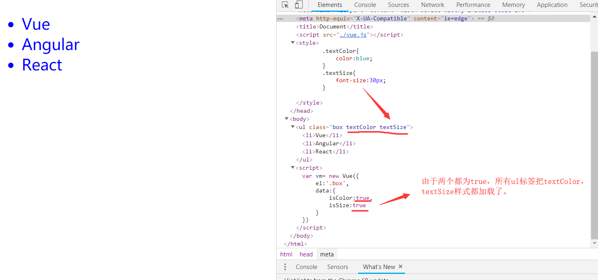


**当 isColor 和 isSize 变化时，class列表将相应的更新.**

==方式②：传一个数据对象给v-bind:class==


```html
<style>
      .textColor{
          color:red;
      }
      .textSize{
          font-size:30px;
      }
</style>

<ul class="box" v-bind:class="classObject">
    <li>Vue</li>
    <li>Angular</li>
    <li>React</li>
</ul>

<script>
var vm= new Vue({
    el:‘.box‘,
    data:{
        classObject:{
            'textColor':true,
            'textSize':false  
        }
    }
})
</script>


```

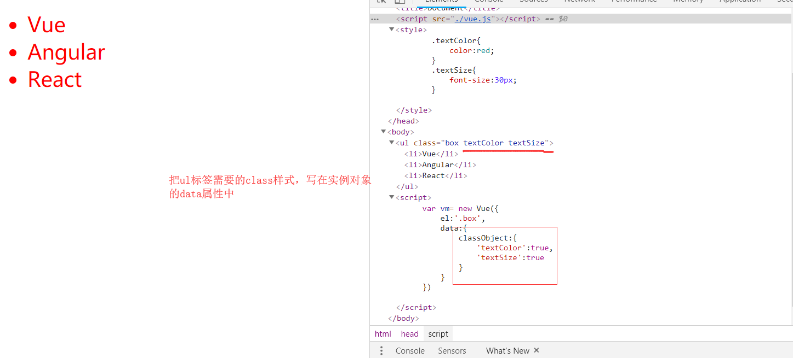

**把class样式写在数据对象中，在用ul标签引用这个数据对象.**

==方式③：传一个数组给v-bind:class，形成一个class列表==

```html
<style>
      .textColor{
          color:green;
      }
      .textSize{
          font-size:30px;
      }
    </style>
</head>

<body>
    <ul class="box" v-bind:class="[classA, classB]">
        <li>Vue</li>    
        <li>Angular</li>
        <li>React</li>
    </ul>
    
    <script>
    var vm= new Vue({
        el:'.box',
        data:{
          classA:'textColor',   //默认加载该样式，为true
          classB:'textSize'
        }
    })
    </script>
</body>
```

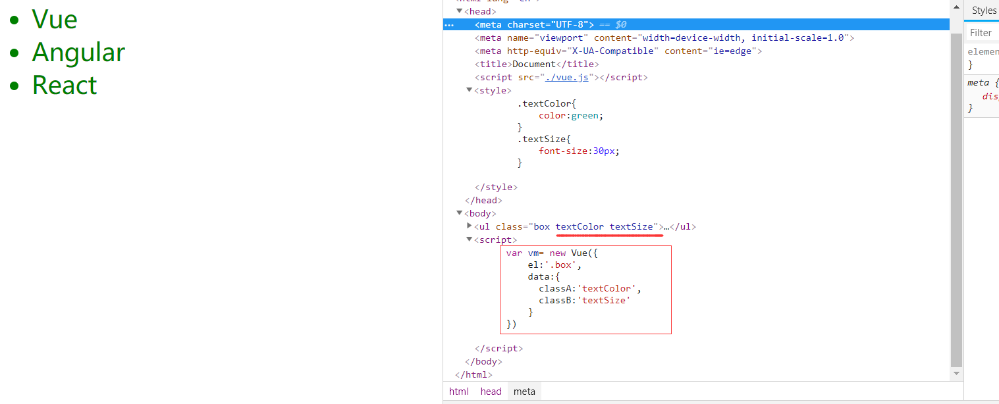


==方式④：通过三目运算符，来切换列表中的class==

```html
<ul class="box"  v-bind:class="[isA?classA:classB]">
        <li>学习Vue</li>
        <li>学习Node</li>
        <li>学习React</li>
</ul>
    
<script>
    var vm= new Vue({
        el:'.box',
        data:{
            classA:'textColor',
            classB:'textSize',
            isA:true 
        }
    })
</script>
```
**首先判断isA的boolean值，如果为true，则渲染classA；如果为false，则渲染classB。**

或者
```html
<ul class="box"  v-bind:class="[classB,isA?classA:classB]">
        <!--这里怎么选，都会出现classB的样式-->
        <li>学习Vue</li>
        <li>学习Node</li>
        <li>学习React</li>
</ul>

....
```


<h2><font color="red">PS:</font></h2>

>对于多个class，可以这么写：
```html
<div v-bind:class="[classA, { classB: isB, classC: isC }]">
```

---

#### 2.v-bind:style绑定style属性,CSS属性名必须用驼峰命名法:

<h3><font color="red">CSS属性名必须用驼峰命名法</font></h3>

==方式①：==

```html
<div id="box" v-bind:style="{color:activeColor, fontSize:size}">
     哈哈哈哈哈哈
    </div>
    
    <script>
    var vm= new Vue({
        el:'#box',
        data:{
          activeColor:'pink',
          size:'20px'
        }
    })
</script>
```
==color:activeColor, fontSize:size，这里用驼峰命名法书写。==

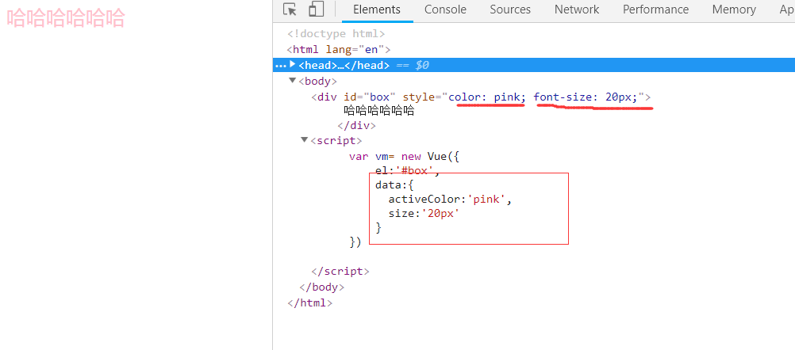


==方式②：绑定一个数据对象==

```html
<div id="box" v-bind:style="styleObject">
     哈哈哈哈哈哈
</div>
    
    <script>
    var vm= new Vue({
        el:'#box',
        data:{
            styleObject:{
                color:'red',
                fontSize:'30px'
            }
        }
    })
</script>
```

==方式③：绑定多个数据对象，写成数组的形式==

```html
<div id="box" v-bind:style="[styleObjectA, styleObjectB]">
     哈哈哈哈哈哈
</div>
    
<script>
    var vm= new Vue({
        el:'#box',
        data:{
            styleObjectA:{
                fontSize:'36px',
               
            },
            styleObjectB:{
                color:'blue'
            }
        }
    })
</script>
```

---

#### 3.v-bind:src绑定src属性:

```html


<script>
    var vm= new Vue({
        el:'.box',
        data:{
         url:'~~~'
        }
    })
</script>
```

#### 4.v-bind:value 绑定表单的value值:

```html
<div id="vue_det">
    <input type="text" v-bind:value="val">  <!--绑定表单的value值-->
</div>

<script type="text/javascript">

    var vm = new Vue({
        el: '#vue_det',   
        data: {
           val:"job"
        }
    })
</script>
```


## 6.指令：

指令是带有 v- 前缀的特殊属性。
指令的职责是，当表达式的值改变时，将其产生的连带影响，响应式地作用于 DOM。


==1.参数==： 在指令名称之后以冒号表示。
```html
<a v-bind:href="url">...</a>
```
<font color="red">上面的href就是参数，通过v-bind指令把href的值与表达式url的值绑定。</font>


### 1.指令缩写：

1. v-bind 缩写

```html
<!-- 完整语法 -->
<a v-bind:href="url">...</a>

<!-- 缩写 -->
<a :href="url">...</a>
```

2. v-on 缩写

```html
<!-- 完整语法 -->
<a v-on:click="doSomething">...</a>

<!-- 缩写 -->
<a @click="doSomething">...</a>
```

==: 与 @ 对于特性名来说都是合法字符,支持 Vue.js 的浏览器都能被正确地解析。==


### 1.条件语句：

#### 1.v-if 指令：

```html
<div id="app">
    <p v-if="seen">现在你看到我了</p>
</div>
        
<script>
    new Vue({
        el: '#app',
        data: {
         seen: true   //默认为true
        }
    })
</script>
```

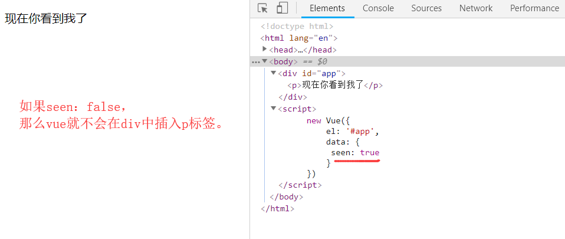

==v-if 指令将根据表达式 seen 的值(true 或 false )来决定是否插入 p 元素。==


#### 2.v-else 指令：

```html
<div id="app">
    <div v-if="Math.random() > 0.5">
        Sorry
    </div>
    <div v-else>
        Not sorry
    </div>

    <div v-if="isboolean">
            you
    </div>
    <div v-else>
            and me
    </div>
</div>
    
<script>
new Vue({
    el: '#app',
    data:{
        isboolean:true  //为flase时，显示and me
    }
})
</script>
```

==随机生成一个数字，判断是否大于0.5，然后输出对应信息.==

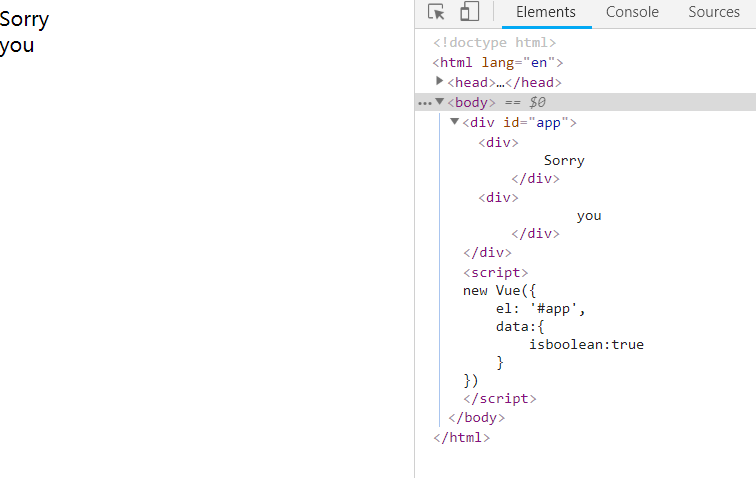


#### 3.v-else-if 指令：

==用作 v-if 的 else-if 块。可以链式的多次使用,
v-else 、v-else-if 必须跟在 v-if 或者 v-else-if之后。==

```html
<div id="app">
    <div v-if="type === 'A'">
        A
    </div>
    <div v-else-if="type === 'B'">
        B
    </div>
    <div v-else-if="type === 'C'">
        C
    </div>
    <div v-else>
        Not A/B/C is {{type}}
    </div>
</div>
    
<script>
new Vue({
    el: '#app',
    data: {
    type: 'D'
    }
})
</script>
```

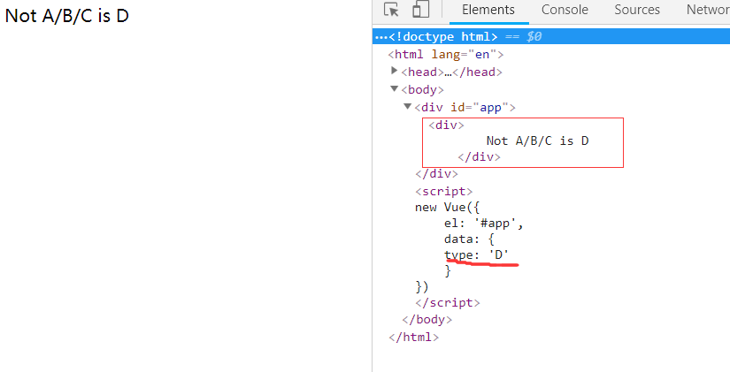


#### 4.用key来复用if-else：

```html
<div id="app">
    <div v-if="loginType==='username'">
            <label>Username</label>
            <input placeholder="Enter your username">
    </div>
    <div v-else>
            <label>Email</label>
            <input placeholder="Enter your email address">
    </div>
    <button v-on:click="changeInput">切换输入内容</button>
</div>

<script>
var vm=new Vue({
    el:'#app',
    data:{
        loginType:'username'
    },
    methods:{
        changeInput:function(){
            return this.loginType= this.loginType==='username'?'email':'username'
            //检测当前的loginType是否为username，是：转变为email，并赋值给loginType
        }
    }
})
</script>
```

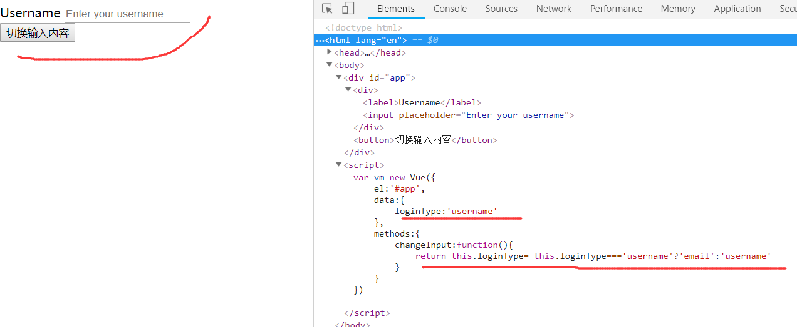


> <font color="red">那么在上面的代码中点击切换按钮，将不会清除用户已经输入的内容。因为两个div使用了相同的元素，不会被替换掉——仅仅是替换了它的 placeholder。</font>


==Vue 提供了一种方式来表达“这两个元素是完全独立的，不要复用它们”。只需添加一个具有唯一值的 key 属性即可：每次切换时，输入框都将被重新渲染==

```html
<div v-if="loginType==='username'">
    <label>Username</label>
    <input placeholder="Enter your username" key="username-input">
</div>
<div v-else>
    <label>Email</label>
    <input placeholder="Enter your email address" key="email-input">
</div>

```


---


### 3.循环语句：

#### 1.v-for 指令:

==v-for指令需要以 todo in todos 形式的写法,
todos是数组,todo是数组中元素迭代的别名。==


**可以用 of 替代 in 作为分隔符:**
```html
<div v-for="todo in todos"></div>
```

>方式①：v-for 迭代数组

```html
<div id="app-4">
    <ol>
        <li v-for="todo in todos">
        {{ todo.text }}
        </li>
    </ol>
</div>
    
<script>
var app4 = new Vue({
  el: '#app-4',
  data: {
    todos: [
      { text: '学习 JavaScript' },
      { text: '学习 Vue' },
      { text: '整个牛项目' }
    ]
  }
})
</script>

```

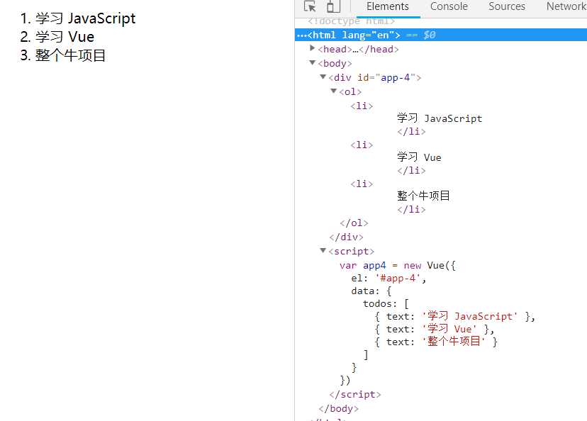


> 方式②：v-for 迭代对象:
==v-for 可以通过一个对象的属性来迭代数据。==

```html

<div id="app">
  <ul>
    <li v-for="value in object">
    {{ value }}
    </li>
  </ul>
</div>
 
<script>
new Vue({
  el: '#app',
  data: {
    object: {
      name: '菜鸟教程',
      url: 'http://www.runoob.com',
      slogan: '学的不仅是技术，更是梦想！'
    }
  }
})
</script>
```

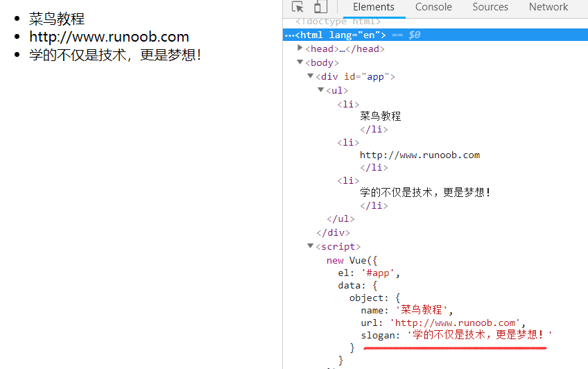


<h2><font color="red">或者把对象的属性名也迭代出来:</font></h2>

```html
<div id="app">
  <ul>
    <li v-for="(value, key) in object">
    {{ key }} : {{ value }}
    </li>
  </ul>
</div>
 
<script>
new Vue({
  el: '#app',
  data: {
    object: {
      name: '菜鸟教程',
      url: 'http://www.runoob.com',
      slogan: '学的不仅是技术，更是梦想！'
    }
  }
})
</script>
```

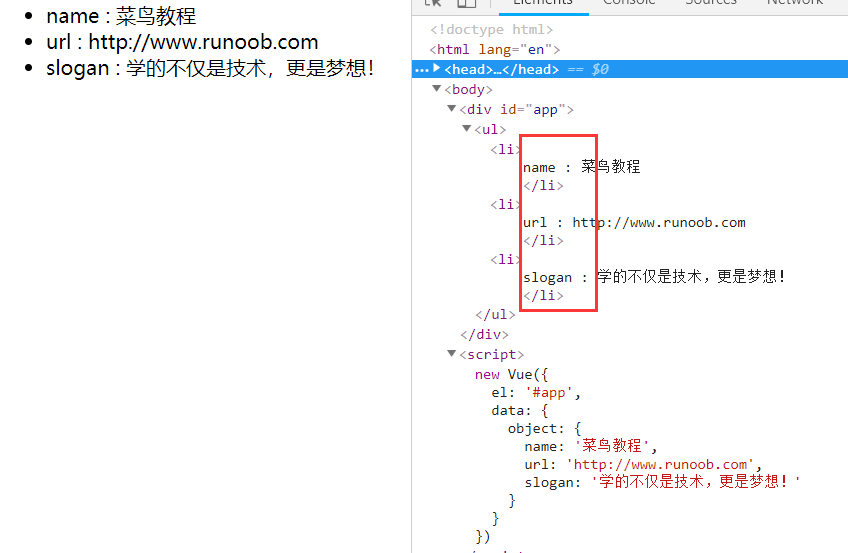


<h2><font color="red">或者把索引也迭代出来:</font></h2>

```html
<div id="app">
  <ul>
    <li v-for="(value, key,index) in object">
     {{ index }}. {{ key }} : {{ value }}
    </li>
  </ul>
</div>
 
<script>
new Vue({
  el: '#app',
  data: {
    object: {
      name: '菜鸟教程',
      url: 'http://www.runoob.com',
      slogan: '学的不仅是技术，更是梦想！'
    }
  }
})
</script>
```

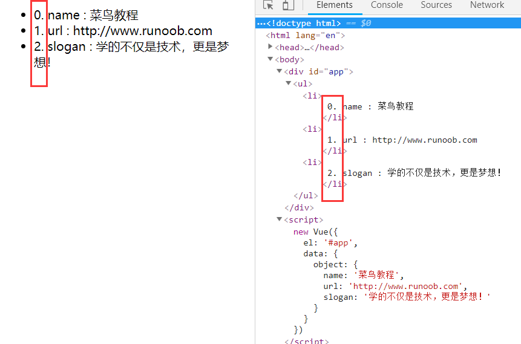


> 方式③：v-for 迭代整数:

```html
<div id="app">
<ul>
    <li v-for="n in 10">
    {{ n }}
    </li>
</ul>
</div>

<script>
new Vue({
el: '#app'
})
</script>
```


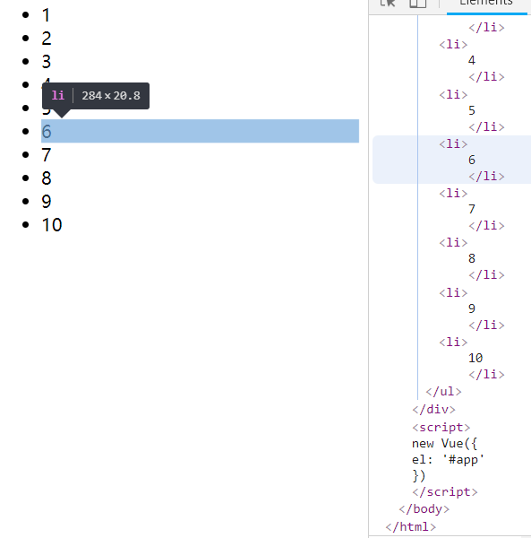


### 4.表单 双向数据绑定 v-model ：

==input 输入框中可以使用 v-model 指令来实现表单输入和应用状态之间的双向绑定：==

#### 1.input 和 textarea 标签
```html
<div id="app">
        <p>input 元素：</p>
        <p>{{ message }}</p>
        <input v-model="message">

        <p>textarea 元素：</p>
        <p>{{ message2 }}</p>
        <textarea v-model="message2"></textarea>
</div>
        
<script>
new Vue({
    el: '#app',
    data: {
    message: 'Runoob!',
    message2: '菜鸟教程\r\nhttp://www.runoob.com'
    }
})
</script>
```


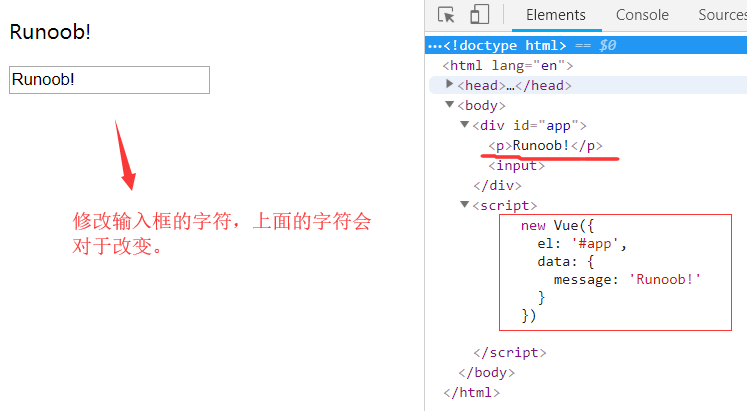


#### 2.复选框：

==单个复选框，绑定到布尔值：==

```html
<div id="app">
  <p>单个复选框：</p>
  <input type="checkbox" id="checkbox" v-model="checked">
  <label for="checkbox">{{ checked }}</label>
  
</div>
 
<script>
new Vue({
  el: '#app',
  data: {
    checked : false //为false，表示未选状态，true为选中状态。
  }
})
</script>

```

==多个复选框，绑定到同一个数组：==
```html
<div id="app">
  <p>多个复选框：</p>
  <input type="checkbox" id="runoob" value="Runoob" v-model="checkedNames">
  <label for="runoob">Runoob</label>
  <input type="checkbox" id="google" value="Google" v-model="checkedNames">
  <label for="google">Google</label>
  <input type="checkbox" id="taobao" value="Taobao" v-model="checkedNames">
  <label for="taobao">taobao</label>
  <br>
  <span>选择的值为: {{ checkedNames }}</span>
</div>
 
<script>
new Vue({
  el: '#app',
  data: {
    checkedNames: []    //数组为空，表示开始没有一个复选框选中。
  }
})
</script>
```

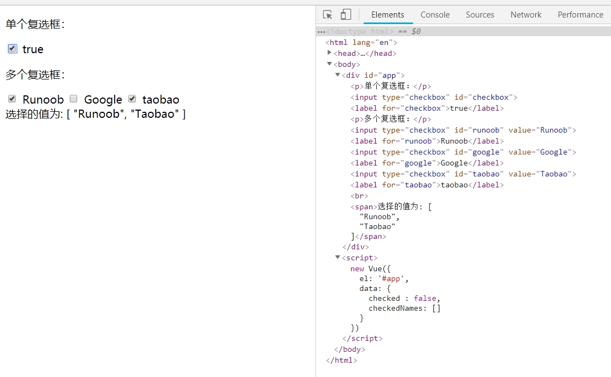


#### 3.单选按钮：

```html
<div id="example-4">
  <input type="radio" id="one" value="One" v-model="picked">
  <label for="one">One</label>
  <br>
  <input type="radio" id="two" value="Two" v-model="picked">
  <label for="two">Two</label>
  <br>
  <span>Picked: {{ picked }}</span>
</div>
 
<script>
new Vue({
  el: '#example-4',
  data: {
    picked: ''  //为空，表示一开始未选
  }
})
</script>
```

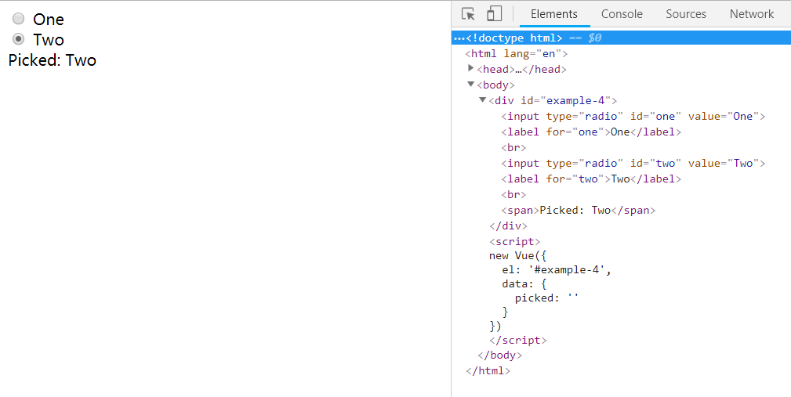


#### 4.下拉框：

==单选时：==

```html
<div id="example-5">
  <select v-model="selected">
    <option disabled value="">请选择</option>
    <option>A</option>
    <option>B</option>
    <option>C</option>
  </select>
  <span>Selected: {{ selected }}</span>
</div>
 
<script>
new Vue({
  el: '#example-5',
  data: {
    selected: ''    //为空，将被渲染为“未选中”状态
  }
})
</script>
```

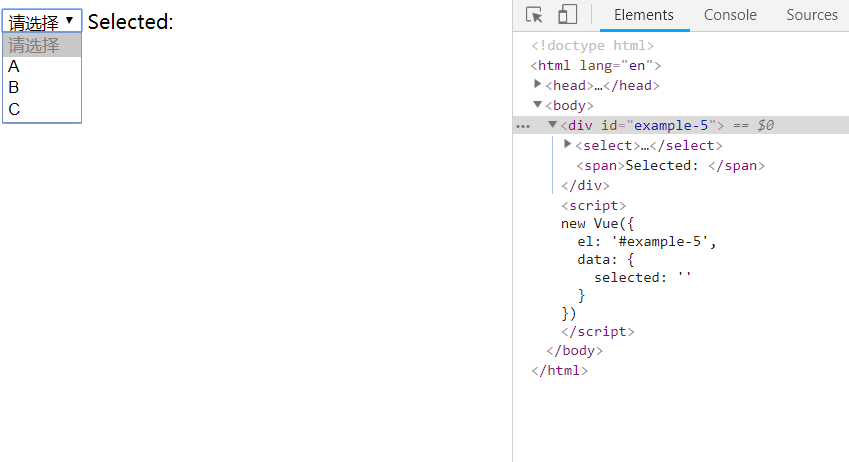


==多选时 (绑定到一个数组)：==
<font color="red">多选时，用Ctrl+鼠标左键 选中选项。</font>


```html
<div id="example-6">
  <select v-model="selected" multiple style="width: 50px;">
    <option>A</option>
    <option>B</option>
    <option>C</option>
  </select>
  <br>
  <span>Selected: {{ selected }}</span>
</div>
 
<script>
new Vue({
  el: '#example-6',
  data: {
    selected: []
  }
})
</script>
```

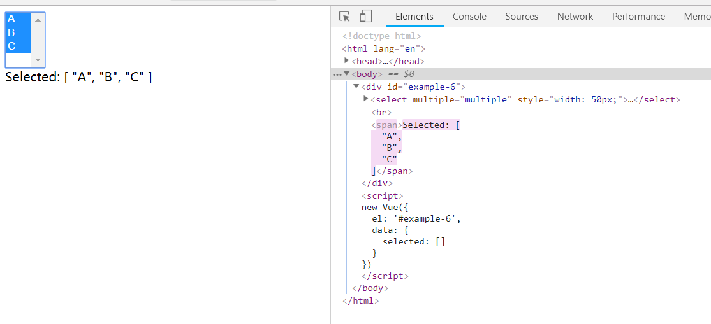


#### 5.用v-for对下拉框选项进行修饰：

```html
<div id="example-6">
  <select v-model="selected">
  <option disabled value="">请选择</option>
  <option v-for="option in options" v-bind:value="option.value">
    {{ option.text }}
  </option>
  </select>

    <span>Selected: {{ selected }}</span>
</div>
 
<script>
new Vue({
  el: '#example-6',
  data: {
    selected: '',  //默认选A选项
    options: [
      { text: 'One', value: 'A' },    //A选项对于的文本值
      { text: 'Two', value: 'B' },
      { text: 'Three', value: 'C' }
    ]
  }
})
</script>
```

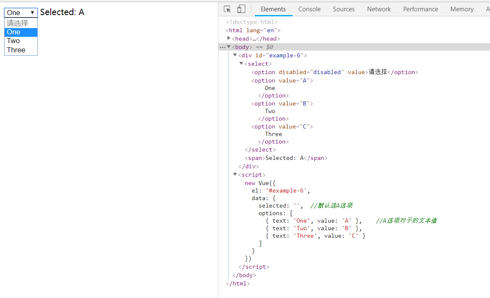


#### 6.用v-bind对表单进行值绑定：

==1.单选按钮：==

```html
<input type="radio" v-model="pick" v-bind:value="a">

// 当选中时
//vm.pick === vm.a
```

==2.下拉框的选项==

```html
<select v-model="selected">
  <option v-bind:value="{ number: 123 }">123</option>
</select>

// 当选中时
typeof vm.selected // => 'object'
vm.selected.number // => 123
```

==3.复选框：==

```html
<input type="checkbox" v-model="toggle" true-value="yes" false-value="no">

// 当选中时
vm.toggle === 'yes'
// 当没有选中时
vm.toggle === 'no'
```

#### 7.修饰符：

①：.lazy

在默认情况下， v-model 在 input 事件中同步输入框的值与数据，但添加一个修饰符 lazy ，从而转变为在 change 事件中同步：
```html
<!-- 在 "change" 而不是 "input" 事件中更新 -->
<input v-model.lazy="msg" >
```

②：.number

如果想自动将用户的输入值转为 Number 类型（如果原值的转换结果为 NaN 则返回原值），可以添加一个修饰符 number 给 v-model 来处理输入值：
```html
<input v-model.number="age" type="number">
```
这通常很有用，因为在 type="number" 时 HTML 中输入的值也总是会返回字符串类型。

③：.trim

如果要自动过滤用户输入的首尾空格，可以添加 trim 修饰符到 v-model 上过滤输入：
```html
<input v-model.trim="msg">
```


---


### 5.事件监听 v-on:


#### 1.点击事件：

==使用 v-on 监听 DOM 事件，可以对用户的输入进行响应,触发时运行一些 JavaScript 代码。==

<font color="red">方式①：直接把 JS 代码写在 v-on 指令中</font>
**例子1：计数器**

```html
<body>
<div id="example-1">
    <button v-on:click="counter += 1">Add +1</button>
    <p>The button above has been clicked {{ counter }} times.</p>
</div>

<script>
var example1 = new Vue({
  el: '#example-1',
  data: {
    counter: 0
  }
})
</script>
</body>
```

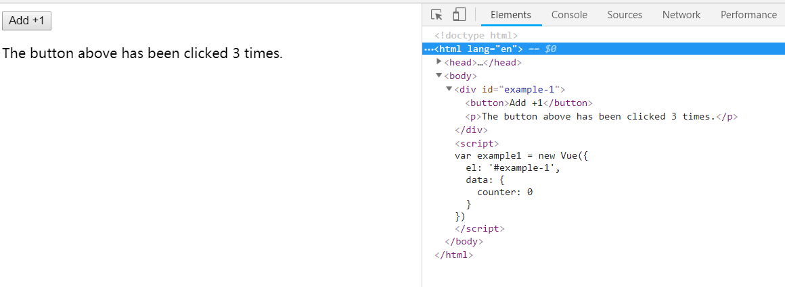


<font color="red">方式②：把被调用方法名写在 v-on 指令中，在 methods对象中定义具体方法</font>
**例子2：在用户点击按钮后对字符串进行反转操作：**

```html
<div id="app">
        <p>{{ message }}</p>
        <button v-on:click="reverseMessage">反转字符串</button>
</div>
        
<script>
var app = new Vue({
    el: '#app',
    data: {
        message: 'Runoob!'   
    },
    methods: {   //method是实例的方法对象，内部写各个具体方法。

            reverseMessage: function () {   //reverseMessage是方法名
            this.message = this.message.split('').reverse().join('')
        }
    }
})


// 也可以用 JavaScript 直接调用方法
app.reverseMessage() 
</script>


```

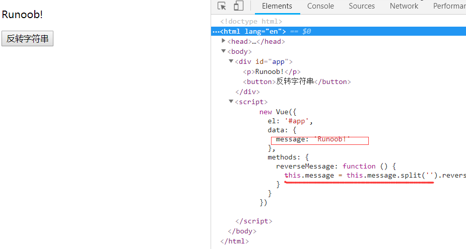


<font color="red">方式③：除了直接绑定到一个方法，在 v-on 指令中也可以用 JS 语句中调用方法：</font>
```html
<div id="example-3">
    <button v-on:click="say('hi')">Say hi</button>
    <button v-on:click="say('what')">Say what</button>
</div>

<script>
new Vue({
  el: '#example-3',
  methods: {
    say: function (message) {
      alert(message)
    }
  }
})
</script>
```
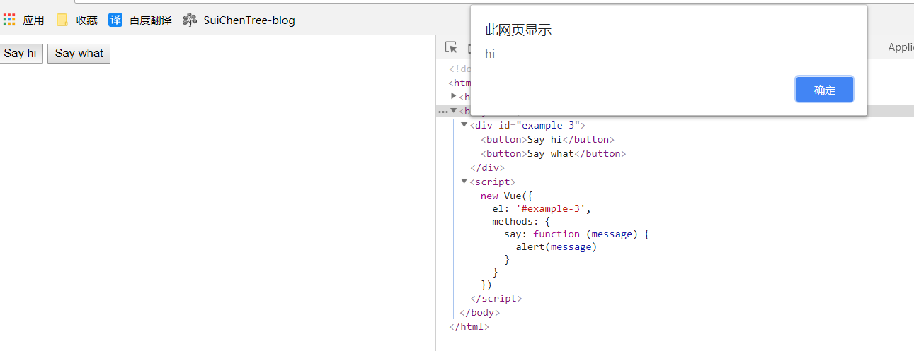


> v-on 缩写

```html
<!-- 完整语法 -->
<a v-on:click="doSomething">...</a>

<!-- 缩写 -->
<a @click="doSomething">...</a>
```

==':'与 '@ '对于特性名来说都是合法字符,支持 Vue.js 的浏览器都能被正确地解析。==


#### 2.事件修饰符：

**修饰符:是由点开头的指令后缀来表示的。**
例如：
```
.stop
.prevent
.capture
.self
.once
.passive
```


```html
<!-- 阻止单击事件继续传播 -->
<a v-on:click.stop="doThis"></a>

<!-- 提交事件不再重载页面 -->
<form v-on:submit.prevent="onSubmit"></form>

<!-- 修饰符可以串联 -->
<a v-on:click.stop.prevent="doThat"></a>

<!-- 只有修饰符 -->
<form v-on:submit.prevent></form>

<!-- 添加事件监听器时使用事件捕获模式 -->
<!-- 即元素自身触发的事件先在此处理，然后才交由内部元素进行处理 -->
<div v-on:click.capture="doThis">...</div>

<!-- 只当在 event.target 是当前元素自身时触发处理函数 -->
<!-- 即事件不是从内部元素触发的 -->
<div v-on:click.self="doThat">...</div>
```


#### 3.按键修饰符：

==Vue 允许为 v-on 在监听键盘事件时添加按键修饰符：==

```html
<!-- 只有在 keyCode 是 13 时调用 vm.submit() -->
<input v-on:keyup.13="submit">


<!-- Vue 为最常用的按键提供了别名-->
<input v-on:keyup.enter="submit">
<!-- 缩写语法 -->
<input @keyup.enter="submit">

<!--
全部的按键别名：
.enter
.tab
.delete (捕获 "删除" 和 "退格" 键)
.esc
.space
.up
.down
.left
.right
.ctrl
.alt
.shift
.meta

-->

```

---

### 6.v-show

> v-show的用法与前面的v-if类似,根据条件展示元素

例子：点击一个按钮时，切换一个元素的显示或隐藏状态。
```html
<div id="app">
    　<p v-show="ok">v-show可以控制元素的显隐状态，点击下面的按钮可看到效果。</p>
    　<button v-on:click='Toggle()'>Toggle</button>
    　<p>ok：{{ok}}</p>
</div>

<script>
var vm=new Vue({
　　el:'#app',
    data:{
　　　ok:true
　　},
　　methods:{
　　　Toggle:function(){
　　　　this.ok=!this.ok;
　　　}
　　}
})
</script>
```

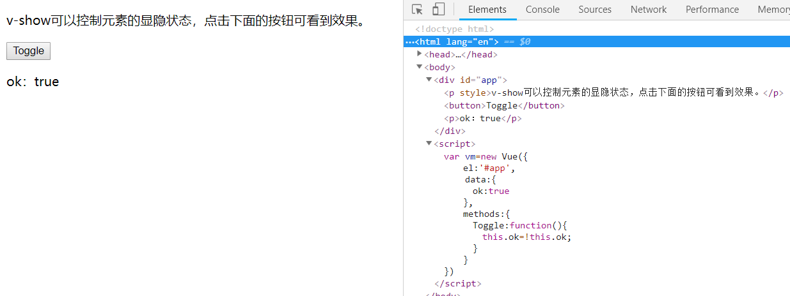


<font color="red" size="5px">PS:v-show与v-if的区别：</font>
1. v-if 为false时，是以注释的形式存在在源代码中。
2. v-if 为true时，才会被渲染。
3. v-show 不管初始条件是什么，元素总是会被渲染，当为false时，只是执行了style="display:none",隐藏了。
4. **如果需要非常频繁地切换，则使用 v-show 较好；如果在运行时条件很少改变，则使用 v-if 较好。**


---

## 7.计算属性 computed - 把繁琐的表达式从html页面抽出来。

### 1.基础：

**计算属性的由来：**
```html
<div id="example">
  {{ message.split('').reverse().join('') }}
</div>
```

<font color="red">这段代码的功能是把messgae的字符进行逆序输出.
例如：message="Hello"，则打印输出"olleH"</font>

==如果表达式存在过多逻辑，html页面就会变得臃肿不堪，难以维护。为了简单逻辑，我们可以使用计算属性。
计算属性可以完成各种复杂的逻辑，包括运算、函数调用等，只要最终返回一个结果就可以。<font color="red">并使html页面看起来美观，简洁。</font>==


例子：
```html
<div id="app">
    <p>原始字符串: {{ message }}</p>
    <p>计算后反转字符串: {{ reversedMessage }}</p>
</div>

<script>
    var vm = new Vue({
        el: '#app',
        data: {
            message: 'Runoob!'
        },
        computed: {
            reversedMessage: function () {
            // `this` 指向 vm 实例
            return this.message.split('').reverse().join('')
            }
        }
    })
</script>
```

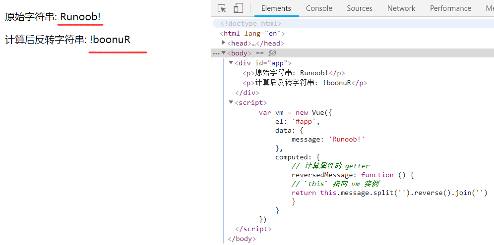


### 2.getter

<font color="red">vue.js中计算属性默认只有 getter，因为是默认值所以我们也常常省略不写，如下代码：</font>

```html
<div id="app">
    <p>原始字符串: {{ message }}</p>
    <p>计算后反转字符串: {{ reversedMessage }}</p>
</div>

<script>
    var vm = new Vue({
        el: '#app',
        data: {
            message: 'Runoob!'
        },
        computed: {
            reversedMessage: function () {
            return this.message.split('').reverse().join('')
            }
        }
    })
</script>
```

==其实computed里的代码完整的写法应该是：==

```js
computed: {
    reversedMessage: {
      //getter，用于读取
      get(){
         return this.message.split('').reverse().join('')
      }
    }
  }
```

==或者是==
```js
computed: {
    reversedMessage: {
        //getter，用于读取
        get:function (){
            return this.message.split('').reverse().join('')
        }
    }
}
```


### 3.settter

==当手动修改计算属性的值时，就会触发setter函数，执行函数的自定义操作。
同时也会触发getter函数。其执行顺序是 setter -> getter==

PS: setter与getter，它们两个是相互独立的

<font color="red">本例中计算属性的值为fullName</font>
```html
<div id="demo">
        <p> {{ fullName }} </p>
        <input type="text" v-model="fullName">
        <input type="text" v-model="firstName">
        <input type="text" v-model="lastName">
</div>

<script>
var vm = new Vue({
    el: '#demo',
    data: {
        firstName: 'zhang',
        lastName: 'san'
    },
    computed: {
        fullName: {
        //getter 方法
            get(){
                console.log('computed getter...')
                return this.firstName + ' ' + this.lastName  //把firstName与lastName拼成"zhang san"
            },
        //setter 方法
            set(newValue){    //这里的newValue是fullName的值"zhang san"
                console.log('computed setter...')
                var names = newValue.split(' ')  //把zhang san以空格分开，分成zhang,san。放到数组names中。
                this.firstName = names[0]
                this.lastName = names[names.length - 1]
                return this.firstName + ' ' + this.lastName  //把得到的firstName与lastName值返回
            }
        
        }
    }
  
})
</script>
```

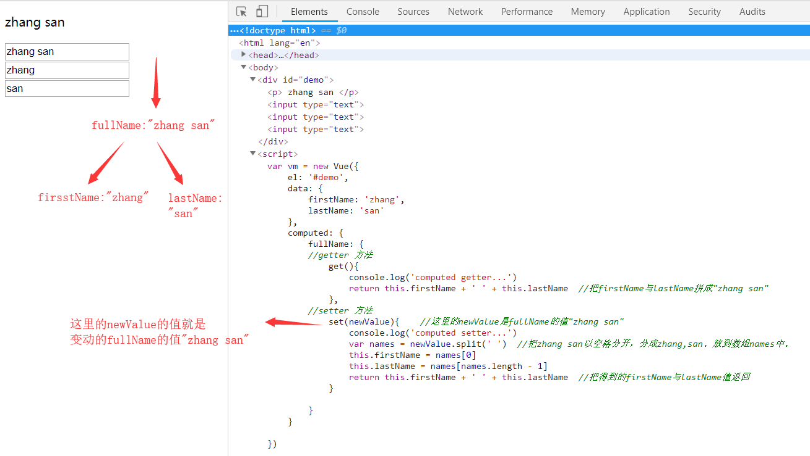


---

### 5.侦听器（侦听属性）：

它用于观察Vue实例上的数据变动。对应一个对象，键是观察表达式，值是对应回调。值也可以是方法名，或者是对象，包含选项。

```html
<div id="app">
                <p>{{ message }}</p>
                <button v-on:click="reverseMessage">反转字符串</button>
</div>
                
<script>
new Vue({
    el: '#app',
    data: {
        message: 'Runoob!'
    },
    methods: {
        reverseMessage: function () {
            this.message = this.message.split('').reverse().join('')
        }
    },
    watch:{
        message: function (newValue, oldValue) {
            console.log('this is watch...')
            console.log('newValue is '+newValue,'oldValue  is '+oldValue)
        }
    }
})
</script>
```

```js
watch:{
        message: function (newValue, oldValue) {
            console.log('this is watch...')
            console.log('newValue is '+newValue,'oldValue  is '+oldValue)
        }
}
```
> ==message 是被侦听的属性值，当它发生变化，便会执行函数。==

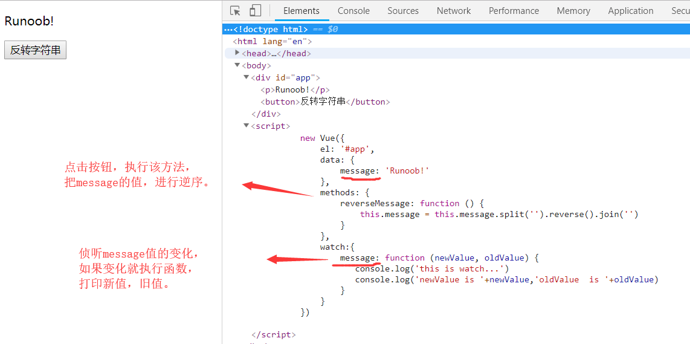
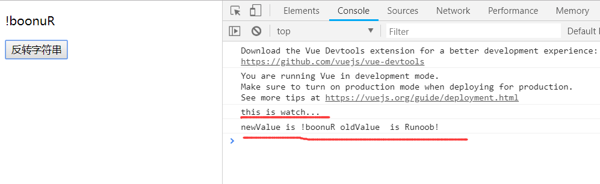


---


## 8.组件：

### 1.全局组件与组件基础：


==通过 Vue.component({...}) 全局注册的,就叫全局组件。==
==组件是可复用的 Vue 实例对象,且带有一个名字。==

> ①基础例子：

```html
<body>
  <div id="components-demo">

      <!--button-counter 标签是下面写好的组件-->
    <button-counter></button-counter>
  </div>
 
<script>
// 定义一个名为 button-counter 的新组件
Vue.component('button-counter', {
  data: function () {  //初始化组件的内容，一开始组件内容的count为0
    return {
      count: 0
    }
  },
  //template是模板
  template: '<button v-on:click="count++">You clicked me {{ count }} times.</button>'
})

//实例化该组件所在的标签（实例化组件所在的根实例）
var vm = new Vue({
  el:'#components-demo'
})
</script>
</body>
```

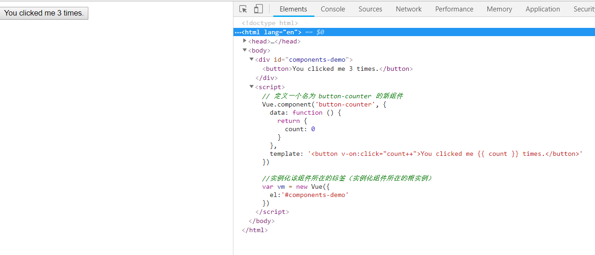

<font color="red">
PS:

1. 在这个例子中组件是 button-counter 标签.
2. 在一个 new Vue 创建的 Vue 根实例中，组件可以作为自定义标签来使用
3. 因为组件是可复用的 Vue 实例，所以它们与 new Vue 接收相同的选项，例如 data、computed、watch、methods 等。
4. ==el是组件所在的根实例特有的选项。==
5. ==所有组件必须写在根实例标签的里面才会生效。==
6. js代码中全局组件必须写在Vue实例创建之前，才会渲染生效。
</font>

<br/>

> ②：组件的 data 必须是一个函数：

<font color="blue">组件的 data 选项必须是一个函数</font>，因此每个实例可以维护一份被返回对象的独立的拷贝：
```js
Vue.component('button-counter', {
  data: function () {
    return {
      count: 0
    }
  },
  template: '<button v-on:click="count++">You clicked me {{ count }} times.</button>'
})
```

<br/>

> ③：组件的复用：

```html
<div id="components-demo">
  <button-counter></button-counter>
  <button-counter></button-counter>
  <button-counter></button-counter>
</div>
```

==注意当点击按钮时，每个组件都会各自独立维护它的 count。因为你每用一次组件，就会有一个它的新实例被创建。==

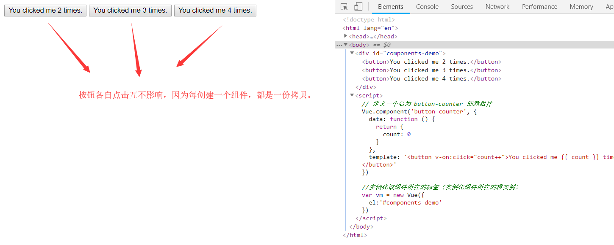


### 2.局部组件：

==局部组件，直接在创建Vue实例里面注册。==

例子：
```html
<div id="app1">
  <child-component></child-component>
</div>

<script>
  new Vue({
    el: "#app1",
    components:{
      "child-component":{
        template:"<h1>我是局部组件</h1>"
      }
    }
  });
</script>
```
或者：
```html
<script>
  var child={
    template:"<h1>我是局部组件</h1>"
  };
  new Vue({
    el: "#app1",
    components:{
      "child-component":child
    }
  });
</script>
```

<h3>局部组件需要注意：</h3>

1. ==属性名为components，s千万别忘了;==
2. 模板标签比较多的时候，可以把html代码抽出来，如上面一样。
3. data属性必须是一个函数。


### 3.父组件向子组件传递数据-Prop：

Prop 是你可以在组件上注册的一些自定义特性。**当一个值传递给一个 prop 特性的时候，它就变成了那个组件实例的一个类似的data属性。**


<font color="blue">注意: prop 是单向绑定的：当父组件的属性变化时，将传导给子组件，但是不会反过来。</font>


#### 1.Prop静态传递数据

```html
<div id="app1">
  <blog-post title="My journey with Vue"></blog-post>
  <blog-post title="Blogging with Vue"></blog-post>
  <blog-post title="Why Vue is so fun"></blog-post>
</div>

<script>
Vue.component('blog-post', {
  props: ['title'],
  template: '<h3>{{ title }}</h3>'
})

new Vue({
  el:'#app1'
})
</script>
```

<font color="red">
props: ['title'],相当于给这个组件添加一个title的data属性。

title="Why Vue is so fun"：是给这个标签的title属性赋值。
</font>


上面是全局组件的写法，下面是局部组件的写法：
```html
<script>
new Vue({
  el:'#app1',
  components:{
      "blog-post":{
        props: ['title'],
        template: '<h3>{{ title }}</h3>'
      }
  }
})
</script>
```

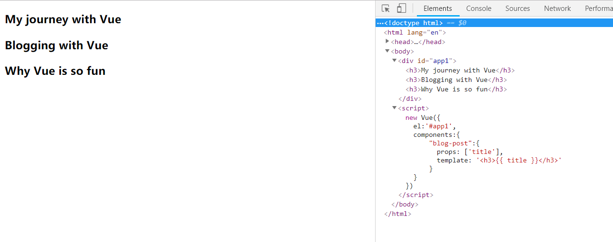


#### 2.Prop动态传递数据：

用 v-bind 动态绑定 props 的值到父组件的数据中。每当父组件的数据变化时，该变化也会传导给子组件。

```html
<div id="app">
    <div>
      <input v-model="parentMsg">
      <br>
      <child v-bind:message="parentMsg"></child>
    </div>
</div>
 
<script>

Vue.component('child', {
  props: ['message'],
  template: '<span>{{ message }}</span>'
})

new Vue({
  el: '#app',
  data: {
    parentMsg: '父组件内容'
  }
})
</script>
```

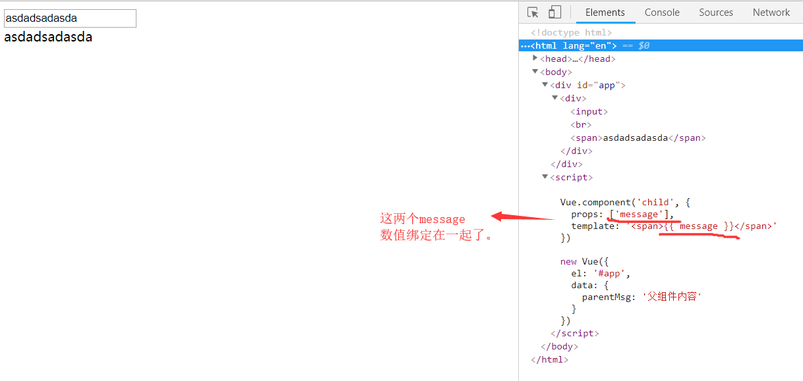


#### 3.Prop验证：


## 9.生命周期：

<font color="red">在vue对象或组件的整个生命周期中，都有对应的函数来表示对象或组件的当前状态。每当组件或对象状态进行变化时，会触发这些函数。</font>

```html
<div id="vue_det">
    <span>{{val}}</span>
    <button v-on:click="change()">更改</button>
</div>

<script type="text/javascript">

    var vm = new Vue({
        el: '#vue_det',   
        data: {
           val:"job"
        },
        methods:{
            change:function(){
                this.val="tom";
            }
        },
        beforeCreate:function(){
            alert("组件或对象实例化前执行的beforeCreate函数");
        },
        created:function(){
            alert("组件或对象实例化后执行的created函数，但页面还未显示");
        },
        beforeMount:function(){
            alert("组件或对象加载前执行的beforeMount函数，但页面还未显示");
        },
        mounted:function(){
            alert("组件或对象加载后执行的mounted函数，页面已经显示");
        },
        beforeUpdate:function(){
            alert("组件或对象更新前执行的beforeUpdate函数，页面已经显示");
        },
        updated:function(){
            alert("组件或对象更新后执行的updated函数，页面已经显示");
        },
        beforeDestory:function(){
            alert("组件或对象销毁前执行的beforeDestory函数");
        },
        destoryed:function(){
            alert("组件或对象销毁后执行的destoryed函数");
        }
    })
</script>
```


## ??.使用 vue-cli构建工具 创建vue项目

<h3>什么是vue-cli？</h3>

vue-cli(vue-command line interface),vue命令行界面。
vue-cli是一个官方的cli,能为单页面应用 (SPA) 快速搭建繁杂的脚手架。只需要几分钟的时间就可以构建一个带有热重载、保存时 lint 校验，以及生产环境可用的项目文件。

<h3>什么是webpack？</h3>

webpack是一款模块加载器兼打包工具,能把less/sass文件,json文件，乃至css文件，全都打包成浏览器识别的js文件和静态资源文件。

<font color="red">注意：浏览器本身不能识别less/sass等文件。webpack就是把这些文件进行打包，编译，变成浏览器能识别的js,html文件</font>


==在使用vue-cli创建项目之前，需要之前安装 node.js + npm(一般安装node.js，就安装了npm)==

>1. 用npm 全局安装 vue-cli。（最新版本的vue-cli，本身就内部封装了webpack。所有安装vue-cli,就安装了webpack）

```
npm install -g vue-cli   #最新版本的vue-cli，本身就内部封装了webpack。所有安装vue-cli,就安装了webpack
```

<font color="red">使用命令 vue -V , 查看是否安装成功。</font>


>2. 创建一个文件夹，使用cmd 命令进入到文件夹。创建vue项目

```
##可以创建五种不同的模板

vue init webpack <project-name>  # 一个全面的webpack+vue-loader的模板，功能包括热加载，linting,检测和CSS扩展。
vue init webpack-simple <project-name>  # 一个简单webpack+vue-loader的模板，不包含其他功能，让你快速的搭建vue的开发环境。
vue init browserify <project-name>  # 一个全面的Browserify+vueify 的模板，功能包括热加载，linting,单元检测。
vue init browserify-simple <project-name>  # 一个简单Browserify+vueify的模板，不包含其他功能，让你快速的搭建vue的开发环境。
vue init simple <project-name>  # 一个最简单的单页应用模板。

```

样例：
```
D:\iview\demo>vue init webpack demo3

? Project name demo3   //项目名称 ，如果不需要更改直接回车就可以了。注意：这里不能使用大写字母
? Project description A Vue.js project   //项目描述，默认就回车
? Author suichen      //作者
? Vue build standalone       
? Install vue-router? Yes     //是否安装vue的路由插件，这里需要安装，所以选择Y
? Use ESLint to lint your code? No   //是否用ESLint来限制你的代码错误和风格。单人开发一般不需要，团队一般就需要
? Set up unit tests No     //是否需要安装单元测试工具
? Setup e2e tests with Nightwatch? No   //是否安装e2e来进行用户行为模拟测试
? Should we run `npm install` for you after the project has been created? (recommended) npm                    

   vue-cli · Generated "demo3".

~ ~ ~ ~ ~ ~
~ ~ ~ ~ ~ ~
~ ~ ~ ~ ~ ~
```

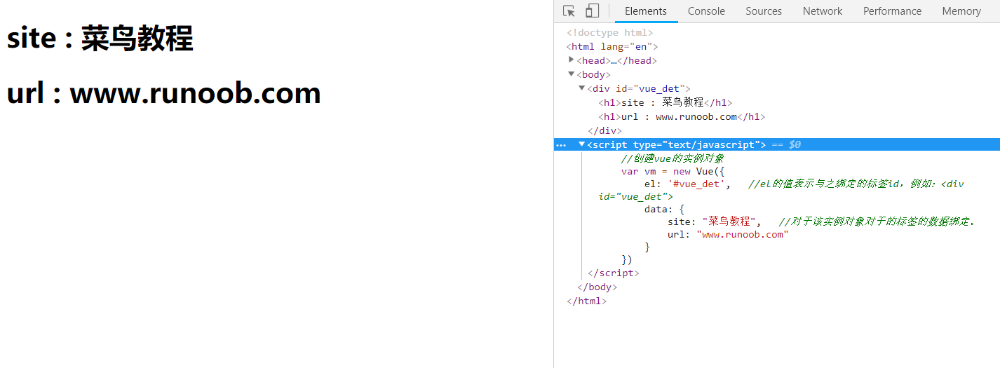

> 3. 安装完成后，可以进入到创建好的项目文件夹中，打开命令行，运行项目。

运行命令：`npm run dev`
```
D:\iview\demo\demo3>npm run dev

> demo3@1.0.0 dev D:\iview\demo\demo3
> webpack-dev-server --inline --progress --config build/webpack.dev.conf.js

 12% building modules 22/29 modules 7 active ...o\demo3\src\components\HelloWorld.vue{ parser: "babylon" } is deprecated; we now treat it as { parser: " 95% emitting

 DONE  Compiled successfully in 9162ms          23:14:11

 I  Your application is running here: http://localhost:8080
```

> 4. 打开http://localhost:8080地址,ctrl+c 关于项目运行

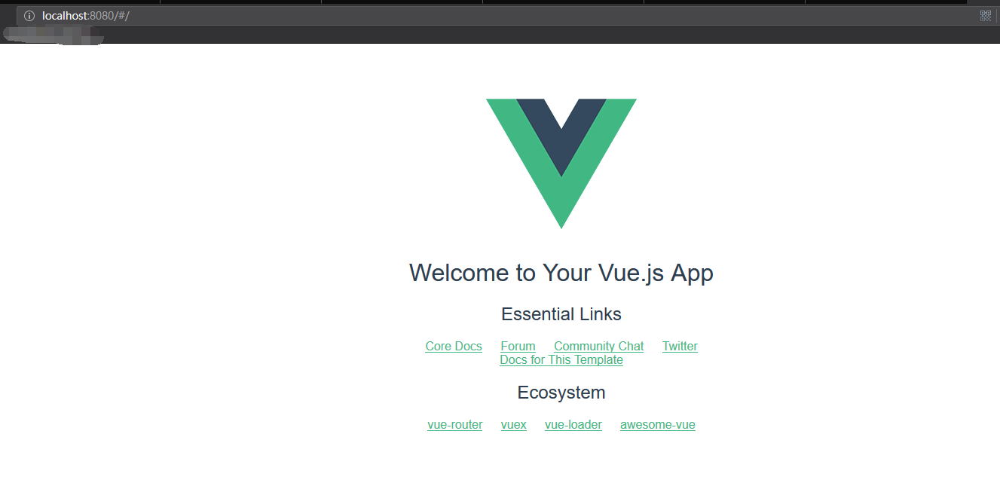

> 5. vue项目文件的结构

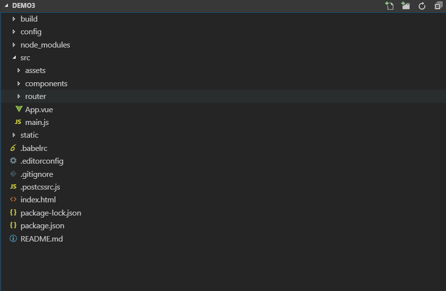

build:关于打包的配置文件所在文件夹
config：相关配置文件的文件夹
node_modules : 依赖的node工具包目录
src：前端源码文件
-- assets : 公共资源文件夹
-- router : 路由文件夹
-- components : 组件文件夹
-- App.vue:项目入口组件，.vue结尾的都是组件
-- main.js：项目入口js
static：存放静态资源，例如：图片等
baletrc: es6解析配置，用于解析最新的es6语法
editorconfig：编辑器配置文件
gitignore：git忽略配置，项目将不会进行提交有关git的文件
index.html:项目单页面入口
package.json:项目配置文件，项目描述，项目版本号，项目依赖安装库等

> 6.vue项目进行打包, `npm run build`。打包完成后，项目结构会出现dist文件夹。

```
D:\iview\demo\demo3>npm run build

> demo3@1.0.0 build D:\iview\demo\demo3
> node build/build.js

Hash: 811a1826f96982d65b8d
Version: webpack 3.12.0
Time: 5734ms
                                                  Asset       Size  Chunks             Chunk Names
               static/js/vendor.eefaac73d06c156e050b.js     120 kB       0  [emitted]  vendor
                  static/js/app.b22ce679862c47a75225.js    11.6 kB       1  [emitted]  app
             static/js/manifest.2ae2e69a05c33dfc65f8.js  857 bytes       2  [emitted]  manifest
    static/css/app.30790115300ab27614ce176899523b62.css  432 bytes       1  [emitted]  app
static/css/app.30790115300ab27614ce176899523b62.css.map  828 bytes          [emitted]
           static/js/vendor.eefaac73d06c156e050b.js.map     602 kB       0  [emitted]  vendor
              static/js/app.b22ce679862c47a75225.js.map    22.2 kB       1  [emitted]  app
         static/js/manifest.2ae2e69a05c33dfc65f8.js.map    4.97 kB       2  [emitted]  manifest
                                             index.html  507 bytes          [emitted]

  Build complete.

  Tip: built files are meant to be served over an HTTP server.
  Opening index.html over file:// won't work.


D:\iview\demo\demo3>
```

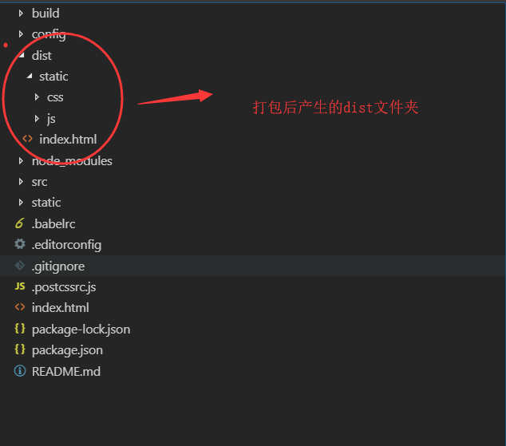

最后只需要将 dist 文件夹放到服务器中运行就行了。