[toc]

# Java

java语言是一门面向对象程序设计语言

## 1. 开发环境配置：

<h3>百度一下</h3>

<h3>java语言的IDE工具：</h3> 

1. eclipse。
2. Spring Tool Suite (STS)：spring团队创建的对eclipse工具的强化版。
3. IDEA


<h3>
<font color="red">
以上几种工具，要学会使用其中一种。请自行百度。

<p></p>

注意：
下面所有示例主要用STS 运行java代码。
</font>
</h3>


---


## 2. 第一个java程序 ---helloworld ：


### 1. 使用命令行运行程序：

①：创建文件：HelloWorld.java

②：在文件中编写代码：
```java
public class HelloWorld {
    /* 第一个Java程序
     * 它将打印字符串 Hello World
     */
    public static void main(String []args) {
        System.out.println("Hello World"); // 打印 Hello World
    }
}
```

③：打开命令行窗口:

1. 找到HelloWorld.java在那个路径下：
2. 执行命令(假如文件在c盘下)：
```
C : > javac HelloWorld.java    //编译文件，产生.class的字节码文件
C : > java HelloWorld      //运行字节码文件，执行程序源代码
```

④：运行结果：

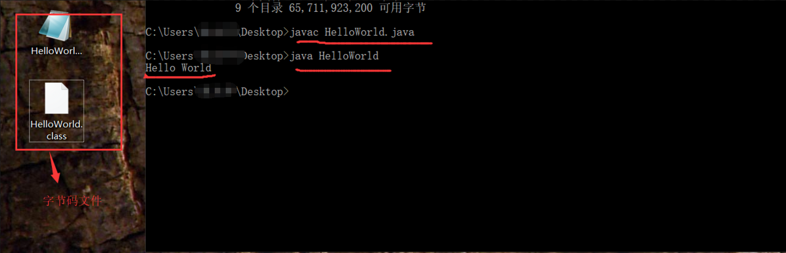


### 2. 使用IDE运行Java程序：

①：创建java project：
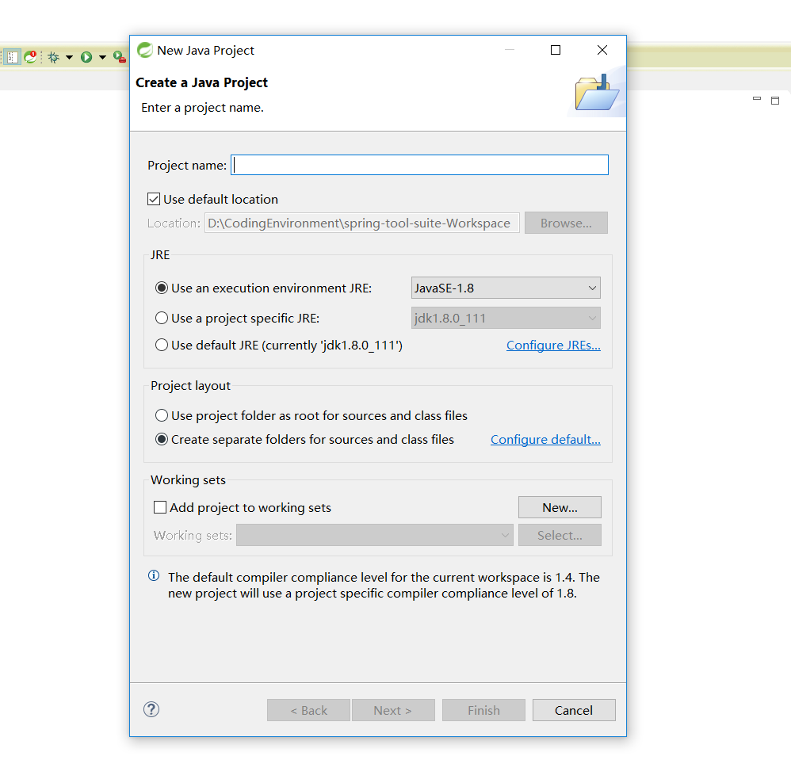

②：创建package包，class类
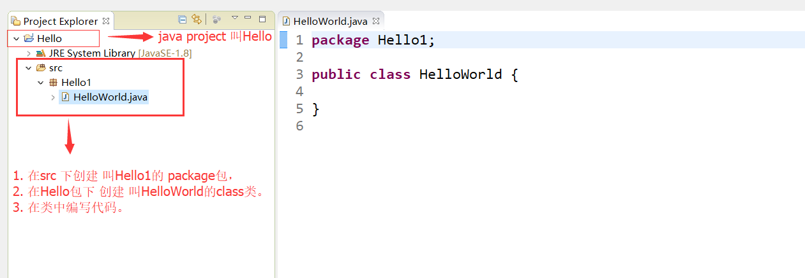

③：在类中编写源代码：
```java
package Hello1;

public class HelloWorld {
    /* 第一个Java程序
     * 它将打印字符串 Hello World
     */
    public static void main(String []args) {
        System.out.println("Hello World"); // 打印 Hello World
    }
}
```


④：运行程序。（右键 --> RunAs --> Java application）

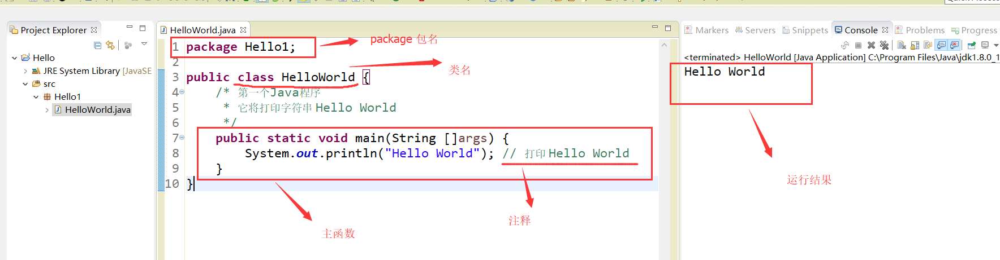


### 3. 第一个java程序解析：
源代码：
```c
package Hello1;

public class HelloWorld {
    /* 第一个Java程序
     * 它将打印字符串 Hello World
     */
    public static void main(String []args) {
        System.out.println("Hello World"); // 打印 Hello World
    }
}


```


<font color="red">
解析：

1. package Hello1;   //声明包名

2. class 关键字用于在java中声明一个类。

3. public 关键字是一个表示可见性的访问修饰符，它表示对所有人可见。

4. static是一个关键字,表示该方法为静态方法。==main方法由JVM执行，因此它不需要创建对象来调用main方法。所以它节省了内存==。

5. void是方法的返回类型，它意味着它不返回任何值。

6. main表示程序开始(执行的入口)。

7.  public static void main(String []args) { ... }

所有的java程序都是由这个main方法开始执行的。

8. String []args 

String[] args是main函数的形式参数。当使用命令行运行程序时，可以用来获取命令行用户输入进去的参数。==java 本身不存在不带String args[]的main函数,所以在程序中去掉String args[]会出现错误。==

例如：

①：创建Test.java :
```c
public class Test {
    public static void main(String[] args) {
        System.out.println(args[0]);
    }
}
```

②：在命令行窗口中比如运行 Test.class 文件：
```
C : > javac Test.java    
C : > java Test
```

③：运行结果：
```
Test  
```
</font>


### 4. 程序运行时的内部细节（★★★）：

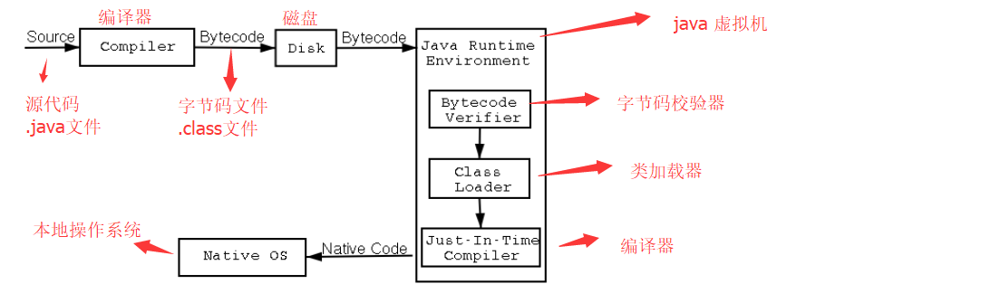

1. 在编译时，java文件(.java)准换为字节码文件（.class），并将java代码转换为字节码.

2. 类加载器(Classloader)：是用于加载类文件的JVM的子系统。

3. 字节码校验器(Bytecode Verifier)：检查代码中是否存在错误代码。


### 5. 常见问题解答（★★★★★）：

#### 1. 一个java源文件中可以有多个类吗？

==可以，但只能有一个 public 类==


#### 2. JVM:

JVM(Java虚拟机)是一个抽象机器。它是一个提供可以执行Java字节码的运行时环境的规范。

==字节码文件(.class)并不直接与机器的操作系统相对应，而是经过虚拟机间接与操作系统交互，由虚拟机将程序解释给本地系统执行。
因此，JVM屏蔽了与具体操作系统平台相关的信息，使得Java程序只需生成在Java虚拟机上运行的目标代码（字节码），就可以在多种平台上不加修改地运行。==

JVM执行以下主要任务：

提供运行时环境(JRE) ---> 加载代码 ---> 验证代码 ---> 执行代码 


#### 3. JRE:

JRE是Java Runtime Environment的缩写。用于提供java程序运行时环境。==它包含一组运行java程序库和JVM==。


#### 4. JDK：

JDK是Java开发工具包。
JDK包括了Java运行环境JRE、Java工具和Java基础类库。


---


## 2. java基础：

### 1. java代码的基本语法：


#### 1. 基本格式与要点：

==①：java中的所有程序代码都必须放在类中。可以大概理解为一个.java文件代表一个类==

类的定义：
```
修饰符 class 类名{

    程序代码;
}
```

==②：编写java代码注意：==

> 1. java程序中每条语句都必须用分号（;）结束。

> 2. Java是大小写敏感的，这就意味着标识符Hello与hello是不同的。

> 3. java程序中，一句连续的字符串不能分开在两行写。要把两行用 + 号连起来。
```java
 System.out.println("this is a 
     java 程序");                  //这是错误示例

System.out.println("this is a"+ 
    "java 程序");                  //这是正确示例
```


> 4. <font color="red">类名的首字母应该大写。</font>如果类名由若干单词组成，那么每个单词的首字母应该大写，例如 MyFirstJavaClass 


> 5. <font color="red">方法名都应该以小写字母开头</font>。如果方法名含有若干单词，则后面的每个单词首字母大写。例如 myFirstJava

> 6. 源文件名(.java文件名)必须和公共类名（public class 类名）相同。

> 7. 主方法入口:所有的Java 程序由public static void main(String []args)方法开始执行.


---


#### 2. 注释：

Java支持单行以及多行注释。==注释中的字符将被Java编译器忽略。==

①：单行注释： 以 `//` 两个字符作为一行注释的开始.

②：多行注释： 它以 `/*` 开始，并以 `*/` 结束.

③：文档注释：看下例。==在STS的快捷键：ALT + SHIFT +J==

```java

int a=10;    //这是单行注释

/*
int b=10;
int c=10;

这是多行注释
*/

/**
 * 文档注释，用于为代码编写帮助文档 
 *
 */

```

<font color="red">
注意：

1. 多行注释 可以嵌套单行注释。

2. 多行注释 不能嵌套多行注释。
</font>


#### 3. 标识符：

==java程序中，类名、变量名以及方法名等都被称为标识符。==

> 关于Java标识符，有以下几点需要注意：

1. 所有的标识符都应该以字母（A-Z或者a-z）,美元符（$）、或者下划线（_）开始。（<font color="red">不能以数字开头</font>）


2. 首字符之后可以是字母（A-Z或者a-z）,美元符（$）、下划线（_）或数字的任何字符组合

3. ==关键字不能用作标识符.==

4. 标识符是大小写敏感的

5. 合法标识符举例：age、$salary、_value、__1_value

6. 非法标识符举例：123abc、-salary


#### 4. java 关键字：

==这些关键字不能用于常量、变量、和任何标识符的名称。==

<font color="red">所有的关键字都是小写的。</font>

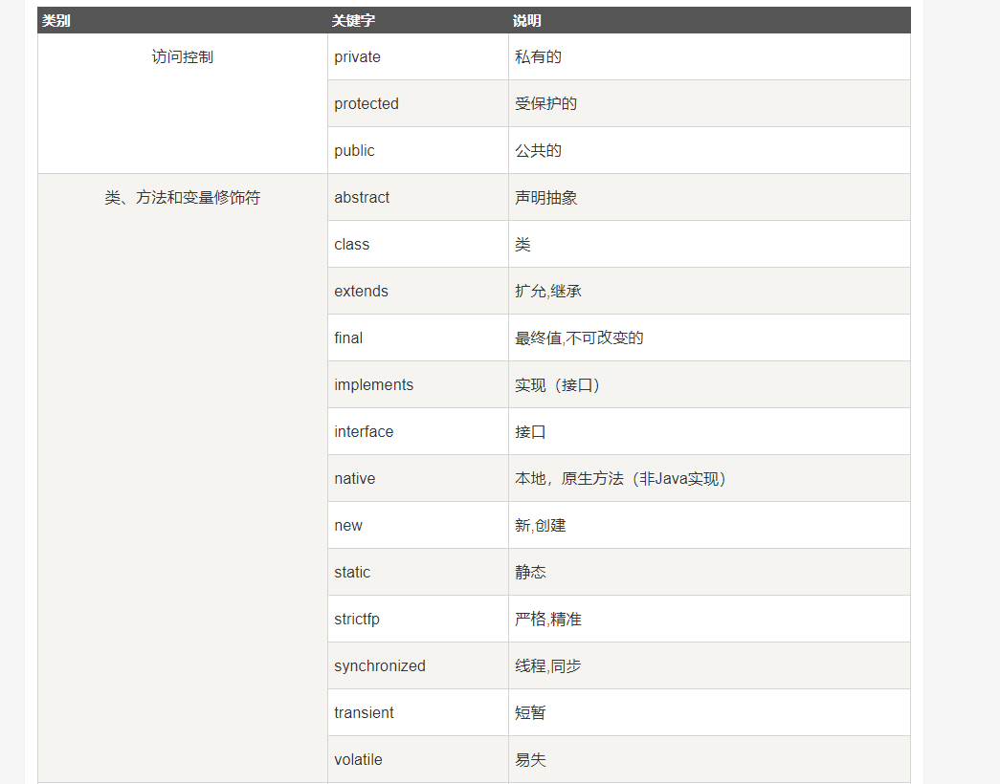

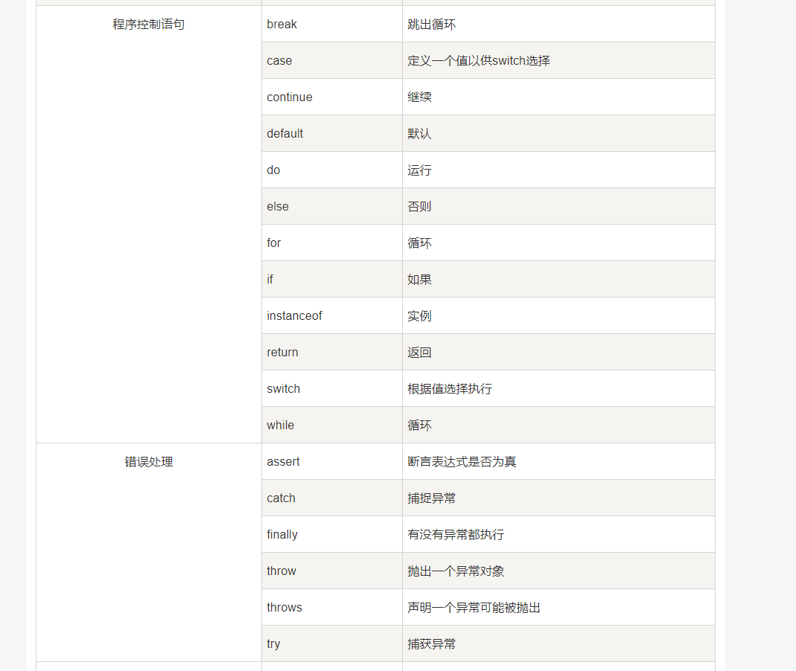

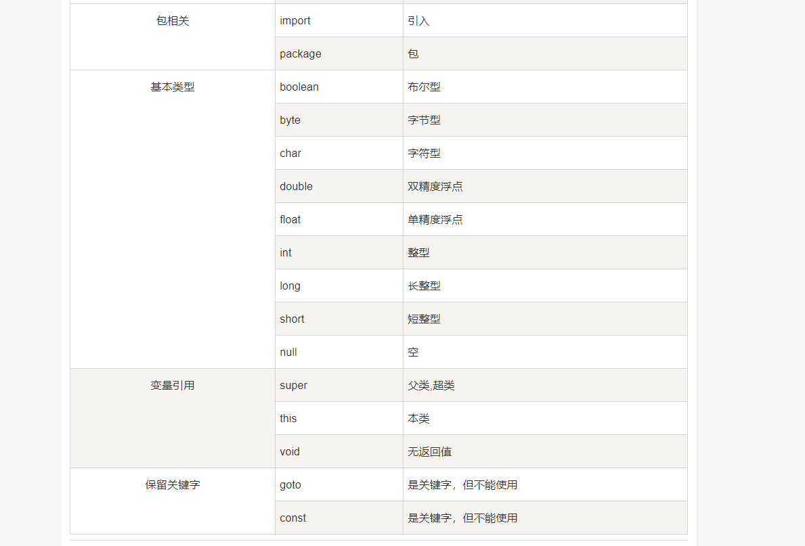


### 2. java 变量：

#### 1.变量的定义：

```java
int a=3;
int b;
int c=a+3;

```

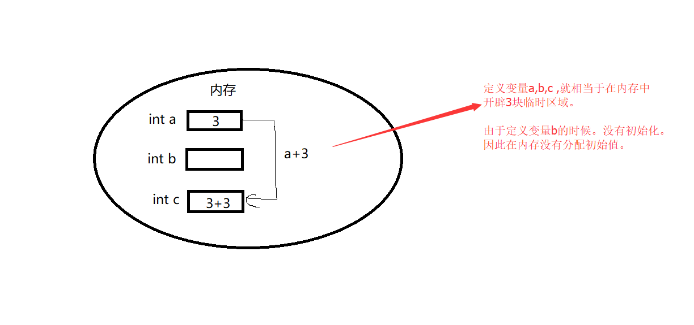

```java
int c=a+3;  
```
<font color="red">
在内存中的表现是：程序首先取出变量a的值，与3相加后，把结果赋值给变量c。
</font>


#### 2. 变量的数据类型：

<font color="red">
在java中，定义变量时必须声明变量的数据类型。
</font>

<p/>

> 整数类型（byte ， short ， int , long）
> byte ：占1个字节（8位），==范围：-128（-2^7）~ 127（2^7-1）==
> short ：占2个字节（16位），==范围：-32768（-2^15）~ 32767（2^15 - 1）==
> int : 占4个字节（32位），==范围: -2^31 ~ 2^31 - 1==
> long : 占8个字节（64位），==范围：-2^63 ~ 2^63 -1==


> 浮点数类型（float ， double）
> float : ==用于存储小数数值。==
> double : ==既可以存储小数，也可以存储整数。==

> 字符型（char）
> char : ==用于存储一个单一的字符，最小值是 \u0000（即为0）；最大值是 \uffff（即为65,535）==

> 布尔型（boolean）
> boolean : ==只有两个取值：true 和 false；==

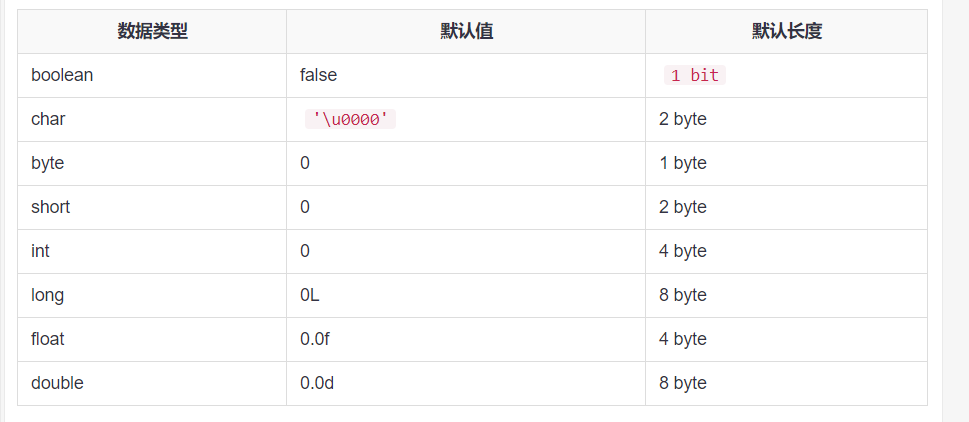


DEMO:
```java
byte a = 100;
short s = 1000;
int a = 10000;
long a = 100000L;    //为long类型变量赋值时，需在数值的后面加上大写的L，表示该类型为long类型。
float f1 = 234.5f;  //为float类型变量赋值时，需在数值的后面加上F或f，表示该类型为float类型。
double d1 = 123.4;
boolean one = true;
char letter = 'A';
```


---


#### 3. 变量的数据类型转换(两种)：

==在程序中，当把一种数据类型的值赋给另一种类型的变量时，需要进行变量的数据类型转换。==

<font color="blue">
整型、实型（常量）、字符型数据可以混合运算。在运算中，不同类型的数据先转化为同一类型，然后进行运算。
</font>

<p/>


<font color="red">
数据类型转换必须满足如下规则：

 ①：不能对boolean类型进行类型转换。
 ②：在把容量大的类型转换为容量小的类型时必须使用强制类型转换.
 ③：转换过程中可能导致溢出或损失精度.
</font>


##### 1.自动类型转换：

==自动类型转换也叫隐式类型转换，在转换过程中不需要进行声明的转换。==
<font color="red">
实现自动类型转换的条件：
①：目标类型的取值范围大于源类型的取值范围。
</font>

转换图：
```
byte -> short,int,long
short , char -> int,long
int -> long

byte,char,short,int -> float
byte,char,short,int,long,float -> double 

```

##### 2.强制类型转换：

==强制类型转换也叫显示类型转换。当两种类型彼此不兼容，或者目标类型的取值范围小于源类型时，可使用强制类型转换。==


> 实现强制类型转换的写法格式：
> 目标类型  变量 =（目标类型）源类型的变量；
```java
byte a;
int b=122;
a=(byte)a;   //int -> byte , 会导致数据精度的损失。

```
---

#### 4. 变量的作用域：

变量需要在它的作用范围内才可以被使用，这个作用范围就是变量的作用域。

==变量一定会定义在某一对大括号中，这个大括号包括的区域就是该变量的作用域。==

```java
public class Test {
    public static void main(String[] args) {
        
        int x=12;

        {
            int y=19;

            System.out.println(x);

        }

         System.out.println(y);    //这段错误

    }
}
```

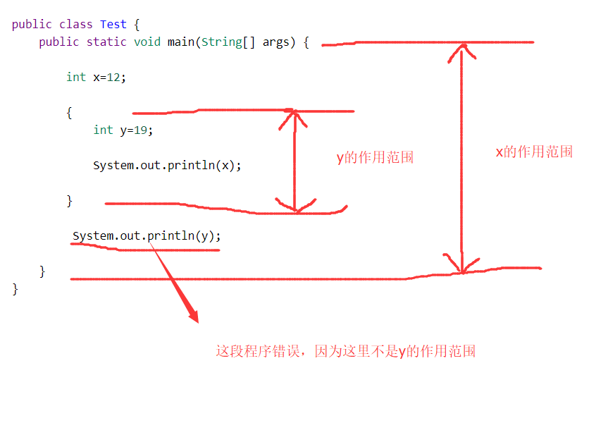


#### 5. 变量种类（3种）：

> 在java中有三种类型的变量：
> 1. 局部变量 :方法或语句块内声明的变量称为局部变量.
> 2. 实例变量 :在类中声明但在方法外部的变量称为实例变量.
> 3. (类变量)静态变量 ：被声明为static的变量(加static修辞符)称为静态变量。它不是局部的。

<font color="blue">局部变量与静态变量可以被main方法使用，实例变量不可。</font>

DEMO:
```java
package Hello1;

public class HelloWorld {
	int data=50;//实例变量

    static int m=100;// 静态变量

   public static void main(String[] args) {
       
       int x=12; //局部变量
       
       System.out.println(data);    //此处有错误
       System.out.println(x);
       System.out.println(m);

   }
	 
}
```

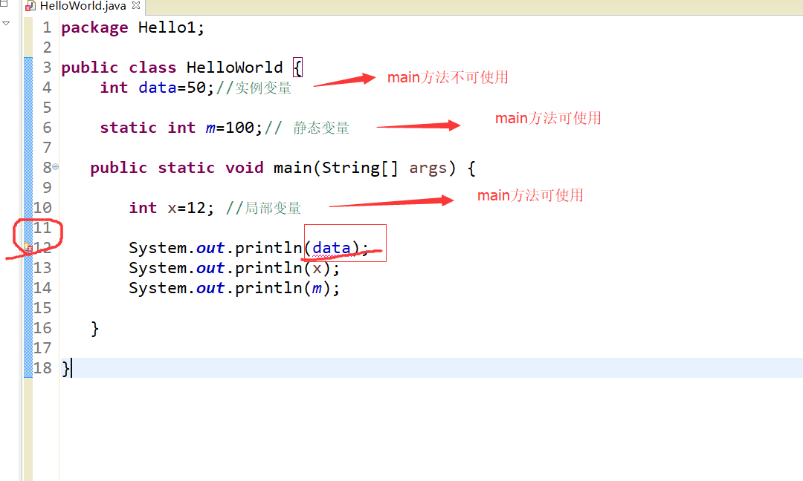


##### 1. 局部变量(main方法可访问):

<font color="red">

1. 局部变量声明在方法、构造方法或者语句块中.

2. 局部变量在方法、构造方法、或者语句块被执行的时候创建，当它们执行完成后，变量将会被销毁；

3. 局部变量是在栈上分配的.

4. 局部变量没有默认值，所以局部变量被声明后，必须经过初始化，才可以使用。
</font>

```java
public class HelloWorld {
	 
    public static void main(String args[]){
        int age;
        age = age + 7;
        System.out.println("小狗的年龄是 : " + age);
    }
}
```

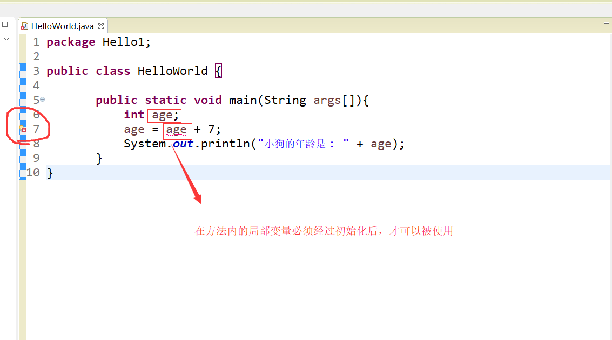


##### 2. 实例变量(main方法不可访问)：

<font color="red">

1. 实例变量声明在一个类中，但在方法、构造方法和语句块之外；

2. 实例变量在对象创建的时候创建，在对象被销毁的时候销毁；

3. 实例变量具有默认值。数值型变量的默认值是0，布尔型变量的默认值是false，引用类型变量的默认值是null。

</font>

DEMO:
```java
public class HelloWorld {
	 
	   // 这个实例变量对子类可见
	   public int a;
	   
	   // 私有变量，仅在该类可见，其他类看不到它
	   private double b;
	   

	   // 打印信息
	   public void printEmp(){
	      System.out.println(a);
	      System.out.println(b);
	   }
	   
}
```

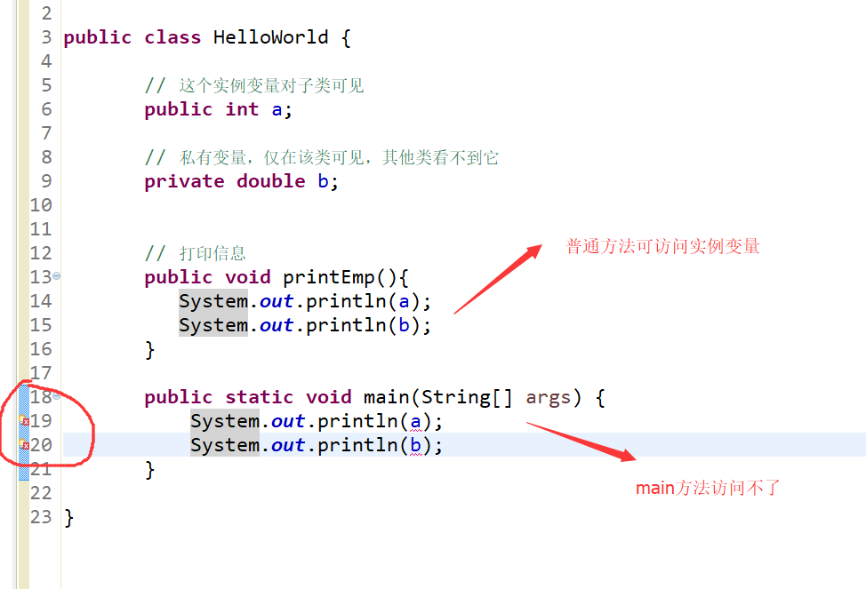


##### 3. 类变量（静态变量）(main方法可访问)：

<font color="red">

1. 类变量也称为静态变量，在类中以static关键字声明，但必须在方法构造方法和语句块之外。

2. 静态变量在程序开始时创建，在程序结束时销毁。

3. 数值型变量默认值是0，布尔型默认值是false，引用类型默认值是null。

</font>

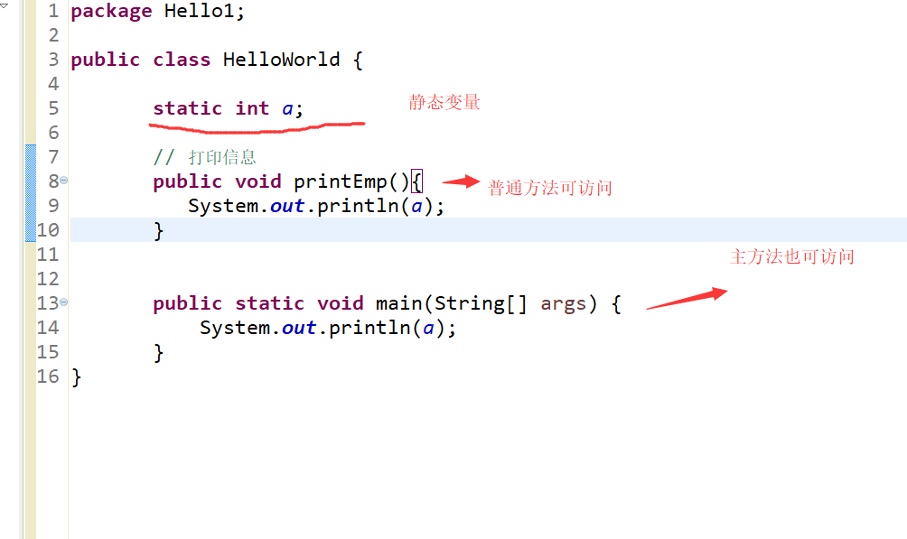


---


### 3.Java 修饰符:

#### 1.访问控制修饰符-public,protected,private：

>在Java中，使用访问控制符来限制对类、变量、方法和构造方法的访问。
① default (即缺省，什么也不写）: 在同一包内可见（可访问）。
② private : 在同一个类内可见（可访问）.==注意：不能修饰类（外部类）==
③ public : 对所有类可见。
④ protected : 对同一包内的类和所有子类可见。==注意：不能修饰类（外部类).==

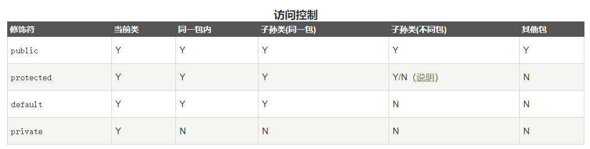


<h4>1. private 修饰符</h4>

>private 访问修饰符的使用主要用来隐藏类的实现细节和保护类的数据。


```java
public class test1 {
   private String format;       //format 变量只能被类内部访问
   public String getFormat() {
      return this.format;       //访问format私有变量，外部类不能访问该变量
   }
   public void setFormat(String format) {
      this.format = format;		//访问format私有变量
   } 
}
```

>format 为私有变量，其他类的方法不能直接得到和设置该变量的值。为了使其他类能够操作该变量，定义了两个public方法间接访format变量。


<h4>2. public 修饰符</h4>

>1. main()方法必须设置成公有的。否则,Java解释器将不能运行该类。
>2. 由于类的继承性，类所有的公有方法和变量都能被其子类继承。


<h4>3. protected 修饰符</h4>

>1. 子类与基类在同一包中：被声明为 protected 的变量、方法和构造方法能被同一个包中的任何其他类访问；
>2. 子类与基类不在同一包中：那么在子类中，子类的实例可以访问其从基类继承而来的 protected 方法，而不能访问基类实例的protected方法。


<h4>4. 方法继承的规则：</h4>

>1. 父类中声明为 public 的方法，在子类中也必须为 public。
>2. 父类中声明为 protected 的方法，在子类中要么声明为 protected，要么声明为 public，不能声明为 private。
>3. 父类中声明为 private 的方法，不能够被继承。


#### 2.static 修饰符:

用处：
>静态变量：
static 关键字用来声明独立于对象的静态变量，无论一个类实例化多少对象，它的静态变量只有一份拷贝。 ==静态变量也被称为类变量。局部变量不能被声明为 static 变量。==

>静态方法：
static 关键字用来声明独立于对象的静态方法。静态方法只能从参数列表得到数据，然后计算这些数据。

```java
public class test1 {
    private static int numInstances = 0;    //静态私有变量
    public static int getCount() {    //静态方法
        return numInstances;
    }
}

```


#### 3.final 修饰符:

> final 变量：
>final变量不能被重新赋值。final变量必须在定义时就指定初始值。

>final 方法：
>final 方法可以被子类继承，但是不能被子类修改。

>final 类:
>final 类不能被继承,没有类能够继承final类的任何特性。


#### 4.abstract 修饰符:

>抽象类：
>1. 抽象类不能用来实例化对象，声明抽象类的唯一目的是为了将来对该类进行扩充。
>2. ==如果一个类包含抽象方法，那么该类一定要声明为抽象类，否则将出现编译错误。抽象类可以包含抽象方法和非抽象方法。==
>3. 任何继承抽象类的子类必须实现父类的所有抽象方法，除非该子类也是抽象类。


```java
abstract class Caravan{
   private double price;
   public abstract void goFast(); //抽象方法的声明以分号结尾
}
```
<font color="red">抽象方法是一种没有任何实现的方法，该方法的的具体实现由子类提供。</font>


#### 5.synchronized 修饰符:

>synchronized 关键字声明的方法同一时间只能被一个线程访问。

```java
public synchronized void showDetails(){
   ....... 
}
```

---


### 4.Java 运算符:

#### 1.算术运算符:

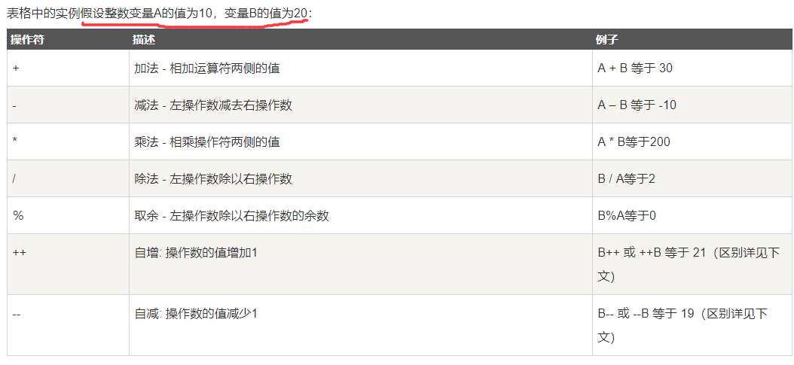

>前缀自增自减法(++a,--a): 先进行自增或者自减运算，再进行表达式运算。
>后缀自增自减法(a++,a--): 先进行表达式运算，再进行自增或者自减运算.

#### 2.关系运算符:

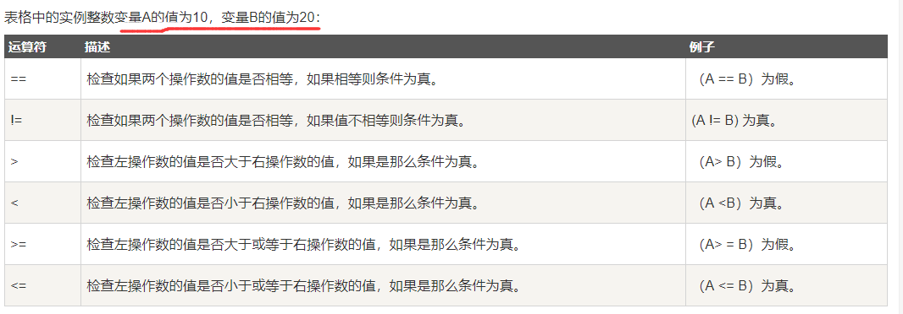

#### 3.位运算符:

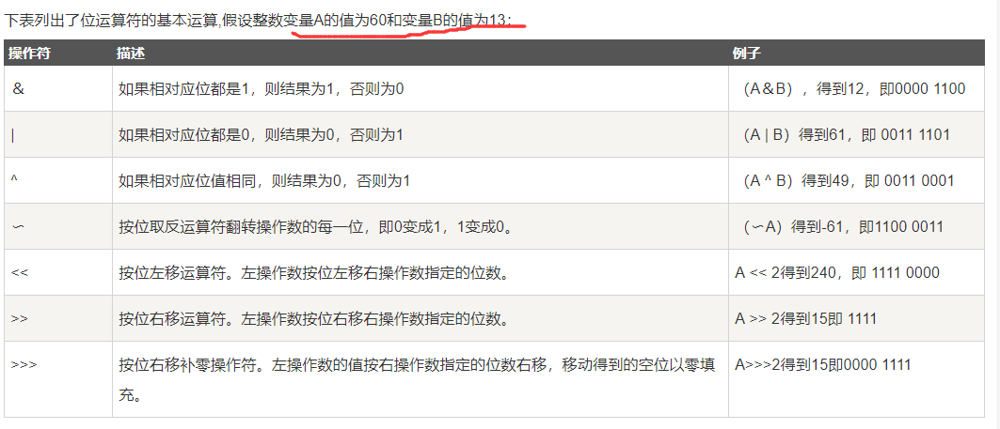

#### 4.逻辑运算符：

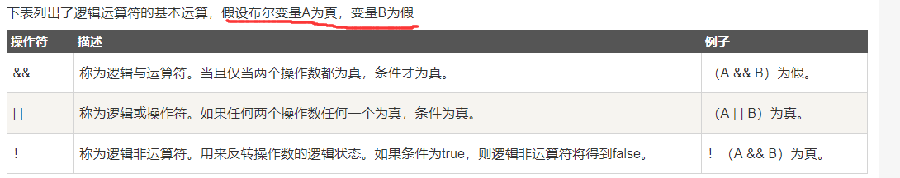

#### 5.赋值运算符：

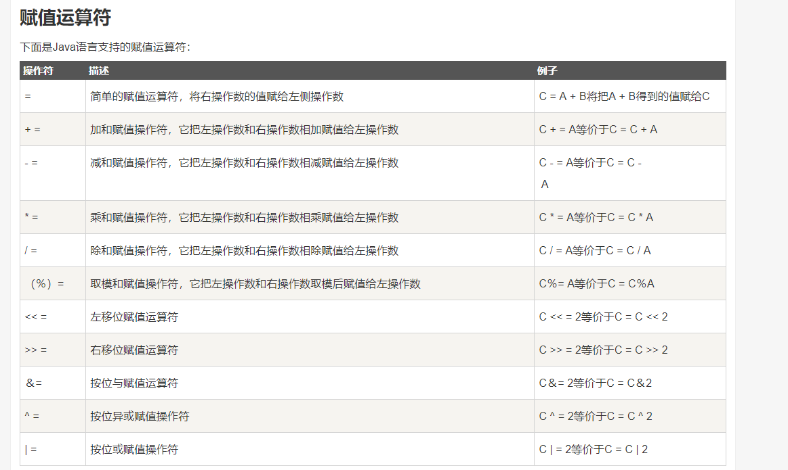

#### 6.Java运算符优先级

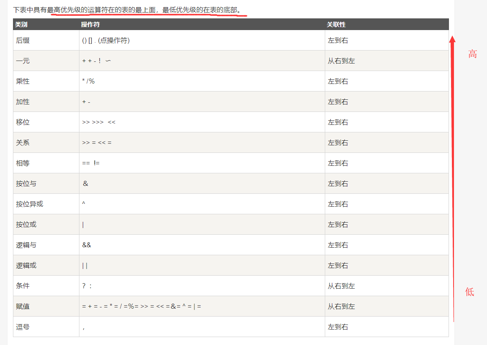

---

### 5.结构语句：

#### 1.条件语句：

<h4>1. if语句,if...else语句,if...else if...else 语句</h4>

>语法：
```java
//if的用法如下：
if(布尔表达式)
{
   //如果布尔表达式为true将执行的语句
}

//if…else 的用法如下：
if(布尔表达式){
   //如果布尔表达式的值为true
}else{
   //如果布尔表达式的值为false
}

//if...elseif...else 语句的用法：
if(布尔表达式 1){
   //如果布尔表达式 1的值为true执行代码
}else if(布尔表达式 2){
   //如果布尔表达式 2的值为true执行代码
}else if(布尔表达式 3){
   //如果布尔表达式 3的值为true执行代码
}else {
   //如果以上布尔表达式都不为true执行代码
}
```

<h4>2. switch 条件语句：</h4>

>switch case 语句语法格式如下：
```java
switch(expression){
    case value :
       //语句
       break; //可选
    case value :
       //语句
       break; //可选
    //你可以有任意数量的case语句
    default : //可选
       //语句
}
```

<font color="red">

PS:
1. case 语句中的值的数据类型必须与变量的数据类型相同，而且只能是常量或者字面常量。 
2. default分支 在没有 case 语句的值和变量值相等的时候执行，default 分支不需要 break 语句。
3. 如果当前匹配成功的 case 语句块没有 break 语句，则从当前 case 开始，后续所有 case 的值都会输出，如果后续的 case 语句块有 break 语句则会跳出判断。

</font>


#### 2.循环语句：

##### 1. while 循环,do…while 循环

>语法：
```java
while( 布尔表达式 ) {
  //循环内容,只要布尔表达式为 true，循环就会一直执行下去
}

do {
       //代码语句,布尔表达式的值为 true，则语句块一直执行
}while(布尔表达式);
```

<font color="red">do…while 循环和 while 循环相似，不同的是，do…while 循环至少会执行一次。</font>


##### 2.for循环

>语法格式如下：
```java
for(初始化; 布尔表达式; 循环控制变量) {
    //代码语句
}

//for循环步骤：
//1.最先执行初始化。
//2.然后，检测布尔表达式的值。如果为 true，循环体被执行。如果为false，循环终止，开始执行循环体后面的语句。
//3.执行一次循环后，更新循环控制变量。
//4.再次检测布尔表达式。循环执行上面的过程。

```
```java
//打印10次输出语句
for(int x = 10; x < 20; x = x+1) {
         System.out.print("value of x : " + x );
         System.out.print("\n");
}
```

##### 3.增强 for 循环-主要用于数组

<font color="red">声明新的局部变量:该变量的类型必须和数组元素的类型匹配。</font>
>语法格式如下：
```java
for(声明新的局部变量 : 被访问的数组名)
{
   //代码句子
}

//例子：
int [] numbers = {10, 20, 30, 40, 50};
for(int x : numbers ){
    System.out.print( x );
    System.out.print(",");
}

String [] names ={"James", "Larry", "Tom", "Lacy"};
for( String name : names ) {
    System.out.print( name );
    System.out.print(",");
}
```


##### 4.break 关键字,continue 关键字:

>break 主要用在循环语句或者 switch 语句中，用来跳出最里层的循环语句。

>continue 作用是让程序立刻跳转到下一次循环的迭代。
>1. 在 for 循环中，continue 语句使程序立即跳转到更新语句。
>2. 在 while 或者 do…while 循环中，程序立即跳转到布尔表达式的判断语句。

例子：
```java
int [] numbers = {10, 20, 30, 40, 50};
for(int x : numbers ) {
    // x 等于 30 时跳出循环
    if( x == 30 ) {
    break;              //跳出for循环
    }
    System.out.print( x );
    System.out.print("\n");
}


for(int x : numbers ) {
    if( x == 30 ) {
        continue;      //当x为30时，跳过这次循环，相当与不打印30语句
    }
    System.out.print( x );
    System.out.print("\n");
}

```

----

### 6.数组：

#### 1.声明数组变量：

```java
int[]  myList;         // 首选的方法
或
int  myList[];         //  效果相同，但不是首选方法
```
<font color="red">注意: 建议使用 int[]  myList; 的方式来声明数组变量。 int  myList[];  风格是来自 C/C++ 语言 ，在Java中采用是为了让 C/C++ 程序员能够快速理解java语言。</font>


#### 2.创建数组：

Java语言使用new操作符来创建数组:
```java
int[] myList = new int[size];

/*
1. 使用 int[size] 创建了一个数组。
2. 把新创建的数组的引用赋值给数组变量myList。
*/
```

```java
public class test1 {
	  public static void main(String[] args) {
		  int[] a=new int[10];  //创建数组a
		  for(int i=0;i<10;i++) {
			  a[i]=i;
		  }
		  
		  //增强for循环
		  for(int x:a) {
			  System.out.println("数组值"+x);
		  }
	  }
}
```

#### 3.数组作为函数的参数，函数的返回值：

```java
public class test1 {
	  public static void main(String[] args) {
		  int[] a=new int[10];  //创建数组a
		  for(int i=0;i<10;i++) {
			  a[i]=i;
		  }
		  
		  printArray(a);   //数组作为函数参数
		  System.out.println("-------");
		  int[] b=reverse(a);    //数组作为函数返回值
		  printArray(b);
	  }
	  
	  public static void printArray(int[] a) {
		  //增强for循环
		  for(int x:a) {
			  System.out.println("数组值"+x);
		  }
	  }
	  
	  public static int[] reverse(int[] a) {
		  int[] result = new int[a.length];    //创建一个与a数组等长的数组result
		 
		  for (int i = 0, j = result.length - 1; i < a.length; i++, j--) {   //把a数组的逆序赋值到result数组上
		    result[j] = a[i];
		  }
		  return result;
	  }
}
```


#### 4.多维数组：

>多维数组可以看成是数组的数组，比如二维数组就是一个特殊的一维数组，其每一行元素都是一个一维数组。

<h4>二维数组的定义：</h4>

>第一种方式：
```java
int a[][] = new int[2][3];  //创建一个2行3列的二维数组
或
int[][] a = new int[2][3];
```
==二维数组 a 可以看成每一行都是一个一维数组，相当于两个一维数组叠加在一起。每一个一维数组都有3列==

>第二种方式：
```java
int a[][] = new int[3][];  //这样创建的方式，只是每个元素的长度不确定
```

>第三种方式：
```java
int[][] a={{1,2},{3,4,5,6},{7,8,9}}  //创建二维数组，其中第一行的一维数组有1,2元素。第二行的一维数组有3,4,5,6元素。第三行的一维数组有789元素。
```

<h4>二维数组的赋值与遍历</h4>

```java
public class test1 {
	  public static void main(String[] args) {
		  int[][] a=new int[3][3];  //创建数组a
		  for(int i=0;i<3;i++) {    //二维数组的赋值
			 for(int j=0;j<3;j++) {
				a[i][j]=i+j;
			 }
		  }
		  
		  for(int i=0;i<3;i++) {    //二维数组的遍历
			 for(int j=0;j<3;j++) {
				System.out.print(" "+a[i][j]);
			 }
			 System.out.println(" ");
		  }
	  }
}

```

---

#### 5.Array数组的常用方法：

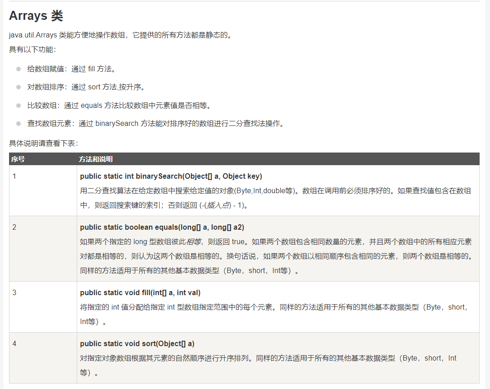


---


### 7.方法：

>Java方法是语句的集合，它们在一起执行一个功能，它就是函数。
方法是解决一类问题的步骤的有序组合
方法包含于类或对象中
方法在程序中被创建，在其他地方被引用

>语法：
```java
修饰符 返回值类型 方法名(参数类型 参数名){
    ...
    方法体
    ...
    return 返回值;
}

/*
1. 修饰符：定义了该方法的访问类型。
2. 返回值类型 ：方法可能会返回值。
3. 方法名：是方法的实际名称。方法名和参数表共同构成方法签名。
4. 参数类型：当方法被调用时，传递值给参数。这个值被称为实参或变量。参数是可选的，方法可以不包含任何参数。
5. 方法体：方法体包含具体的语句，定义该方法的功能语句。
*/

public static int max(int num1, int num2) {
   int result;
   if (num1 > num2)
      result = num1;
   else
      result = num2;
 
   return result; //返回值
}
```

---
#### 1.方法调用：

>当方法有返回值的时候，方法调用通常被当做一个值。例如：
int larger = max(30, 40);

>如果方法返回值是void（无返回值），方法调用一定是一条语句。例如：
System.out.println("欢迎访问菜鸟教程！");


#### 2.方法的重载

>创建两个有相同名字但参数不同的方法，这叫做方法重载。

下面的两个max方法有相同名字但参数不同：
```java
public static int max(int num1, int num2) {
   int result;
   if (num1 > num2)
      result = num1;
   else
      result = num2;
 
   return result; //返回值
}

public static double max(double num1, double num2) {
  if (num1 > num2)
    return num1;
  else
    return num2;
}
```


#### 3.构造方法：

>构造方法给一个类的实例变量赋初值，或者执行其它必要的步骤来创建一个完整的对象，构造方法没有返回值。

```java
// 一个简单的构造函数
class MyClass {
  int x;
  // 以下是构造方法,构造方法没有返回值
  MyClass() {
    x = 10;
  }
}

//-------

public class ConsDemo {
   public static void main(String args[]) {
      MyClass t1 = new MyClass();    //实例化类对象
      System.out.println(t1.x);   //t1.x的值为10
   }
}
```

>所有的类都有构造方法，因为Java自动提供了一个默认构造方法.

>类为 public，构造函数也为 public；类改为 private，构造函数也改为 private

>一旦你定义了自己的构造方法，默认构造方法就会失效。


---


## 3.面向对象：

### 0.Java 封装

>封装可以防止类中的代码和数据被外部类的代码随机访问,必须通过严格的接口控制才能访问，增加程序的安全性。


>封装的步骤：
1.修改属性的可见性来限制对属性的访问（一般限制为private）。
2.对每个属性提供对外的公共方法进行设置和访问。

```java
public class Person{
    private String name;  //设置私有属性，来限制对属性的随意访问
    private int age;
​
    public int getAge(){   //提供公共方法对属性进行操作
      return age;
    }
​
    public String getName(){
      return name;
    }
​
    public void setAge(int age){
      this.age = age;
    }
​
    public void setName(String name){
      this.name = name;
    }
}
```

### 1.类与对象：

>类：类是一个模板，它描述一类对象的行为和状态。例如：人类,会吃喝睡。
>对象：对象是类的一个实例，有状态和行为。例如，小明，就是人类的实例化的一个对象。

>Java中的类:
```java
public class human {
	  String name;    //姓名
	  int age;   		//年龄
	  String sex;		//性别		
	  Date birth;  		//出生年月
	  
	  public human() {   
		 //默认的构造方法
	  }
	  
	  public human(String name) {   
		  this.name=name;     //改造的构造方法
	  }
	  
	  void sleeping(){   //人类会睡觉
	  }
	  
	  void eating(){     //人类会吃
	  }
}
```


#### 1.创建对象：

> human hu=new human();   //这个实例化对象语句会调用默认的构造方法  

>human hu2=new human("xiaoming");   //这个实例化对象语句会调用改造的构造方法
```java
public class human {
	  String name;    //姓名
	  int age;   		//年龄
	  String sex;		//性别		
	  Date birth;  		//出生年月
	  
	  public human() {   
		 //默认的构造方法
	  }
	  
	  public human(String name) {   
		  this.name=name;     //改造的构造方法
	  }
	  
	  void sleeping(){   //人类会睡觉
	  }
	  
	  void eating(){     //人类会吃
	  }
	  
	  public static void main(String[] args) {
		   human hu=new human();   //这个实例化对象语句会调用默认的构造方法
		   System.out.println("方式1  "+hu.name);
		   human hu2=new human("xiaoming");   //这个实例化对象语句会调用改造的构造方法
		   System.out.println("方式2  "+hu2.name);
	  }
}
```

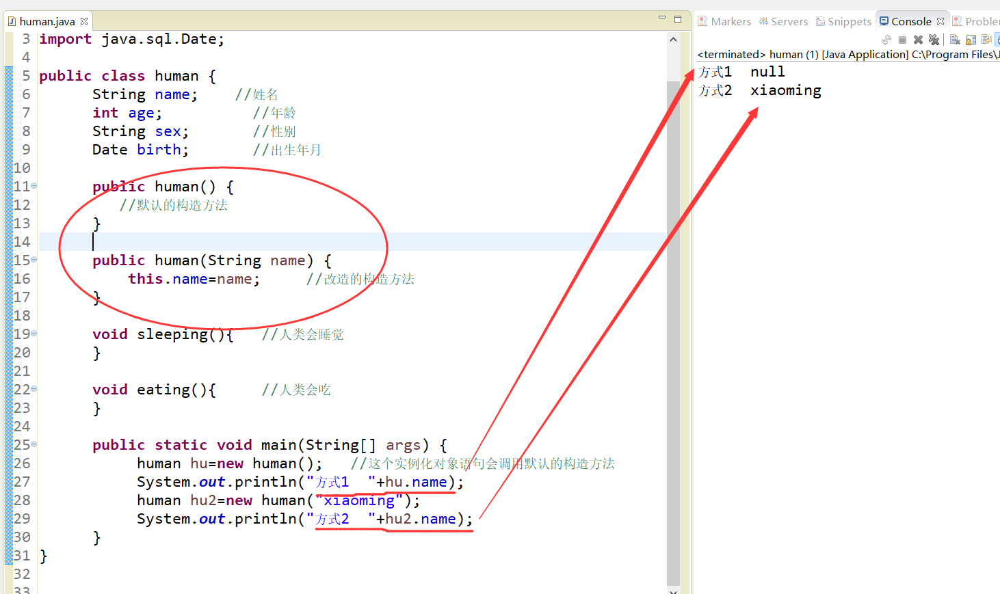


#### 2.类的封装：

>类的封装就是指在定义一个类时，把类的属性私有化（用private修饰），私有属性只能在本类中被访问，为了能让外界访问，通过构造方法来访问私有属性。

```java
public class human {
	private String name;    //姓名
	private int age;   		//年龄
	private String sex;		//性别		
	private Date birth;  		//出生年月
	  public human() {   
		 //默认的构造方法
	  }
	  public human(String name) {   
		  this.name=name;     //改造的构造方法
	  }
	public String getName() {
		return name;
	}
	public void setName(String name) {
		this.name = name;
	}
	public int getAge() {
		return age;
	}
	public void setAge(int age) {
		this.age = age;
	}
	public String getSex() {
		return sex;
	}
	public void setSex(String sex) {
		this.sex = sex;
	}
	public Date getBirth() {
		return birth;
	}
	public void setBirth(Date birth) {
		this.birth = birth;
	}
	public static void main(String[] args) {
		   human hu=new human();   //这个实例化对象语句会调用默认的构造方法
		   hu.setAge(23);			//设置年龄23
		   hu.setName("xiaoming");	//设置姓名为小明
		   hu.setSex("男");  
	  }
}

```

#### 3.类的构造方法与构造方法的重载：

构造方法的定义：
>1. 方法名与类名相同。
>2. 方法无返回值类型。

```java
public class human {
	  String name;      //姓名
	  int age;   		//年龄
	  String sex;		//性别		
	  Date birth;  		//出生年月
	  
      public human() {   
		 //无参的构造方法
	  }
	  public human(String name) {   
		  this.name=name;     //有参的构造方法
	  }
}
```

>1. 一个类中可以定义多个构造方法，只要构造方法的参数类型与参数个数互不相同。
>2. 在java中每个类中至少有一个构造方法，若类中没有编写该方法。则java会默认创建一个无参构造方法。
>3. 一旦对类的构造方法进行重载，系统不再提供默认的构造方法。


#### 4.this关键字

>①：通过this关键字可以访问类的变量。
>②：this可以调用方法。
>③：this可以调用构造方法。（==注意：只能在构造方法中用this调用构造方法，并且该语句必须在第一行。==）

```java
//this关键字可以访问类的变量
 public human(String name) {   
		  this.name=name;     
	  }
//this可以调用方法
public String getName() {
	return name;
}
public void tets() {
    this.getName();
}

//this可以调用构造方法
public human() {   
    //默认的构造方法
}
public human(String name) {   
    this();   //调用无参构造方法
}
```

#### 5.源文件声明规则与Import语句:

>1. 一个源文件中只能有一个public类,主类
>2. 一个源文件可以有多个非public类
>3. 源文件的名称应该和public类的类名保持一致。例如：源文件中public类的类名是Employee，那么源文件应该命名为Employee.java。
>4. 如果源文件包含import语句，那么应该放在package语句和类定义之间。如果没有package语句，那么import语句应该在源文件中最前面。
>5. import语句和package语句对源文件中定义的所有类都有效。在同一源文件中，不能给不同的类不同的包声明。


>==Import语句就是用来提供一个合理的路径，使得编译器可以找到某个类。==
>例如，下面的命令行将会命令编译器载入java_installation/java/io路径下的所有类
```java
import java.io.*;
```


#### 6.内部类：

>java允许在一个类的内部在定义类，这样的类叫做内部类。

<h4>①：成员内部类</h4>

>在一个类中在定义一个类，这种类叫做成员内部类。==成员内部类中可以访问外部类的所有成员，包括私有成员。==

>创建成员内部类对象语法：
>外部类名.内部类名 变量名=new 外部类名().new 内部类名();

```java
package blog;

import java.sql.Date;

public class human {
private String name="xiaoming";   
public human() {}
	  
public void shilihua() {    //外部类要访问内部类
	neibu n=new neibu();
	n.show();
}
	
  class neibu{
	  void show() {
		  System.out.println("这是内部类的show方法,"+"外部类的name成员的值为"+name);
	  }
  }
	  
	  
	public static void main(String[] args) {
		human h=new human();
		h.shilihua();   //外部类访问内部类,可在外部类中创建方法，方法中创建内部类对象。
		human.neibu hn=new human().new neibu();   //外部类访问内部类，要通过外部类对象去创建内部类对象
		hn.show();
	}
}
```

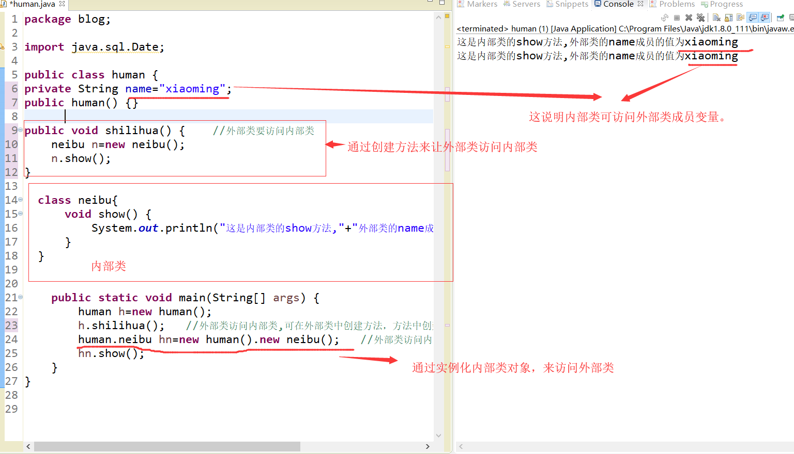

<font color="red">外部类访问内部类的方法：</font>
>1. 外部类访问内部类,可在外部类中创建方法，方法中创建内部类对象。
>2. 外部类访问内部类，要通过外部类对象去创建内部类对象,从而实现外部类访问内部类。


<h4>②：静态内部类</h4>

==用static修饰符修饰的成员内部类就是静态内部类。==

>实例化静态内部类对象语法：
> 外部类名.内部类名 变量名=new 外部类名.内部类名();

```java
package blog;

import java.sql.Date;

public class human {
private String name="xiaoming";
private static int number=5;
public human() {}
	  
public void shilihua() {    //外部类要访问内部类
	neibu2 n=new neibu2();
	n.show();
}
  
  //静态内部类
  static class neibu2{
	  void show() {
		  //静态内部类只能访问外部类的静态成员
		  System.out.println("这是静态内部类的show方法,"+"外部类的静态number成员的值为"+number);
	  } 
	  
  }
	public static void main(String[] args) {
		human h=new human();
		h.shilihua();   //外部类访问内部类,可在外部类中创建方法，方法中创建内部类对象。
		human.neibu2 hn=new human.neibu2();   //外部类访问内部类，要通过外部类对象去创建内部类对象
		hn.show();
	}
}


```

<font color="red">PS:</font>
>1. 在静态内部类中，只能访问外部类的静态成员，非静态成员不能访问。
>2. 静态内部类中可以定义静态成员，但在非静态内部类中不能定义静态成员。


<h4>③：方法内部类</h4>

>方法内部类指在成员方法中定义的类，==它只能在当前方法中使用。==,方法内部类可以访问外部类成员

```java
public class human {
private String name="xiaoming";
	public void shilihua() {    //外部类要访问内部类
		//方法内部类
		class inner{
			void show() {
				 System.out.println("这是静态内部类的show方法,"+"外部类的静态name成员的值为"+name);
			}
		}
		//实例化内部类对象
		inner i=new inner();
		i.show();   //调用内部类方法
	}
	  
	public static void main(String[] args) {
		human h=new human();
		h.shilihua();
	}
}

```


---

### 2.类的继承---减少重复代码，提高维护性：

#### 1.extends类的继承：

>继承就是子类继承父类中==所有可继承的成员变量和方法==，使得子类对象具有父类的成员变量和方法，使得子类具有父类相同的行为。

```java
class 父类 {
}
 
class 子类 extends 父类 {   //用关键字extends,让子类继承父类
}
```
```java
public class human {
	public static void main(String[] args) {
		B b=new B();
		b.showA();    //这是从A类中继承的方法
		b.name="xiaoming";  //这是从A类中继承的成员变量
		b.showB();
	}
}
class A{
	String name;
	void showA() {
		System.out.println("这是A类的showA方法");
	}
}
//B类继承A类，B类是A类的子类
class B extends A{
	int age;
	void showB() {
		System.out.println("this is B class-showB方法");
	}
	
}
```

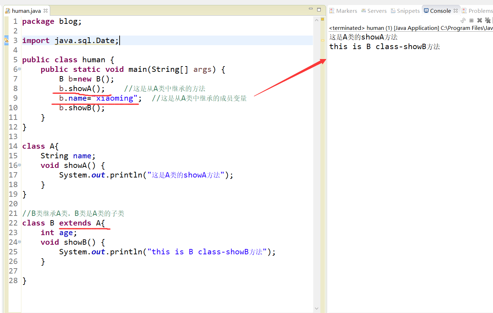

<font color="red">

PS:在类的继承中注意：
1. 在Java中只支持单继承，即一个类中只有一个父类。
2. 多个类可以有一个父类。
3. 多层继承是可以的。即B类继承A类，C类继承B类。
4. 子类拥有父类非private的变量、方法。
5. 子类可以拥有自己的属性和方法，即子类可以对父类进行扩展。
6. 子类可以用自己的方式实现父类的方法。
</font>

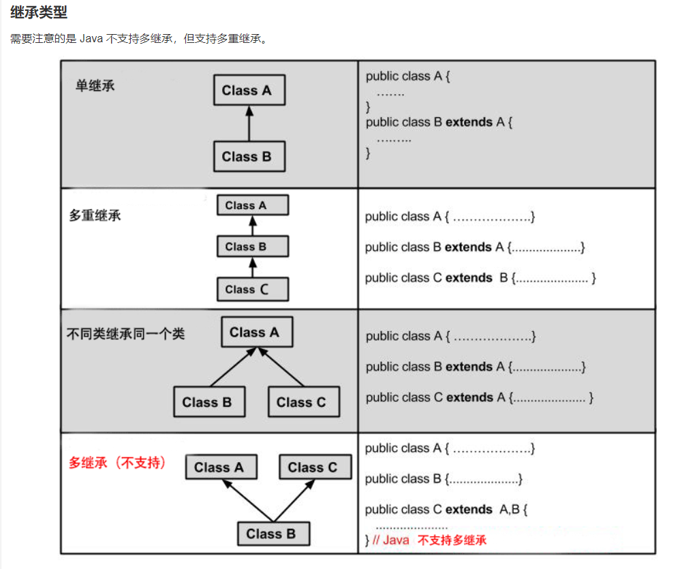


#### 2.重写父类方法：

>在继承中，有时子类会需要对从父类哪里继承的方法进行修改，这叫做重写父类方法，==两个方法之间必须具有相同的方法名，参数列表，返回值类型。==。

```java
public class human {
	public static void main(String[] args) {
		B b=new B();
		b.show();    //这是B类中对A类show方法的重写
	}
}

class A{
	String name;
	void show() {
		System.out.println("这是A类的showA方法");
	}
}

//B类继承A类，B类是A类的子类
class B extends A{
	int age;
	//重写show方法：
	void show() {
		System.out.println("this is B class-showB方法");
	}
	
}
```
>运行结果：this is B class-showB方法


#### 3. super 关键字：

>当子类重写父类方法后，不能访问原来父类的那个方法，但可以通过super关键字来访问。

<h4>①：使用super关键字调用父类的变量与方法：②：用super关键字调用父类构造方法。</h4>

```java
public class human {
	public static void main(String[] args) {
		B b=new B();
		b.show();    //这是B类中对A类show方法的重写
	}
}
class A{
	String name="A_name";
	A(String name){
		System.out.println("this is A 的有参构造方法 "+name);
	}
	void show() {
		System.out.println("这是A类的showA方法");
	}
}
//B类继承A类，B类是A类的子类
class B extends A{
	int age;
	B(){
		super("xiaoming");    //调用父类的有参构造方法
	}
	//重写show方法：
	void show() {
		super.show();   //调用A类的show方法
		System.out.println("用super关键字调用A类的变量name= "+super.name);
		System.out.println("this is B class-showB方法");
	}
	
}
```
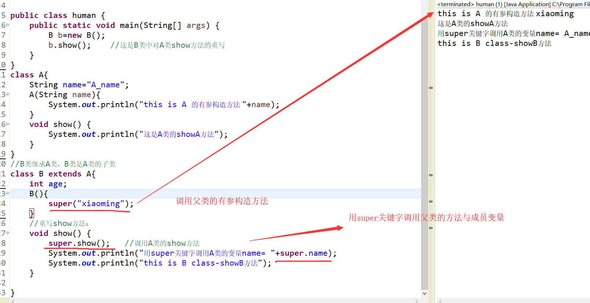

<font color="red">
通过super调用父类的构造方法的代码必须位于子类构造方法的第一行，并且只能出现一次。
</font>


#### 4.final关键字：

>final关键子用于修饰类，变量，方法
>1. final修饰的类不能被继承。
>2. final修饰的方法不能被子类重写。
>3. final修饰的变量是常量，只能被赋值一次。

```java
final class A{
	//最终类
}
public final void show(){
	//最终方法
}
final String name="xiaoming";
```

#### 5.抽象类与接口：

##### 1.抽象类与abstract关键字：

>抽象类：部分含有抽象方法的类，也可以不含有。
>抽象方法：无方法体的方法叫做抽象方法.
>==抽象方法,抽象类用abstract关键字修饰。==
```java
abstract class A{
	abstract int show();   //抽象方法show
}
```

<font color="red">

注意：
1.抽象类是不可以被实例化。
2.任何子类必须重写父类的抽象方法，或者声明自身为抽象类。。
</font>

```java
//抽象类
abstract class C{
	abstract void show();    //抽象方法
	void run() {   			 //非抽象方法
		System.out.println("RUN");
	}
}

class D extends C{
	void show() {    //对父类抽象方法的重写
		System.out.println("this is 对抽象类C的抽象方法show的重写");
	}
}

public class human {
	public static void main(String[] args) {
		D d=new D();
		d.run();
		d.show();
	}
}
```

>运行结果：
>RUN
>this is 对抽象类C的抽象方法show的重写

##### 2.接口与interface,implements关键字：

<font color="blue">接口的特点</font>
>1.==当一个抽象类中的所有方法都是抽象方法时，这个抽象类叫做接口。此时要用interface关键字来声明接口。==
>2.接口无法被实例化，但是可以被实现(用implements关键字)。一个实现接口的类，必须实现接口内所有的抽象方法，否则就必须声明为抽象类。
>3.接口中的方法都默认用“ public abstract ”修饰,变量默认用“ public final ”修饰,即抽象方法与全局变量
>4.一个类可以实现多个接口。
>5.一个接口能继承另一个接口.


```java
//用interface关键字声明接口
interface C{
	 void show();    //抽象方法
	 void run();
}
// 接口e
interface E {
	void eat();
	void sleep();
}

//一个接口继承另一个接口
interface G extends E{
	void speak();
	void jump();
}

//用implements关键字实现接口C
class D implements C{
	public void show() {    //对接口的重写
		System.out.println("show");
	}
	public void run() {
		System.out.println("run");
	}
}

//实现两个接口
class F implements C,E{
	public void eat() { // 对接口的重写
		System.out.println("F-eat");
	}
	public void sleep() {
		System.out.println("F-sleep");
	}
	public void show() { // 对接口的重写
		System.out.println("F-show");
	}
	public void run() {
		System.out.println("F-run");
	}
}
```


#### 6.多态：

##### 1.多态概述

>1.在同一个方法中，根据参数类型的不同而产生不同的执行结果的现象叫做多态。
>2.多态存在的三个必要条件:继承,重写,父类引用指向子类对象.
>3.java中允许父类引用指向子类对象，根据被引用子类的不同，得到不同的执行结果。
>4.==当使用多态方式调用方法时，首先检查父类中是否有该方法，如果没有，则编译错误；如果有，再去调用子类的同名方法。==

```java
abstract class Animal {  
    abstract void eat();  
}  
  
class Cat extends Animal {  
    public void eat() {  
        System.out.println("吃鱼");  
    }  
    public void work() {  
        System.out.println("抓老鼠");  
    }  
}  
class Dog extends Animal {  
    public void eat() {  
        System.out.println("吃骨头");  
    }  
    public void work() {  
        System.out.println("看家");  
    }  
}

public class human {
	public static void main(String[] args) {
		Animal animal=new Cat();   //父类引用指向子类对象
		animal.eat();     		   //父类引用调用子类方法
		Animal animal2=new Dog();  //父类引用指向子类对象
		animal2.eat();  		   //父类引用调用子类方法
	}
}
```

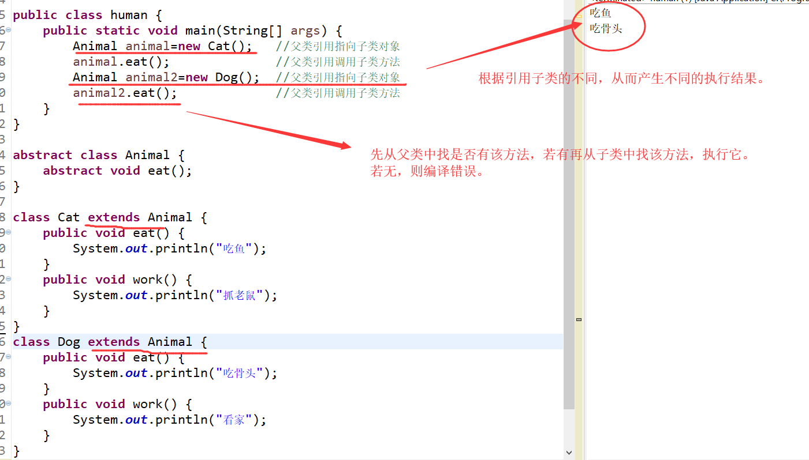


##### 2.Object类

>Object类是所有类的父类，即每个类都直接或间接继java.lang.Object类
>该类中主要有以下方法: toString(),getClass(),equals(),clone(),finalize()等, ==其中toString(),equals()是其中最重要的方法==。

<h4>toString()方法</h4>

>toString 方法返回一个字符串，该字符串由类名、at 标记符“@”和此对象哈希码的无符号十六进制表示组成。

```java
@Override
	public String toString() {
		return "human [getClass()=" + getClass() + ", hashCode()=" + hashCode() + ", toString()=" + super.toString()
				+ "]";
	}
```

<h4>equals()方法</h4>

>equals()方法：比较两个对象是否相等。
>注意：即便是内容完全相等的两块不同的内存对象，也返回false。
>String类已经重写了object中的equals方法（这样就是比较内容是否相等了）。


<h4>hashCode()方法</h4>

>返回该对象的哈希码值

---

### 3.异常：

>异常不是语法错误，是程序代码逻辑上的错误，无法在编译期间检查出来。
>在java中，以异常类的方式，通过异常处理机制对运行中发送的各种问题进行处理。r

#### 1.try..catch 和 finally

>使用try..catch关键字可以捕获异常。try..catch代码块放在异常可能发生的地方。

使用try..catch的语法如下：
```java
try
{
   // 可能有异常的程序代码
}catch(ExceptionName e1)
{
   //Catch 块
}

try{
   // 程序代码
}catch(异常类型1 异常的变量名1){
  // 程序代码
}catch(异常类型2 异常的变量名2){
  // 程序代码
}catch(异常类型2 异常的变量名2){
  // 程序代码
}

```

>如果try中代码中发生异常，异常被抛给第一个 catch 块。
如果抛出异常的数据类型与异常类型1匹配，它在这里就会被捕获。
如果不匹配，它会被传递给第二个catch块。
如此，直到异常被捕获或者通过所有的 catch 块。

```java
public class human {
	public static void main(String[] args) {
		try {
			int a=4/0;      //0不能作为除数，这段代码有异常
		} catch (Exception e) {
			System.out.println("当代码出现异常时，会执行catch块中的代码！");
		}finally {
			System.out.println("当代码是否出现异常时，都会执行finally块中的代码！");
		}
	}
}
```

>当代码无论是否出现异常时，都会执行finally块中的代码


#### 2.throws/throw关键字：

>java中允许在方法上使用 throws关键字来表明该方法有可能发生异常。
>throw 关键字用于在方法中声明抛出异常的实例化对象。

```java
public class className
{ 
	//throws关键字声明该方法可能有异常
  public void devide(double amount) throws RemoteException,InsufficientFundsException
  {
    //throw 关键字抛出某个异常的实例化对象
    throw new RemoteException();
  }
  
}
```

#### 3.声明自定义异常:

>在 Java 中编写自己的异常类时需要记住下面的几点。
>1.如果希望写一个检查性异常类，则需要继承 Exception 类。
>2.如果你想写一个运行时异常类，那么需要继承 RuntimeException 类。

```java
class MyException extends Exception{
	public MyException(){
		super();  //调用父类Exception的无参构造方法
	}
	public MyException(String messgae){
		super(messgae);  //调用父类Exception的有参构造方法
	}
}
```

---

## 4.多线程

### 1.基本概述：

>进程：每一个独立运行的程序称为进程,包含一个或多个线程。
>线程：一个进程中可以存在多个执行单元同时运行，其中每一个执行单元叫做线程，==其中每个进程中至少存在一个线程==。

<h4>1.线程的创建</h4>

>Java 提供了三种创建线程的方法：
①通过继承 Thread 类本身,重写该类的run方法。
②通过实现 Runnable 接口

>①通过继承 Thread 类,重写该类的run方法:

```java
public class human {
	public static void main(String[] args) {
		Mythread mythread=new Mythread();
		mythread.start();   
		for(int i=0;i<1000;i++) {
			System.out.println("main方法正在执行中...");
		}
	}
	
}
class Mythread extends Thread{
	public void run() {
		for(int i=0;i<1000;i++) {
			System.out.println("run方法正在执行中...");
		}
	}
}
```

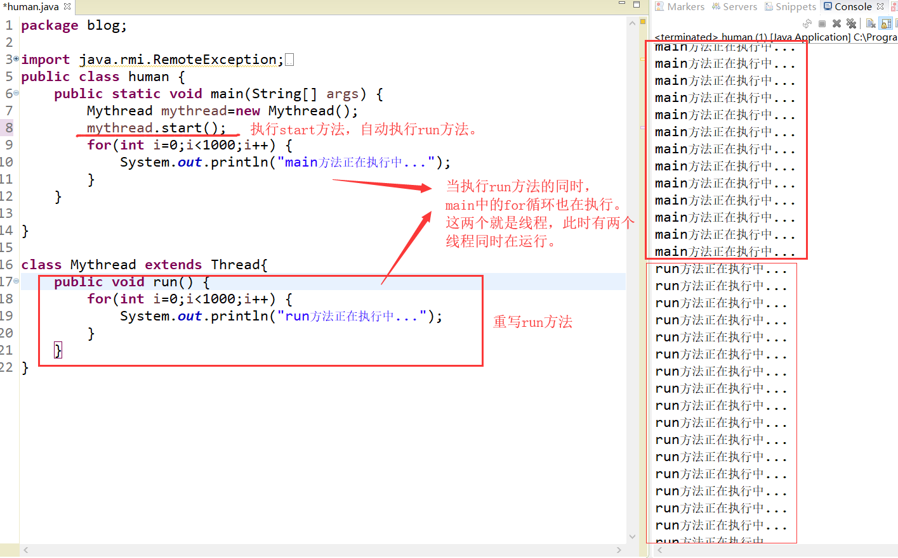


<font color="red">通过调用start()方法来启动线程的run方法</font>

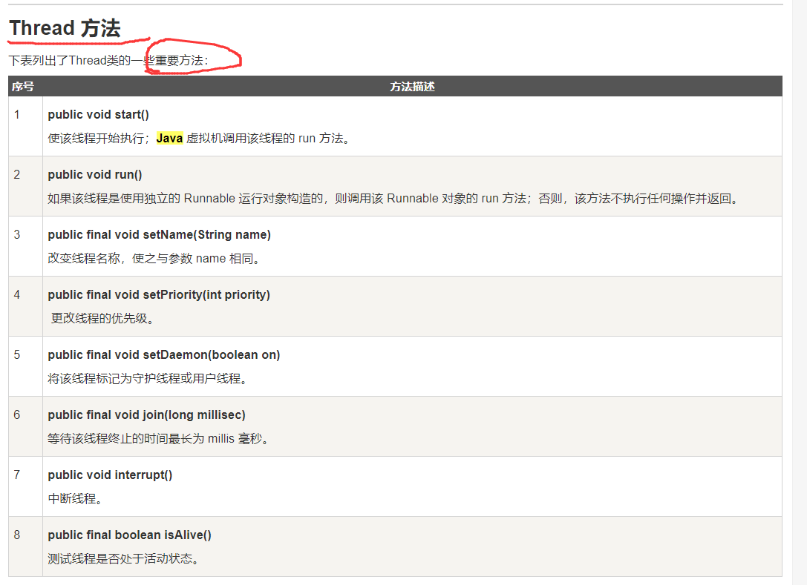

>②通过实现 Runnable 接口

<font color="red">由于java只支持单继承，所以当A类已经继承B类，则A类就无法继承Thread 类，实现不了多线程操作。所以建议用Runnable 接口实现多线程。</font>
```java
public class human {
	public static void main(String[] args) {
		  RunnableDemo R1 = new RunnableDemo();   //实例化对象
	      Thread th1=new Thread(R1,"窗口1");  //把实例化对象作为参数，传入Thread的有参构造方法中
	      Thread th2=new Thread(R1,"窗口2"); 
	      th1.start();  //开启线程1
	      th2.start();  //开启线程2
	}
	
}
class RunnableDemo implements Runnable {
	   //重写run方法
	   public void run() {
		   String tname=Thread.currentThread().getName();   //获取当前线程的名字
		   for(int i=1;i<=1000;i++) {
			   	System.out.println("线程 "+tname+"正在卖第 "+i+"张票");
		   } 
	   }
}
```
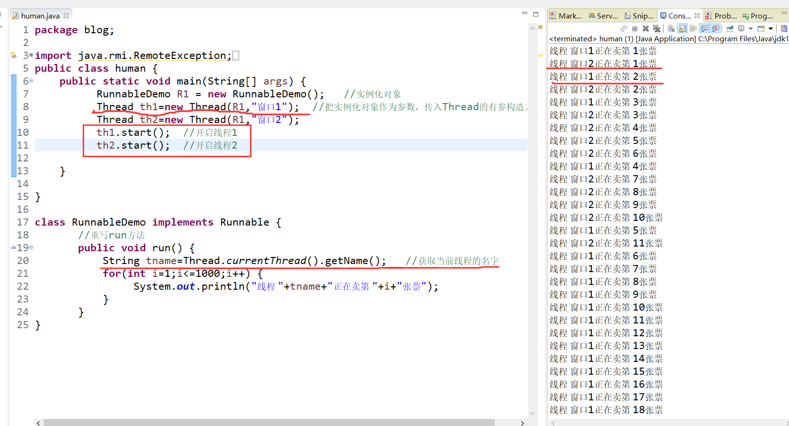

---

### 2.线程的生命周期：

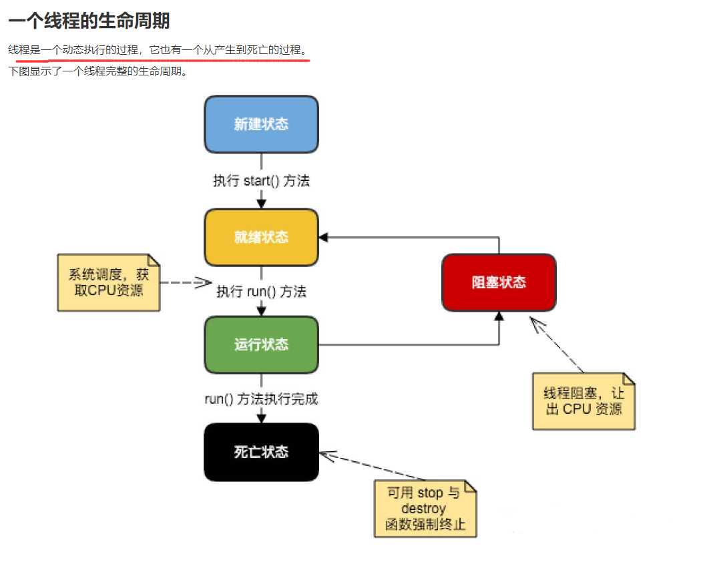

>新建状态:
当建立一个线程对象后，该线程对象就处于新建状态。它保持这个状态直到程序 start() 这个线程。

>就绪状态:
当调用了start()方法之后，线程就进入就绪状态。就绪状态的线程处于就绪队列中，要等待JVM里线程调度器的调度。

>运行状态:
如果就绪状态的线程获取 CPU 资源，就可以执行 run()，此时线程便处于运行状态。处于运行状态的线程最为复杂，==它可以变为阻塞状态、就绪状态和死亡状态==。

>阻塞状态:
如果一个线程执行了sleep（睡眠）、suspend（挂起）等方法后，失去所占用资源之后，该线程就从运行状态进入阻塞状态。在睡眠时间已到或获得设备资源后可以重新进入就绪状态。可以分为三种：
>1. 等待阻塞：线程执行 wait() 方法，使线程进入到等待阻塞状态。
>2. 同步阻塞：线程在获取 synchronized 同步锁失败(因为同步锁被其他线程占用)。
>3. 其他阻塞：通过调用线程的 sleep() 或 join() 发出了 I/O 请求时，线程就会进入到阻塞状态。当sleep() 状态超时，join() 等待线程终止或超时，或者 I/O 处理完毕，线程重新转入就绪状态。

>死亡状态:
一个运行状态的线程完成任务或者其他终止条件发生时，该线程就切 
换到终止状态。


### 3.线程的调度


### 4.线程的同步


### 5.线程的通信


---


## 5.java API

### 1.String 类

>Java 提供了 String 类来创建和操作字符串.

>①求字符串的长度,连接两个字符串：
```java
String name="xiaoming";  //创建字符串name变量
String name2="xiaoqiang";

int len=name.length();   //字符串的长度
System.out.println("name变量的长度为 "+len);

//连接两个字符串：
String name3=name.concat(name2);
System.out.println(name3);
```

>②字符串转换为字符数组,把字符串进行大小写转换：
```java
String name="xiaoming";  //创建字符串name变量
char [] ch=name.toCharArray();
	for(char c:ch){
	System.out.println(c);
	}

//把字符串进行大小写转换
System.out.println(name.toLowerCase());
System.out.println(name.toUpperCase());
```

>③字符串的判断操作：
```java
String name="xiaoming";  //创建字符串name变量
String name2="xiaoqiang";

System.out.println("判断字符串是否以xiao开头："+name.startsWith("xiao"));
System.out.println("判断字符串是否以g结尾： "+name.endsWith("g"));
System.out.println("判断字符串是否包含ao "+name.contains("ao"));
System.out.println("判断字符串是否为空 "+name.isEmpty());
System.out.println("判断两个字符串是否相等 "+name.equals(name2));
```

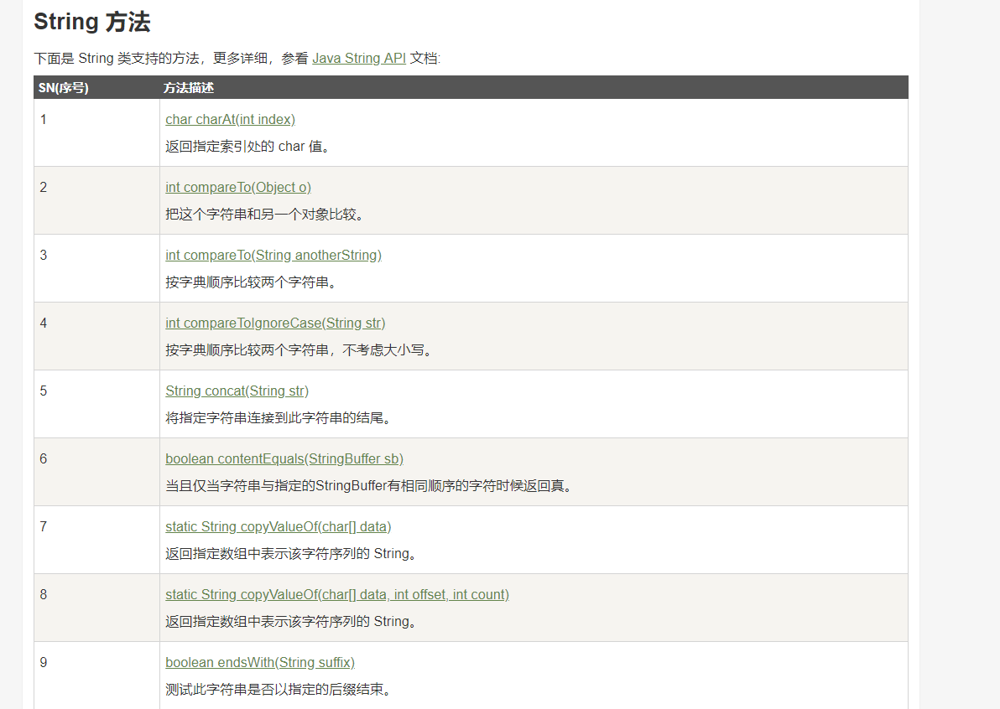
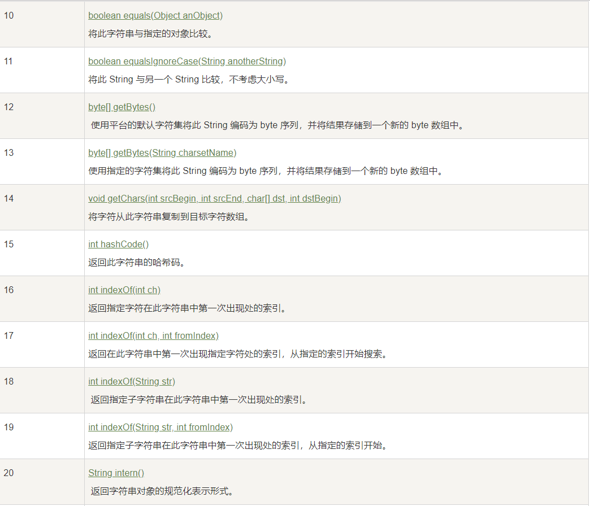
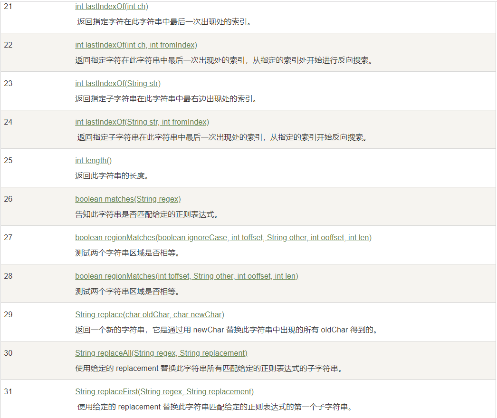
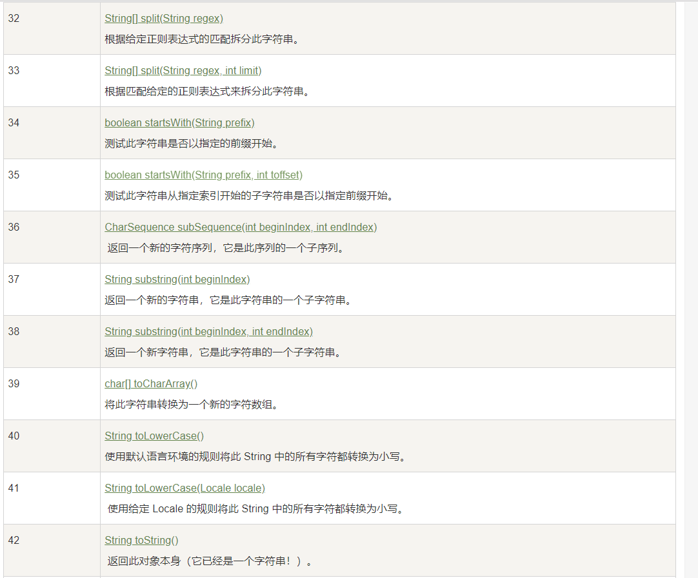
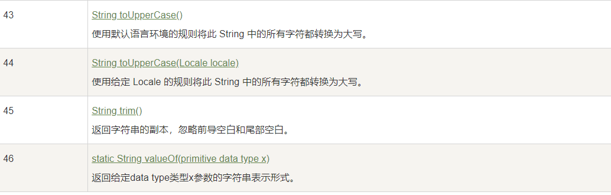


### 2.StringBuffer类：

>和 String 类不同的是，StringBuffer 和 StringBuilder 类的对象能够被多次的修改，并且不产生新的未使用对象。

```java
StringBuffer sBuffer = new StringBuffer("菜鸟教程官网：");
sBuffer.append("www");
sBuffer.append(".runoob");
sBuffer.append(".com");
System.out.println(sBuffer);  
```
>运行结果：菜鸟教程官网：www.runoob.com

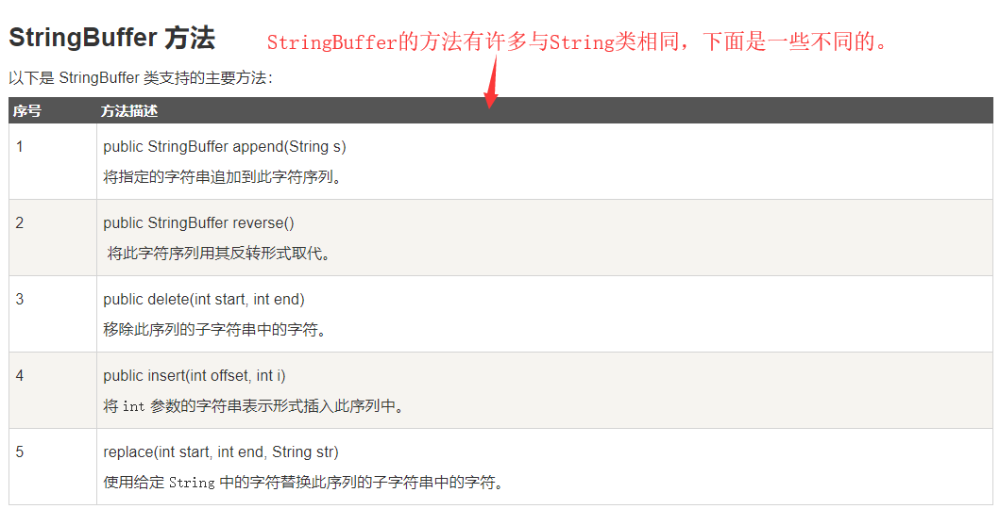


### 3.Math 类:

```java
System.out.println("90 度的正弦值：" + Math.sin(Math.PI/2));  
System.out.println("0度的余弦值：" + Math.cos(0));  
System.out.println("60度的正切值：" + Math.tan(Math.PI/3));  
System.out.println("1的反正切值： " + Math.atan(1));  
System.out.println("π/2的角度值：" + Math.toDegrees(Math.PI/2));  
System.out.println(Math.PI);  
```

### 4.Scanner 类

<font color="blue">scan.nextInt(); 用于输出整数</font>

>通过 Scanner 类的 next() 与 nextLine() 方法获取输入的字符串。

>①使用 next 方法：

```java
Scanner scan = new Scanner(System.in);
// 从键盘接收数据
System.out.println("next方式接收：");

if (scan.hasNext()) {    // 判断是否还有输入
	String str1 = scan.next();
	System.out.println("输入的数据为：" + str1);
}
scan.close();
```
>输入：xiao ming
>输出：xiao 

<font color="red">

next()的方法的特征:
1、一定要读取到有效字符后才可以结束输入。
2、对输入的空白，next()方法会自动将其去掉。
3、只有输入有效字符后才将其后面输入的空白作为分隔符或者结束符。
next() 不能得到带有空格的字符串。
</font>


>②使用 nextLine 方法：
```java
Scanner scan = new Scanner(System.in);
// 从键盘接收数据
System.out.println("nextLine方式接收：");
if (scan.hasNextLine()) {
	String str2 = scan.nextLine();
	System.out.println("输入的数据为：" + str2);
}
scan.close();
```
<font color="red">

nextLine()的特征：
1、以Enter为结束符,即nextLine()方法返回的是输入回车之前的所有字符。
2、可以获得空白。
</font>

### 5.包装类

>通过包装类可以把基本数据类型包装为数据类型的对象，当作对象处理。

基本数据类型 |	对应的包装类
------------ | -------------
byte  |	Byte
short |	Short
int  |	Integer
long  |	Long
char  |	Character
float  | 	Float
double |	Double
boolean |	Boolean

>①装箱：把基本数据类型转换为对象数据类型。
>②拆箱：把对象转换为基本数据类型。
```java
//int类型的装箱操作：
int a=10;
//手动装箱
Integer in=new Integer(a);
//自动转箱
Integer in2=a;
System.out.println(in.toString()+","+in2.toString());

//Integer的拆箱操作：
//手动拆箱
int num=in.intValue();
//自动拆箱
int num2=in2;
System.out.println(num+","+num2);
```
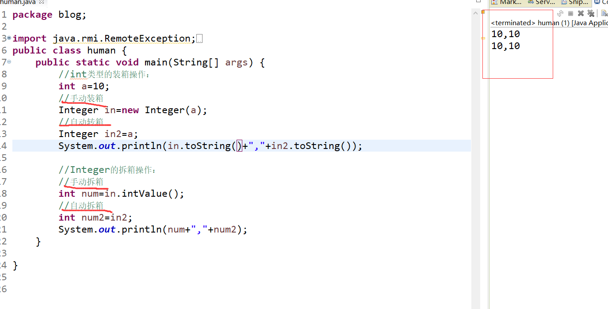

---

### 6.Date类与Calendar类

>①Date类
```java
Date now = new Date();
System.out.println(now);

//创建一个SimpleDateFormat的对象，指定它的格式
SimpleDateFormat  sdf = new SimpleDateFormat("yyyy年MM月dd日：HH：mm:ss");
//将指定的日期格式化
String date = sdf.format(now);
System.out.println(date);

//将指定的格式化后的日期解析成原来的日期格式
Date date1 = sdf.parse(date);
System.out.println(date1);
```
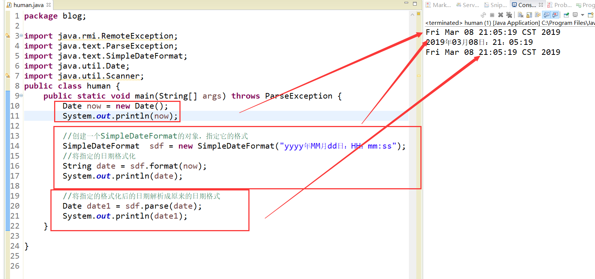

>②Calendar类
```java
Calendar  c = Calendar.getInstance();
System.out.println(c);
//获取年份
int year = c.get(Calendar.YEAR);
//获取月份，由于月份是从0开始计算的，所以+1
int month = c.get(Calendar.MONTH)+1;
//获取天数
int day = c.get(Calendar.DAY_OF_MONTH);
//获取小时
int hour = c.get(Calendar.HOUR);
//获取分钟数
int minute = c.get(Calendar.MINUTE);
//获取秒数
int second = c.get(Calendar.SECOND);

//把Calendar类型转换成Date类型
Date date = c.getTime();

//把Date类型转换成Calendar类型
c.setTime(date);

//Date类型是标准的时间
SimpleDateFormat  sfd = new SimpleDateFormat("yyyy年MM月dd日：HH时mm分ss秒");
String dates = sfd.format(date);
System.out.println("Date类的打印现在时间： "+dates);
//而由上面的get 到的都是一般的十二进制的数，不是标准的时间输出
System.out.println("Calendar类的打印现在时间： "+year+"年"+month+"月"+day+"日"+hour+"时"+minute+"分"+second+"秒");
```
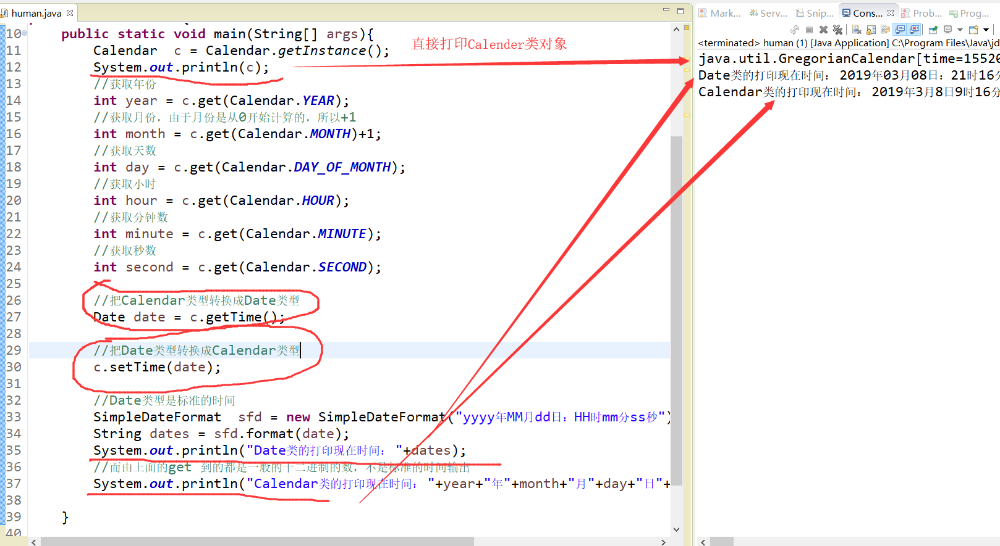

---

## 6.集合

>==集合：一些可以存储任意类型的对象，并且长度可变的类。==

<font color="red">

集合按照存储结构分为单列集合与双列集合
1. 单列集合是按照线性列表的方式存储元素，其根接口是Collection.
2. 双列集合是按照键值对的方式存储元素，其根接口是Map.
</font>
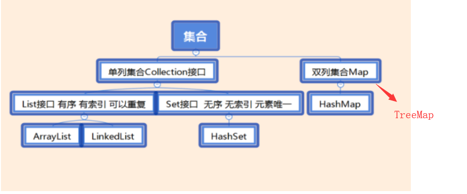

---

### 1.单列集合根接口-Collection接口

>Collection接口是单列集合类的根接口，其有两个重要的子接口，List和Set.
>List的存储的元素有序，可重复.
>Set的特点是存储的元素无序，不可重复.

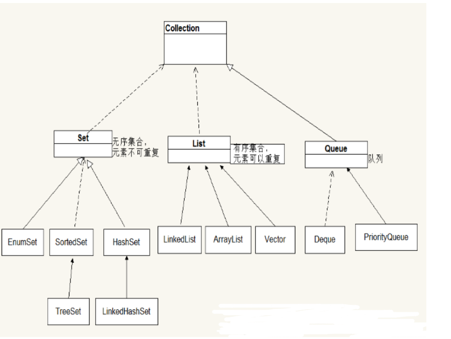

>Collection接口的常用方法：
<font color="red">Collection接口或其子接口的具体实现类也可以使用这些方法。</font>


方法 | 描述
------------ | -------------
boolean add(Object obj)  | 把元素obj加入到集合中
boolean addAll(Collection c)  | 把集合c的元素加入到集合中
void clear()  |  删除集合所有元素
Object remove(Object obj) | 删除集合的obj元素
Object removeAll(Collection c) | 删除集合c的所有元素
boolean isEmpty() | 判断集合是否为空
boolean contains(Object obj)  |  判断集合是否包含obj
Iterator iterator() | 返回该集合的迭代器，用来遍历该集合下的所有元素
int size()  |  获取该集合的元素个数


#### 1.List 接口

>List的存储的元素有序，可重复。List接口的主要实现类是 ArrayList,LinkedList.

List集合常用方法：
方法 | 描述
------------ | -------------
void add(int index,Object obj)  | 把元素obj加入到集合的index处
boolean addAll(int index,Collection c)  | 把集合c的元素加入到index处
Object get(int index) |  返回index处的元素
Object remove(int index) | 删除index处的元素
Object set(int index,Object obj) | 把index处的元素替换为obj对象，并把替换后的元素返回。
int indexOf(Object obj) | 返回obj对象在集合中的位置
int lastIndexOf(Object obj) | 返回obj对象在集合的最后一个的位置


##### 1.ArrayList集合---适合查找元素：

<font color="red">ArrayList是List接口的一个实现类。可以把其看成一个长度可变的数组对象。</font>

```java
ArrayList ar=new ArrayList();   //创建ArrayList集合
//向集合中添加元素
ar.add("xiaoming");
ar.add("xiaohua");
ar.add("xiaoqiang");
System.out.println("此时集合的长度 "+ar.size());
//索引从0开始
System.out.println("集合的第二个元素是："+ar.get(1));
```

##### 2.LinkedList集合---适合元素的增删改操作：

<font color="red">LinkedList是List接口的一个实现类。可以把其看成一个长度可变的双向循环链表。</font>

LinkedList集合中的方法
方法 | 描述
------------ | -------------
void add(int index,Object obj)  | 把元素obj加入到集合的index处
void addFirst(Object obj)  | 把obj元素插入到集合的开头
void addLast(Object obj)  | 把obj元素插入到集合的末尾
Object getFirst() |  返回集合开头的元素
Object getLast() |  返回集合末尾的元素
Object removeFirst() | 删除第一个元素，并把它返回
Object removeLast() | 删除最后一个元素，并把它返回

```java
LinkedList link=new LinkedList();   //创建linklist集合
link.add("xiao");
link.add("ming");
link.add("hua");
link.add("qiang");
//打印集合中的元素
System.out.println(link.toString());
```
>运行结果：[xiao, ming, hua, qiang]

---


#### 2.Set接口

>Set的特点是存储的元素无序,不可重复.Set接口的主要实现类是HashSet 和 TreeSet.
>1. HashSet是根据对象的哈希值来确定元素在集合的存储位置，有好的存取，查找性能。
>2. TreeSet是以二叉树的方式来存储元素,可以对集合的元素进行排序。


##### 1.HashSet集合
<font color="red">HashSet是Set接口的一个实现类。其根据对象的哈希值来确定元素在集合的存储位置，有好的存取，查找性能。允许包含值为null的元素，但最多只能一个</font>

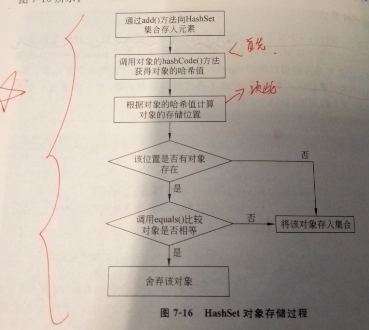

>HashSet集合不出现重复元素。主要是hashCode(),equals()方法的原因。
>==因此当HashSet集合存储对象类型的元素时，需要重写该对象的hashCode(),equals()方法。==

```java
public class human {
	private String name;
	private int age;
	
	human(String name,int age){
		this.name=name;
		this.age=age;
	}
	//重写toString方法
	public String toString() {
		return name+": "+age;
	}
	//重写hashCode方法
	public int hashCode() {
		return name.hashCode();
	}
	//重写equals方法
	public boolean equals(Object obj) {
		if (this == obj)
			return true;
		if (obj == null)
			return false;
		human other = (human) obj;
		if (name == null) {
			if (other.name != null)
				return false;
		} else if (!name.equals(other.name))
			return false;
		return true;
	}
	public static void main(String[] args) {
		HashSet hSet=new HashSet();
		hSet.add(new human("xiaoming",22));
		hSet.add(new human("xiaoqiang",23));
		hSet.add(new human("xiaohua",23));
		hSet.add(new human("xiaoqiang",23));
		hSet.add(new human("xiaoming",22));
		System.out.println(hSet);
	}
}
```

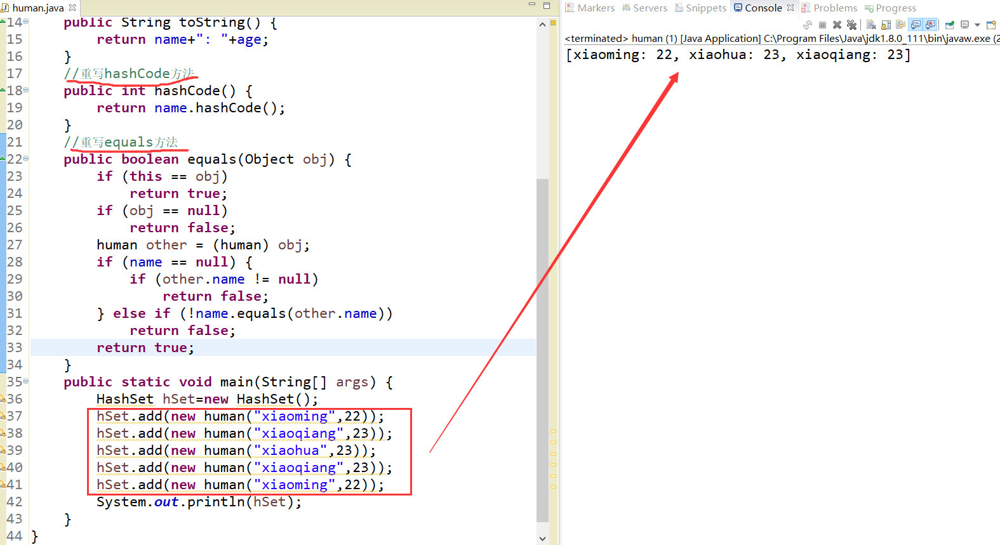

---

##### 2.TreeSet集合
<font color="red">TreeSet是以平衡的二叉排序树的方式来存储元素,可以对集合的元素进行排序。
存储的元素会按照从大小排序，并且去除重复元素。</font>

>==TreeSet集合在插入元素时，通过调用compareTo()方法，对集合中的元素进行比较，从而进行排序。因此，当TreeSet集合存储对象类型数据时，需要该对象实现Comparable接口，并重写compareTo()方法==

```java
//实现Comparable接口
public class human implements Comparable{
	private String name;
	private int age;
	
	human(String name,int age){
		this.name=name;
		this.age=age;
	}
	
	//重写该方法
	public String toString() {
		return name+"： "+age;
	}

	//重写Comparable接口的compareTo方法
	public int compareTo(Object o) {
		human h=(human)o;     //强制转换为human类型
		if(this.age==h.age) {    
			return 0;     //表示相等
		}else if(this.age>h.age){
			return 1;    //从小到大，升序排序
		}else {
			return -1;
		}
	}
	
	public static void main(String[] args) {
		TreeSet tSet=new TreeSet();
		tSet.add(new human("xiaoming",22));
		tSet.add(new human("xiaoqiang",24));
		tSet.add(new human("xiaohua",23));
		tSet.add(new human("xiaohua",23));
		System.out.println(tSet);
	}
}

```

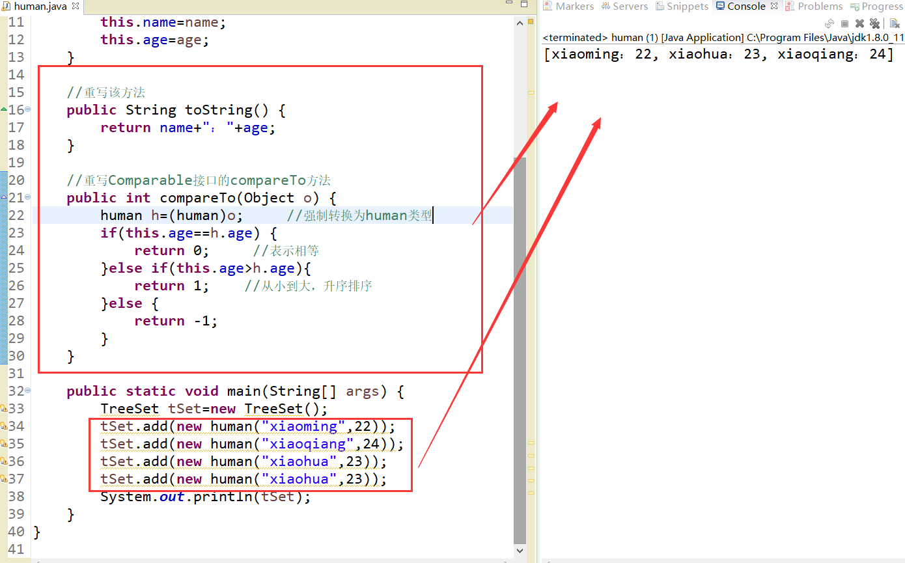

---

### 2.双列集合根接口-Map接口

>==Map接口是双列集合根接口,用键值对方式来存储元素，其有两个重要实现类，HashMap,TreeMap.==

>Map接口接口的常用方法：
<font color="red">Map接口的具体实现类也可以使用这些方法。</font>

方法 | 描述
------------ | -------------
void put(Object key,Object value)| 把元素的键值对加入到集合中
Object get(Object key)| 通过元素的键，把元素取出来
boolean containsKey(Object key) | 根据key判断元素是否在集合中
boolean containsValue(Object value)  |  根据value判断元素是否在集合中
Set keySet() | 返回集合中所有的key
Collection<V> values()  |  返回集合中所有的value
Set<Map.Entry<K,V>> entrySet()  |  以(key,value)的形式，返回集合所有元素
 


#### 1.HashMap集合

>用于存储键值对关系，且保证没有重复的key值。

==遍历HashMap集合元素的两种方式：①先遍历集合中的所有key,再根据key来获取value。②先获取集合中的映射关系，再根据关系取出key和value。==

```java
public static void main(String[] args) {
	HashMap hm=new HashMap ();
        hm.put(1, "小明");
        hm.put(2, "小华");
        hm.put(3, "小强");
        
        System.out.println(hm);
        
        //遍历HashMap集合的方式1：
        //先获取集合的所有key序列
        //再根据key序列找到value，用迭代器进行遍历
        Set ks=hm.keySet();
        Iterator ite=ks.iterator();    		
        while(ite.hasNext())  //判断该对象是否有下一个元素
        {	  
        	Object key=ite.next();   //获得一个key值
        	Object value=hm.get(key); //根据key序列找到value
        	System.out.println(key+":"+value);  
        }
        
        System.out.println("-------------");
        
        //遍历HashMap集合的方式2：
        //先获取集合中所有的映射关系
        //再从映射关系中取出key,value
        Set entryset=hm.entrySet();
        Iterator ite2=entryset.iterator();
        while(ite2.hasNext())  //判断该对象是否有下一个元素
        {	
        	Map.Entry entry=(Map.Entry)(ite2.next());   //获取某一个映射关系
        	Object key=entry.getKey(); //根据映射关系找到key值
        	Object value=entry.getValue(); //找到value
        	System.out.println(key+":"+value);  
        }
	}

/*
运行结果：
{1=小明, 2=小华, 3=小强}
1:小明
2:小华
3:小强
-------------
1:小明
2:小华
3:小强

*/
```
---

#### 2.TreeMap集合

>TreeMap是通过二叉树的原理来保证键的唯一性。

>TreeMap 要注意的事项：
　　1. 往TreeMap添加元素的时候，如果元素的键具备自然顺序，那么就会进行排序存储。
　　2. 往TreeMap添加元素的时候，如果元素的键不具备自然顺序特性， 那么键所属的类必须要实现Comparable接口，把键的比较规则定义在CompareTo方法上。
　　3. 往TreeMap添加元素的时候，如果元素的键不具备自然顺序特性，而且键所属的类也没有实现Comparable接口，那么就必须自定义比较器。

==通过自定义比较器对所有的键进行排序==

```java
//实现Comparator接口,重写compare方法
public class human implements Comparator{
	private String name;
	private int age;
	
	human(String name,int age){
		this.name=name;
		this.age=age;
	}
	//重写该方法
	public String toString() {
		return name+":"+age;
	}
	//重写该方法
	public int compare(Object o1, Object o2) {
		human h1=(human)o1;
		human h2=(human)o2;
		if(h1.age==h2.age) {    
			return 0;     //表示相等
		}else if(h1.age>h2.age){
			return 1;    //从小到大，升序排序
		}else {
			return -1;
		}
	}
	public static void main(String[] args) {
		human h1=new human("小明", 22);
		human h2=new human("小华", 19);
		human h3=new human("小强", 26);
		
		TreeMap tMap=new TreeMap();
		tMap.put(12, h1);
		tMap.put(2, h2);
		tMap.put(3, h3);
		
		Set ks=tMap.keySet();
        Iterator ite=ks.iterator();    		
        while(ite.hasNext())  //判断该对象是否有下一个元素
        {	  
        	Object key=ite.next();   //获得一个key值
        	Object value=tMap.get(key); //根据key序列找到value
        	System.out.println(key+":"+value);  
        }
	}
}

/*
运行结果：
2:小华:19
3:小强:26
12:小明:22
*/
```

---

### 3.Iterator 接口---主要用于迭代Collection单列集合中的元素

```java
ArrayList list=new ArrayList();
list.add("Hello");
list.add("World");
list.add("HAHAHAHA");

//使用迭代器进行相关遍历,先获取该集合的迭代对象
Iterator ite=list.iterator();    		
while(ite.hasNext())  //判断该对象是否有下一个元素
{
	//使用迭代器本身的删除方法
	if("tom".equals(ite.next())){
		it.remove();
	}
	System.out.println(ite.next());  //ite.next()取出集合中的元素
}
```
<font color="red">

注意：
1.通过迭代器遍历的元素，会把这些元素当作Object类型对待，若想得到特定类型的元素，需要进行强制类型转换。
2.在对集合元素进行迭代时，若在该过程中删除其中一个元素，迭代器对象会抛出一个异常。可以使用迭代器本身的删除方法remove(),来解决。
</font>

---

### 4.ListIterator 接口---Iterator接口的子类

>ListIterator迭代器在Iterator迭代器上添加一些特有的方法.

方法 | 描述
----- | -----
void add(Object o)  | 把元素o插入到集合中
boolean hasPrevious()  | 用于逆序遍历时，判断集合是否有上一个元素
Object previous()  |  用于逆序遍历时，遍历集合的上一个元素
void remove()  |  删除有next(),previous()方法返回的最后一个元素 

```java
ArrayList list = new ArrayList();
list.add("Hello");
list.add("World");
list.add("HAHAHAHA");

// 使用ListIterator迭代器进行相关遍历,先获取该集合的迭代对象
ListIterator it = list.listIterator();
while (it.hasNext()) {
	String str = (String) it.next();
	if ("Hello".equals(str)) {
		it.add("aaa");
	}
}
System.out.println(list);
```

---

### 5.泛型---用于规定参数类型：

>当把元素存入到集合中时，集合会转换Object类型。同样从集合中取出元素时，该元素类型会变为Object类型。
>==泛型可以指定集合存入取出的参数数据类型==
```java
ArrayList<String> al=new ArrayList<String>();   //指定该集合只能存取String类型的参数元素。
ArrayList<Human> al=new ArrayList<Human>();   //指定该集合只能存取Human对象类型的参数元素。
```

<font color="red">
使用泛型后，每次遍历集合元素不用把Object类型强制转换为其他类型。
</font>

<h4>自定义泛型：</h4>

>自定义泛型的作用是用来规定一个==类, 接口或方法所能接受的参数数据的类型==。

```java
//自定义泛型类 human，T为参数数据类型
public class human<T>{  
	private T temp;   
	public void save(T temp) {
		this.temp=temp;
	}
	public T get() {
		return temp;
	}
	
	public static void main(String[] args) {
		//这里可以随机定humanl类的参数数据类型
		human<Integer> h=new human<Integer>(); //定义human类的参数数据类型为Integer
		h.save(new Integer(3));
		Integer a=h.get();
		System.out.println(a);
	}
}
```

---


## 7. IO(输入输出)

>==程序从输入流中读取数据，向输出流中写入数据。==
>IO流分为字节流，字符流。
>字节流用java.io.InputStream 和 java.io.OutputStream 表示输入输出流。
>字符流用java.io.Reader 和 java.io.Writer 表示输入输出流。


### 1.字节流

>java中字节流的最顶级的两个抽象类为InputStream 和 OutputStream

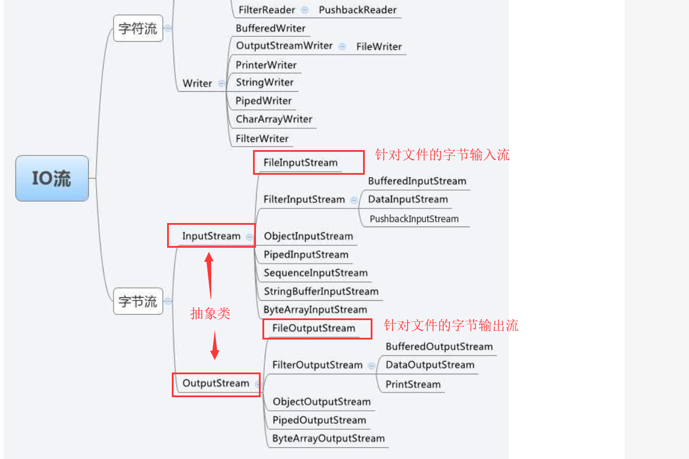


#### 1.抽象类InputStream，OutputStream


>InputStream的常用方法

方法 | 描述
----- |  -----
int read() | 读取一个字节，把它转换为0~255的整数，并返回该整数。
int read(byte[] b)  |  读取字节，并保存到字节数组b中，返回读取的字节数
int read(byte[] b,int off,int len) | 读取字节，并保存到b字符数组中，其中off为数组的开始下标，len为读取的字节数
void close() | 关闭输入流
 

>OutputStream的常用方法

方法 | 描述
----- |  -----
void writer(int b) | 向输出流写入一个字节b
void writer(byte[] b)  |  把字节数组写入到输出流中
void writer(byte[] b,int off,int len) | 把数组中从off下标开始的字节写入len个长度到输出流中。
void flush() | 刷新输出流
void close() | 关闭输出流

#### 2.字节流读写文件---FileInputStream和FileOutputStream

>Java提供FileInputStream 和 FileOutputStream来读写文件数据。
>==FileInputStream 和 FileOutputStream 分别是InputStream，OutputStream的实现类。==

```java
public class human{  
	public static void main(String[] args) throws Exception {
		//父类引用指向子类对象，创建文件字节输入流
		FileInputStream f = new FileInputStream("C:\\Users\\Desktop\\a.txt");
		int b=0;   //记住每次读取的一个字节
		while(true) {
			b=f.read();   //记住每次读取的一个字节
			if(b==-1) {
				break;
			}
			System.out.println(b);
		}
		f.close();  //关闭输入流
	}
}

/*
运行结果：（文件内容:this is a.txt）
116
104
105
115
32
105
115
32
97
46
116
120
116
13
10
*/

----------------------------

public static void main(String[] args) throws Exception {
	//创建文件字节输出流，用于写入数据到文件中
	FileOutputStream os = new FileOutputStream("C:\\Users\\Desktop\\a.txt");
	String str="hello world";
	byte[] b=str.getBytes();   //把字符串转换为字符数组
	for(int i=0;i<b.length;i++) {
		os.write(b[i]);   //把字符数组的数据写入到文件中
	}
	os.close(); 
}
/*
运行结果：hello world
*/
```

<font color="red">
通过FileOutputStream写入数据到文件：

1.步骤把原先文件内容清空，再写入数据。
2.如果文件不存在，会创建一个新的文件，再写入数据。 
</font>


<h4>如何写入数据时，原先的数据不会被清空？</h4>

>使用FileOutputStream的构造函数FileOutputStream(String fname,boolean append)，把append设置为true时，写入数据时，原先数据不会被清空。
```java
FileOutputStream os = new FileOutputStream("C:\\Users\\Desktop\\a.txt",true);
```

#### 3.文件拷贝

```java
public static void main(String[] args) throws Exception {
	//输入流读取文件数据
	FileInputStream fin=new FileInputStream("C:\\Users\\Desktop\\a.txt");
	//输出流写入数据到b文件
	FileOutputStream os = new FileOutputStream("C:\\Users\\Desktop\\b.txt");
	int t=0;   //存储读取的一个字节
	while(true) {
		t=fin.read();
		if(t==-1) {   //-1表示读取数据完毕
			break;
		}
		os.write(t);    //把从文件a读取的数据，写入到文件b中
	}
	
	fin.close();
	os.close(); 
	}
```


#### 4.字节流缓冲区

>通过定义一个字节数组作为缓冲区，来提高字节流读取写入的效率。
>例：通过缓冲区来拷贝文件：

```java
public static void main(String[] args) throws Exception {
	//输入流读取文件数据
	FileInputStream fin=new FileInputStream("C:\\Users\\Desktop\\a.txt");
	//输出流写入数据到b文件
	FileOutputStream os = new FileOutputStream("C:\\Users\\Desktop\\b.txt");
	byte[] b=new byte[1024];  //定义字节数组作为缓冲区
	int t;   //临时存储一个字节
	while(true) {
		t=fin.read(b);
		if(t==-1) {   //-1表示读取数据完毕
			break;
		}
		os.write(b);   //把缓冲区的数据写入到文件b中
	}
	
	fin.close();
	os.close(); 
	}
```

#### 5.字节缓冲流---BufferedInputStream , BufferedOutputStream 

>这两个流在读写数据时提供缓冲功能。
>==BufferedInputStream的实例化需要FileInputStream的对象==
>==BufferedOutputStream的实例化需要FileOutputStream的对象==

```java
public static void main(String[] args) throws Exception {
	FileInputStream fin=new FileInputStream("C:\\Users\\Desktop\\a.txt");
	BufferedInputStream bs=new BufferedInputStream(fin);

	FileOutputStream os = new FileOutputStream("C:\\Users\\Desktop\\b.txt");
	BufferedOutputStream bo=new BufferedOutputStream(os);

	int t;   //临时存储一个字节
	while(true) {
		t=bs.read();
		if(t==-1) {   //-1表示读取数据完毕
			break;
		}
		bo.write(t);   //把缓冲区的数据写入到文件b中
	}

	bs.close();
	bo.close(); 
	}
```

---


### 2.字符流

>字符流有两个顶级抽象类Reader,Writer.

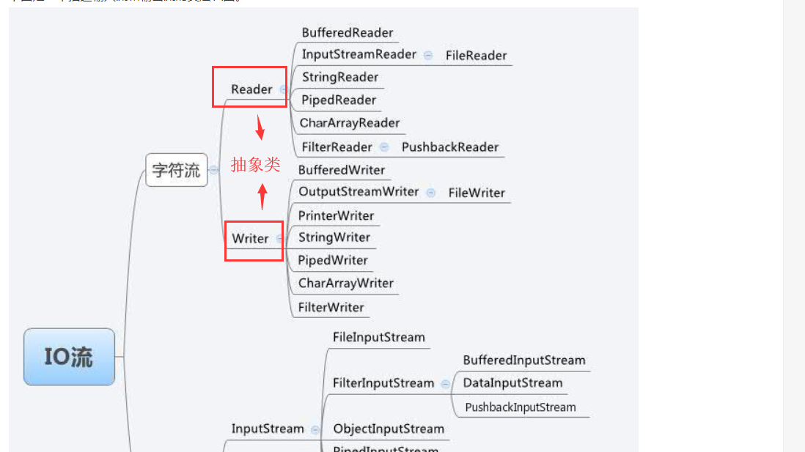


#### 1.字符流读写文件---FileReader,FileWriter

```java
public static void main(String[] args) throws Exception {
	FileReader fr=new FileReader("C:\\Users\\Desktop\\a.txt");
	int t;   //存储一个字符
	while(true) {
		t=fr.read();  
		if(t==-1) {
			break;
		}
		System.out.println((char)t);  //强制转换为字符
	}
	fr.close();
	
}

//--------------------

public static void main(String[] args) throws Exception {
	FileWriter fw=new FileWriter("C:\\Users\\Desktop\\a.txt");
	String str="good bybe";
	fw.write(str);     //把字符串写入文件a中
	fw.close();
}

```

<font color="red">FileWriter会把文件原先的数据清空，在写入数据。</font>
>若向写入数据时，原先数据不被清空，则：
```java
FileWriter fw=new FileWriter("C:\\Users\\Desktop\\a.txt",true);
```

#### 2.字符缓冲流---BufferedReader , BufferedWriter 

>这两个流在读写数据时提供缓冲功能。
>==BufferedReader的实例化需要FileReader的对象==
>==BufferedWriter的实例化需要FileWriter的对象==

>例：拷贝文件
```java
public static void main(String[] args) throws Exception {
	FileReader fr=new FileReader("C:\\Users\\束永祥\\Desktop\\a.txt");
	BufferedReader br=new BufferedReader(fr);

	FileWriter fw = new FileWriter("C:\\Users\\束永祥\\Desktop\\b.txt");
	BufferedWriter bw=new BufferedWriter(fw);

	String str;
	while(true) {
		str=br.readLine();   //每次读取一行数据
		if(str==null) {   //null表示读取数据完毕
			break;
		}
		bw.write(str);   //把缓冲区的数据写入到文件b中
	}
	br.close();
	bw.close(); 
}
```


---

## 8.File类

>java提供File类用于操作文件。

File类的构造方法：
方法 | 描述
----- | -----
File(String pathname) | 通过路径名来创建一个File对象
File(String parent,String child) | 通过父路径，子路径创建一个File对象
File(File parent,String child) | 根据父文件与子路径来创建File对象

```java
public static void main(String[] args) throws Exception {
	//根据路径创建文件的实例化对象
	File file=new File("C:\\Users\\束永祥\\Desktop\\a.txt");
	System.out.println("文件名称 ："+file.getName());
	System.out.println("文件的相对路径："+file.getPath());
	System.out.println("文件的绝对路径："+file.getAbsolutePath());
	System.out.println("判断是否是一个文件："+file.isFile());
	System.out.println("判断是否是一个目录："+file.isDirectory());
	System.out.println("删除文件："+file.delete());
}
```
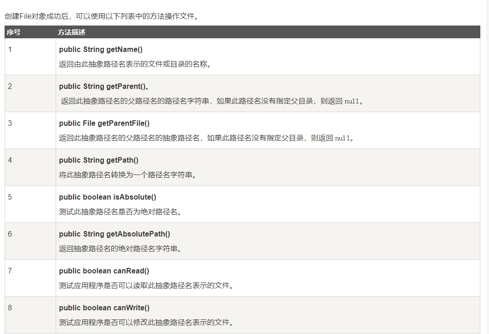
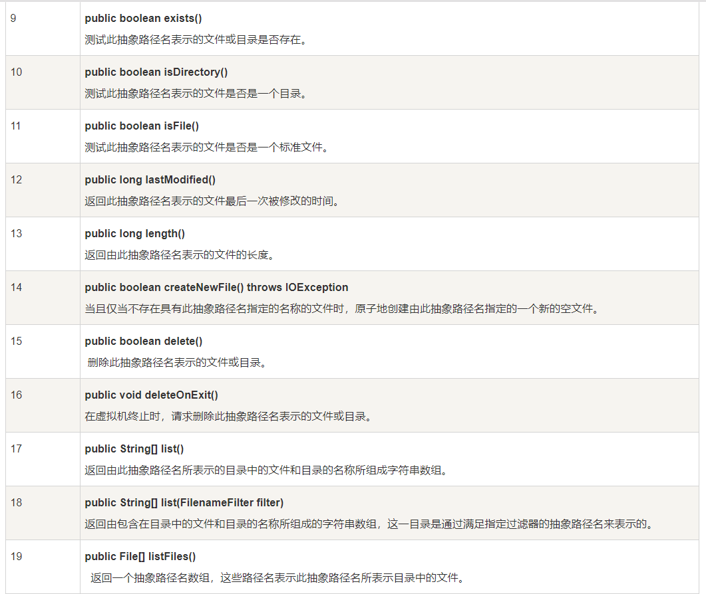
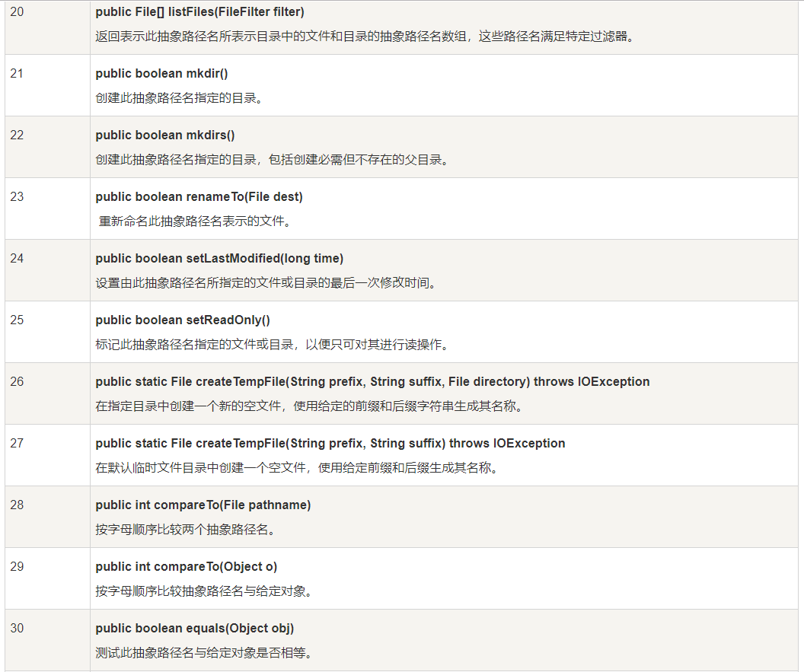


<h4>①遍历目录下的第一层文件（若目录有文件，则无法遍历）：</h4>
```java
public static void main(String[] args) throws Exception {
		//根据路径创建实例化对象
		File file=new File("D:\\study");
		//判断是否是一个目录
		if(file.isDirectory()) {
			String[] str=file.list();//获得该目录下的所有文件名
			for(String s:str) {
				System.out.println(s);
			}
			
		}
}
```


<h4>①遍历目录下的所有文件（包括子目录中的文件）：</h4>
```java
public static void main(String[] args) throws Exception {
		//根据路径创建实例化对象
		File file=new File("D:\\study");
		//判断是否是一个目录
		if(file.isDirectory()) {
			File[] f=file.listFiles();  //获取目录下的所有文件与子目录
			for(File fo:f) {
				System.out.println(fo);
				//对每一个文件对象再次遍历
				if(fo.isDirectory()) {
					String[] str=fo.list();  //获取目录下的所有文件名
					for(String s:str) {
						System.out.println(s);
					}
				}
			}
		}
	}
```
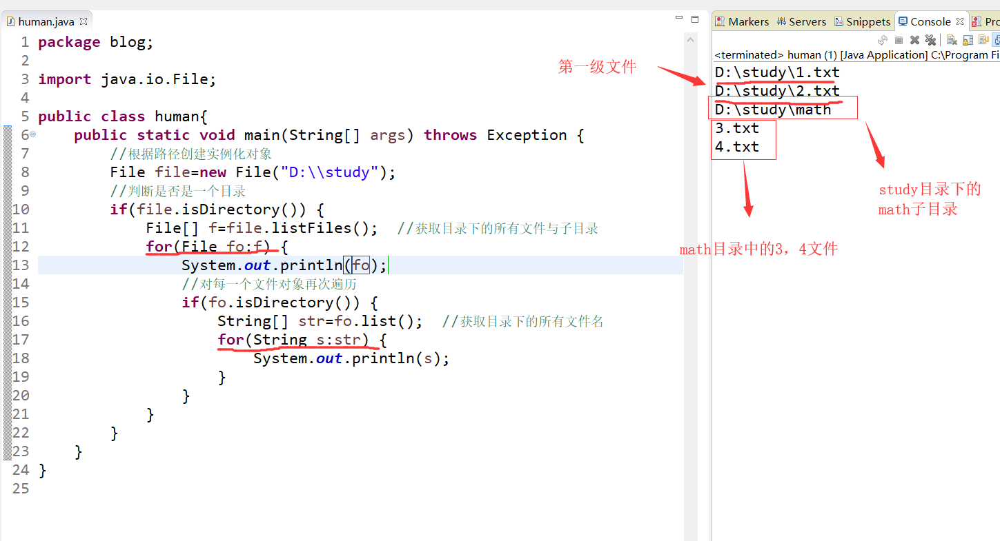
