[toc]
# javaweb

## 概述：
&emsp;&emsp;Java Web，是用Java技术来解决相关web互联网领域的技术总和。web包括：web服务器和web客户端两部分。Java在客户端的应用有java applet，不过使用得很少，Java在服务器端的应用非常的丰富，比如Servlet，JSP和第三方框架等等。Java技术对Web领域的发展注入了强大的动力。

&emsp;&emsp;Java的Web框架虽然各不相同，但基本也都是遵循特定的路数的：<font color="red">使用Servlet或者Filter拦截请求，使用MVC的思想设计架构，使用约定，XML或 Annotation实现配置，运用Java面向对象的特点，面向对象实现请求和响应的流程，</font>支持Jsp，Freemarker，Velocity等视图。


## javaBean

&emsp;&emsp;javabean是一种带有特定写法的java类。
具有一些规范：
①：公共无参构造方法
②: 私有类型属性
③：公共类型属性的getter / setter 方法
④：Javabean应该直接或间接实现 java.io.Serializable 接口，以支持序列化接口。

<font color="red">建议javabean 属性的命名 使用驼峰命名法。</font>

<font color="blue">驼峰命名法：</font>
&emsp;&emsp;**第一个单词首字母小写，之后每个单词的首字母大写。例如：userName,myFirstName 等**


## jsp

### 1.概述：
&emsp;&emsp;JSP全名为Java Server Pages，中文名叫java服务器页面，其根本是一个简化的Servlet设计.<font color="blue">它是一种动态网页技术标准</font>。JSP技术有点类似ASP技术，<font color="red">它是在传统的网页HTML文件中插入Java程序段和JSP标记(tag)，从而形成JSP文件，后缀名为(*.jsp)。</font>
1. 它使用JSP标签在HTML网页中插入Java代码。标签通常以<%开头以%>结束。
2. JSP通过网页表单获取用户输入数据、访问数据库及其他数据源，然后动态地创建网页。
3. JSP标签有多种功能，比如访问数据库、记录用户选择信息、访问JavaBeans组件等，还可以在不同的网页中传递控制信息和共享信息。

### 2.jsp原理及使用：

#### 1.jsp容器：
&emsp;&emsp;网络服务器需要一个JSP引擎，也就是一个容器来处理JSP页面。容器负责截获对JSP页面的请求。

本教程使用<font color="red">内嵌JSP容器的Apache</font>来支持JSP开发。
JSP容器与Web服务器协同合作，为JSP的正常运行提供必要的运行环境和其他服务，并且能够正确识别专属于JSP网页的特殊元素。

下图显示了JSP容器和JSP文件在Web应用中所处的位置。

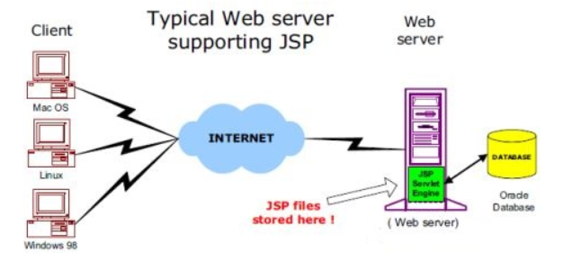

#### 2.jsp的处理：
以下步骤表明了Web服务器是如何使用JSP来创建网页的：
1. 就像其他普通的网页一样，您的浏览器发送一个HTTP请求给服务器。
2. Web服务器识别出这是一个对JSP网页的请求，并且将该请求传递给内部的JSP引擎。通过使用URL或者.jsp文件来完成。
3. JSP引擎从磁盘中载入JSP文件，然后将它们<font color="red">转化为servlet。这种转化只是简单地将所有模板文本改用println()语句，并且将所有的JSP元素转化成Java代码。</font>
4. JSP引擎将servlet编译成可执行类，并且将原始请求传递给servlet引擎。
5. Web服务器的某组件将会调用servlet引擎，然后载入并执行servlet类。在执行过程中，servlet产生HTML格式的输出并将其内嵌于HTTP response中上交给Web服务器。
6. <font color="red">Web服务器以静态HTML网页的形式将HTTP response返回到您的浏览器中。</font>
7. 最终，Web浏览器处理HTTP response中动态产生的HTML网页，就好像在处理静态网页一样。

以上提及到的步骤可以用下图来表示：

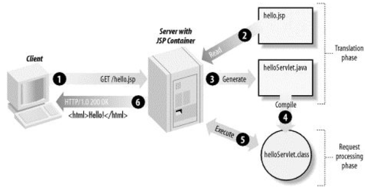


#### 3.jsp生命周期：
JSP生命周期就是从创建到销毁的整个过程，类似于servlet生命周期，区别在于JSP生命周期还包括将JSP文件编译成servlet。

以下是JSP生命周期中所走过的几个阶段：
1. 编译阶段：
servlet容器编译servlet源文件，生成servlet类
2. 初始化阶段：
加载与JSP对应的servlet类，创建其实例，并调用它的初始化方法
3. 执行阶段：
调用与JSP对应的servlet实例的服务方法
4. 销毁阶段：
调用与JSP对应的servlet实例的销毁方法，然后销毁servlet实例.

**JSP初始化：**

容器载入JSP文件后，它会在为请求提供任何服务前调用jspInit()方法。如果您需要执行自定义的JSP初始化任务，复写jspInit()方法就行了，就像下面这样：
```java
public void jspInit(){
  // 初始化代码
}
```
<font color="red">通常情况下您可以在jspInit()方法中初始化数据库连接、打开文件和查询数据表。</font>

**JSP销毁：**

JSP生命周期的销毁阶段描述了当一个JSP网页从容器中被移除时所发生的一切。
jspDestroy()方法在JSP中等价于servlet中的销毁方法。当您需要执行任何清理工作时复写jspDestroy()方法，比如释放数据库连接或者关闭文件夹等等。
jspDestroy()方法：
```java
public void jspDestroy()
{
   // 清理代码
}
```

#### 4.jsp的简单使用：

1. 安装Tomcat 服务器（jsp 引擎/jsp 容器）并配置：
详细过程自己百度。
<br/>
2. 把eclipse 与 tomcat 关联。
<br/>
3. 在eclipse中创建动态web 项目工程("File-->New-->Dynamic Web Project")，并选择运行环境为之前安装的tomcat 服务器 与 JDK。
<font color="red">注意:在下一步中勾选生成 web.xml 文件.</font>
详细过程自己百度。
<br/>
4. 工程目录(**使用的eclipse 的 氧气 版本,不同版本的工程目录可能有所差别**)：


上图中各个目录解析：
deployment descriptor：部署的描述。
lib：**自己需要的jar包可以放在里面，eclipse会自动加入到类路径。**
build：放入编译之后的文件。
WebContent:放进写入的jsp页面。


5. 在jsp页面写上html 标签
```jsp
<%@ page language="java" contentType="text/html; charset=UTF-8"
    pageEncoding="UTF-8"%>
<!DOCTYPE html PUBLIC "-//W3C//DTD HTML 4.01 Transitional//EN" "http://www.w3.org/TR/html4/loose.dtd">
<html>
<head>
<meta http-equiv="Content-Type" content="text/html; charset=UTF-8">
<title>Insert title here</title>
</head>
<body>
	<h2>this is  h2 title</h2>
	<span style="color:red">this is red code</span>
</body>
</html>
```

6. 启动tomcat 服务器，在浏览器 输入网址：http://localhost:8080/ 项目工程名 / jsp页面名称.jsp 。
<br/>
7. 效果图：
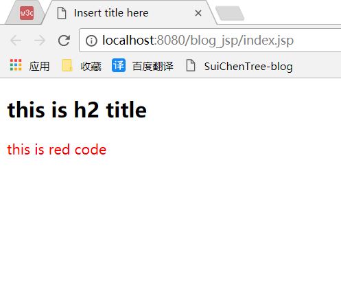


### 3.jsp的基本语法：

#### 1.嵌入Java代码（脚本代码）：
在jsp页面可以嵌入Java的代码段来完成业务处理。
语法格式：
`<% 编写Java代码 %>`

1. 打印九九乘法表：
```jsp
<body>
  <%
  	for(int i=0;i<10;i++){
  		for(int j=0;j<=i;j++){
  			String s=j+" * "+i+" = "+i*j;
  			out.print(s+"    ");    //每个式子有空格
  		}
  		out.print("<br/>");
  	}
  
  %>
</body> 
```
结果：
0 * 0 = 0 
0 * 1 = 0 1 * 1 = 1 
0 * 2 = 0 1 * 2 = 2 2 * 2 = 4 
0 * 3 = 0 1 * 3 = 3 2 * 3 = 6 3 * 3 = 9 
0 * 4 = 0 1 * 4 = 4 2 * 4 = 8 3 * 4 = 12 4 * 4 = 16 
0 * 5 = 0 1 * 5 = 5 2 * 5 = 10 3 * 5 = 15 4 * 5 = 20 5 * 5 = 25 
0 * 6 = 0 1 * 6 = 6 2 * 6 = 12 3 * 6 = 18 4 * 6 = 24 5 * 6 = 30 6 * 6 = 36 
0 * 7 = 0 1 * 7 = 7 2 * 7 = 14 3 * 7 = 21 4 * 7 = 28 5 * 7 = 35 6 * 7 = 42 7 * 7 = 49 
0 * 8 = 0 1 * 8 = 8 2 * 8 = 16 3 * 8 = 24 4 * 8 = 32 5 * 8 = 40 6 * 8 = 48 7 * 8 = 56 8 * 8 = 64 
0 * 9 = 0 1 * 9 = 9 2 * 9 = 18 3 * 9 = 27 4 * 9 = 36 5 * 9 = 45 6 * 9 = 54 7 * 9 = 63 8 * 9 = 72 9 * 9 = 81 


2. 判断语句：
```
<%!int day = 3;%>
	
  <%
  if (day == 1 | day == 7) {
	%>
	
  <p>Today is weekend</p>
	
  <%
	} else {
	%>
	
  <p>Today is not weekend</p>
	
  <%
		}
	%>
```

3. switch…case块:
```jsp
<%  
switch(day) { 
case 0:    
  out.println("It\'s Sunday.");    
  break; 
case 1:    
  out.println("It\'s Monday.");    
  break; 
case 2:    
  out.println("It\'s Tuesday.");    
  break; 
case 3:    
  out.println("It\'s Wednesday.");    
  break; 
case 4:    
  out.println("It\'s Thursday.");    
  break; 
case 5:    
  out.println("It\'s Friday.");    
  break; 
default:    
  out.println("It's Saturday."); 
} 
%>
```


#### 2.jsp表达式：
&emsp;&emsp;表达式元素中可以包含任何符合Java语言规范的表达式，但是不能使用分号来结束表达式。
&emsp;&emsp;**表达式中的内容先被转化成String，然后插入到表达式出现的地方。**
<font color="red">由于表达式的值会被转化成String，所以您可以在一个文本行中使用表达式而不用去管它是否是HTML标签。</font>

JSP表达式的语法格式：
<%= 表达式 %>

例子：
```jsp
<%@ page language="java" contentType="text/html; charset=UTF-8"
    pageEncoding="UTF-8"%>
<!DOCTYPE html PUBLIC "-//W3C//DTD HTML 4.01 Transitional//EN" "http://www.w3.org/TR/html4/loose.dtd">
<html>
<head>
<meta http-equiv="Content-Type" content="text/html; charset=UTF-8">
<title>Insert title here</title>
</head>
<body>
<p>   
  Today's date: <%= (new java.util.Date()).toLocaleString()%>
</p>
</body> 
</html>
```

运行后得到以下结果：
`Today's date: 2017-11-30 18:40:35`

#### 3.jsp注释：
JSP注释的语法格式：
```jsp
<%-- 这里可以填写 JSP 注释 --%>
```
<br/>

#### 4.jsp指令标签（注意：<%@ ~~ %>中@与%不能分离 ，属性值不能以';' 号结尾）：
JSP指令用来设置与整个JSP页面相关的属性。 
JSP指令语法格式：
```jsp
<%@ 指令名称 指令属性="value" %>
```

<font color="red">三种指令标签：</font>
<%@ page ... %>	: 定义页面的依赖属性，比如脚本语言、error页面、缓存需求等等
<%@ include ... %>	: 包含其他文件
<%@ taglib ... %>	: 引入标签库,jar包的定义，可以是自定义标签。

##### 1. page指令：

import 属性：	导入要使用的Java类.
` <%@ page import="java.util.*" %> `

contentType 属性 ：指定当前JSP页面的MIME类型和字符编码。
errorPage 属性：指定当JSP页面发生异常时需要转向的错误处理页面。
isErrorPage 属性：指定当前页面是否可以作为另一个JSP页面的错误处理页面.

language 属性：定义JSP页面所用的脚本语言，默认是Java。
session 属性：指定JSP页面是否使用session.
~ ~ ~

##### 2. Include指令
<font color="red">JSP可以通过include指令来包含其他文件。被包含的文件可以是JSP文件、HTML文件或文本文件.</font>包含的文件就好像是该JSP文件的一部分，会被同时编译执行。

Include指令的语法格式如下：
`<%@ include file="url" %>`


##### 3. Taglib指令
JSP API允许用户自定义标签，一个自定义标签库就是自定义标签的集合。
<font color="red">Taglib指令引入一个自定义标签集合的定义，包括库路径、自定义标签。</font>

Taglib指令的语法：
`<%@ taglib url="url" prefix="prefixOfTag" %>`
url属性确定标签库的位置，prefix属性指定被引用的标签库的使用前缀。

例子,引入 jstl 标签库：
`<%@ taglib prefix="c" uri="http://java.sun.com/jsp/jstl/core" %>`


#### 5.jsp动作标签(更多信息，自行百度)：
JSP动作标签在请求处理阶段起作用。JSP动作标签是用XML语法写成的。

语法：
`<jsp:标签名 属性名="value" />`

**常用的动作标签如下：**

jsp:include	：在页面被请求的时候引入一个文件。
jsp:useBean	：寻找或者实例化一个JavaBean。
jsp:setProperty	：设置JavaBean的属性。
jsp:getProperty	：输出某个JavaBean的属性。
jsp:forward	：把请求转到一个新的页面。

<font color="red">所有的动作要素都有两个属性：id属性和scope属性。</font>
①：id属性：
id属性是动作元素的唯一标识，可以在JSP页面中引用。动作元素创建的id值可以通过PageContext来调用。
②：scope属性：
该属性用于识别动作元素的生命周期。 id属性和scope属性有直接关系，scope属性定义了相关联id对象的寿命。 scope属性有四个可能的值： (1) page, (2)request, (3)session, 和 (4) application。


##### 1. &lt; jsp:include &gt;动作标签：
该动作标签用来包含静态和动态的文件。把指定文件插入正在生成的页面。语法格式如下：
`<jsp:include page="URL" flush="true" />`

main.jsp：
```jsp
<%-- flush	布尔属性，定义在包含目标资源前是否刷新缓存区。 --%>
<jsp:include page="date.jsp" flush="true" /> 
```

##### 2. &lt; jsp:useBean &gt;动作元素
用来装载一个将在JSP页面中使用的JavaBean。
这个功能非常有用，因为它使得我们既可以发挥Java组件重用的优势，同时也避免了损失JSP区别于Servlet的方便性。
jsp:useBean动作最简单的语法为：
```jsp
<%-- class	指定Bean的完整包名。 --%>
<jsp:useBean id="name" class="package.class" />

```

<font color="red">在类载入后，我们既可以通过 jsp:setProperty 和 jsp:getProperty 动作标签来修改和检索bean的属性。</font>


##### 3.  jsp:setProperty,  jsp:getProperty动作标签:
jsp:getProperty动作提取指定Bean属性的值，转换成字符串，然后输出。
jsp:setProperty用来设置已经实例化的Bean对象的属性.


例子如下：
```jsp
<%--  name	要检索的Bean属性名称。Bean必须已定义。。
      property	表示要提取Bean属性的值.
      class	指定Bean的完整包名。
 --%>

<jsp:useBean id="test" class="action.TestBean" />
 
<jsp:setProperty name="test" property="message"  value="Hello JSP..." />
 
<jsp:getProperty name="test" property="message" />
```

运行结果：
```
Hello JSP...
```

##### 4.&lt; jsp:forward &gt;动作元素
jsp:forward动作把请求转到另外的页面。jsp:forward标记只有一个属性page。
语法格式如下所示：
`<jsp:forward page="URL" />`


##### 5.&lt; jsp:param &gt;动作标签
用于其他标签的子标签，为其他标签传递参数。
```jsp
<%--
  name : 指定参数名称 。
  这段代码：在转发请求到addUser.jsp 页面的同时，传递参数 useName
--%>
<jsp:forward page="addUser.jsp">
  <jsp:param name="userName" value="xiaoming">
</jsp:forward>

```


#### 6.jsp九大内置对象：
<font color="red">在任何一个jsp 页面中，都包含了输出，请求，回应，应用上下文 ，异常处理 等一些概念</font>，jsp把这些具有公共特性的功能抽象，封装为一个个jsp的内置对象。

内置对象：是JSP容器为每个页面提供的Java对象，开发者可以直接使用它们而不用显式声明。

##### 1.out 输出对象：
在jsp的java代码段中。主要用于向客户端的浏览器输出信息。
```jsp
<%
out.print("i am jsp");
out.println("i am jsp");
%>

```


##### 2.request 请求对象
request对象是javax.servlet.http.HttpServletRequest 类的实例。

request对象提供了一系列方法来获取客户端请求的HTTP头信息，cookies，HTTP方法等等。

1. 获取请求参数：
&emsp;&emsp;在一次请求中，可以在URL上通过使用' ? ' 的方式来传递参数。后通过request 对象的getParameter() 方法获取参数的值。

```html
<a href="a.jsp?id=1">点击</a>
```
a.jsp :
```jsp
<%
String id=request.getParameter("id");
%>
<%-- 返回此request中id指定的参数的参数值，若不存在则返回null --%>
```


2. 获取form 表单的信息：
<font color="red">form表单的复选框，下拉列表框中被选定的值，要使用 request 对象的getParameterValues() 方法获取被选中参数的值。</font>其他表单组件可以用getParameter() 方法获取参数的值。
```html
<body>
<form action="main.jsp" method="POST" target="_blank">
<!--
  爱好复选框 
-->
<div>
<input type="checkbox" name="like" value="Maths"/> Maths
<input type="checkbox" name="like" value="Physics"/> Physics
<input type="checkbox" name="like" value="Chemistry"/> Chemistry
</div>

<input type="submit" value="提交" />

</form>
</body>

```

```jsp
<!--
  获取多个复选框的值。

-->
String[] like=request.getParameterValues("like");

```

3. 获取请求客户端的信息（**自行百度**）
<br/>
4. 在作用域中管理属性：
通过使用 <font color="red">setAttribute() </font>方法可以在 request 对象的属性列表中添加一个属性，然后在request 对象中的作用域中使用它。用 <font color="red">getAttribute() </font>方法将属性取出。用 <font color="red">removeAttribute() </font>方法把属性删除。

```jsp
<body>
<%
  request.setAttribute("time",new Date());  //在request对象中添加一个属性 time，属性值为当前系统时间。

%>

获取time 的属性值：<%=request.getAttribute("time") %>
<!--删除属性 time -->
<%
request.removeAttribute("time");
%>
再次获取time 的属性值：<%=request.getAttribute("time") %>
</body>
```

<font color="red">注意：设置的属性超出request作用域就失效。</font>


5. 解决中文乱码问题：
在通过request 对象请求参数时，若参数值为中文，则有可能 获取的参数值为乱码。

①：若在获取请求参数时乱码：
```jsp
String usrename=new String(request.getParameter("username").getBytes("iso-8859-1"),"UTF-8")
```

②：获取表单提交的数据为乱码：
设置jsp页面的编码格式为utf-8。
```jsp

<%
request.setCharacterEncoding("UTF-8");   //注意该方法，要在页面上没有调用任何request对象的方法中使用。
%>
```


##### 3.response 响应对象
<font color="red">用于响应客户请求，向客户端输出信息</font>


1. 重定向网页：
通过使用该对象的 sendRedirect() 方法，把原先的目标网页重定向到另一个网页。<font color="red">重定向可以把地址重新定向到不同的主机上，用户可以从浏览器上看到跳转后的地址。并且在重定向操作后，request 中的属性失效，并且进入一个新的request 对象。</font>

`response.sendRedirect("http://www.baidu.com");`
**URL可以是相对路径或绝对路径。**

<font color="red">在该方法后面，不要继续存在脚本代码。因为重定向后，进入另一个页面，原先页面的脚本代码没有用处，可能还会产生异常。</font>

2. 处理HTTP文件头信息：
setHeader(String headname,String value) 方法同过两个参数————头名称 和 参数值 来设置HTTP 文件头信息。
```jsp
<%

response.setHeader("refresh","5");  //设置网页每5秒刷新一次
response.setHeader("refresh","2;URL=aa.jsp");  //设置2秒后，自动跳转到 aa.jsp页面。

%>

```


3. 设置页面响应类型：
默认情况下，jsp页面的内容类型是 text/html,就是html或文本数据，此值不是固定的。
`response.setContentType("text/html");`

可选值有：text/html , application/x_msexcel , application/msword ,.....

<br/>


##### 4.session 会话对象（在同一个浏览器中共享数据）

**由于HTTP协议是一种无状态协议（客户发出请求，服务器接受请求并响应，一个流程就结束。）服务器无法一直保存请求响应信息。而session 对象用于保存该类信息。**

<font color="red">session 对象内部使用Map类来保存数据，数据格式为“ key / value”</font>.

1. 创建及获取session 信息：
setAttribute(String key,Object obj)方法：用于把信息保存到session 范围中。
getAttribute(String key)方法，用于获取session范围的信息。

```jsp
<%
String s="i am session";
session.setAttribute("ms",s);

out.println(session.getAttribute("ms"));
%>
```
2. 设置session的有效时间：

<font color="red">注意：如果客户端长期不向服务器发送请求，session对象会消失。session在服务器的默认存储时间为30 分钟。超过30分钟，session 存储的信息失效，此时调用getAttribute（） 方法，会产生异常。 </font>

`session.setMaxInactiveInterval(10000);`
可以通过手动设置session的有效时间。


3. 移除session中的对象，手动销毁session对象。

removeAttribute(String key) 方法 ： 移除存储在session的对象。

`session.removeAttribute("ms");   //若移除的session已经失效，报异常。`

invalidate()方法，删除session 对象。

`session.invalidate(); `   
<font color="red">若session对象 销毁后，在调用该session对象，则产生异常。</font>


##### 5.application对象（在同一个应用程序中共享数据）
&emsp;&emsp;application对象的信息保存在服务器中，直到服务器关闭，否则 application对象保存的信息都有效。与session 对象相比 application 对象生命期更长，相当于系统的 “全局变量”。

1. application 中数据的操作：
```jsp
<%
application.setAttribute(String name,Object obj);  //创建一个application 范围内有效的属性。

application.getAttribute(String name);  //获取application 对象中的某个属性。

application.getAttributeNames();    //获取application 对象的所有属性；

application.removeAttribute(String name);   //把某个属性从application对象中移除。

%>

```


2. 例子（实现网页计数的功能，记录网页的来访数量）
```jsp
<body>
<%

Integer a=(Integer)application.getAttribute("visitorCount"); //获取当前访客数量

if(a==null){       //如果当前访客数量为 null，表示为第一个访客
	a=1;
}else{
	a++;
}

application.setAttribute("visitorCount",a);   //把最新的访客数量 设为applciation对象的属性，使得页面共享这个数据

%>
<p>第<%=a %>位访客</p> 
</body>
```


##### 6.page对象
page对象代表jsp页面本身，只在jsp页面内有效。类似于Java类中的this关键字。

方法：
```jsp

<%
page.getClass();       //返回当前Object的类
page.hashCode();       //返回Object的哈希码；
page.toString();       //转换成字符串
page.equals(Object obj);    //比较
%>

```

##### 7.pageContent对象（很少使用）
pageContent对象的创建与初始化都有容器完成。可以通过该对象可以获得jsp 页面的其他内置对象。很少使用，因为通过pageContent对象调用其它对象很麻烦。

```jsp
<%
 pageContent.getRequest();  //获取request 对象
 pageContent.getsession();  //获取session对象
 ~ ~ ~


%>

```


##### 8.config 对象（获取web.xml 配置信息）
```jsp
<%
config.getServletName();   //它返回包含在<servlet-name>元素中servlet名字，
//注意，<servlet-name>元素在 WEB-INF\web.xml 文件中定义。

config.getInitParameter(); //获取服务器所有的初始参数名称

%>

```

##### 9.exception对象（获取异常信息）
exception对象 用来处理jsp 文件执行时发生的所有错误与异常，<font color="red">只有在page 指令中的 isErrorPage 属性值为 true 的jsp 页面中使用。</font>

运行流程：
**当jsp 页面出现没有捕获的异常时，jsp 会生成exception 对象，并把exception 对象传送到 page指令中设定的错误页面，然后在错误页面处理相应的exception 对象。**
```jsp
<%
exception.getMessage();   //返回exception对象的异常信息字符串

exception.getLocalizedmessage();  //返回本地化的异常错误

exception.toString();   //返回异常错误信息的描述

%>
```


##### 补充：
在超链接中传递多个参数值(使用‘ & ’)：
`<a href="user.jsp?userid=1&name=tom&age=12&gender=woman">超链接</a>`


### 4.jsp与javaBean的混合：
1. 实例化javabean对象：

```jsp

<jsp:useBean id="beanName" scope="作用域" class="bean的类路径" />
<!--
scope的取值：
    page:当前页面有效。
    request： 请求范围内有效。
    session： session范围内有效。
    application： 服务器内有效。

-->

```

2. 访问bean的属性：
使用jsp:getProperty 与 jsp:getProperty 标签。

```jsp
<jsp:useBean id="students" class="com.entity.StudentsBean"> 
<!--
  name属性: jsp:useBean标签的 id值。property属性：想要调用的getter或setter方法。
-->

   <jsp:setProperty name="students" property="firstName" value="Zara"/>
   <jsp:setProperty name="students" property="lastName"  value="Ali"/>
   <jsp:setProperty name="students" property="age"       value="10"/>
</jsp:useBean>

<!--
  name属性: jsp:useBean标签的 id值。property属性：想要调用的getter或setter方法。
-->
<p>Student First Name: 
   <jsp:getProperty name="students" property="firstName"/>
</p>
<p>Student Last Name: 
   <jsp:getProperty name="students" property="lastName"/>
</p>
<p>Student Age: 
   <jsp:getProperty name="students" property="age"/>
</p>
```


## Servlet（继承，实现了Servlet接口的，Java类）

### 1.概述：
<font color="red">Servlet 是运行在带有支持Servlet 规范的解释器的 web 服务器上的 Java 类，</font>是作为来自 Web 浏览器或其他 HTTP 客户端的请求和 HTTP 服务器上的数据库或应用程序之间的中间层。
**使用 Servlet，您可以收集来自网页表单的用户输入，呈现来自数据库或者其他源的记录，还可以动态创建网页。**

**注意：**<font color="blue">一个jsp文件最终将会转换为Servlet 后运行的。Web容器（Tomcat）最终运行的是一个Servlet文件，而不是 jsp文件。</font>

### 2. 原理与继承关系：
<font color="red">从http协议中的请求和响应可以得知，浏览器发出的请求是一个请求文本，而浏览器接收到的也应该是一个响应文本。并不知道是其中的内部细节。只知道浏览器发送过来的请求也就是request，我们响应回去的就用response。</font>


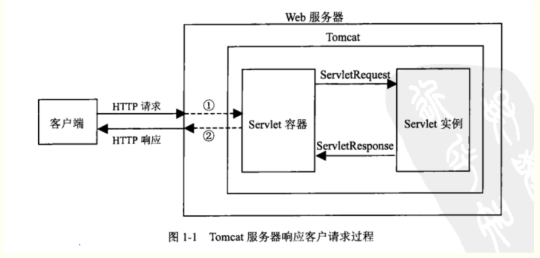

> ①：Tomcat将http请求文本接收并解析，然后封装成HttpServletRequest类型的request对象，所有的HTTP头数据读可以通过request对象调用对应的方法查询到。

> ②：Tomcat同时会要响应的信息封装为HttpServletResponse类型的response对象，通过设置response属性就可以控制要输出到浏览器的内容，然后将response交给tomcat，tomcat就会将其变成响应文本的格式发送给浏览器


> Java Servlet API 是Tomcat和servlet之间的接口，它定义了serlvet的各种方法，还定义了Servlet容器（==Tomcat==）传送给Servlet的对象类，其中最重要的就是==ServletRequest和ServletResponse==。所以说我们在编写servlet时，需要实现Servlet接口，按照其规范进行操作。


> <font color="red">通常情况下，编写一个Java类,继承HttpServlet类（实现的servlet接口），相当于把该java类与Tomcat（Servlet容器）进行了关联。</font>


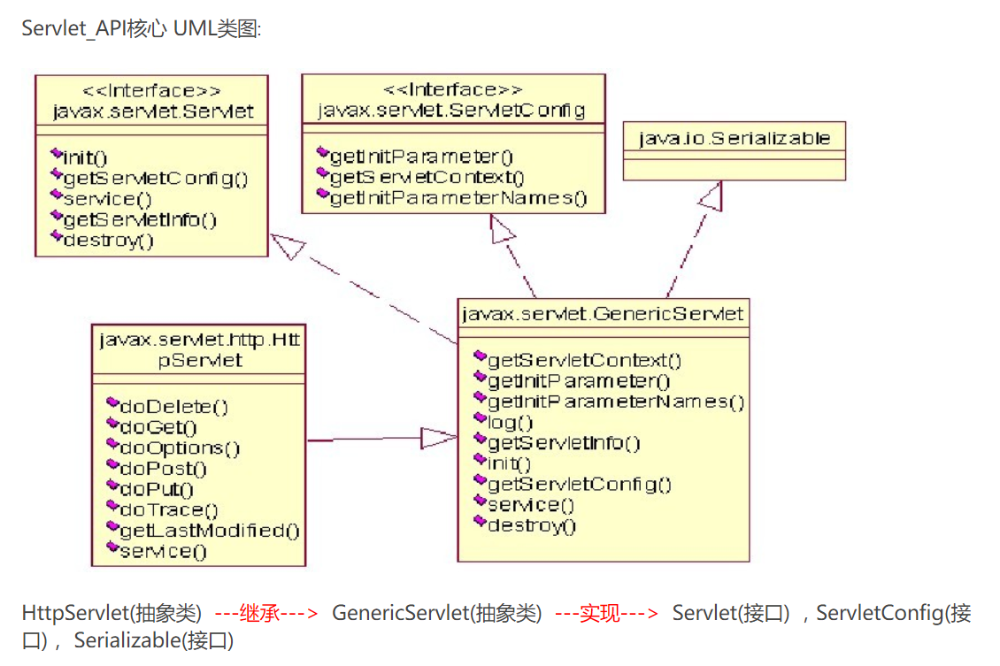


### 3.创建Servlet,与配置Servlet（把servlet对象注入到Servlet容器中）：

1. 创建Servlet（继承HttpServlet类，并重写该类的方法）：

```java
public class myservlet extends HttpServlet{

	@Override
	protected void doGet(HttpServletRequest request, HttpServletResponse response) throws ServletException, IOException {
		System.out.println("this is 重写HttpServlet的方法,  处理get类型的请求");
	}

	@Override
	protected void doPost(HttpServletRequest request, HttpServletResponse response) throws ServletException, IOException {
		System.out.println("this is 重写HttpServlet的方法， 处理post类型的请求");
	}

	@Override
	public void init() throws ServletException {
		System.out.println("this is 重写GenericServlet的方法，  Servlet对象的初始化方法");
	}

	@Override
	public void destroy() {
		System.out.println("this is 重写GenericServlet的方法 , Servlet对象的销毁方法");
	}
	
	
}
```


2. 配置Servlet(在web.xml文件):
<font color="red">配置Servlet，主要用于把创建的Servlet注入到Servlet容器（Tomcat）中。
让浏览器发出的请求知道到达哪个servlet，也就是让tomcat将封装好的request找到对应的servlet让其使用
</font>


web.xml
```xml
<!--
配置格式：
  <servlet>
  	<servlet-name> servlet的名称 </servlet-name>
  	<servlet-class> servlet的完整类名 </servlet-class>
  </servlet>
  
  <servlet-mapping>
  	<servlet-name> servlet的名称 </servlet-name>
  	<url-pattern>  访问的 url 的地址,浏览器通过它找到对应的servlet </url-pattern>
  </servlet-mapping>

-->

  <servlet>
  	<servlet-name>myservlet</servlet-name>
  	<servlet-class>com.servlet.myservlet</servlet-class>
  </servlet>
  
  <servlet-mapping>
  	<servlet-name>myservlet</servlet-name>
  	<url-pattern>/mys</url-pattern>
  </servlet-mapping>
```

**浏览器 调用servlet的步骤：**
&emsp;&emsp;①：首先浏览器通过http://localhost:8080/blog_jsp/mys来找到web.xml中的url-pattern。
&emsp;&emsp;②：匹配到了url-pattern后，就会找到servlet的名字myservlet，知道了名字，就可以通过servlet-name找到第三步。
&emsp;&emsp;③：到了第三步，也就能够知道servlet类的位置了。然后到其中找到对应的处理方式进行处理。


3. 使用Servlet处理表单数据：
  
①：创建servlet（修改上面例子中的servlet）
```java
public class myservlet extends HttpServlet{

	@Override
	protected void doGet(HttpServletRequest request, HttpServletResponse response) throws ServletException, IOException {
		System.out.println("this is 重写HttpServlet的方法,  处理get类型的请求");
	}

	@Override
	protected void doPost(HttpServletRequest request, HttpServletResponse response) throws ServletException, IOException {
		request.setCharacterEncoding("utf-8");                      //设置请求的编码格式,防止中文乱码。
		response.setContentType("text/html;charset=utf-8");         //设置响应的编码格式,防止中文乱码。
		
		String name=request.getParameter("name");
		Integer age=Integer.valueOf(request.getParameter("age"));
		
		System.out.println("姓名 ："+name+",  年龄："+age);
		
		PrintWriter outp = response.getWriter();      //从response 中获取输出流对象。
		outp.println("姓名 ："+name+",  年龄："+age);     //输出字符串给浏览器
		
		outp.flush();                                 //刷新输出流
		outp.close();         						  //关闭输出流		
		
	}

}
```

②：编写jsp中的表单：

```jsp
<form action="mys" method="post">

名字：<input type="text" name="name">
年龄：<input type="text" name="age" />
<input type="submit" value="提交" />

</form>
```


<font color="red">注意：action属性的值 是 表单提交的servlet的地址，即配置文件（web.xml）中的Servlet的 URL 映射值</font>

```xml
 <servlet-mapping>
  	<servlet-name>myservlet</servlet-name>
  	<url-pattern>/mys</url-pattern>
  </servlet-mapping>
  
```


③: 运行
开启tomcat 服务器，运行index.jsp文件。


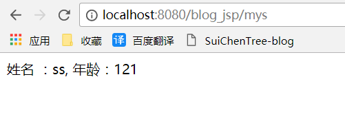


<font color="red">注意：浏览器的地址变化，从blog_jsp/index.jsp  ----> blog_jsp/mys</font>


④：补充
>当tomcat服务器启动，服务器会根据web.xml的信息，通过调用servlet的初始化方法，来创建servlet。


### 4.servlet的生命周期：
Servlet 生命周期可被定义为从创建直到毁灭的整个过程。以下是 Servlet 遵循的过程：
①：Servlet 通过调用 init () 方法进行初始化。
②：Servlet 调用 service() 方法来处理客户端的请求。
③：Servlet 通过调用 destroy() 方法终止（结束）。
④：最后，Servlet 是由 JVM 的垃圾回收器进行垃圾回收的。


服务器启动时(web.xml中配置load-on-startup=1，默认为0)或者第一次请求该servlet时，就会初始化一个Servlet对象，也就是会执行初始化方法init(ServletConfig conf).

该servlet对象去处理所有客户端请求，在service(ServletRequest req，ServletResponse res)方法中执行

最后服务器关闭时，才会销毁这个servlet对象，执行destroy()方法。

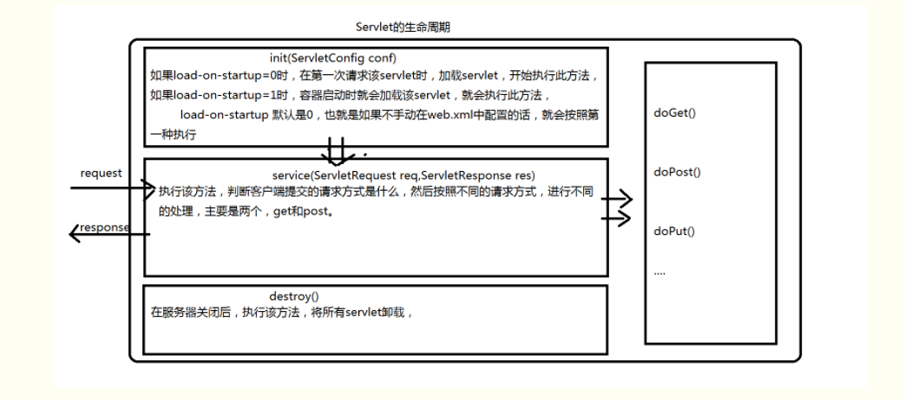


### 5.servlet编写过滤器（Filter 过滤器）：
Servlet 过滤器是可用于 Servlet 编程的 Java 类，有以下目的：
①：在客户端的请求访问数据库，后端资源之前，拦截这些请求。
②：在服务器的响应发送回客户端之前，处理这些响应。

<font color="red">过滤器被部署在配置在 web.xml 中，然后映射到web.xml中的 Servlet。
当 Web 容器启动 Web 应用程序时，它会为您在web.xml中声明的每一个过滤器创建一个实例。
该过滤器执行的顺序是按它们在部署描述符中声明的顺序。</font>

1. 创建过滤器并配置：
**过滤器是一个实现了 javax.servlet.Filter 接口的 Java 类。**

```java
public class LogFilter implements Filter{

	@Override
	public void destroy() {
		System.out.println("LogFilter  destroy");
		
	}
	
	/*
	 * 在该方法中实现过滤操作。
	 * 请求过滤后，需要把请求释放，向下传递。
	 * */
	@Override
	public void doFilter(ServletRequest request, ServletResponse response, FilterChain chain)
			throws IOException, ServletException {
		System.out.println("LogFilter  doFilter");
		
		chain.doFilter(request, response);            //把过滤器拦截的请求释放，向下传递
		
	}

	@Override
	public void init(FilterConfig arg0) throws ServletException {
		System.out.println("LogFilter  init");
		
	}

}
```

web.xml
```xml
<filter>
	<filter-name>LoginFilter</filter-name>
	<filter-class>com.filter.LogFilter</filter-class>
</filter>

<filter-mapping>
   <filter-name>LoginFilter</filter-name>
   <url-pattern>/*</url-pattern>
   <!--过滤器的URL映射-->
</filter-mapping>
```

注意：
<font color="blue">filter-mapping标签用于把过滤器和URL关联，而URL 又与servlet 关联。</font>

①：/* 表示对所有是servlet 都进行过滤。在少数的 Servlet 上应用过滤器，可以指定一个特定的 Servlet 路径

②：<font color="red">web.xml 中的 filter-mapping 元素的顺序决定了 Web 容器应用过滤器到 Servlet 的顺序。若要反转过滤器的顺序，您只需要在 web.xml 文件中反转 filter-mapping 元素即可。


<br/>

2. 多个过滤器的运行流程：


<br/>


3. 实现字符编码过滤器：

①：创建过滤器（修改上面的过滤器）：
```java
public class LogFilter implements Filter{

	@Override
	public void destroy() {
		System.out.println("LogFilter  destroy");
		
	}
	
	/*
	 * 在该方法中实现过滤操作。
	 * 请求过滤后，需要把请求释放，向下传递。
	 * */
	@Override
	public void doFilter(ServletRequest request, ServletResponse response, FilterChain chain)
			throws IOException, ServletException {
		System.out.println("LogFilter  doFilter");
		
		request.setCharacterEncoding("utf-8");     //设置request的编码格式
		response.setContentType("text/html;charset=utf-8");
		
		
		chain.doFilter(request, response);            //把过滤器拦截的请求释放，向下传递
		
	}

	@Override
	public void init(FilterConfig arg0) throws ServletException {
		System.out.println("LogFilter  init");
		
	}

}
```

②：创建jsp：
```jsp
<form action="mys" method="post">

名字：<input type="text" name="name">
年龄：<input type="text" name="age" />
<input type="submit" value="提交" />

</form>
```


③：编写servlet：
```java
public class myservlet extends HttpServlet{

	@Override
	protected void doGet(HttpServletRequest request, HttpServletResponse response) throws ServletException, IOException {
		System.out.println("this is 重写HttpServlet的方法,  处理get类型的请求");
	}

	@Override
	protected void doPost(HttpServletRequest request, HttpServletResponse response) throws ServletException, IOException {
	
		
		String name=request.getParameter("name");
		Integer age=Integer.valueOf(request.getParameter("age"));
		
		System.out.println("姓名 ："+name+",  年龄："+age);
		
		PrintWriter outp = response.getWriter();      //从response 中获取输出流对象。
		outp.println("姓名 ："+name+",  年龄："+age);     //输出字符串给浏览器
		
		outp.flush();                                 //刷新输出流
		outp.close();         						  //关闭输出流		
		
	}

	@Override
	public void init() throws ServletException {
		System.out.println("this is 重写GenericServlet的方法，  Servlet对象的初始化方法");
	}

	@Override
	public void destroy() {
		System.out.println("this is 重写GenericServlet的方法 , Servlet对象的销毁方法");
	}
	
	
}
```


④：运行结果：


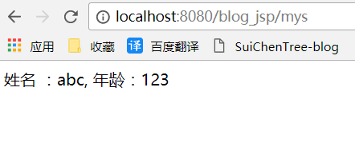

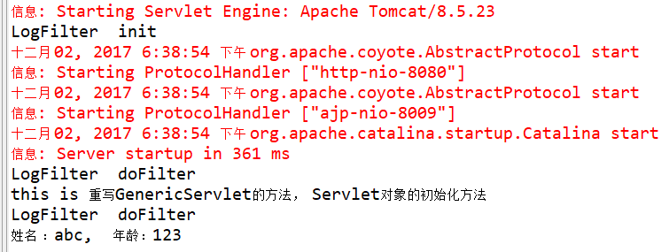

<br/>

4. 补充：
**在doFilter() 方法中，当业务逻辑处理完成。需要通过FilterChain 对象的 doFilter（）方法将请求传递到下一个过滤器或目标资源中，否则出现错误。**


### 6.servlet 对于异常的处理：
当一个 Servlet 抛出一个异常时。web.xml 使用 error-page 元素来指定对特定异常 或 HTTP 状态码 作出相应的 Servlet 调用。

web.xml
```xml
  <servlet>
  	<servlet-name>myservlet</servlet-name>
  	<servlet-class>com.servlet.myservlet</servlet-class>
  </servlet>
  
  <servlet-mapping>
  	<servlet-name>myservlet</servlet-name>
  	<url-pattern>/mys</url-pattern>
  </servlet-mapping>


<!-- error-code 相关的错误页面 
	当状态码为404 时，URL映射为 /mys 的servlet 将被调用

-->
<error-page>
    <error-code>404</error-code>
    <location>/mys</location>
</error-page>

<!-- exception-type 相关的错误页面
	当该servlet 出现 IOException时，URL映射为 /mys 的servlet 将被调用
 -->
<error-page>
    <exception-type>java.io.IOException</exception-type >
    <location>/mys</location>
</error-page>
```

<font color="red">如果您想对所有的异常有一个通用的错误处理程序，那么应该定义下面的 error-page，而不是为每个异常定义单独的 error-page 元素.</font>

```xml
<error-page>
    <exception-type>java.lang.Throwable</exception-type >
    <location>/mys</location>
</error-page>
```

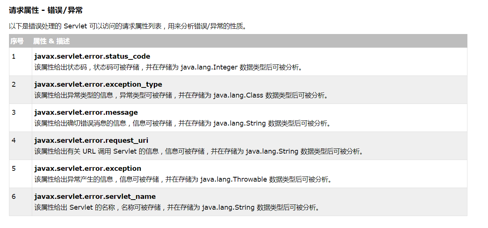


## EL表达式 与 JSTL标签库：

### 1.EL(表达式语言，Epression Language)
EL主要用于简化jsp中对 对象的引用。

1. EL表达式语法（中间为合法的表达式）：
`${~ ~ ~}  `  

例如：在jsp页面上显示一段话。
以前：`out.print("i am xiaoming");`
现在：`${"i am xiaoming"}`


2. EL的运算符：
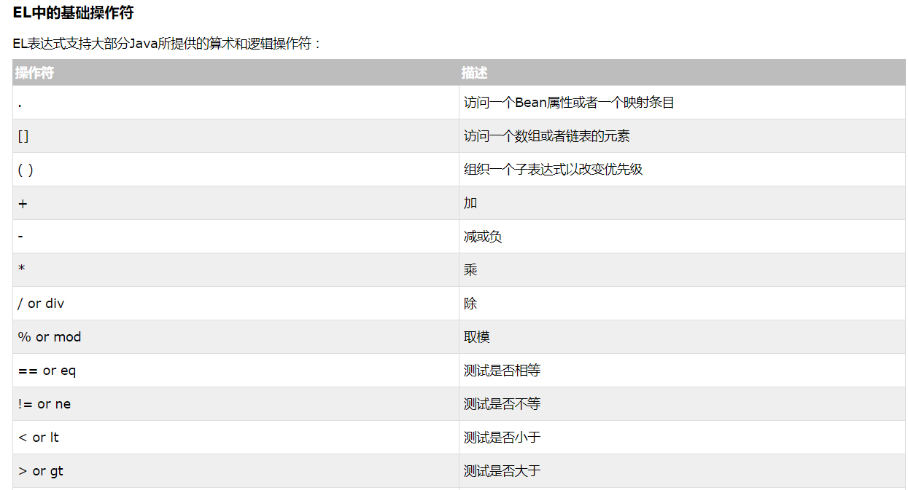

<font color="red">注意：EL的 “ + ”运算符，不能把两个字符串连接。若两个字符串无法转化为int 类型，则抛出异常。</font>

<br/>

3. EL 操作jsp的内置对象：
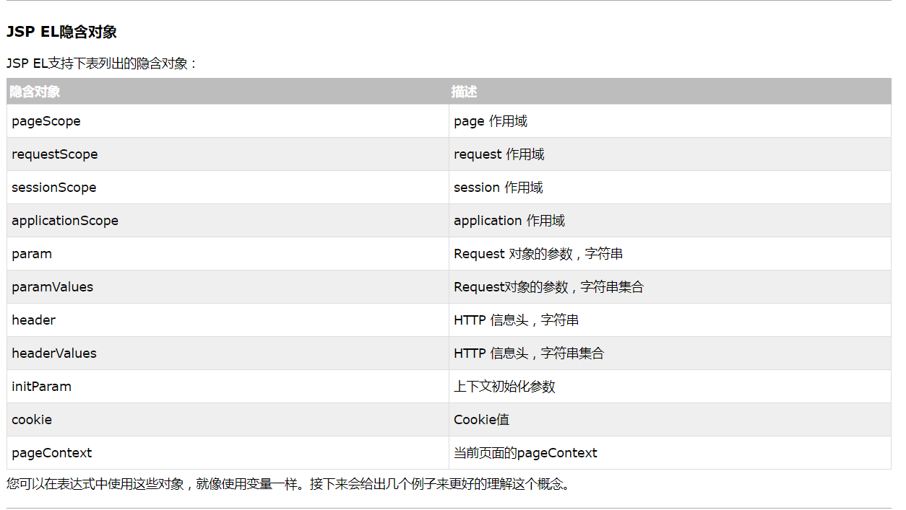


```jsp
<body>

${1+2}
${requestScope.user}    <!--获取request 作用域的 user属性-->

</body> 
```


### 2.JSTL
JSP 标准标签库（jstl）,是一个JSP标签集合，它封装了JSP应用的通用核心功能。

1. 使用前提：
①：在WEB-INF下的lib文件夹中加入<font color="red">jstl-1.2.jar 和 standard-1.1.2.jar</font>
②：在需要使用jstl的jsp页面上要引入：
<%@ tagliburi="http://java.sun.com/jsp/jstl/core" prefix="c"%> 
③：使用jstl

<br/>

2. 核心标签：
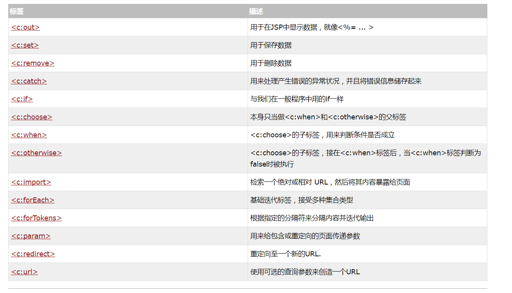

```jsp
	
	<!--c:out标签
		格式： <c:out value="表达式">
	
	 -->
	<c:out value="123"/>
	
	<!--c:set 变量设置标签, c:remove 标签
	格式：<c:set var="变量名" value="变量值" scope="变量的作用域，默认为page"/>

	<c:remove var="移除的变量名" scope="该变量的范围"/>
	-->
	<c:set value="root" var="userid"/>
	userid:${userid }
	<c:remove var="userid"/>
	userid:${userid }


<!--
	流程控制标签：

<c:if> ：判断表达式的值，如果表达式的值为真则执行其主体内容。

<c:choose>和<c:when>和<c:otherwise> 标签：
	<c:choose>标签与Java switch语句的功能一样，用于在众多选项中做出选择。
	switch语句中有case，而<c:choose>标签中对应有<c:when>，
	switch语句中有default，而<c:choose>标签中有<c:otherwise>。
	
	<c:when>标签的test属性，用于条件判断。

	
-->

<c:set var="salary" scope="session" value="${2000*2}"/>
<c:if test="${salary > 2000}">
   <p>我的工资为: <c:out value="${salary}"/><p>
</c:if>


<c:set var="salary" scope="session" value="${2000*2}"/>
<p>你的工资为 : <c:out value="${salary}"/></p>
<c:choose>
    <c:when test="${salary <= 0}">
       太惨了。
    </c:when>
    <c:when test="${salary > 1000}">
       不错的薪水，还能生活。
    </c:when>
    <c:otherwise>
        什么都没有。
    </c:otherwise>
</c:choose>


<!--
循环标签：<c:forEach>  ,  <c:forTokens>
	这两个标签封装了Java中的for，while，do-while循环。
	相比而言，<c:forEach>标签是更加通用的标签，因为它迭代一个集合中的对象。
	<c:forTokens>标签将字符串分隔为一个子串数组然后迭代它们。


-->

<c:forEach var="i" begin="1" end="5">
   Item <c:out value="${i}"/><p>
</c:forEach>


<c:forTokens items="google,w3cschool,taobao" delims="," var="name">
   <c:out value="${name}"/><p>
</c:forTokens>

```

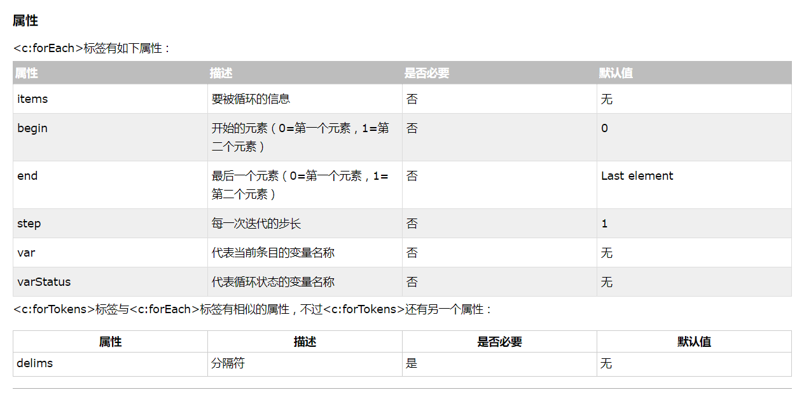


3. 补充：
jstl 与 el 没有什么关系，但一般把它们配合在一起使用。jstl 与 el 的配合对于简化jsp页面比单独使用更强大。


## JDBC

参考链接：[Class.forName()方法的作用](http://blog.csdn.net/angus_17/article/details/8020652)


JDBC（Java DataBase Connectivity,java数据库连接）是<font color="red">一种用于执行SQL语句的Java API，可以为多种关系数据库提供统一访问,用来连接 Java 编程语言和广泛的数据库</font>，它由一组用Java语言编写的类和接口组成。JDBC提供了一种基准，据此可以构建更高级的工具和接口，使数据库开发人员能够编写数据库应用程序。

<br/>

### 1.jdbcl连接数据库，以mysql数据库为例：

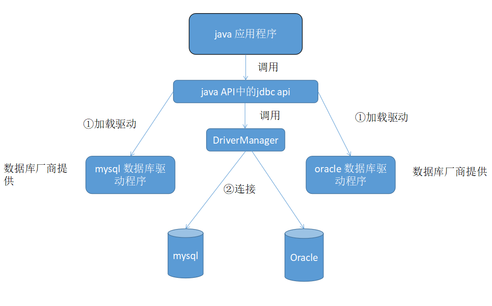

1. ①：加载驱动：
把mysql的驱动程序（不同的数据库驱动程序，都由数据库厂商提供）放到WEB-INF/lib目录下： 
mysql-connector-java-5.1.40-bin.jar

`Class.forName("com.mysql.jdbc.Driver");`

<font color="red">加载数据库驱动程序使用的是Class.forName（）方法。该方法会把驱动程序加入到 JVM 中。 </font>

2. 设置数据库的用户名，密码，连接URL.
连接URL的基本格式：“jdbc协议 + 数据库ip 地址 + 数据库端口号 + 数据库名称”
```java
String url="jdbc:mysql://localhost:3306/test";
String user="root";
String password="123456";
```

<font color="blue">注意：这里的用户，密码 要与你安装的MySQL 数据库的用户，密码，对应。</font>


3. ②：连接:
通过jdbc api的DriverManager类的getConnection（）方法，创建数据库的连接。

`Connection	conn=DriverManager.getConnection(url,user,password);`

4. 建立连接后，使用连接对象创建<font color="red">操作SQL语句的Statement 对象或PreparedStatement对象</font>。
```java

String sql="insert into goods (name,price,address) values(?,?,?)";      
PreparedStatement pstmt=conn.prepareStatement(sql);
	pstmt.setString(1,g.getName());      
	pstmt.setDouble(2,g.getPrice());
	pstmt.setString(3,g.getAddress());

/*
	? 表示占位符，表示要插入数据的位置

	pstmt.setString(1,g.getName()); 表示给第一个占位符赋值。

*/
```


5. 调用对象的execute（）方法,编译执行sql语句：
```java
int a=pstmt.execute();   //a=1 ,表示 数据表的一行 受影响。

```

6. 关闭数据库连接，释放系统资源：
`conn.close();`


7. 完整代码：

```java
public class linkdatabase {
	private static String dirverName="com.mysql.jdbc.Driver";
	private static String url="jdbc:mysql://localhost:3306/test";
	private static String user="root";
	private static String password="123456";
	
	public static Connection getconnection(){
		Connection conn=null;
		
		try {
			Class.forName("com.mysql.jdbc.Driver");
			conn=DriverManager.getConnection(url,user,password);
		
		} catch (ClassNotFoundException e) {
			e.printStackTrace();
			System.out.println("数据库链接失败1");
		} catch (SQLException e) {
			e.printStackTrace();
			System.out.println("数据库链接失败2");
		}
		
		return conn;
		
	}
}


-----------------------------------

public class Goods_delete_Controller extends HttpServlet {
	private Connection conn=linkdatabase.getconnection();     //获取数据库连接
	
	protected void doGet(HttpServletRequest request, HttpServletResponse response) throws ServletException, IOException {
		Integer id=2;

		int a=0;
		String sql="delete from goods where id=?";
		PreparedStatement pstmt;
		try {
			pstmt = conn.prepareStatement(sql);
			pstmt.setInt(1,id); 							//给占位符赋值
			a=pstmt.executeUpdate();                        //执行sql语句，返回 a
			
		} catch (SQLException e) {
			System.out.println(" GoodsDao  delete 异常");
			e.printStackTrace();
		}


		if(a==1) {
			System.out.println("删除成功");
			
			/*
			 * 查询全部数据
			 * */
			List<Goods> lg=gs.selectAll_service(conn);
			request.setAttribute("listgoods", lg);             //把查出来的数据，存放在request对象的listgoods属性中
			request.getRequestDispatcher("goodslist.jsp").forward(request,response);        //把查询的数据传递给下一个 goodslist.jsp 页面
			
		}
	
	}

	
}

```


### 2.Statement 接口与PreparedStatement接口:
JDBC 的 Statement 和 PreparedStatement 接口定义的方法和属性，可以让你发送 SQL 命令到数据库，并从你的数据库接收数据。


==注意：开发中不建议使用Statement来操作数据库，而是使用PreparedStatement，因为Statement是执行的是完整的SQL语句。而PreparedStatement 可以执行带参数的sql语句。==


#### 1.Statement 接口：
<font color="red">主要用于执行静态的sql语句（不带参的sql 语句），并返回结果。
</font>

①：创建Statement 对象：
` Statement stmt=conn.createStatement( );`


②：你可以用它的三个常用执行方法的任一方法来执行 SQL 语句：

1. boolean execute(String SQL) : 
如果 ResultSet 对象可以被检索，则返回的布尔值为 true ，否则返回 false 。当你需要使用真正的动态 SQL 时，可以使用这个方法来执行 SQL 语句。

2. int executeUpdate(String SQL) :
 返回执行 SQL 语句影响的行的数目。 <font color="red">常用于INSERT，UPDATE 或 DELETE 语句。</font>

3. ResultSet executeQuery(String SQL) :
 返回一个 ResultSet 对象。当你希望得到一个结果集时使用该方法。 <font color="red">常用于SELECT  语句。</font>


#### 2.PreparedStatement 接口：
>Statement 对象执行静态sql 语句，但在实际过程中，往往将程序的变量作为sql 语句的参数。而这时，使用Statement 对象 操作sql语句会过于繁琐，并且存在安全方面的缺陷。因此这是，使用PreparedStatement 对象比较好。

PreparedStatement 对象继承 Statement 对象，它们之间的区别：
①：PreparedStatement 对象 执行的sql 语句都是预编译的,可以高效的多次执行sql 语句。
②：可以使用占位符 “ ？ ” 来代替sql语句的参数，然后通过 setXXX() 方法，给占位符赋值。


1. 创建PreparedStatement 对象：

```java
String SQL = "Update Employees SET age = ? WHERE id = ?";
PreparedStatement  pstmt = conn.prepareStatement(SQL);
pstmt.setInt(1,age);         //把参数的age值，赋值给 第一个占位符。
pstmt.setInt(2,id);
int a=pstmt.executeUpdate();         //执行sql语句,并传回结果。
```

2. 常用方法

```java

pstmt.execute();    //执行的sql语句可以说任何种类的sql 语句

pstmt.executeQuery();    //执行查询语句

pstmt.executeUpdate();   // 必须是insert ，update ， delete 语句


pstmt.setBoolean(int index,boolean b);     //给占位符设置boolean值

pstmt.setDate(int index,Date d);      //给占位符设置date值

pstmt.setString(int index,String str);    //给占位符设置String值

pstmt.setInt(int index,int a);     //给占位符设置int值

....

```

### 3.结果集ResultSet接口（提供指针功能）:

`ResultSet rs=pstmt.executeQuery("select * from user");`

其用于保存查询时，返回的结果集。<font color="red">结果集与数据库表的字段相对应，与表一样也是由行与列组成。并且在结果集的行上提供指针功能。可以通过指针来操作结果集的数据</font>

1. 常用方法：
```java

beforeFirst();      //把指针移到ResultSet 对象的开头，正好在第一行之前。
afterLast();       //把指针移到ResultSet 对象的末尾，正好在最后一行之后。
close();           //释放资源。
first();          //把指针移到第一行。

next();            //把指针从当前行，下移一行，常用与while循环的迭代条件。

getBoolean(int columnindex);     //获取当前行上指定列的值（Boolean类型的）
getBoolean(String columnName);     //通过列名获取当前行上列的值（Boolean类型的）


getDate(int columnindex);     //获取当前行上指定列的值（Date类型的）
getDate(String columnName);     //通过列名获取当前行上指定列的值（Boolean类型的）


getInt(int columnindex);     //获取当前行上指定列的值（Int类型的）
getInt(String columnName);     //通过列名获取当前行上指定列的值（Boolean类型的）


getString(int columnindex);     //获取当前行上指定列的值（String类型的）
getString(String columnName);     //通过列名获取当前行上指定列的值（Boolean类型的）


...

```


2. 例子：
```java

ResultSet result = stmt.executeQuery("SELECT * FROM user");

　　while(result.next()){

　　System.out.print(result.getString("name"));       
 //name 是表的name列，若name列是第一列，可写成：result.getString(1);

　　System.out.print(result.getString("email"));     

　　System.out.print(result.getInt("age"));

　　

　　}
```


### 4.例子：jdbc 操作数据库:
<font color="red">首先，导入MySQL的数据库驱动程序包（mysql-connector-java-5.1.40-bin.jar）</font>


1. 创建表（goods表）,数据库名称为test

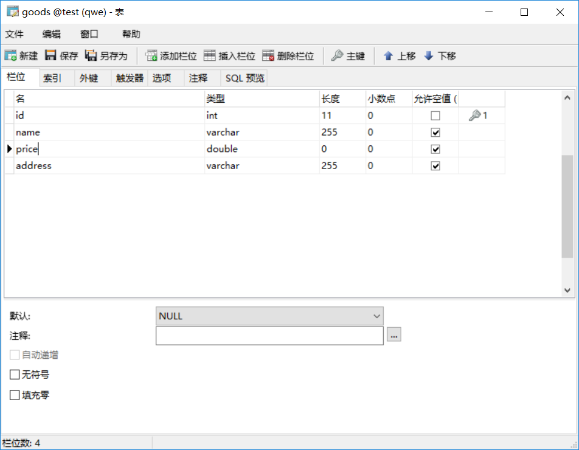


2. 创建实体类（数据表的映射）：
```java
package com.entity;

public class Goods {
	private Integer id;
	private String name;
	private Double price;
	private String address;
	public Goods() {
		
	}
	public Goods(String name, Double price, String address) {
		this.name = name;
		this.price = price;
		this.address = address;
	}
	public Integer getId() {
		return id;
	}
	public void setId(Integer id) {
		this.id = id;
	}
	public String getName() {
		return name;
	}
	public void setName(String name) {
		this.name = name;
	}
	public Double getPrice() {
		return price;
	}
	public void setPrice(Double price) {
		this.price = price;
	}
	public String getAddress() {
		return address;
	}
	public void setAddress(String address) {
		this.address = address;
	}
	@Override
	public String toString() {
		return "Goods [id=" + id + ", name=" + name + ", price=" + price + ", address=" + address + "]";
	}
	
	
}

```


3. jdbc连接数据库：
```java
package com.link;

import java.sql.Connection;
import java.sql.DriverManager;
import java.sql.SQLException;

public class linkdatabase {
	private static String dirverName="com.mysql.jdbc.Driver";
	private static String url="jdbc:mysql://localhost:3306/test";
	//我这里的数据库名称是test
	private static String user="root";
	private static String password="123456";
	
	public static Connection getconnection(){
		Connection conn=null;
		
		try {
			Class.forName("com.mysql.jdbc.Driver");   //把数据库驱动程序加载到jvm中。
			conn=DriverManager.getConnection(url,user,password);  //连接数据库
		
		} catch (ClassNotFoundException e) {
			e.printStackTrace();
			System.out.println("数据库链接失败1");
		} catch (SQLException e) {
			e.printStackTrace();
			System.out.println("数据库链接失败2");
		}
		
		return conn;        //返回数据库的连接
		
	}
}

```


4. 测试jdbc 对数据库的增删改查：
```java
package com.test;

import java.sql.Connection;
import java.sql.PreparedStatement;
import java.sql.ResultSet;
import java.sql.SQLException;

import org.junit.Test;

import com.entity.Goods;
import com.link.linkdatabase;

public class test_jdbc {

	/*
	 * 插入数据
	 * */
	@Test
	public void test_insert() throws Exception {
		Connection conn=linkdatabase.getconnection();       //获取数据库连接
		
		String sql="insert into goods (name,price,address) values(?,?,?)";        
		try {
			PreparedStatement pstmt=conn.prepareStatement(sql);           //创建prepareStatement对象
			pstmt.setString(1,"xiaoming");                               //给占位符赋值
			pstmt.setDouble(2,22);
			pstmt.setString(3,"beijing");
			
			int a=pstmt.executeUpdate();                        //执行sql语句
			
			if(a==1){
				System.out.println("insert success");
			}else {
				System.out.println("insert shibai ");
			}
			
			
		} catch (SQLException e) {
			System.out.println("  insert 异常");
			e.printStackTrace();
		}finally {
			conn.close();                          //关闭连接，释放资源
			
		}
		
		
		
	}
	
	
	
	/*
	 * 删除数据
	 * */
	@Test
	public void test_delete() throws Exception {
		Connection conn=linkdatabase.getconnection();       //获取数据库连接
		
		String sql="delete from goods where id=?";        
		try {
			PreparedStatement pstmt=conn.prepareStatement(sql);           //创建prepareStatement对象
			pstmt.setInt(1,1);                        //给占位符赋值

			
			int a=pstmt.executeUpdate();                        //执行sql语句
			
			if(a==1){
				System.out.println("delete success");
			}else {
				System.out.println("delete shibai ");
			}
			
			
		} catch (SQLException e) {
			System.out.println("   delete 异常");
			e.printStackTrace();
		}finally {
			conn.close();                          //关闭连接，释放资源
			
		}
		
		
		
	}
	
	/*
	 * 修改数据
	 * */
	@Test
	public void test_update() throws Exception {
		Connection conn=linkdatabase.getconnection();       //获取数据库连接
		
		String sql="update goods set name=? ,price=? , address=? where id=?";        
		try {
			PreparedStatement pstmt=conn.prepareStatement(sql);           //创建prepareStatement对象
			pstmt.setString(1,"xiaoho");                               //给占位符赋值
			pstmt.setDouble(2,55);
			pstmt.setString(3,"beijing");
			pstmt.setInt(4,33);
			
			int a=pstmt.executeUpdate();                        //执行sql语句
			
			if(a==1){
				System.out.println("update success");
			}else {
				System.out.println("update shibai ");
			}
			
			
		} catch (SQLException e) {
			System.out.println("update 异常");
			e.printStackTrace();
		}finally {
			conn.close();                          //关闭连接，释放资源
			
		}
		
		
		
	}
	
	
	/*
	 * 查询全部数据
	 * */
	@Test
	public void test_selectAll() throws Exception {
		Connection conn=linkdatabase.getconnection();       //获取数据库连接
		
		String sql="select * from goods";        
		try {
			PreparedStatement pstmt=conn.prepareStatement(sql);           //创建prepareStatement对象
		
			ResultSet rs=pstmt.executeQuery(sql);                        //执行sql语句
			
			
			while(rs.next()){                                   //遍历ResultSet结果集
				System.out.println("id:  "+rs.getInt("id")+"  ,   name: "+rs.getString("name")+"    "
						+ "price:"+rs.getDouble("price")+"   address :"+rs.getString("address"));
				
			}
			
			
		} catch (SQLException e) {
			System.out.println("  selectAll 异常");
			e.printStackTrace();
		}finally {
			conn.close();                          //关闭连接，释放资源
			
		}
		
		
	}
}

```

---

## Javaweb 实现CRUD的例子（商品表，订单表）：

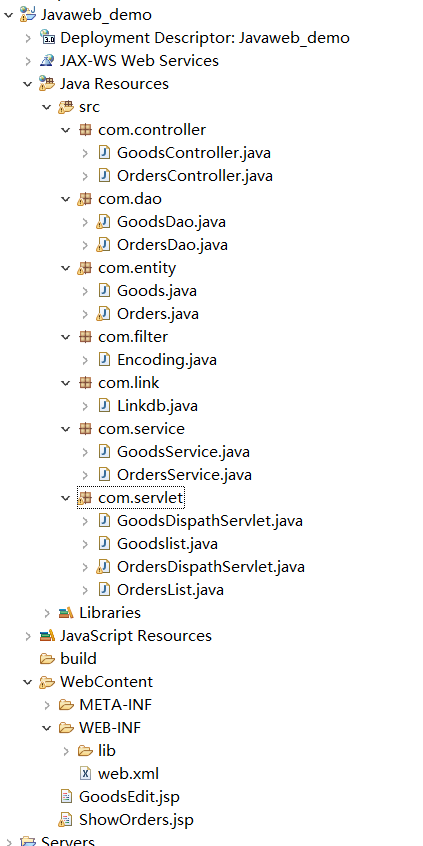


<h4>①.创建数据库,导入jar包：</h4>
1. 创建goods表，其中oid 字段对应 orders表的id： 

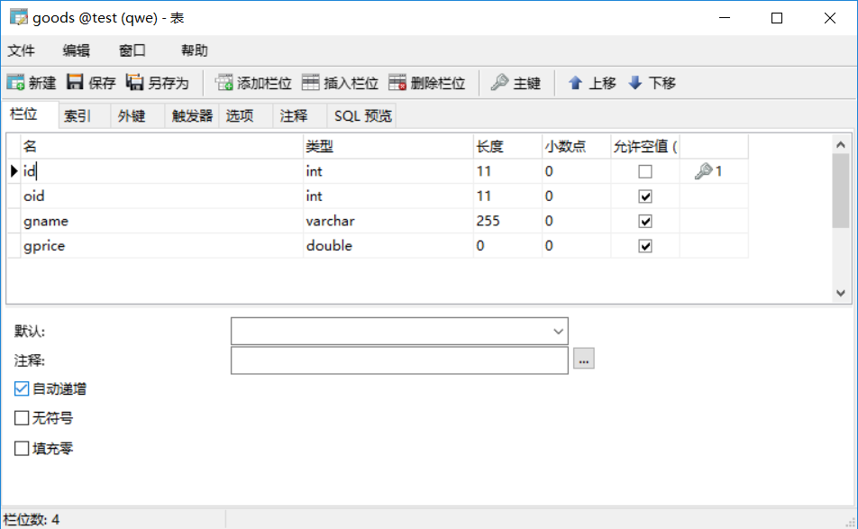

2. 创建orders表（<font color="red">注意：order 是mysql 数据库的关键字，无法作为表名。</font>）

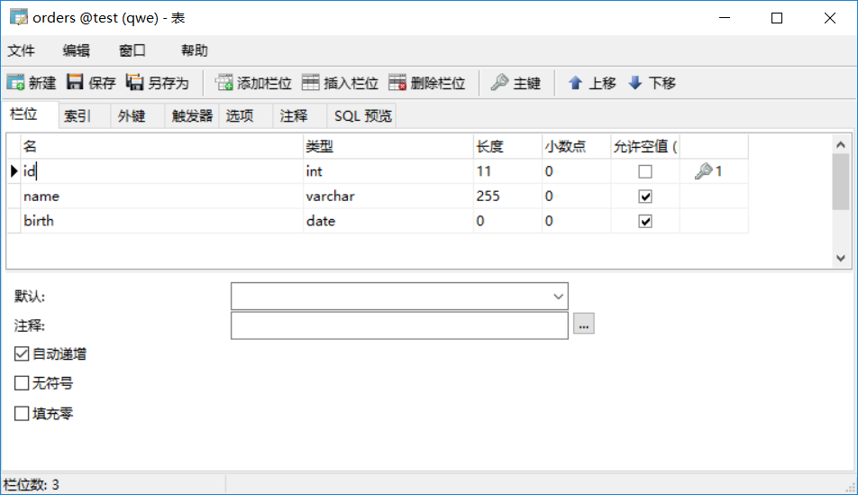


需要的jar包：
> jstl-1.2.jar
> mysql-connector-java-5.1.42-bin.jar


<h4>②.创建实体类bean：</h4>

```java

package com.entity;
public class Goods {
	private Integer id;
	private Integer oid;
	private String gname;
	private Double gprice;
	public Goods() {}
	public Goods(Integer id, Integer oid, String gname, Double gprice) {
		super();
		this.id = id;
		this.oid = oid;
		this.gname = gname;
		this.gprice = gprice;
	}
	// get/set/toString 方法省略
}

```

```java
package com.entity;

import java.util.Date;
import java.util.List;

public class Orders {
	private Integer id;
	private String name;
	private Date birth;                       //Date 是日期类型 例如： 2017-12-18 
	private Goods goods;
	
	public Orders(){}
	public Orders(Integer id, String name, Date birth) {
		this.id = id;
		this.name = name;
		this.birth = birth;
	}
	public Orders(Integer id, String name, Date birth, Goods goods) {
		super();
		this.id = id;
		this.name = name;
		this.birth = birth;
		this.goods = goods;
	}
	// get/set/toString 方法省略
}

```


<h4>③.创建与数据库的连接：</h4>

```java
package com.link;

import java.sql.Connection;
import java.sql.DriverManager;
import java.sql.SQLException;

public class Linkdb {
	private static String url="jdbc:mysql://localhost:3306/test";
	private static String username="root";
	private static String password="root";
	
	public static Connection getlinkDB(){
		Connection conn=null;
		try {
			Class.forName("com.mysql.jdbc.Driver");
			conn=DriverManager.getConnection(url, username, password);
		} catch (SQLException e) {
			System.out.println("link shibai");
		}catch(ClassNotFoundException e){
			System.out.println("link shibai22222");

		}finally{
			if(conn==null){
				System.out.println("link shibai3333");
			}
		}
		return conn;	
	}
}

```

<h4>④.Dao层(直接用实体类bean和 SQL语句来操作数据库)：</h4>

Goodsdao.java：
```java
package com.dao;

import java.sql.Connection;
import java.sql.PreparedStatement;
import java.sql.ResultSet;
import java.sql.SQLException;
import java.sql.Statement;
import java.util.ArrayList;
import java.util.Date;
import java.util.List;

import com.entity.Goods;
import com.link.Linkdb;

/*
 * 这里为 dao层 ，直接操作 实体类 和sql 语句来实现对数据的操作（增删改查）
 * 
 * */
public class GoodsDao {
	
	private static Connection conn=Linkdb.getlinkDB();  //获取数据库连接
	
	/** insert
	 * @param name
	 * @return
	 * @throws SQLException
	 */
	public int insert(Goods g) throws SQLException{
    	String sql="insert into goods(oid, gname,gprice) values(?,?,?) ";
		PreparedStatement pstmt = conn.prepareStatement(sql);
		pstmt.setInt(1, g.getOid());
		pstmt.setString(2,g.getGname());
		pstmt.setDouble(3,g.getGprice());
		
		int a = pstmt.executeUpdate();
		if(a==0){
			System.out.println("insert shibai ");
		}
		return a;
	}
	
	
	/** delete
	 * @param id
	 * @return
	 * @throws SQLException
	 */
	public int delete(Integer id) throws SQLException{
		String sql="delete from goods where id=?";
		PreparedStatement pstmt = conn.prepareStatement(sql);
		pstmt.setInt(1,id);
		
		int a = pstmt.executeUpdate();
		if(a==0){
			System.out.println("delete shibai ");
		}
		return a;
	}
	
	
	/** deleteByOid
	 * @param id
	 * @return
	 * @throws SQLException
	 */
	public int deleteByOid(Integer oid) throws SQLException{
		String sql="delete from goods where oid=?";
		PreparedStatement pstmt = conn.prepareStatement(sql);
		pstmt.setInt(1,oid);
		
		int a = pstmt.executeUpdate();
		if(a==0){
			System.out.println("deleteByOid shibai ");
		}
		return a;
	}
	
	
	/** update
	 * @param id
	 * @param name
	 * @return
	 * @throws SQLException
	 */
	public int update(Goods g) throws SQLException{
		String sql="update goods set  gname=? , gprice=?  where id=?";
		PreparedStatement pstmt = conn.prepareStatement(sql);
		pstmt.setString(1, g.getGname());
		pstmt.setDouble(2,g.getGprice());
		pstmt.setInt(3, g.getId());
		
		int a = pstmt.executeUpdate();
		if(a==0){
			System.out.println("update shibai ");
		}
		return a;
	}
	
	
	
	/** selectone 
	 * @param id
	 * @return
	 * @throws SQLException
	 */
	public Goods selectone(Integer id) throws SQLException{
		Goods goods=new Goods();
		String sql="select * from goods where id=?";
		PreparedStatement pstmt = conn.prepareStatement(sql);
		pstmt.setInt(1, id);
		
		ResultSet rs = pstmt.executeQuery();
		while(rs.next()){
			goods.setId(rs.getInt("id"));
			goods.setOid(rs.getInt("oid"));
			goods.setGname(rs.getString("gname"));
			goods.setGprice(rs.getDouble("gprice"));
		}
		return goods;
	}
	
	

	/** selectAll
	 * @return
	 * @throws SQLException
	 */
	public List<Goods> selectAll() throws SQLException{
		List<Goods> listGoods=new ArrayList<Goods>();
		String sql="select * from goods";
		PreparedStatement pstmt = conn.prepareStatement(sql);
		ResultSet rs = pstmt.executeQuery();
	
		while(rs.next()){
			Goods ods=new Goods(rs.getInt("id"),rs.getInt("oid"),rs.getString("gname"),rs.getDouble("gprice"));
			listGoods.add(ods);
		}
		return listGoods;
	}


	/**查询某个订单下的全部商品
	 * @param oid
	 * @return
	 * @throws SQLException
	 */
	public List<Goods> selectByoid(Integer oid) throws SQLException {
		List<Goods> goodslist=new ArrayList<Goods>();
		String sql="select * from goods where oid=?";
		PreparedStatement pstmt = conn.prepareStatement(sql);
		pstmt.setInt(1, oid);
		
		ResultSet rs = pstmt.executeQuery();
		while(rs.next()){
			Goods goods=new Goods();
			goods.setId(rs.getInt("id"));
			goods.setOid(rs.getInt("oid"));
			goods.setGname(rs.getString("gname"));
			goods.setGprice(rs.getDouble("gprice"));
			goodslist.add(goods);            //把结果集的数据放到List<Goods> 中
		}
		return goodslist;
		
	}


	/**通过id 查询某个表单下的商品
	 * @param id
	 * @param oid
	 * @return
	 * @throws SQLException
	 */
	public Goods selectByoidAndid(Integer id, Integer oid) throws SQLException {
		Goods goods=new Goods();
		String sql="select * from goods where oid=? and id=?";
		PreparedStatement pstmt = conn.prepareStatement(sql);
		pstmt.setInt(1, oid);
		pstmt.setInt(2, id);
		ResultSet rs = pstmt.executeQuery();

		while(rs.next()){
			goods.setId(rs.getInt("id"));
			goods.setOid(rs.getInt("oid"));
			goods.setGname(rs.getString("gname"));
			goods.setGprice(rs.getDouble("gprice"));
		}
		return goods;
	}
	
}

```


OrdersDao.java:
```java
package com.dao;

import java.sql.Connection;
import java.sql.PreparedStatement;
import java.sql.ResultSet;
import java.sql.SQLException;
import java.sql.Statement;
import java.sql.Timestamp;
import java.util.ArrayList;
import java.util.Date;
import java.util.List;

import com.entity.Goods;
import com.entity.Orders;
import com.link.Linkdb;

/*
 * 这里为 dao层 ，直接操作 实体类 和sql 语句来实现对数据的操作（增删改查）
 * 
 * */
public class OrdersDao {
	
	private static Connection conn=Linkdb.getlinkDB();  //获取数据库连接
	
	
	/** insert
	 * 
	 * @param name
	 * @return
	 * @throws SQLException
	 */
	public int insert(Orders o) throws SQLException{
    	String sql="insert into orders(name, birth) values(?,?)";
		PreparedStatement pstmt = conn.prepareStatement(sql);
		pstmt.setString(1,o.getName());
		pstmt.setDate(2,(java.sql.Date) o.getBirth());
		
		int a = pstmt.executeUpdate();
		if(a==0){
			System.out.println("insert shibai ");
		}
		return a;       //返回insert orders表生成的主键id值
	 
	}
	
	
	/** delete
	 * @param id
	 * @return
	 * @throws SQLException
	 */
	public int delete(Integer id) throws SQLException{
		String sql="delete from orders where id=?";
		PreparedStatement pstmt = conn.prepareStatement(sql);
		pstmt.setInt(1,id);
		
		int a = pstmt.executeUpdate();
		if(a==0){
			System.out.println("delete shibai ");
		}
		return a;
	}
	
	
	/** update
	 * @param id
	 * @param name
	 * @return
	 * @throws SQLException
	 */
	public int update(Orders o) throws SQLException{
		String sql="update orders set name=? , birth=? where id=?";
		PreparedStatement pstmt = conn.prepareStatement(sql);
		pstmt.setString(1,o.getName());
		pstmt.setDate(2, (java.sql.Date) o.getBirth());
		pstmt.setInt(3,o.getId());
		
		int a = pstmt.executeUpdate();
		if(a==0){
			System.out.println("update shibai ");
		}
		return a;
	}
	
	
	
	/** selectone 
	 * @param id
	 * @return
	 * @throws SQLException
	 */
	public Orders selectone(Integer id) throws SQLException{
		Orders orders=new Orders();
		String sql="select * from orders where id=?";
		PreparedStatement pstmt = conn.prepareStatement(sql);
		pstmt.setInt(1, id);
		
		ResultSet rs = pstmt.executeQuery();
		while(rs.next()){
			orders.setId(rs.getInt("id"));
			orders.setName(rs.getString("name"));
			orders.setBirth(rs.getDate("birth"));
		}
		return orders;
	}
	
	

	/** selectAll  
	 * @return
	 * @throws SQLException
	 */
	public List<Orders> selectAll() throws SQLException{
		List<Orders> listorders=new ArrayList<Orders>();
		String sql="select * from orders";
		PreparedStatement pstmt = conn.prepareStatement(sql);
		ResultSet rs = pstmt.executeQuery();
		
		while(rs.next()){
			Orders ods=new Orders(rs.getInt("id"),rs.getString("name"),rs.getDate("birth"));
			listorders.add(ods);
		}
		return listorders;
	}
}

```


<h4>⑤：Service层（对Dao层的封装）：</h4>

GoodsService.java：
```java
package com.service;
import java.sql.SQLException;
import java.util.List;
import com.dao.GoodsDao;
import com.entity.Goods;

/*
 * 这里是 service 层，一般用于对dao 层的方法进行封装，因为有些操作需要多个 dao层的方法联合使用
 * 
 * */
public class GoodsService {
	
	GoodsDao goodsdao=new GoodsDao();	
	
	public int insert(Goods o) throws SQLException{
		return goodsdao.insert(o);
	}
	
	public int delete(Integer id) throws SQLException{
		return goodsdao.delete(id);
	}
	
	public int deleteByOid(Integer oid) throws SQLException{
		return goodsdao.deleteByOid(oid);
	}

	public int update(Goods o) throws SQLException{
		return goodsdao.update(o);
	}
	
	public Goods selectone(Integer id) throws SQLException{
		return goodsdao.selectone(id);
	}
	
	public List<Goods> selectAll() throws SQLException{
		return goodsdao.selectAll();
	}

	public List<Goods> selectByoid(Integer oid) throws SQLException {
		return goodsdao.selectByoid(oid);
	}

	//通过id查询该订单表的商品,如果该订单表没有该id的商品，显示无。
	public Goods selectByoidAndid(Integer id, Integer oid) throws SQLException {
		return goodsdao.selectByoidAndid(id,oid);
	}
	
}

```

OrdersService.java:
```java
package com.service;

import java.sql.SQLException;
import java.util.List;

import com.dao.OrdersDao;
import com.entity.Orders;
/*
 * 这里是 service 层，一般用于对dao 层的方法进行封装，因为有些操作需要多个 dao层的方法联合使用
 * 
 * */
public class OrdersService {
	
	OrdersDao orderdao=new OrdersDao();	
	
	public int insert(Orders o) throws SQLException{
	    return orderdao.insert(o);
	}
	
	public int delete(Integer id) throws SQLException{
		return orderdao.delete(id);
	}
	
	public int update(Orders o) throws SQLException{
		return orderdao.update(o);
	}
	
	public Orders selectone(Integer id) throws SQLException{
		return orderdao.selectone(id);
	}
	
	public List<Orders> selectAll() throws SQLException{
		return orderdao.selectAll();
	}

}

```

<h4>⑥：Controller层（对Service层的封装）</h4>

GoodsController.java:
```java
package com.controller;

import java.sql.SQLException;
import java.util.List;

import com.entity.Goods;
import com.service.GoodsService;
/*
 * 
 * 这里是 Controller 层，一般用于对service 层的方法进行封装，因为有些业务操作需要多个 service 层的方法联合使用。
 * */
public class GoodsController {
	
	GoodsService goodsservice=new GoodsService();
	
	public int insert(Goods o) throws SQLException{
		return goodsservice.insert(o);
	}
	
	public int delete(Integer id) throws SQLException{
		 return goodsservice.delete(id);
	}
	
	
	public int deleteByOid(Integer oid) throws SQLException{
		 return goodsservice.deleteByOid(oid);
	}
	
	public int update(Goods o) throws SQLException{
		 return goodsservice.update(o);
	}
	
	
	public Goods selectone(Integer id) throws SQLException{
		 return goodsservice.selectone(id);
	}
	
	//查询该表单下的所有商品
	public List<Goods> selectByoid(Integer oid) throws SQLException{
		 return goodsservice.selectByoid(oid);
	}
	
	//通过id查询该订单表的商品,如果该订单表没有该id的商品，显示无。
	public Goods selectByoidAndid(Integer id,Integer oid) throws SQLException{
		 return goodsservice.selectByoidAndid(id,oid);
	}
	
	
	public List<Goods> selectAll() throws SQLException{
		 return goodsservice.selectAll();
	}

}

```

OrdersController.java:
```java
package com.controller;
import java.sql.SQLException;
import java.util.List;
import com.entity.Orders;
import com.service.OrdersService;
/*
 * 
 * 这里是 Controller 层，一般用于对service 层的方法进行封装，因为有些业务操作需要多个 service 层的方法联合使用。
 * */
public class OrdersController {
	
	OrdersService ordersservice=new OrdersService();
	
	public int insert(Orders o) throws SQLException{
		return ordersservice.insert(o);
	}
	
	public int delete(Integer id) throws SQLException{
		 return ordersservice.delete(id);
	}
	
	
	public int update(Orders o) throws SQLException{
		 return ordersservice.update(o);
	}
	
	
	public Orders selectone(Integer id) throws SQLException{
		 return ordersservice.selectone(id);
	}
	
	
	public List<Orders> selectAll() throws SQLException{
		 return ordersservice.selectAll();
	}

}

```

<h4>⑦：编写字符编码过滤器：</h4>

```java

package com.filter;
import java.io.IOException;
import javax.servlet.Filter;
import javax.servlet.FilterChain;
import javax.servlet.FilterConfig;
import javax.servlet.ServletException;
import javax.servlet.ServletRequest;
import javax.servlet.ServletResponse;
import javax.servlet.annotation.WebFilter;

/**
   /* 表示对每个请求都要进行过滤操作，
 
@WebFilter("/*") 表示用注解的配置该过滤器的映射路径，这样可以不用在web.xml中使用xml标签进行映射路径的配置。

 */
@WebFilter("/*")
public class Encoding implements Filter {

	/*
	 * 设置编码过滤器，对每个请求都进行编码设置，防止中文乱码
	 * */
	public void doFilter(ServletRequest request, ServletResponse response, FilterChain chain) throws IOException, ServletException {
	
	request.setCharacterEncoding("utf-8");         //设置请求的字符编码变为utf-8
	response.setContentType("text/html;charset=utf-8");  //设置响应的字符编码变为utf-8
		chain.doFilter(request, response);
	}

	@Override
	public void destroy() {
		System.out.println("filter destory");
	}

	@Override
	public void init(FilterConfig arg0) throws ServletException {
		System.out.println("filter init");
	}

	
}

```


<h4>⑧：编写Servlet文件：</h4>
<font color="red">
注意：

OrdersDispathServlet : 处理从ShowOrders.jsp 页面发送的请求(通过code值的不同，进行CRUD)。
OrdersList  ： 处理从 OrdersDispathServlet 发送的请求（通过status值的不同，来决定是全查还是根据条件查询），并跳转到ShowOrders.jsp 页面。

GoodsDispathServlet  ： 处理从GoodsEdit.jsp 页面发送的请求(通过code值的不同，进行CRUD)。
Goodslist  ：处理从 GoodsDispathServlet 发送的请求（通过status值的不同，来决定是全查还是根据条件查询），并跳转到GoodsEdit.jsp 页面。

</font>

OrdersDispathServlet.java: 
```java
package com.servlet;

import java.io.IOException;
import java.io.PrintWriter;
import java.sql.Date;
import java.sql.SQLException;
import java.sql.Timestamp;

import javax.servlet.ServletException;
import javax.servlet.annotation.WebServlet;
import javax.servlet.http.HttpServlet;
import javax.servlet.http.HttpServletRequest;
import javax.servlet.http.HttpServletResponse;

import org.apache.jasper.tagplugins.jstl.core.Out;

import com.controller.GoodsController;
import com.controller.OrdersController;
import com.entity.Goods;
import com.entity.Orders;

/**
 *   /OrdersDispathServlet  ： 表示这个servlet的映射路径，   使用@WebServlet 可以省略在web.xml 上使用xml标签进行servlet的配置
 */
@WebServlet("/OrdersDispathServlet")
public class OrdersDispathServlet extends HttpServlet {
	private static final long serialVersionUID = 1L;
	
	/*
	 * 该servlet 初步实现了对不同的请求进行不同的处理，主要通过code 来识别不同的请求
	 * */

	protected void doGet(HttpServletRequest request, HttpServletResponse response) throws ServletException, IOException {
		int success=0;
		OrdersController ordersc=new OrdersController();
		GoodsController goodsc=new GoodsController();
		Integer code = Integer.valueOf(request.getParameter("code"));
		System.out.println("code   "+code);
		
		/* code    1：insert  2:delete  3:update  4: 输入框有值式：selectone ，输入框无值时：selectAll
		 * status  1：全查（有关联的 ）   2:单查（有关联的）
		 * 
		 * success ：表示数据操作状态， 0： 表示插入失败，更新失败 ,删除失败 。      1：表示成功
		 * */
		if(code==1) {
		    Orders o=new Orders();
			String name=request.getParameter("name");
			Date birth=Date.valueOf(request.getParameter("birth"));
			o.setName(name);
			o.setBirth(birth);
			try {
				success=ordersc.insert(o);	  //insert orders表.返回1 表示insert成功 ，0表示失败
				request.getRequestDispatcher("/OrdersList?status=1&success="+success).forward(request, response);//从该servlet 调用 另一个servlet，并传值status=1
			} catch (SQLException e) {
				System.out.println("OrdersDispathServlet insert error");
			}
			

		}else if(code==2) {
			Integer id=Integer.valueOf(request.getParameter("id"));     
			try {
				/*
				 * 根据id删除Orders表的数据，和与之关联的goods表的数据
				 * */
				success=ordersc.delete(id);       
				goodsc.deleteByOid(id);
				request.getRequestDispatcher("/OrdersList?status=1&success="+success).forward(request, response); 
				
			} catch (SQLException e) {
				System.out.println("OrdersDispathServlet delete error");
			}
			
		}else if(code==3) {
			Orders o=new Orders();
			Integer id=Integer.valueOf(request.getParameter("id"));
			String name=request.getParameter("name");
			Date birth=Date.valueOf(request.getParameter("birth"));
			o.setId(id);
			o.setName(name);
			o.setBirth(birth);
			
			try {
				success=ordersc.update(o);
				request.getRequestDispatcher("/OrdersList?status=1&success="+success).forward(request, response);    
			} catch (SQLException e) {
				e.printStackTrace();
				System.out.println("OrdersDispathServlet update error");
			}
			
		}else if(code==4) {
			/*
			 * code=4 表示查询，如果没有id值，表示全查，否则根据id查
			 * 
			 * */
			String id=request.getParameter("id");
			if(id.equals("")==true) {
				request.getRequestDispatcher("/OrdersList?status=1").forward(request, response);               
			}else {
				request.getRequestDispatcher("/OrdersList?status=2&id="+id).forward(request, response);              
			}
		}
	
	}
	
	protected void doPost(HttpServletRequest request, HttpServletResponse response) throws ServletException, IOException {	
		doGet(request, response);
	}

}

```

OrdersList.java:
```java
package com.servlet;

import java.io.IOException;
import java.sql.SQLException;
import java.util.ArrayList;
import java.util.List;

import javax.servlet.ServletException;
import javax.servlet.annotation.WebServlet;
import javax.servlet.http.HttpServlet;
import javax.servlet.http.HttpServletRequest;
import javax.servlet.http.HttpServletResponse;

import com.controller.OrdersController;
import com.entity.Orders;

/**
 * 配置 @WebServlet(value="/OrdersList") ，就相当于在web.xml 文件配置该servlet。 映射路径为/OrdersList
 * 
 */
@WebServlet(value="/OrdersList")
public class OrdersList extends HttpServlet {
	private static final long serialVersionUID = 1L;

	protected void doGet(HttpServletRequest request, HttpServletResponse response) throws ServletException, IOException {
		List<Orders> orderslist=new ArrayList<Orders>();
		OrdersController orderc=new OrdersController();
		String status = request.getParameter("status");	
		String success=request.getParameter("success");
		System.out.println("status : "+status+"   success : "+success);
		
		/*
		 *  status  1：全查   2:单查
		 *  success ：表示数据操作状态， 0： 表示插入失败，更新失败 ,删除失败 。      1：表示成功
		 * */
		if(status.equals("1")) {
			try {
				orderslist = orderc.selectAll();
				request.setAttribute("orderslist", orderslist);
				request.getRequestDispatcher("ShowOrders.jsp?success="+success).forward(request, response);//重定向到ShowOrders.jsp 页面，并把orderslist带回
			} catch (SQLException e) {
				System.out.println("OrdersList servlet  全查    error");
			}
			
			
			
		}else if(status.equals("2")) {
			
			Integer id=Integer.valueOf(request.getParameter("id"));
			try {
				Orders selectone = orderc.selectone(id);   //单个查询返回的是Orders对象
			    orderslist.add(selectone);       
				request.setAttribute("orderslist", orderslist);
				request.getRequestDispatcher("ShowOrders.jsp?success="+success).forward(request, response);
			} catch (SQLException e) {
				System.out.println("OrdersList  servlet 单查    shibai ");
			}
			
		}
	}

	protected void doPost(HttpServletRequest request, HttpServletResponse response) throws ServletException, IOException {
		doGet(request, response);
	}

}

```

GoodsDispathServlet.java:
```java
package com.servlet;

import java.io.IOException;
import java.sql.SQLException;

import javax.servlet.ServletException;
import javax.servlet.annotation.WebServlet;
import javax.servlet.http.HttpServlet;
import javax.servlet.http.HttpServletRequest;
import javax.servlet.http.HttpServletResponse;

import com.controller.GoodsController;
import com.entity.Goods;

@WebServlet("/GoodsDispathServlet")
public class GoodsDispathServlet extends HttpServlet {
	private static final long serialVersionUID = 1L;
       
	protected void doGet(HttpServletRequest request, HttpServletResponse response) throws ServletException, IOException {
		int success=0;
		GoodsController goodsc=new GoodsController();
		Integer code=Integer.valueOf(request.getParameter("code"));
		Integer oid=Integer.valueOf(request.getParameter("oid"));
		System.out.println("code  "+code+"   oid   "+oid);
			/*
			 * code 1:insert  2:delete  3:update  4:输入框有值式：selectone ，输入框无值时：selectAll
			 * status  1：全查     2:单查
			 * success ：表示数据操作状态， 0： 表示插入失败，更新失败 ,删除失败 。      1：表示成功
			 * 
			 * oid ： 表示商品表的订单id ,连接订单表与商品表的纽带。
			 * */
			if(code==1) {
				String gname=request.getParameter("gname");
				Double gprice=Double.valueOf(request.getParameter("gprice"));
				Goods good=new Goods();
				good.setOid(oid);
				good.setGname(gname);
				good.setGprice(gprice);
				
				try {
					success=goodsc.insert(good);      //insert goods表.返回1 表示insert成功 ，0表示失败
					request.getRequestDispatcher("/Goodslist?status=1&oid="+oid+"&success="+success).forward(request, response);		
				} catch (SQLException e) {
					System.out.println(" GoodsDispathServlet  code=1  error ");
				}
				
			}else if(code==2) {
				Integer id=Integer.valueOf(request.getParameter("id"));
				try {
					success=goodsc.delete(id);
					request.getRequestDispatcher("/Goodslist?status=1&oid="+oid+"&success"+success).forward(request, response);
				} catch (SQLException e) {
					System.out.println(" GoodsDispathServlet  code=2  error ");
				}
			}else if(code==3) {
				Integer id=Integer.valueOf(request.getParameter("id"));
				String gname=request.getParameter("gname");
				Double gprice=Double.valueOf(request.getParameter("gprice"));
				
				Goods good=new Goods();
				good.setId(id);
				good.setGname(gname);
				good.setGprice(gprice);
				try {
					success=goodsc.update(good);
					request.getRequestDispatcher("/Goodslist?status=1&oid="+oid+"&success="+success).forward(request, response);		
				} catch (SQLException e) {
					System.out.println(" GoodsDispathServlet  code=3  error ");
				}
			}else if(code==4) {
				String id=request.getParameter("id");
				if(id=="") {
					request.getRequestDispatcher("/Goodslist?status=1&oid="+oid).forward(request, response);		
				}else {
					Integer id2=Integer.valueOf(id);
					request.getRequestDispatcher("/Goodslist?status=2&id="+id2+"&oid="+oid).forward(request, response);
				}
				
			}
	}
	
	protected void doPost(HttpServletRequest request, HttpServletResponse response) throws ServletException, IOException {
		doGet(request, response);
	}

}

```

Goodslist.java:
```java
package com.servlet;

import java.io.IOException;
import java.sql.SQLException;
import java.util.ArrayList;
import java.util.List;

import javax.servlet.ServletException;
import javax.servlet.annotation.WebServlet;
import javax.servlet.http.HttpServlet;
import javax.servlet.http.HttpServletRequest;
import javax.servlet.http.HttpServletResponse;

import com.controller.GoodsController;
import com.entity.Goods;

/**
 * Servlet implementation class Goodslist
 */
@WebServlet("/Goodslist")
public class Goodslist extends HttpServlet {
	private static final long serialVersionUID = 1L;

	protected void doGet(HttpServletRequest request, HttpServletResponse response) throws ServletException, IOException {
		GoodsController goodsc=new GoodsController();
		List<Goods> goodslist =new ArrayList<Goods>();
		String status=request.getParameter("status");
		String success=request.getParameter("success");
		System.out.println("status : "+status+"   success: "+success);
		
		/*
		 * status  1:查询该表单下的全部商品       2：通过id 查询该表单下的商品
		 * success ：表示数据操作状态， 0： 表示插入失败，更新失败 ,删除失败 。      1：表示成功
		 * oid ： 表示商品表的订单id ,连接订单表与商品表的纽带。
		 * */
		if(status.equals("1")) {
			Integer oid=Integer.valueOf(request.getParameter("oid"));
			try {
				goodslist = goodsc.selectByoid(oid);
				request.setAttribute("goodslist", goodslist);
				request.getRequestDispatcher("GoodsEdit.jsp?oid="+oid+"&success="+success).forward(request, response);
			} catch (SQLException e) {
				System.out.println("Goodslist  doGet  error 111");
			}
			
		}else if(status.equals("2")) {
			Integer id=Integer.valueOf(request.getParameter("id"));
			Integer oid=Integer.valueOf(request.getParameter("oid"));
			try {
				goodslist.add(goodsc.selectByoidAndid(id, oid));
				request.setAttribute("goodslist", goodslist);
				request.getRequestDispatcher("GoodsEdit.jsp?oid="+oid+"&success="+success).forward(request, response);
			} catch (SQLException e) {
				System.out.println("Goodslist  doGet  error 222");
			}
			
		}
		
	}

	
	protected void doPost(HttpServletRequest request, HttpServletResponse response) throws ServletException, IOException {
		
		doGet(request, response);
	}

}

```


<h4>⑨：编写jsp：</h4>

ShowOrders.jsp:
```html
<%@ page language="java" contentType="text/html; charset=UTF-8"
    pageEncoding="UTF-8"%>
<%@ taglib uri="http://java.sun.com/jsp/jstl/core" prefix="c" %> 
<!--使用jstl 标签 需要的配置-->  

<!DOCTYPE html PUBLIC "-//W3C//DTD HTML 4.01 Transitional//EN" "http://www.w3.org/TR/html4/loose.dtd">
<html>
<head>
<meta http-equiv="Content-Type" content="text/html; charset=UTF-8">
<title>ShowOrders.jsp</title>
</head>
<body>

<table border="1">
	<tr>
		<th>序号</th>
		<th>id</th>
		<th>name</th>
		<th>birth</th>
		<th>Edit</th>
		<th>Delete</th>
	</tr>
	<c:forEach items="${orderslist }" var="aa" varStatus="vst"> <!-- varStatus="vst" 该属性给遍历的数据设置序号，  ${vst.count } 从1开始，逐次递增   -->
		<tr>
			<c:if test="${aa.id != null }">
			<td>${vst.count }</td>
			</c:if>
			<c:if test="${aa.id == null }">
			<script>alert("列表为空");</script>
			</c:if>
			<td>${aa.id }</td>
			<td>${aa.name }</td>
			<td>${aa.birth }</td>
			<c:if test="${aa.id >0 }">    <!-- 当列表有数据时，才显示edit选项 -->
			<td><a href="Goodslist?status=1&oid=${aa.id }">edit</a></td>
			</c:if>
			<c:if test="${aa.id >0 }">    <!-- 当列表有数据时，才显示delete选项 -->
			<td><a href="OrdersDispathServlet?code=2&id=${aa.id }">delete</a></td>
			</c:if>
		</tr>
	</c:forEach>
</table>


<br/>
insert
<form action="OrdersDispathServlet?code=1" method="post" onsubmit="return check(this)">
name:<input name="name" type="text"/>
birth:<input type="date" name="birth"/>
<input type="submit" value="submit"/>
</form>

<br/>
update(根据id更新)
<form action="OrdersDispathServlet?code=3" method="post" onsubmit="return check(this)">
id:<input type="text" name="id"/>
name:<input name="name" type="text"/>
birth:<input type="date" name="birth"/>
<input type="submit" value="submit" />
</form>


<br/>
selectone/selectAll(通过id查询。输入框为空，全查)
<form  action="OrdersDispathServlet?code=4" method="post">
id:<input type="text" name="id"/>
<input type="submit" value="submit"/>
</form>


</body>
<script type="text/javascript">

//校验form表单的input 输入框是否为空

    function check(form) {

		  if(form.id.value=='') {
		           alert("请输入用户id!");
		           form.id.focus();
		           return false;
		  }
		  if(form.name.value=='') {
	           alert("请输入用户姓名!");
	           form.name.focus();
	           return false;
	      }
		  if(form.birth.value==''){
		           alert("请输入日期!");
		           form.birth.focus();
		           return false;
		  }
		  return true;
    }
    
// 通过Goodslist 这个servlet 传来的success 状态码 ，来判断当前操作 是否成功

	<c:if test="${param.success == '1'}">
		alert("操作成功");
	</c:if>
	<c:if test="${param.success == '0'}">
	alert("操作失败");
	</c:if>
 
</script>

</html>
```

GoodsEdit.jsp:
```html
<%@ page language="java" contentType="text/html; charset=UTF-8"
    pageEncoding="UTF-8"%>
<%@ taglib uri="http://java.sun.com/jsp/jstl/core" prefix="c" %>
<!--使用jstl 标签 需要的配置-->  

<!DOCTYPE html PUBLIC "-//W3C//DTD HTML 4.01 Transitional//EN" "http://www.w3.org/TR/html4/loose.dtd">
<html>
<head>
<meta http-equiv="Content-Type" content="text/html; charset=UTF-8">
<title>GoodsEdit.jsp</title>
</head>
<body>

<table border="1">
	<tr>
		<th>序号</th>
		<th>id</th>
		<th>oid</th>
		<th>gname</th>
		<th>gprice</th>
		<th>delete</th>
	</tr>
	<c:forEach items="${goodslist }" var="aa" varStatus="vst"> <!-- varStatus="vst" 该属性给遍历的数据设置序号，  ${vst.count } 从1开始，逐次递增   -->
		<tr>
			<c:if test="${aa.id != null }">
			<td>${vst.count }</td>
			</c:if>
			<c:if test="${aa.id == null }">
			<script>alert("列表为空");</script>
			</c:if>
			<td>${aa.id }</td>
			<td>${aa.oid }</td>
			<td>${aa.gname }</td>
			<td>${aa.gprice }</td>
			<c:if test="${aa.id >0 }">    <!-- 当列表有数据时，才显示delete选项 -->
			<td><a href="GoodsDispathServlet?code=2&id=${aa.id }&oid=${aa.oid}">delete</a></td>
			</c:if>
		</tr>
	</c:forEach>
</table>


<br/>
insert
<form action="GoodsDispathServlet?code=1"  method="post" onsubmit="return check(this)">
<input type="hidden" name="oid" value="${param.oid}">   <!-- type="hidden" 表示该input 框隐藏 -->
gname:<input type="text" name="gname"/>
gprice:<input type="text" name="gprice"/>
<input type="submit" value="submit"/>
</form>

<br/>
update(根据id修改)
<form action="GoodsDispathServlet?code=3" method="post" onsubmit="return check(this)">
id:<input type="text" name="id"/>
<input type="hidden" name="oid" value="${param.oid}">
gname:<input type="text" name="gname"/>
gprice:<input type="text" name="gprice"/>
<input type="submit" value="submit" />
</form>


<br/>
selectone/selectAll(输入框为空，根据oid查询该表单下的全部商品，否则根据id查该表单的商品)
<form  action="GoodsDispathServlet?code=4" method="post">
id:<input type="text" name="id"/>
<input type="hidden" name="oid" value="${param.oid}">
<input type="submit" value="submit"/>
</form>

<br/>
<a href="ShowOrders.jsp">查看订单信息</a>

</body>
<script type="text/javascript">

//校验form表单的input 输入框是否为空

    function check(form) {

		  if(form.id.value=='') {
		           alert("请输入商品id!");
		           form.id.focus();
		           return false;
		  }
		  if(form.gname.value=='') {
	           alert("请输入商品姓名!");
	           form.gname.focus();
	           return false;
	      }
		  if(form.gprice.value==''){
		           alert("请商品价格!");
		           form.gprice.focus();
		           return false;
		  }
		  return true;
    }
    
    
 // 通过Orderslist 这个servlet 传来的success 状态码 ，来判断当前操作 是否成功
 	<c:if test="${param.success == '1'}">
 		alert("操作成功");
 	</c:if>
 	<c:if test="${param.success == '0'}">
 	alert("操作失败");
 	</c:if>
 	
</script>

</body>
</html>

```


<h4>⑩：运行截图：</h4>
订单编辑页面：

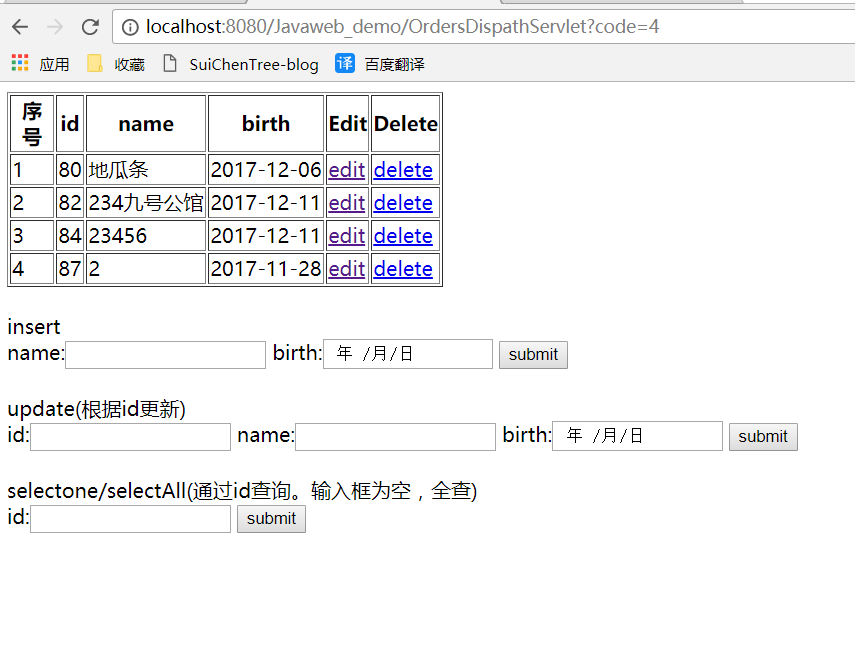

某个订单下的商品编辑页面：

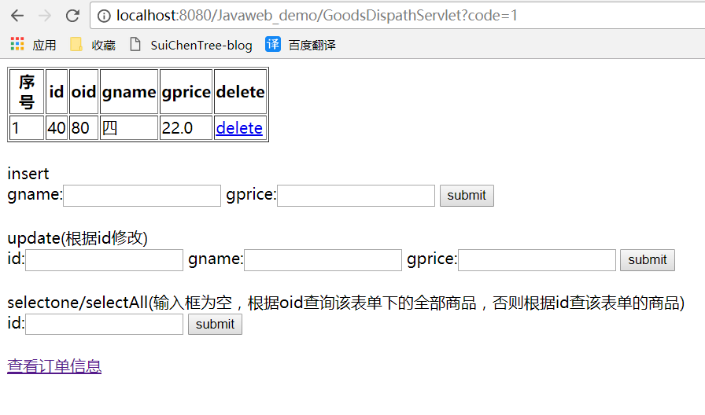


## 参考资料：
[Java Web(一) Servlet详解！！- - 一杯凉茶 - 博客园](http://www.cnblogs.com/whgk/p/6399262.html)
[Java Web(一) Servlet过滤器详解！！- - 一杯凉茶 - 博客园](http://blog.csdn.net/jiangwei0910410003/article/details/23372847)
[w3school](https://www.w3cschool.cn/)