[toc]
# Mybatis
## 概述：
&emsp;&emsp;MyBatis 是支持定制化 SQL、存储过程以及高级映射的优秀的持久层框架。MyBatis 避免了几乎所有的 JDBC 代码和手动设置参数以及获取结果集。MyBatis 可以对配置和原生Map使用简单的 XML 或注解，将接口和 Java 的 POJOs(Plain Old Java Objects,普通的 Java对象)映射成数据库中的记录。

## ORM框架：
目前流行的ORM框架：
JPA , [Hibernate](https://baike.baidu.com/item/Hibernate/206989?fr=aladdin) , <font color="red">Mybatis(半ORM框架)</font>

Hibernate： 会根据数据库的表的结构，自动生成SQL语句，它提供全面的数据库封装机制。
Mybatis：这里的半ORM框架，是相对与Hibernate 这种提供全面的数据库封装机制的“全自动化ORM框架”而言。mybatis不会为程序员在运行期间自动生成 sql 语句执行，具体的sql 语句需要程序员自己编写，然后通过映射配置文件，把sql语句与持久化类进行一一对应。

### 1.概述：
&emsp;&emsp;**对象关系映射**(<font color="red">Object Relational Mapping</font>，简称ORM，或O/RM，或O/R mapping），是一种程序技术，用于实现面向对象编程语言里不同类型系统的数据之间的转换。从效果上说，它其实是创建了一个可在编程语言里使用的--“虚拟对象数据库”。
&emsp;&emsp;对象关系映射技术:**<font color="red">用来把对象模型表示的对象映射到基于S Q L 的关系模型数据库结构中去</font>**。这样，我们在具体的操作实体对象的时候，就<strong color="blue">不需要再去和复杂的 SQ L 语句打交道，只需简单的操作实体对象的属性和方法</strong>。
O R M 技术是在对象和关系之间提供了一条桥梁，前台的对象型数据和数据库中的关系型的数据通过这个桥梁来相互转化。

### 2.ORM框架的基本映射方式：
1. 数据表映射类（持久化类/实体类/entity/pojo）：
&emsp;&emsp;数据库的一个表对应一个映射类（普通的javaBean类),程序对持久话类的操作，ORM框架会转化为对应的数据库表的操作（<font color="red">当程序使用这个持久化类生成实例化对象，删除对象，修改对象中的属性值时，会被自动转化为对数据表的对应的CRUD操作。</font>）。 
2. 数据表的行映射对象：
&emsp;&emsp;持久化类对产生许多实例化对象，<font color="red">每个实例化对象对应数据表的一行记录。</font>当程序操作对象，就相当与操作表中对应的一行记录。
3. 数据表的列（字段）映射对象的属性：
&emsp;&emsp;**当程序修改某个持久化类的某个实例化对象的属性时，就相当与修改某数据表的某一条记录的某一个列（字段）的数据。**


## mybatis的使用前提：

①要使用 MyBatis， 只需将 mybatis-x.x.x.jar 文件置于应用程序的 classpath 中即可。<font color="red">由于Mybatis的底层是基于JDBC 的，因此还要还少不了JDBC驱动的，不同的数据库使用不同的数据库驱动。我这里使用的是MySQL数据库。</font>

Mysql的数据库驱动 ： mysql-connector-java-5.1.42-bin.jar
Mybatis jar包：mybatis-3.4.3.jar

②如果使用 Maven 来构建项目，则需将下面的 dependency 代码置于 pom.xml 文件中：
```xml
<dependencies>    
<dependency>  
<groupId>org.mybatis</groupId>
<artifactId>mybatis</artifactId>  
<version>x.x.x</version>     <!--mybatis的版本号-->
</dependency>

<dependency>
    <groupId>mysql</groupId>
    <artifactId>mysql-connector-java</artifactId>
    <version>x.x.x</version>
</dependency>
</dependencies>
```

## Mybatis的XML方式使用：

porject 类视图(所建项目为Dynamic web project)：
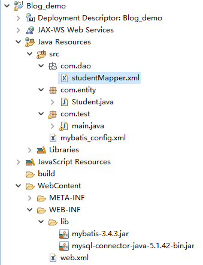

### ①安装MySQL,创建数据库,创建数据表：
安装mysql，===》<font color="red">请自行百度</font>
推荐一个数据库图形界面工具：[Navicat](http://www.navicat.com.cn/)

数据库截图：
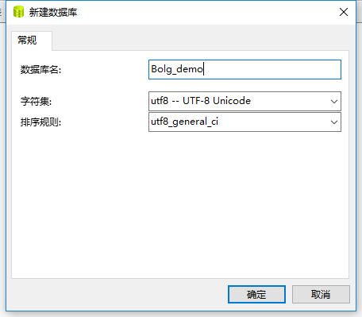
数据表截图：
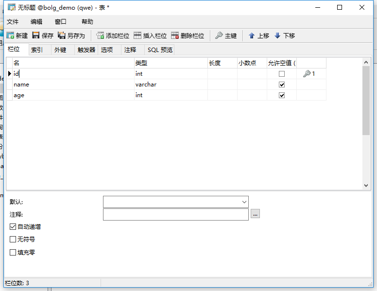

### ②创建持久化类（数据库映射类/javaBean/实体类）：
Student.java
```java
package com.entity;
public class Student {
	private Integer id;
	private String name;
	private Integer age;

	public Student(){}

	public Integer getId() {
		return id;
	}
	public void setId(Integer id) {
		this.id = id;
	}
	public String getName() {
		return name;
	}
	public void setName(String name) {
		this.name = name;
	}
	public Integer getAge() {
		return age;
	}
	public void setAge(Integer age) {
		this.age = age;
	}
	@Override
	public String toString() {
		return "Student [id=" + id + ", name=" + name + ", age=" + age + "]";
	}
}

```
### ③创建Mybatis_config.xml ， 数据库名字：blog_demo

Mybatis_config.xml ---<strong>通过mybatis配置文件来告诉mybatis 连接那个数据库，以及连接数据库的用户名，密码等信息。</strong>

```xml
<?xml version="1.0" encoding="UTF-8"?>
<!DOCTYPE configuration
 PUBLIC "-//mybatis.org//DTD Config 3.0//EN"
 "http://mybatis.org/dtd/mybatis-3-config.dtd">
<configuration>

<!--环境配置： 指定要连接的数据库-->
 <environments default="mysql">
 	<environment id="mysql">
 		<transactionManager type="JDBC"/>    <!-- 事务管理 -->
		 <dataSource type="POOLED">   <!-- datasource 数据源配置-->
		 		<property name="driver" value="com.mysql.jdbc.Driver"/>
		 		<property name="url" value="jdbc:mysql://localhost:3306/blog_demo?useUnicode=true&amp; characterEncoding=utf8"/>   
		 		<property name="username" value="root"/>
		 		<property name="password" value="123456"/>
		 </dataSource>
	</environment>
</environments>
 		
		<!-- mappers标签告诉mybatis去哪里找sql（持久化类的）映射文件 -->
		 <mappers>
		 		<mapper resource="com/dao/studentMapper.xml"/> 
		 </mappers>
		
</configuration>


```

### ④创建studentMapper.xml  ，数据表名字：student

studentMapper.xml----(<font color="red">Mybatis 通过XML 文件去完成持久化类与数据库表之间的映射关系</font>)

```xml
<?xml version="1.0" encoding="UTF-8"?>
<!DOCTYPE mapper
 PUBLIC "-//mybatis.org//DTD Mapper 3.0//EN"
 "http://mybatis.org/dtd/mybatis-3-mapper.dtd">

<!-- 为mapper指定唯一的命名空间，在不用接口式编程的情况下，随便取名 -->
<mapper namespace="com.dao.StudentMapper">

<!--#{id}:从传递过来的参数取出id值-->

<!--动态插入数据-->
<insert id="insertStudent" parameterType="com.entity.Student">         
insert into student
    <trim prefix="(" suffix=")" suffixOverrides="," >
		
    <if test='name != null and name != "" '>
             name,
    </if>
    <if test='age != null and age != "" '>
             age,
    </if>
     
    </trim>

	<trim prefix="values (" suffix=")" suffixOverrides="," >
		    <if test='name != null and name != "" '>
            		 #{name},
		    </if>
		    <if test='age != null and age != "" '>
		              #{age},
		    </if>
	</trim>
</insert>

<!-- 动态删除的sql语句 -->
<delete id="deleteStudent" parameterType="com.entity.Student">
delete from student where 1=1
		<if test="id !=null">and id=#{id}</if>
		<if test="name !=null">and name=#{name}</if>
		<if test="age !=null">and age=#{age}</if>
</delete>
		

<!--动态更新数据-->		
<update id="updateStudent" parameterType="com.entity.Student">
update student
	<trim prefix="set" suffixOverrides=",">
		<if test="name !=null">name=#{name},</if>
		<if test="age !=null">age=#{age},</if>
	</trim>
	where id=#{id}
</update>

<!--动态查询数据-->
<select id="selectStudent" resultType="com.entity.Student" parameterType="com.entity.Student">
	select * from student where 1=1
	 	<if test="id !=null">and id=#{id}</if>
		<if test="name !=null">and name=#{name}</if>
		<if test="age !=null">and age=#{age}</if>
</select>

<!-- 查询全部数据 -->
<select id="selectAllStudent" resultType="com.entity.Student">
		select * from student
</select>

</mapper>

```
### ⑤创建test类，main.java

main.java ---测试mybatis的CRUD操作：

```java
package com.test;

import java.io.IOException;
import java.io.InputStream;

import org.apache.ibatis.io.Resources;
import org.apache.ibatis.session.SqlSession;
import org.apache.ibatis.session.SqlSessionFactory;
import org.apache.ibatis.session.SqlSessionFactoryBuilder;

import com.entity.Student;

public class main {
	public static void main(String[] args) throws IOException {
		/*
		 * 1.通过输入流来读取mybatis的配置文件信息。告诉程序连接的数据库，用户名，密码。以及到哪里去寻找 持久化类与数据表的映射文件
		 * 2.通过xml配置文件信息，初始化mybatis ， 创建SqlSessionFactory
		 * 3.通过SqlSessionFactory，实例化session 对象
		 * 4.创建你要操作的数据对象
		 * 5.找到Mapper映射文件的对应的sql语句，通过映射文件袋命名空间+对应SQL语句的id ，例如："com.dao.StudentMapper.insertStudent"
		 * 6.对操作对象实行CRUD 方法
		 * */
		
		
		//通过这句来读取xml 配置文件的信息
		InputStream inputs=Resources.getResourceAsStream("mybatis_config.xml");
		//初始化mybatis ， 创建SqlSessionFactory，通过xml配置文件信息
		SqlSessionFactory ssf=new SqlSessionFactoryBuilder().build(inputs);
		//实例化session 对象，通过SqlSessionFactory
		SqlSession session=ssf.openSession();
		
		Student stu=new Student();
		stu.setName("xiaoming");
		stu.setAge(12);
		
		//找到Mapper映射文件的对应的sql语句，通过映射文件袋命名空间+对应SQL语句的id
		
		
//		session.insert("com.dao.StudentMapper.insertStudent", stu);
//		session.commit();         //提交到数据库，查询数据不用提交,对数据库的数据不修改的话，不用提交
		
		stu.setId(2);               //修改数据要知道id
		stu.setAge(33);
		session.update("com.dao.StudentMapper.updateStudent", stu);
		session.commit();        //提交到数据库，查询数据不用提交,对数据库的数据不修改的话，不用提交
		
		Student sa=session.selectOne("com.dao.StudentMapper.selectStudent", stu);
		System.out.println(sa);
		
		int a=session.delete("com.dao.StudentMapper.deleteStudent", stu);
		System.out.println(a);
		session.commit();        //提交到数据库，查询数据不用提交,对数据库的数据不修改的话，不用提交
		
		
		session.close();
		System.out.println("ss");
		
	}
}

```

## Mybatis 接口式编程方式， （相比之前调用数据库的方式，接口式编程的方式只要改动几个地方）：
&emsp;&emsp;接口式编程，我们可以简单的理解是<font color="red"> Mybatis 为连接持久化类与数据表之间的映射文件定义了一个代理接口，以后全部通过这个接口来和映射文件交互，而不再是使用以前方法。</font>
&emsp;&emsp;映射文件如何知道自己被哪个接口代理呢？这里就是通过名称空间来实现的，<strong>映射文件的名称空间再也不是随心所欲的定义的了，而是要使用代理接口的全限定名作为其名称空间。所谓全限定名，就是接口所在的包名加上接口名称。</strong>

<strong>类路径图：</strong>
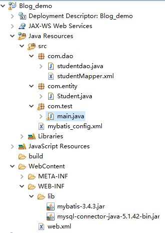

### ①：增加代理接口： studentdao.java 

```java
package com.dao;

import java.util.List;

import com.entity.Student;

public interface studentdao {
	/*
	 * mybatis的代理接口，
	 * 1.是一个接口，并且接口的全类名，必须是映射文件的命名空间的值
	 * 2.接口的方法名与映射文件的SQL语句的id值一一对应。
	 * 3.方法的参数，也与SQL语句的的参数一一对应。
	 * */
	
	public int insertStudent(Student stu);
	public int deleteStudent(Student stu);
	public int updateStudent(Student stu);
	public Student selectStudent(Student stu);
	public List<Student> selectAllStudent();
	
}

```

### ②：修改映射文件的命名空间的值---studentMapper.xml 的命名空间：
```xml
<?xml version="1.0" encoding="UTF-8"?>
<!DOCTYPE mapper
 PUBLIC "-//mybatis.org//DTD Mapper 3.0//EN"
 "http://mybatis.org/dtd/mybatis-3-mapper.dtd">

<!-- 为mapper指定唯一的命名空间，在不用接口式编程的情况下，随便取名,用接口式编程的情况时，应该为代理接口的全类名 -->
<mapper namespace="com.dao.studentdao">
......

```

###  ③测试类 ，main.java 
```java
package com.test;

import java.io.IOException;
import java.io.InputStream;

import org.apache.ibatis.io.Resources;
import org.apache.ibatis.session.SqlSession;
import org.apache.ibatis.session.SqlSessionFactory;
import org.apache.ibatis.session.SqlSessionFactoryBuilder;

import com.dao.studentdao;
import com.entity.Student;

public class main {
	public static void main(String[] args) throws IOException {
		/*
		 * 1.通过输入流来读取mybatis的配置文件信息。告诉程序连接的数据库，用户名，密码。以及到哪里去寻找 持久化类与数据表的映射文件
		 * 2.通过xml配置文件信息，初始化mybatis ， 创建SqlSessionFactory
		 * 3.通过SqlSessionFactory，实例化session 对象
		 * 4.: 通过session对象，用反射的方式，获取代理接口的实例化对象。
		 * 5.创建你要操作的数据对象
		 * 6.用代理接口的方法，实现对数据库的CRUD
		 * 
		 * */
		
		
		//通过这句来读取xml 配置文件的信息
		InputStream inputs=Resources.getResourceAsStream("mybatis_config.xml");
		//初始化mybatis ， 创建SqlSessionFactory，通过xml配置文件信息
		SqlSessionFactory ssf=new SqlSessionFactoryBuilder().build(inputs);
		//实例化session 对象，通过SqlSessionFactory
		SqlSession session=ssf.openSession();
		
		//通过session对象，用反射的方式，获取代理接口的实例化对象，这段代码，相当于实例化接口对象
		studentdao studao=session.getMapper(studentdao.class);
		
		
		Student stu=new Student();
		stu.setName("xiaoming");
		stu.setAge(12);
		
//		int a=studao.insertStudent(stu);
//		System.out.println(a);
//		session.commit();            //提交到数据库，查询数据不用提交,对数据库的数据不修改的话，不用提交
		
		stu.setId(3);               
		stu.setAge(33);
		studao.updateStudent(stu);  //修改数据要知道id
		session.commit();        //提交到数据库，查询数据不用提交,对数据库的数据不修改的话，不用提交
		
		Student sa=studao.selectStudent(stu);
		System.out.println(sa);
		
		int asc=studao.deleteStudent(stu);
		System.out.println(asc);
		session.commit();        //提交到数据库，查询数据不用提交,对数据库的数据不修改的话，不用提交
		
		session.close();
		System.out.println("ss");
		
	}
}

```

## <font color="red">ResultMap</font>:

### 1.ResultMap的作用概述：
&emsp;&emsp;MyBatis中在查询进行select映射的时候，返回类型可以用resultType，也可以用resultMap，resultType是直接表示返回类型的，而resultMap则是对外部ResultMap的引用（<font color="red">相当于自定义结果集映射规则</font>），但是<strong>resultType跟resultMap不能同时存在</strong>。

&emsp;&emsp;在MyBatis进行查询映射时,<font color="blue">由于Mybatis的底层是JDBC，其实查询出来的每一个属性都是放在一个对应的Map里面的，其中键是属性名，值则是其对应的值。</font>

&emsp;&emsp;①当提供的返回类型属性是resultType时，<font color="red">MyBatis会将Map里面的键值对取出赋给resultType所指定的对象对应的属性。所以其实MyBatis的每一个查询映射的返回类型都是ResultMap，只是当提供的返回类型属性是resultType的时候，MyBatis对自动的给把对应的值赋给resultType所指定对象的属性。</font>
&emsp;&emsp;②当提供的返回类型是resultMap时，因为Map不能很好表示领域模型，就需要自己再进一步的把它转化为对应的对象，这常常在复杂查询中很有作用<font color="green">(需要程序员自定义结果集映射规则，手动的把查询的结果一个一个转化为想要对应的对象)</font>。

### 2.若表的列名与持久化类的属性名不相同，可用ResultMap解决：

<font color="red">这段代码中，student表的列名为 sid,sname,sage,而持久化类(实体类)的属性为 id, name,age</font>

studentMapper.xml
```xml

<select id="selectStudentByid" resultMap="rem">
		select * where id=#{id}
</select>

<!--resultMap 的 id值与 select标签的resultMap的值相同,表明这两个标签互相联系-->

<resultMap type="com.entity.Student" id="rem">
	<id property="id" column="sid"/>  <!-- id 标签指的是该列为主键列，result标签代表普通列-->
	<result property="name" column="sname"/>
	<result property="age" column="sage"/>
</resultMap>

```

### 3.一对一关联查询（association标签）：

参考链接：
[MyBatis两张表字段名相同产生的问题](http://blog.csdn.net/lee4037/article/details/16798941)

&emsp;&emsp;生活中有许多涉及到一对一关联查询的例子，例如，<font color="red">把学生作为中心，一个学生只能有一个班级。查询某个学生时，把他所在的班级也查出来。</font>

1. 增加school_class表：
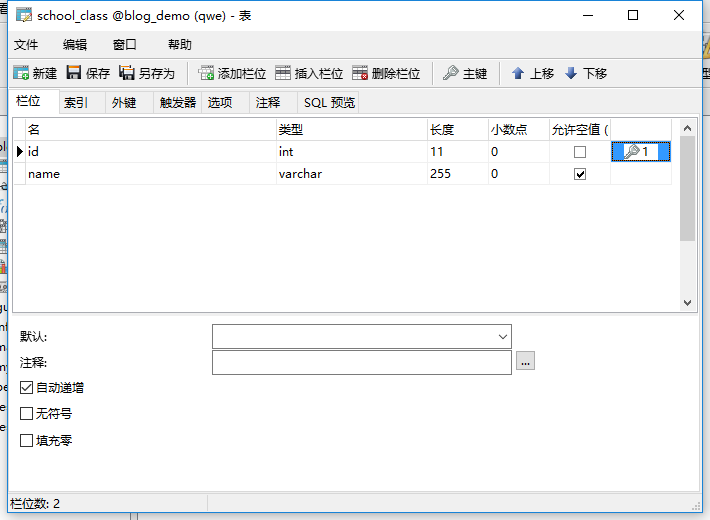

2. 修改student表（<font color="red">增加class_id 列,class_id 列与school_class的id列 对应。没有设置外键<font>）:
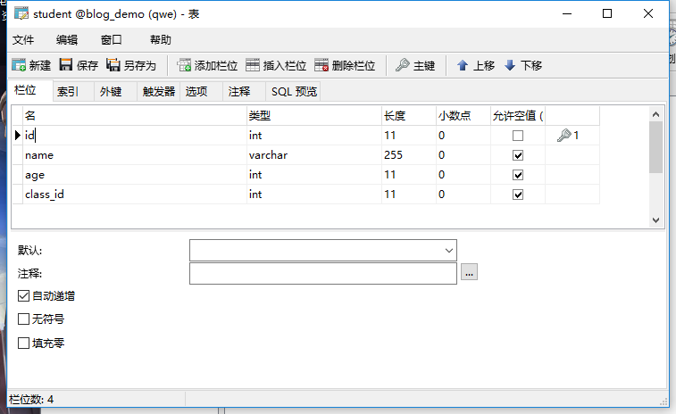
2.5，修改Student的javaBean：
```java
private School_class sclass;       //这个字段用来表示学生的班级,其对应的列名为class_id

public School_class getSclass() {
		return sclass;
}

public void setSclass(School_class sclass) {
		this.sclass = sclass;
}

@Override
public String toString() {
		return "Student [id=" + id + ", name=" + name + ", age=" + age
				+ ", sclass=" + sclass + "]";
}

```

3. 编写School_class的javaBean对象，这个对应school_class表的持久化类，


4. 在StudentMapper的映射文件中使用ResultMap：
&emsp;&emsp;<font color="red">执行select标签时，会根据与其相联系的resultMap 标签来进行结果集映射</font>
<strong>有两种方法：</strong>

数据库中执行sql语句：
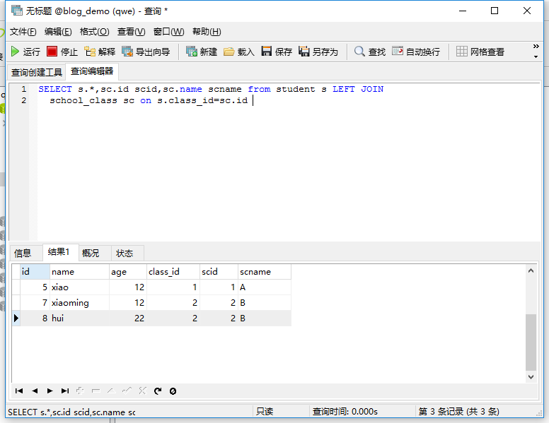
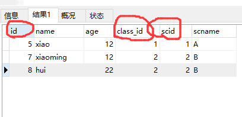
①：使用别名
```xml

<select id="selectStudent" resultMap="one_one_select" parameterType="com.entity.Student">
	SELECT s.*,sc.id scid,sc.name scname from student s LEFT JOIN 
	
<!--这里的sql语句使用了 left join...on..关联查询，，scid 是sid的别名，scname是sc.name的别名，s 是student表的别名，sc 是school——class的别名-->

	school_class sc on s.class_id=sc.id where 1=1 
	
	<if test="id !=null">and s.id=#{id}</if>
	 <if test="name !=null">and s.name=#{name}</if>
</select>

<!--resultMap 的 id值与 select标签的resultMap的值相同,表明这两个标签互相联系-->


<resultMap type="com.entity.Student" id="one_one_select">
	<id property="id" column="id"/>
	<result property="name" column="name"/>
	<result property="age" column="age"/>
 
   <association property="sclass" column="class_id" javaType="com.entity.School_class">
	 <id property="id" column="scid"/>
     <result property="name" column="scname"/>

	 <!--scid 是sid的别名，scname是sc.name的别名-->

   </association> 
	
</resultMap>


```

②：在sql语句执行时，在执行另一个sql语句
```xml
<select id="selectStudent2" resultMap="one_one_select2" parameterType="com.entity.Student">
	SELECT s.*,sc.id scid,sc.name scname from student s LEFT JOIN 
	school_class sc on s.class_id=sc.id where 1=1 
	
	<if test="id !=null">and s.id=#{id}</if>
	<if test="name !=null">and s.name=#{name}</if>
</select>

<resultMap type="com.entity.Student" id="one_one_select2">
	<id property="id" column="id"/>
	<result property="name" column="name"/>
	<result property="age" column="age"/>
 
   <association property="sclass" column="class_id" javaType="com.entity.School_class" select="selectClass"/>
 <!--select的值，表示执行一条sql语句，select的值指向id为select属性值的select标签。并把执行sql语句的结果，封装到property 代表的对象中。-->
  	
</resultMap>

<select id="selectClass" resultType="com.entity.School_class" parameterType="com.entity.School_class">
	select * from school_class where id=#{id}
</select>


```


5. 测试：

main.java:
```java
		//通过这句来读取xml 配置文件的信息
		InputStream inputs=Resources.getResourceAsStream("mybatis_config.xml");
		//初始化mybatis ， 创建SqlSessionFactory，通过xml配置文件信息
		SqlSessionFactory ssf=new SqlSessionFactoryBuilder().build(inputs);
		//实例化session 对象，通过SqlSessionFactory
		SqlSession session=ssf.openSession();
		
		//通过session对象，用反射的方式，获取代理接口的实例化对象，这段代码，相当于实例化接口对象
		studentdao studao=session.getMapper(studentdao.class);
		
		Student stu=new Student();
		stu.setName("xiao");
		
		Student s = studao.selectStudent(stu); //selectStudent为代理接口（studentdao）的动态查询数据的方法。
		System.out.println(s);
		System.out.println(s.getSclass());

```
6. 结果截图：
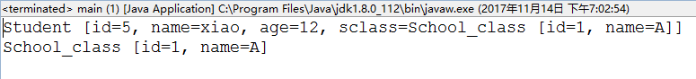

### 4.一对多关联查询（collection标签）：
参考链接：
[一对多表关系详解](http://blog.csdn.net/xzm_rainbow/article/details/15336933)

&emsp;&emsp;生活中，如果以班级为中心的话,<font color="red">一个班级可以有多个学生，这相当与一对多的关系。查询某个班级时，把班级所在的多个学生也查询出来。</font>

1. 添加代码，School_class 的javaBean
```java
private List<Student> stulist;    //一个班可以有多个学生，使用list集合

public List<Student> getStulist() {
		return stulist;
}	
public void setStulist(List<Student> stulist) {
		this.stulist = stulist;
}
@Override
public String toString() {
		return "School_class [id=" + id + ", name=" + name + ", stulist="+ stulist + "]";
}
```
2. 添加代码到mybatis的配置文件：
```xml
<mappers>
	<mapper resource="com/dao/studentMapper.xml"/> 
	<mapper resource="com/dao/School_classMapper.xml"/> 
</mappers>
```
3. 添加代码，到School_classMapper.xml
<strong>测试sql语句：</strong>
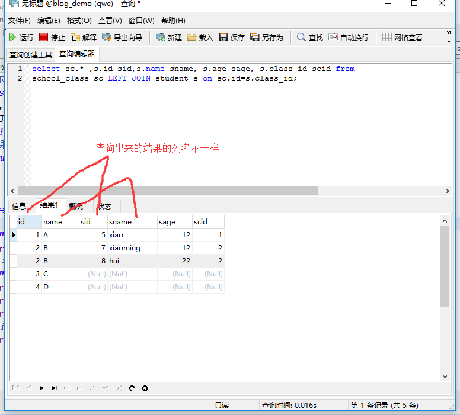
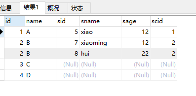
```xml
<mapper namespace="com.dao.School_classdao">

<!--#{id}:从传递过来的参数取出id值-->
<select id="selectclass_stu" resultMap="one_to_more">
select sc.* ,s.id sid,s.name sname, s.age sage, s.class_id scid from 
school_class sc LEFT JOIN student s on sc.id=s.class_id where 1=1
		<if test=" id!=null ">and sc.id=#{id}</if>
		<!-- 这段表示，如果传来的参数中的id 不为null，则参数的id的值赋值给sql语句的sc.id -->
		<if test=" name!=null ">and sc.name=#{name}</if>
		
</select>

<resultMap type="com.entity.School_class" id="one_to_more">
	<id property="id" column="id"/>
	<!-- 这段表示，把查询出来的id列的值赋值给School_class的id属性 -->
	<result property="name" column="name"/>
	<collection property="stulist" ofType="com.entity.Student">  
	<!-- ofType:表示集合当中的类型，本例子为Student类型，sid在sql语句中为s.id的别名 ，-->
		<id property="id" column="sid"/>
		<!-- 这段表示，把查询出来的sid列的值赋值给Student的id属性 -->
		<result property="name" column="sname"/>
		<result property="age" column="sage"/>
		<result property="sclass.id" column="scid"/>
		<!-- 这段表示，查询出来的scid列的值，赋值给Student的sclass属性的id字段 -->
		<result property="sclass.name" column="sname"/>
	</collection>

</resultMap>
```
4. 测试：
```java
...
School_classdao mapper =session.getMapper(School_classdao.class);
School_class sc=new School_class();
sc.setName("A");
School_class selectclass_stu = mapper.selectclass_stu(sc);
System.out.println(selectclass_stu);
```
<strong>运行结果：</strong>
School_class [id=1, name=A, stulist=[Student [id=5,name=xiao, age=12, sclass=School_class [id=1, name=null,stulist=null]]]]


### 5.多对多关联查询：