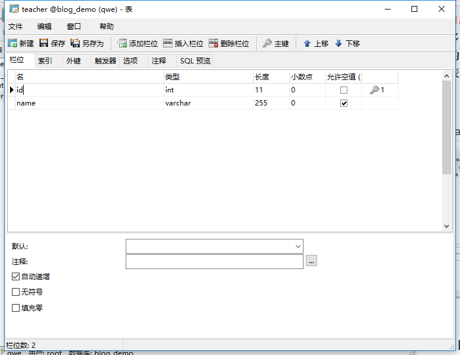
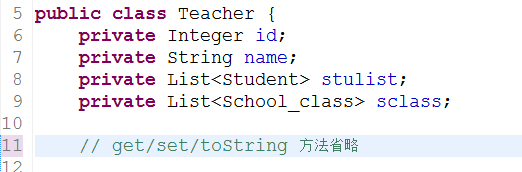
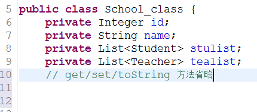
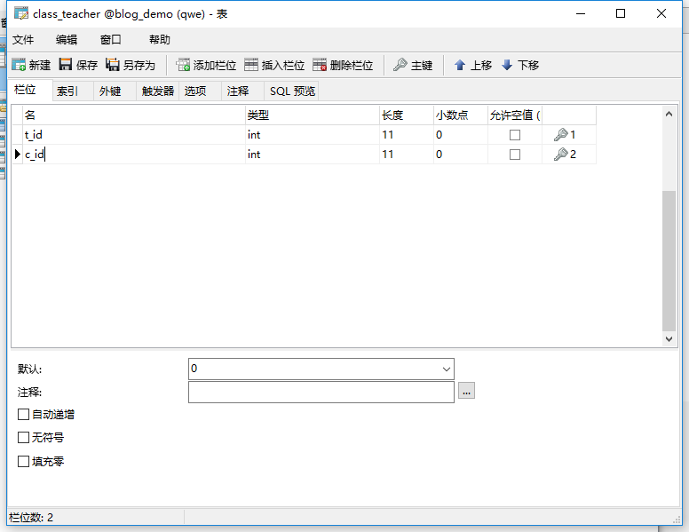
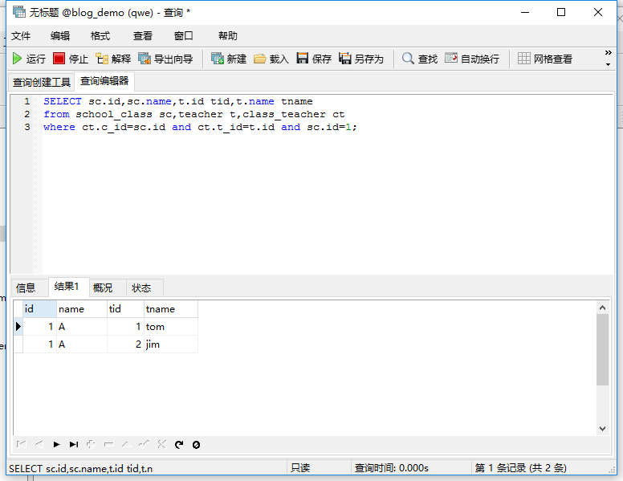
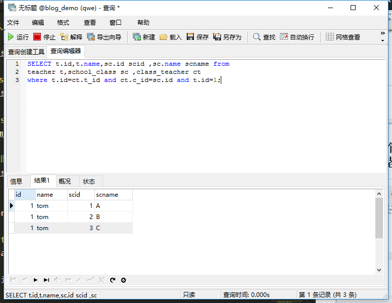
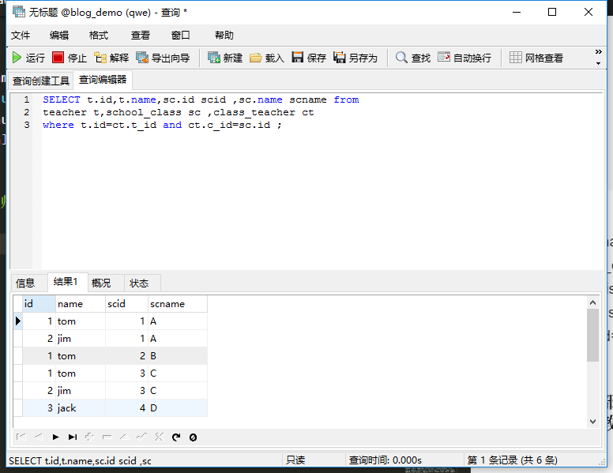

[toc]
# Mybatis
## 概述：
&emsp;&emsp;MyBatis 是支持定制化 SQL、存储过程以及高级映射的优秀的持久层框架。MyBatis 避免了几乎所有的 JDBC 代码和手动设置参数以及获取结果集。MyBatis 可以对配置和原生Map使用简单的 XML 或注解，将接口和 Java 的 POJOs(Plain Old Java Objects,普通的 Java对象)映射成数据库中的记录。

## ORM框架：
目前流行的ORM框架：
JPA , [Hibernate](https://baike.baidu.com/item/Hibernate/206989?fr=aladdin) , <font color="red">Mybatis(半ORM框架)</font>

Hibernate： 会根据数据库的表的结构，自动生成SQL语句，它提供全面的数据库封装机制。
Mybatis：这里的半ORM框架，是相对与Hibernate 这种提供全面的数据库封装机制的“全自动化ORM框架”而言。mybatis不会为程序员在运行期间自动生成 sql 语句执行，具体的sql 语句需要程序员自己编写，然后通过映射配置文件，把sql语句与持久化类进行一一对应。

### 1.概述：
&emsp;&emsp;**对象关系映射**(<font color="red">Object Relational Mapping</font>，简称ORM，或O/RM，或O/R mapping），是一种程序技术，用于实现面向对象编程语言里不同类型系统的数据之间的转换。从效果上说，它其实是创建了一个可在编程语言里使用的--“虚拟对象数据库”。
&emsp;&emsp;对象关系映射技术:**<font color="red">用来把对象模型表示的对象映射到基于S Q L 的关系模型数据库结构中去</font>**。这样，我们在具体的操作实体对象的时候，就<strong color="blue">不需要再去和复杂的 SQ L 语句打交道，只需简单的操作实体对象的属性和方法</strong>。
O R M 技术是在对象和关系之间提供了一条桥梁，前台的对象型数据和数据库中的关系型的数据通过这个桥梁来相互转化。

### 2.ORM框架的基本映射方式：
1. 数据表映射类（持久化类/实体类/entity/pojo）：
&emsp;&emsp;数据库的一个表对应一个映射类（普通的javaBean类),程序对持久话类的操作，ORM框架会转化为对应的数据库表的操作（<font color="red">当程序使用这个持久化类生成实例化对象，删除对象，修改对象中的属性值时，会被自动转化为对数据表的对应的CRUD操作。</font>）。 
2. 数据表的行映射对象：
&emsp;&emsp;持久化类对产生许多实例化对象，<font color="red">每个实例化对象对应数据表的一行记录。</font>当程序操作对象，就相当与操作表中对应的一行记录。
3. 数据表的列（字段）映射对象的属性：
&emsp;&emsp;**当程序修改某个持久化类的某个实例化对象的属性时，就相当与修改某数据表的某一条记录的某一个列（字段）的数据。**


## mybatis的使用前提：

①要使用 MyBatis， 只需将 mybatis-x.x.x.jar 文件置于应用程序的 classpath 中即可。<font color="red">由于Mybatis的底层是基于JDBC 的，因此还要还少不了JDBC驱动的，不同的数据库使用不同的数据库驱动。我这里使用的是MySQL数据库。</font>

Mysql的数据库驱动 ： mysql-connector-java-5.1.42-bin.jar
Mybatis jar包：mybatis-3.4.3.jar

②如果使用 Maven 来构建项目，则需将下面的 dependency 代码置于 pom.xml 文件中：
```xml
<dependencies>    
<dependency>  
<groupId>org.mybatis</groupId>
<artifactId>mybatis</artifactId>  
<version>x.x.x</version>     <!--mybatis的版本号-->
</dependency>

<dependency>
    <groupId>mysql</groupId>
    <artifactId>mysql-connector-java</artifactId>
    <version>x.x.x</version>
</dependency>
</dependencies>
```

## Mybatis的XML方式使用：

porject 类视图(所建项目为Dynamic web project)：


### ①安装MySQL,创建数据库,创建数据表：
安装mysql，===》<font color="red">请自行百度</font>
推荐一个数据库图形界面工具：[Navicat](http://www.navicat.com.cn/)

数据库截图：

数据表截图：


### ②创建持久化类（数据库映射类/javaBean/实体类）：
Student.java
```java
package com.entity;
public class Student {
	private Integer id;
	private String name;
	private Integer age;

	public Student(){}

	public Integer getId() {
		return id;
	}
	public void setId(Integer id) {
		this.id = id;
	}
	public String getName() {
		return name;
	}
	public void setName(String name) {
		this.name = name;
	}
	public Integer getAge() {
		return age;
	}
	public void setAge(Integer age) {
		this.age = age;
	}
	@Override
	public String toString() {
		return "Student [id=" + id + ", name=" + name + ", age=" + age + "]";
	}
}

```
### ③创建Mybatis_config.xml ， 数据库名字：blog_demo

Mybatis_config.xml ---<strong>通过mybatis配置文件来告诉mybatis 连接那个数据库，以及连接数据库的用户名，密码等信息。</strong>

```xml
<?xml version="1.0" encoding="UTF-8"?>
<!DOCTYPE configuration
 PUBLIC "-//mybatis.org//DTD Config 3.0//EN"
 "http://mybatis.org/dtd/mybatis-3-config.dtd">
<configuration>

<!--环境配置： 指定要连接的数据库-->
 <environments default="mysql">
 	<environment id="mysql">
 		<transactionManager type="JDBC"/>    <!-- 事务管理 -->
		 <dataSource type="POOLED">   <!-- datasource 数据源配置-->
		 		<property name="driver" value="com.mysql.jdbc.Driver"/>
		 		<property name="url" value="jdbc:mysql://localhost:3306/blog_demo?useUnicode=true&amp; characterEncoding=utf8"/>   
		 		<property name="username" value="root"/>
		 		<property name="password" value="123456"/>
		 </dataSource>
	</environment>
</environments>
 		
		<!-- mappers标签告诉mybatis去哪里找sql（持久化类的）映射文件 -->
		 <mappers>
		 		<mapper resource="com/dao/studentMapper.xml"/> 
		 </mappers>
		
</configuration>


```

### ④创建studentMapper.xml  ，数据表名字：student

studentMapper.xml----(<font color="red">Mybatis 通过XML 文件去完成持久化类与数据库表之间的映射关系</font>)

```xml
<?xml version="1.0" encoding="UTF-8"?>
<!DOCTYPE mapper
 PUBLIC "-//mybatis.org//DTD Mapper 3.0//EN"
 "http://mybatis.org/dtd/mybatis-3-mapper.dtd">

<!-- 为mapper指定唯一的命名空间，在不用接口式编程的情况下，随便取名 -->
<mapper namespace="com.dao.StudentMapper">

<!--#{id}:从传递过来的参数取出id值-->

<!--动态插入数据-->
<insert id="insertStudent" parameterType="com.entity.Student">         
insert into student
    <trim prefix="(" suffix=")" suffixOverrides="," >
		
    <if test='name != null and name != "" '>
             name,
    </if>
    <if test='age != null and age != "" '>
             age,
    </if>
     
    </trim>

	<trim prefix="values (" suffix=")" suffixOverrides="," >
		    <if test='name != null and name != "" '>
            		 #{name},
		    </if>
		    <if test='age != null and age != "" '>
		              #{age},
		    </if>
	</trim>
</insert>

<!-- 动态删除的sql语句 -->
<delete id="deleteStudent" parameterType="com.entity.Student">
delete from student where 1=1
		<if test="id !=null">and id=#{id}</if>
		<if test="name !=null">and name=#{name}</if>
		<if test="age !=null">and age=#{age}</if>
</delete>
		

<!--动态更新数据-->		
<update id="updateStudent" parameterType="com.entity.Student">
update student
	<trim prefix="set" suffixOverrides=",">
		<if test="name !=null">name=#{name},</if>
		<if test="age !=null">age=#{age},</if>
	</trim>
	where id=#{id}
</update>

<!--动态查询数据-->
<select id="selectStudent" resultType="com.entity.Student" parameterType="com.entity.Student">
	select * from student where 1=1
	 	<if test="id !=null">and id=#{id}</if>
		<if test="name !=null">and name=#{name}</if>
		<if test="age !=null">and age=#{age}</if>
</select>

<!-- 查询全部数据 -->
<select id="selectAllStudent" resultType="com.entity.Student">
		select * from student
</select>

</mapper>

```
### ⑤创建test类，main.java

main.java ---测试mybatis的CRUD操作：

```java
package com.test;

import java.io.IOException;
import java.io.InputStream;

import org.apache.ibatis.io.Resources;
import org.apache.ibatis.session.SqlSession;
import org.apache.ibatis.session.SqlSessionFactory;
import org.apache.ibatis.session.SqlSessionFactoryBuilder;

import com.entity.Student;

public class main {
	public static void main(String[] args) throws IOException {
		/*
		 * 1.通过输入流来读取mybatis的配置文件信息。告诉程序连接的数据库，用户名，密码。以及到哪里去寻找 持久化类与数据表的映射文件
		 * 2.通过xml配置文件信息，初始化mybatis ， 创建SqlSessionFactory
		 * 3.通过SqlSessionFactory，实例化session 对象
		 * 4.创建你要操作的数据对象
		 * 5.找到Mapper映射文件的对应的sql语句，通过映射文件袋命名空间+对应SQL语句的id ，例如："com.dao.StudentMapper.insertStudent"
		 * 6.对操作对象实行CRUD 方法
		 * */
		
		
		//通过这句来读取xml 配置文件的信息
		InputStream inputs=Resources.getResourceAsStream("mybatis_config.xml");
		//初始化mybatis ， 创建SqlSessionFactory，通过xml配置文件信息
		SqlSessionFactory ssf=new SqlSessionFactoryBuilder().build(inputs);
		//实例化session 对象，通过SqlSessionFactory
		SqlSession session=ssf.openSession();
		
		Student stu=new Student();
		stu.setName("xiaoming");
		stu.setAge(12);
		
		//找到Mapper映射文件的对应的sql语句，通过映射文件袋命名空间+对应SQL语句的id
		
		
//		session.insert("com.dao.StudentMapper.insertStudent", stu);
//		session.commit();         //提交到数据库，查询数据不用提交,对数据库的数据不修改的话，不用提交
		
		stu.setId(2);               //修改数据要知道id
		stu.setAge(33);
		session.update("com.dao.StudentMapper.updateStudent", stu);
		session.commit();        //提交到数据库，查询数据不用提交,对数据库的数据不修改的话，不用提交
		
		Student sa=session.selectOne("com.dao.StudentMapper.selectStudent", stu);
		System.out.println(sa);
		
		int a=session.delete("com.dao.StudentMapper.deleteStudent", stu);
		System.out.println(a);
		session.commit();        //提交到数据库，查询数据不用提交,对数据库的数据不修改的话，不用提交
		
		
		session.close();
		System.out.println("ss");
		
	}
}

```

## Mybatis 接口式编程方式， （相比之前调用数据库的方式，接口式编程的方式只要改动几个地方）：
&emsp;&emsp;接口式编程，我们可以简单的理解是<font color="red"> Mybatis 为连接持久化类与数据表之间的映射文件定义了一个代理接口，以后全部通过这个接口来和映射文件交互，而不再是使用以前方法。</font>
&emsp;&emsp;映射文件如何知道自己被哪个接口代理呢？这里就是通过名称空间来实现的，<strong>映射文件的名称空间再也不是随心所欲的定义的了，而是要使用代理接口的全限定名作为其名称空间。所谓全限定名，就是接口所在的包名加上接口名称。</strong>

<strong>类路径图：</strong>


### ①：增加代理接口： studentdao.java 

```java
package com.dao;

import java.util.List;

import com.entity.Student;

public interface studentdao {
	/*
	 * mybatis的代理接口，
	 * 1.是一个接口，并且接口的全类名，必须是映射文件的命名空间的值
	 * 2.接口的方法名与映射文件的SQL语句的id值一一对应。
	 * 3.方法的参数，也与SQL语句的的参数一一对应。
	 * */
	
	public int insertStudent(Student stu);
	public int deleteStudent(Student stu);
	public int updateStudent(Student stu);
	public Student selectStudent(Student stu);
	public List<Student> selectAllStudent();
	
}

```

### ②：修改映射文件的命名空间的值---studentMapper.xml 的命名空间：
```xml
<?xml version="1.0" encoding="UTF-8"?>
<!DOCTYPE mapper
 PUBLIC "-//mybatis.org//DTD Mapper 3.0//EN"
 "http://mybatis.org/dtd/mybatis-3-mapper.dtd">

<!-- 为mapper指定唯一的命名空间，在不用接口式编程的情况下，随便取名,用接口式编程的情况时，应该为代理接口的全类名 -->
<mapper namespace="com.dao.studentdao">
......

```

###  ③测试类 ，main.java 
```java
package com.test;

import java.io.IOException;
import java.io.InputStream;

import org.apache.ibatis.io.Resources;
import org.apache.ibatis.session.SqlSession;
import org.apache.ibatis.session.SqlSessionFactory;
import org.apache.ibatis.session.SqlSessionFactoryBuilder;

import com.dao.studentdao;
import com.entity.Student;

public class main {
	public static void main(String[] args) throws IOException {
		/*
		 * 1.通过输入流来读取mybatis的配置文件信息。告诉程序连接的数据库，用户名，密码。以及到哪里去寻找 持久化类与数据表的映射文件
		 * 2.通过xml配置文件信息，初始化mybatis ， 创建SqlSessionFactory
		 * 3.通过SqlSessionFactory，实例化session 对象
		 * 4.: 通过session对象，用反射的方式，获取代理接口的实例化对象。
		 * 5.创建你要操作的数据对象
		 * 6.用代理接口的方法，实现对数据库的CRUD
		 * 
		 * */
		
		
		//通过这句来读取xml 配置文件的信息
		InputStream inputs=Resources.getResourceAsStream("mybatis_config.xml");
		//初始化mybatis ， 创建SqlSessionFactory，通过xml配置文件信息
		SqlSessionFactory ssf=new SqlSessionFactoryBuilder().build(inputs);
		//实例化session 对象，通过SqlSessionFactory
		SqlSession session=ssf.openSession();
		
		//通过session对象，用反射的方式，获取代理接口的实例化对象，这段代码，相当于实例化接口对象
		studentdao studao=session.getMapper(studentdao.class);
		
		
		Student stu=new Student();
		stu.setName("xiaoming");
		stu.setAge(12);
		
//		int a=studao.insertStudent(stu);
//		System.out.println(a);
//		session.commit();            //提交到数据库，查询数据不用提交,对数据库的数据不修改的话，不用提交
		
		stu.setId(3);               
		stu.setAge(33);
		studao.updateStudent(stu);  //修改数据要知道id
		session.commit();        //提交到数据库，查询数据不用提交,对数据库的数据不修改的话，不用提交
		
		Student sa=studao.selectStudent(stu);
		System.out.println(sa);
		
		int asc=studao.deleteStudent(stu);
		System.out.println(asc);
		session.commit();        //提交到数据库，查询数据不用提交,对数据库的数据不修改的话，不用提交
		
		session.close();
		System.out.println("ss");
		
	}
}

```

## <font color="red">ResultMap（注释很重要）</font>:

### 1.ResultMap的作用概述：
&emsp;&emsp;MyBatis中在查询进行select映射的时候，返回类型可以用resultType，也可以用resultMap，resultType是直接表示返回类型的，而resultMap则是对外部ResultMap的引用（<font color="red">相当于自定义结果集映射规则</font>），但是<strong>resultType跟resultMap不能同时存在</strong>。

&emsp;&emsp;在MyBatis进行查询映射时,<font color="blue">由于Mybatis的底层是JDBC，其实查询出来的每一个属性都是放在一个对应的Map里面的，其中键是属性名，值则是其对应的值。</font>

&emsp;&emsp;①当提供的返回类型属性是resultType时，<font color="red">MyBatis会将Map里面的键值对取出赋给resultType所指定的对象对应的属性。所以其实MyBatis的每一个查询映射的返回类型都是ResultMap，只是当提供的返回类型属性是resultType的时候，MyBatis对自动的给把对应的值赋给resultType所指定对象的属性。</font>
&emsp;&emsp;②当提供的返回类型是resultMap时，因为Map不能很好表示领域模型，就需要自己再进一步的把它转化为对应的对象，这常常在复杂查询中很有作用<font color="green">(需要程序员自定义结果集映射规则，手动的把查询的结果一个一个转化为想要对应的对象)</font>。

### 2.若表的列名与持久化类的属性名不相同，可用ResultMap解决：

<font color="red">这段代码中，student表的列名为 sid,sname,sage,而持久化类(实体类)的属性为 id, name,age</font>

studentMapper.xml
```xml

<select id="selectStudentByid" resultMap="rem">
		select * where id=#{id}
</select>

<!--resultMap 的 id值与 select标签的resultMap的值相同,表明这两个标签互相联系-->

<resultMap type="com.entity.Student" id="rem">
	<id property="id" column="sid"/>  <!-- id 标签指的是该列为主键列，result标签代表普通列-->
	<result property="name" column="sname"/>
	<result property="age" column="sage"/>
</resultMap>

```

### 3.一对一关联查询（association标签）：

参考链接：
[MyBatis两张表字段名相同产生的问题](http://blog.csdn.net/lee4037/article/details/16798941)

&emsp;&emsp;生活中有许多涉及到一对一关联查询的例子，例如，<font color="red">把学生作为中心，一个学生只能有一个班级。查询某个学生时，把他所在的班级也查出来。</font>

1. 增加school_class表：


2. 修改student表（<font color="red">增加class_id 列,class_id 列与school_class的id列 对应。没有设置外键<font>）:

2.5，修改Student的javaBean：
```java
private School_class sclass;       //这个字段用来表示学生的班级,其对应的列名为class_id

public School_class getSclass() {
		return sclass;
}

public void setSclass(School_class sclass) {
		this.sclass = sclass;
}

@Override
public String toString() {
		return "Student [id=" + id + ", name=" + name + ", age=" + age
				+ ", sclass=" + sclass + "]";
}

```

3. 编写School_class的javaBean对象，这个对应school_class表的持久化类，


4. 在StudentMapper的映射文件中使用ResultMap：
&emsp;&emsp;<font color="red">执行select标签时，会根据与其相联系的resultMap 标签来进行结果集映射</font>
<strong>有三种方法：</strong>

数据库中执行sql语句：


<font color="red">①不使用association标签，使用级联属性封装结果集</font>
StudentMapper.xml
```xml
<select id="selectStudent" resultMap="one_one_select_gai" parameterType="com.entity.Student">
	SELECT s.*,sc.id scid,sc.name scname from student s LEFT JOIN 
	
	school_class sc on s.class_id=sc.id where 1=1 
	
	<if test="id !=null">and s.id=#{id}</if>
	 <if test="name !=null">and s.name=#{name}</if>
</select>

<resultMap type="com.entity.Student" id="one_one_select_gai">
	<id property="id" column="id"/>
	<result property="name" column="name"/>
	<result property="age" column="age"/>
	<!--property="sclass.id"表示Student的sclass属性的id属性，把查询出来的scid的列的值，赋值给它  -->
 	<result property="sclass.id" column="scid"/>
 	<result property="sclass.name" column="scname"/>
 	
</resultMap>
```

<font color="red">②：association 使用别名（嵌套查询）</font>
```xml

<select id="selectStudent" resultMap="one_one_select" parameterType="com.entity.Student">
	SELECT s.*,sc.id scid,sc.name scname from student s LEFT JOIN 
	
<!--这里的sql语句使用了 left join...on..关联查询，，scid 是sid的别名，scname是sc.name的别名，s 是student表的别名，sc 是school——class的别名-->

	school_class sc on s.class_id=sc.id where 1=1 
	
	<if test="id !=null">and s.id=#{id}</if>
	 <if test="name !=null">and s.name=#{name}</if>
</select>

<!--resultMap 的 id值与 select标签的resultMap的值相同,表明这两个标签互相联系-->


<resultMap type="com.entity.Student" id="one_one_select">
	<id property="id" column="id"/>
	<result property="name" column="name"/>
	<result property="age" column="age"/>
 	
 <!-- association 用来指定联合的javaBean对象，
 property="sclass"告诉标签那个属性是联合的对象
 javaType 表示联合的对象的类型，不能省略。
 
 association标签内的id,result标签，表示查询出来的列名的值，放到联合对象的那个属性中
  -->	
 	
   <association property="sclass" javaType="com.entity.School_class">
	 <id property="id" column="scid"/>
	 <!--查询出来的列名scid 的值，放到联合对象的id属性中  -->
	 <!--scid 是sid的别名，scname是sc.name的别名-->
     <result property="name" column="scname"/>
   </association> 
	
</resultMap>

```


<font color="red">③：association 分步查询（在sql语句执行时，在执行另一个sql语句）</font>
```xml
<select id="selectStudent2" resultMap="one_one_select2" parameterType="com.entity.Student">
	SELECT s.*,sc.id scid,sc.name scname from student s LEFT JOIN 
	school_class sc on s.class_id=sc.id where 1=1 
	
	<if test="id !=null">and s.id=#{id}</if>
	<if test="name !=null">and s.name=#{name}</if>
</select>

<resultMap type="com.entity.Student" id="one_one_select2">
	<id property="id" column="id"/>
	<result property="name" column="name"/>
	<result property="age" column="age"/>
	<!--association标签中
		使用select指定的方法（传入column指定的列的参数的值），查询出来的结果，封装给property 指定的对象中
	
	-->
   <association property="sclass" column="class_id" javaType="com.entity.School_class" select="selectClass"/>
 <!--select的值，表示执行一条sql语句，select的值指向id为select属性值的select标签。并把执行sql语句的结果，封装到property 代表的对象中。-->
  	
</resultMap>
```

School_classMapper.xml
```xml
<select id="selectClass" resultType="com.entity.School_class" parameterType="com.entity.School_class">
	select * from school_class where id=#{id}
</select>


```


5. 测试：

main.java:
```java
		//通过这句来读取xml 配置文件的信息
		InputStream inputs=Resources.getResourceAsStream("mybatis_config.xml");
		//初始化mybatis ， 创建SqlSessionFactory，通过xml配置文件信息
		SqlSessionFactory ssf=new SqlSessionFactoryBuilder().build(inputs);
		//实例化session 对象，通过SqlSessionFactory
		SqlSession session=ssf.openSession();
		
		//通过session对象，用反射的方式，获取代理接口的实例化对象，这段代码，相当于实例化接口对象
		studentdao studao=session.getMapper(studentdao.class);
		
		Student stu=new Student();
		stu.setName("xiao");
		
		Student s = studao.selectStudent(stu); //selectStudent为代理接口（studentdao）的动态查询数据的方法。
		System.out.println(s);
		System.out.println(s.getSclass());

```
6. 结果截图：


### 4.一对多关联查询（collection标签）：
参考链接：
[一对多表关系详解](http://blog.csdn.net/xzm_rainbow/article/details/15336933)

&emsp;&emsp;生活中，如果以班级为中心的话,<font color="red">一个班级可以有多个学生，这相当与一对多的关系。查询某个班级时，把班级所在的多个学生也查询出来。</font>

1. 添加代码，School_class 的javaBean
```java
private List<Student> stulist;    //一个班可以有多个学生，使用list集合

public List<Student> getStulist() {
		return stulist;
}	
public void setStulist(List<Student> stulist) {
		this.stulist = stulist;
}
@Override
public String toString() {
		return "School_class [id=" + id + ", name=" + name + ", stulist="+ stulist + "]";
}
```
2. 添加代码到mybatis的配置文件：
```xml
<mappers>
	<mapper resource="com/dao/studentMapper.xml"/> 
	<mapper resource="com/dao/School_classMapper.xml"/> 
</mappers>
```
3. 添加代码，到School_classMapper.xml(**这里有两种写法，①使用嵌套查询，②使用分部查询**)
 
**①：嵌套查询**
<strong>测试sql语句：</strong>


```xml
<mapper namespace="com.dao.School_classdao">

<!--#{id}:从传递过来的参数取出id值-->
<select id="selectclass_stu" resultMap="one_to_more">
select sc.* ,s.id sid,s.name sname, s.age sage, s.class_id scid from 
school_class sc LEFT JOIN student s on sc.id=s.class_id where 1=1
		<if test=" id!=null ">and sc.id=#{id}</if>
		<!-- 这段表示，如果传来的参数中的id 不为null，则参数的id的值赋值给sql语句的sc.id -->
		<if test=" name!=null ">and sc.name=#{name}</if>
		
</select>

<resultMap type="com.entity.School_class" id="one_to_more">
	<id property="id" column="id"/>
	<!-- 这段表示，把查询出来的id列的值赋值给School_class的id属性 -->
	<result property="name" column="name"/>
	<collection property="stulist" ofType="com.entity.Student">  
	<!-- ofType:表示集合当中的类型，本例子为Student类型，sid在sql语句中为s.id的别名 ，-->
		<id property="id" column="sid"/>
		<!-- 这段表示，把查询出来的sid列的值赋值给Student的id属性 -->
		<result property="name" column="sname"/>
		<result property="age" column="sage"/>
		<result property="sclass.id" column="scid"/>
		<!-- 这段表示，查询出来的scid列的值，赋值给Student的sclass属性的id字段 -->
		<result property="sclass.name" column="sname"/>
	</collection>

</resultMap>
```

**②分布查询：**

```xml
<!-- 一对多关联查询的分布查询 -->
<select id="selectclass_stu2" resultMap="one_more_aprat">
	select * from school_class where id=#{id}

</select>

<resultMap type="com.entity.School_class" id="one_more_aprat">
	<id property="id" column="id"/>
	<result property="name" column="name"/>
	<collection property="stulist" column="id" select="selectstudent"/>
	<!-- 
		执行select="selectstudent"的sql语句，(把column的值当做参数)，
		查询的结果封装到property="stulist"的属性中。
	 -->

</resultMap>


<!--id="selectstudent" 的select查询，应该写在StudentMapper.xml中,这里是为了方便  -->
<select id="selectstudent" resultType="com.entity.School_class" parameterType="com.entity.School_class">
	select * from student where class_id=#{id}
</select>

```


4. 测试(以嵌套查询为例)：
```java
...
School_classdao mapper =session.getMapper(School_classdao.class);
School_class sc=new School_class();
sc.setName("A");
School_class selectclass_stu = mapper.selectclass_stu(sc);
System.out.println(selectclass_stu);
```
<strong>运行结果：</strong>
School_class [id=1, name=A, stulist=[Student [id=5,name=xiao, age=12, sclass=School_class [id=1, name=null,stulist=null]]]]


### 5.多对多关联查询：
参考链接：
[Mybatis多对多关联查询](https://www.cnblogs.com/hnlictmso/p/6363277.html)

&emsp;&emsp;生活中，如果以班级与老师的关系的话,<font color="red">一个班级可以有多个老师，一个老师可以教多个班级，这就是多对多的关系。①查询某个班级时，把班级所在的多个老师也查询出来。②查询某个老师时，把老师所在的多个班级也查询出来。③把老师全查询出来时，把所以老师的所教的班级都查询出来。</font>
&emsp;&emsp;<strong>一般进行多对多的关联查询，要用到中间表（存放两表达的公共信息，如id，通过公共信息，使得两表产生连接）</strong>

1. 创建老师表：teacher


2. 编写老师表的持久化类（javaBean）,代理接口（方法名与映射文件的id值相同）


3. 添加TeacherMapper.xml到mybatis的配置文件中:
```xml
<!-- mappers标签告诉mybatis去哪里找sql（持久化类的）映射文件 -->
		 <mappers>
		 		<mapper resource="com/dao/studentMapper.xml"/> 
		 		<mapper resource="com/dao/School_classMapper.xml"/> 
		 		<mapper resource="com/dao/TeacherMapper.xml"/> 
		 </mappers>
```

4. 修改School_class表的持久化类，代理接口：


5. 创建中间表：class_teacher（不用编写其javaBean与代理接口）


#### ①查询某个班级时，把班级所在的多个老师也查询出来：



School_classMapper.xml
```xml
<select id="select_class_tescher" resultMap="more_to_more">
SELECT sc.id,sc.name,t.id tid,t.name tname 
from school_class sc,teacher t,class_teacher ct 
where ct.c_id=sc.id and ct.t_id=t.id and sc.id=#{id};

</select>
<!-- tid 是t.id的别名，tname是t.name的别名，ct 是中间表class_teacher的别名， -->
<resultMap type="com.entity.School_class" id="more_to_more">
		<id property="id" column="id"/>
		<result property="name" column="name"/>
		<!-- 把结果的name列的值赋值给School_class的name属性 -->
		<collection property="tealist" ofType="com.entity.Teacher">
			<id property="id" column="tid"/>
			<result property="name" column="tname"/>
			<!-- 把结果的tname列的值赋值给School_class的tealist属性的name字段 -->
		</collection>
</resultMap>

```
测试 main.java:
```java
@Test
	public void test() throws Exception{
		//通过这句来读取xml 配置文件的信息
		InputStream inputs=Resources.getResourceAsStream("mybatis_config.xml");
		//初始化mybatis ， 创建SqlSessionFactory，通过xml配置文件信息
		  SqlSessionFactory ssf=new SqlSessionFactoryBuilder().build(inputs);
		//实例化session 对象，通过SqlSessionFactory
		SqlSession session=ssf.openSession();
		
		//通过session对象，用反射的方式，获取代理接口的实例化对象，这段代码，相当于实例化接口对象
		School_classdao scdao =session.getMapper(School_classdao.class);
		School_class sc=new School_class();
		sc.setId(1);
		School_class selectclass_stu = scdao.select_class_tescher(sc); //代理接口的方法与对应的xml映射文件的CRUD标签的id值相同。
		System.out.println(selectclass_stu);
		
	}
```
测试结果：
School_class [id=1, name=A, stulist=null, tealist=[Teacher [id=1, name=tom, stulist=null, sclass=null], Teacher [id=2, name=jim, stulist=null, sclass=null]]]


#### ②查询某个老师时，把老师所在的多个班级也查询出来：


TeacherMapper.xml
```xml
<!-- 为mapper指定唯一的命名空间，在不用接口式编程的情况下，随便取名 -->
<mapper namespace="com.dao.Teacherdao">

<!--#{id}:从传递过来的参数取出id值-->
<select id="select_teacher_class" resultMap="more_to_more">
SELECT t.id,t.name,sc.id scid ,sc.name scname from 
teacher t,school_class sc ,class_teacher ct 
where t.id=ct.t_id and ct.c_id=sc.id and t.id=#{id};

</select>

<resultMap type="com.entity.Teacher" id="more_to_more">
	<id property="id" column="id"/>
	<result property="name" column="name"/>
	<collection property="sclass" ofType="com.entity.School_class">
		<id property="id" column="scid"/>
		<result property="name" column="scname"/>
	</collection>
</resultMap>
```

测试代码 main.java:
```java
@Test
	public void test2() throws Exception{
		//通过这句来读取xml 配置文件的信息
		InputStream inputs=Resources.getResourceAsStream("mybatis_config.xml");
		//初始化mybatis ， 创建SqlSessionFactory，通过xml配置文件信息
		  SqlSessionFactory ssf=new SqlSessionFactoryBuilder().build(inputs);
		//实例化session 对象，通过SqlSessionFactory
		SqlSession session=ssf.openSession();
		
		//通过session对象，用反射的方式，获取代理接口的实例化对象，这段代码，相当于实例化接口对象
		Teacherdao mapper =session.getMapper(Teacherdao.class);
		Teacher t=new Teacher();
		t.setId(1);
		
		Teacher select_teacher_class = mapper.select_teacher_class(t); //代理接口的方法与对应的xml映射文件的CRUD标签的id值相同。
		System.out.println(select_teacher_class);
		
	}
```

测试结果：
Teacher [id=1, name=tom, stulist=null, sclass=[School_class [id=1, name=A, stulist=null, tealist=null], School_class [id=2, name=B, stulist=null, tealist=null], School_class [id=3, name=C, stulist=null, tealist=null]]]


#### ③把查询全部老师的同时，把所有老师的所教的班级都查询出来：


TeacherMapper.xml:
```xml
<select id="select_teacher_class2" resultMap="more_to_more2">
SELECT t.id,t.name,sc.id scid ,sc.name scname from 
teacher t,school_class sc ,class_teacher ct 
where t.id=ct.t_id and ct.c_id=sc.id ;

</select>
<resultMap type="com.entity.Teacher" id="more_to_more2">
	<id property="id" column="id"/>
	<result property="name" column="name"/>
	<!-- 把查询出来的的name列的值赋值给Teacher类的name属性 -->
	<collection property="sclass" ofType="com.entity.School_class">
		<id property="id" column="scid"/>
		<result property="name" column="scname"/>
		<!-- 把查询出来的的scname列的值赋值给Teacher类sclass属性的name字段 -->
	</collection>
</resultMap>

```

测试代码：
```java
@Test
	public void test3() throws Exception{
		//通过这句来读取xml 配置文件的信息
		InputStream inputs=Resources.getResourceAsStream("mybatis_config.xml");
		//初始化mybatis ， 创建SqlSessionFactory，通过xml配置文件信息
		  SqlSessionFactory ssf=new SqlSessionFactoryBuilder().build(inputs);
		//实例化session 对象，通过SqlSessionFactory
		SqlSession session=ssf.openSession();
		
		//通过session对象，用反射的方式，获取代理接口的实例化对象，这段代码，相当于实例化接口对象
		Teacherdao mapper =session.getMapper(Teacherdao.class);
		Teacher t=new Teacher();
		t.setId(1);
		
		List<Teacher> select_teacher_class = mapper.select_teacher_class2(t);
		System.out.println(select_teacher_class);
		
	}
```
测试结果：
[Teacher [id=1, name=tom, stulist=null, sclass=[School_class [id=1, name=A, stulist=null, tealist=null], School_class [id=2, name=B, stulist=null, tealist=null], School_class [id=3, name=C, stulist=null, tealist=null]]], Teacher [id=2, name=jim, stulist=null, sclass=[School_class [id=1, name=A, stulist=null, tealist=null], School_class [id=3, name=C, stulist=null, tealist=null]]], Teacher [id=3, name=jack, stulist=null, sclass=[School_class [id=4, name=D, stulist=null, tealist=null]]]]

### 6.关联查询补充：

#### 1.懒加载（延迟加载）：
&emsp;&emsp;resultMap可实现高级映射（使用association、collection实现一对一及一对多映射），association、collection具备延迟加载功能。
&emsp;&emsp;如果查询订单并且关联查询用户信息。如果先查询订单信息即可满足要求，当我们需要查询用户信息时再查询用户信息。把对用户信息的按需去查询就是延迟加载。<strong>白话文：不会立即发送sql语句去查询用户信息，而是等到要用用户信息时，才会发送sql语句查询订单对应的用户信息。</strong>
<font color="red">延迟加载：先从单表查询，需要时再从关联表去关联查询，大大提高数据库性能，因为查询单表要比关联查询多张表速度要快。</font>

&emsp;&emsp;<strong>在实际开发中，一对多关系通常映射为集合对象，而由于多的一方的数据量可能很大，所以通常使用懒加载；而多对一只是关联到一个对象，所以通常使用多表连接，直接把数据提取出来即可。</strong>

School_classMapper.xml
```xml

<resultMap type="com.entity.School_class" id="one_to_more">
	<id property="id" column="id"/>

	<result property="name" column="name"/>
	<collection property="stulist" ofType="com.entity.Student" fetchType="lazy">  
	<!--fetchType="lazy" ,fetchType的取值有eager，lazy，
	eager：表示立即加载。
	lazy：表示懒加载。

	注意：当使用fetchType="lazy" 时，使用懒加载时，要在mybatis的配置文件中增加配置：

	
	-->
		<id property="id" column="sid"/>
		
		<result property="name" column="sname"/>
		<result property="age" column="sage"/>
		<result property="sclass.id" column="scid"/>
		<!-- 这段表示，查询出来的scid列的值，赋值给Student的sclass属性的id字段 -->
		<result property="sclass.name" column="sname"/>
	</collection>

</resultMap>
```

mybatis_config.xml:
```xml
<settings>
		<!-- 使用懒加载生效，必须配置的属性
		lazyLoadingEnabled：表示懒加载的的全局开关，所有的关联对象，都会懒加载，默认为false。
		lazyLoadingEnabled：开启时，会使带有懒加载属性的对象立即加载；反之，每种属性都会按需加载，默认为true
		
		 -->
		<setting name="lazyLoadingEnabled" value="true"/>
		<setting name="aggressiveLazyLoading" value="false"/>
</settings>	 
```

#### 2.使用association，collection 标签进行分布查询时，可以传多列的值：
注意：<font color="red">需要把多列的值封装为map，传过去</font>：
&emsp;&emsp;column="{key1=column1,key2=column2,...}"
```xml

 <association property="sclass" column="{id=class_id}" javaType="com.entity.School_class" select="selectClass"/>

```

#### 3.MyBatis的鉴别器（discriminator）:
&emsp;&emsp;使用鉴别器，进行分段查询时，根据表中某个字段区别数据，根据查询的结果，选择不同的封装结果集的规则，将查询出的数据自动封装成不同类型的对象（选择不同的分段查询，类似switch）。
参考链接：
[MyBatis鉴别器](http://blog.csdn.net/ykzhen2015/article/details/51249963)


## 动态SQL:
&emsp;&emsp;Mybatis的动态sql是基于OGNL的表达式来完成的，OGNL表达式可以被用在任意的sql映射语句中。
常用的动态SQL元素：
1. if 语句 (简单的条件判断)
2. choose (when,otherwize) ,相当于java 语言中的 switch ,与 jstl 中的choose 很类似.
3. trim (对包含的内容加上 prefix,或者 suffix 等，前缀，后缀)
4. where (主要是用来简化sql语句中where条件判断的，能智能的处理 and , or ,不必担心多余导致语法错误)
5. set (主要用于更新时)
6. foreach (在实现 mybatis in 语句查询时特别有用)
7. bind
8. sql标签；

参考链接：
[OGNL](https://baike.baidu.com/item/OGNL/10365326?fr=aladdin)

### 1.if 语句 (简单的条件判断)：
```xml

<select id="select1" resultType="Student">  
  select * from User Where 1=1  
  <if test="name != null and phone != null">  
    and name like #{name} and phone = #{phone} 
  </if>  
  <if test="gender != null">  
    and gender = #{gender}  
  </if>  
....
</select>  
```
### 2.choose (when,otherwize)语句：
<font color="red">如果传入了id,就根据id查询，没有传入id，就根据name查询，否则就根据 gender="男" 查询。<font color="red">只会进入其中一个分支（条件）去查询</font>。**例如传入了id，name，还是按id查询。**</font>
```xml
<select id="select2"  resultType="Student">  
  select * from student Where 1=1   

  <choose>  
    <when test="id != null">  
      AND id =#{id}  
    </when>

	<when test="name != null">  
      AND name =#{name}  
    </when>    

    <otherwise>  
      	AND gender="男"  
    </otherwise>  
  </choose>  

</select>   
```

### 3.trim标签（常用，三种用法）
1. 第一种用法：
```xml
<select id="select2" resultType="com.entity.user">
select * from user 
	<trim prefix="where" prefixoverride="AND | OR">

　　	<if test="name != null"> 	
		AND name=#{name}
		</if>

　　	<if test="gender != null">
 		AND gender=#{gender}
    	</if>

	</trim>

</select>
```
<font color="red">假如说name和gender的值都不为null的话.打印的SQL为：
&emsp;&emsp;select * from user where name = 'xx' and gender = 'xx'
在where 与name 之间是不存在第一个and的，上面两个属性的意思如下：
&emsp;&emsp;prefix：前缀　　　　　　
&emsp;&emsp;prefixoverride：去掉第一个and或者是or
</font>


2. 第二种用法：
```xml
<update id="update2" parameterType="com.entity.user">
	update user

<trim prefix="set" suffixoverride="," suffix=" where id = #{id} ">

	<if test="name != null">
 	name=#{name} ,
 	 </if>

	<if test="gender != null"> 
	gender=#{gender} ,  
	</if>

</trim>

</update>
```
<font color="red">假如说name和gender的值都不为null的话打印的SQL为：
update user set name='xx' , gender='xx'    where id='x'
在gender='xx' 与where 的地方不存在逗号，而且自动加了一个set前缀和where后缀，上面三个属性的意义如下，
&emsp;&emsp;prefix：前缀。
&emsp;&emsp;suffixoverride：去掉最后一个逗号（也可以是其他的标记，就像是上面前缀中的and一样）
&emsp;&emsp;suffix：后缀.可直接写在sql语句末尾。
</font>

3. 第三种方法：
```xml
<insert id="insertGoods" parameterType="com.entity.Goods">         
insert into goods
	<trim prefix="(" suffix=")" suffixOverrides="," >	
	<if test='name != null and name != "" '>
             name,
    </if>
    <if test='price != null and price != "" '>
             price,
    </if>
    <if test='introduce != null and introduce != "" '>
             introduce,
    </if>
    </trim>
	
	<trim prefix="values (" suffix=")" suffixOverrides="," >
		
		    <if test='name != null and name != "" '>
            		 #{name},
		    </if>
		    <if test='price != null and price != "" '>
		              #{price},
		    </if>
		    <if test='introduce != null and introduce != "" '>
		              #{introduce},
		    </if>
		
	</trim>

</insert>
```
<strong>如果if的条件都符合的话,sql语句：
insert into goods（ name, price, introduce）values （ 'xx' , 'xx', 'xx' ）
</strong>

### 4.where 
&emsp;&emsp;where 元素知道在有一个及一个以上的if语句成立的情况下，才去插入where子句，而且若最后的内容为 and 或 or 开头，则where元素会将其去除。

```xml
<select id="select3"  resultType="user">  
  SELECT * FROM User  
<where>  
  
  <if test="age != null">  
    age = #{age}  
  </if>  
  <if test="name != null">  
    and name like #{name}  
  </if>  
  
<where> 

</select>  
```
若没有传入 age ,它会自动清除最近内容的and或者or，SQL语句为：<font color="red">
SELECT * FROM User  where  name like #{name}  </font>

### 5.set语句（适用与动态更新）：
```xml
<update id="update1" parameterType="user"> 
  update User  
    <set>  
      <if test="username !=null">
	  username=#{username},
	  </if>  
      <if test="password !=null">
	  password=#{password},
	  </if>  
      <if test="Age != null">
	  Age =#{Age}
	  </if>  
    </set>  
  where id=#{id}  
</update>  
```
set 元素会前置set 关键字，同时会消除多出来的无关的逗号。sql语句：<font color="red">
 update user  set  username=#{username},password=#{password}, Age =#{Age}  where id=#{id}  </font>

### 6.foreach语句：
&emsp;&emsp;关于动态sql的另一个常用的操作就是对集合进行遍历，通常发生在构建 in 条件语句时。
&emsp;&emsp;<font color="red">foreach 的元素功能非常强大。它允许指定一个集合，声明可以用在元素体内的集合项和索引变量。它也允许指定开闭匹配的字符串以及在迭代中间放置分隔符。</font>

<strong>foreach 标签中：</strong>

<font color="red">collection</font> ：指定要遍历的集合，list类型的会特殊处理封装在map中，map的key就叫list。

<font color="red">item</font> ：把当前遍历的元素赋值给指定的变量

<font color="red">separator </font>：每个元素之间的分隔符。

<font color="red">open</font>：遍历条件中，以什么符号开始的。

<font color="red">close</font>：遍历条件中，以什么符号结束的。

<font color="red">index</font>：遍历list时，index表示为索引，item是当前值。遍历map时，index表示为map的key，item为map的value。

<font color="red">"#{item_ids}"</font>: item_ids是变量名，表示取出变量的值，也就是当前遍历出的元素。 

<strong>1. 批量查询：</strong>

```xml

<select id="select5" resultType="user">  
    select * from User where id in  
<foreach collection="list" index="index" item="item_ids" open="(" separator="," close=")">  
        #{item_ids}  
</foreach>  
    
</select>  
    
```

```java
public List<User> select5(List<Integer> ids);  //给这个sql语句传入一个集合，集合的每个元素都为id 
```
SQL语句(一个？表示一个id)：
<font color="red">select * from User where id in （?,?,....）</font>


<strong>2. 批量插入数据：</strong>
mysql支持<font color="red"> insert into tbale_name() values (),(),(),...这种语法</font>

Studentdao.java
```java
	public void addstulist(List<Student> stulist);

```

StudentMapper.xml
```xml
	<insert id="addstulist">
		insert into student (id,name,gender) values
		<foreach collection="list" item="stulist" separator="," >
	    	(#{stulist.id},#{stulist.name},#{stulist.gender})
		</foreach>
	</insert>
```

SQL语句(一个？表示一个id)：

<font color="red">insert into student(id,name,gender) values (?,?,?) ,(?,?,?)...</font>


### 7.bind语句(我也不太会)：
&emsp;&emsp;bind元素可以从OGNL表达式中创建一个变量并将其绑定到上下文中。

bind元素允许你在自定义变量（不用符合OGNL规范），并且应用到上下文中。把OGNL表达式的值绑定到一个变量中，方便后来引用这个变量。
例如：
```xml
<select id="select_bind" resultType="com.entity.user">
  <bind name="name" value="'%' + name + '%'" />
  SELECT * FROM user
  WHERE name LIKE #{name}
</select>
```

bind标签：
name="name" :被绑定的属性，变量。
value="'%' + _parameter.getName() + '%'" ：对被绑定的属性，变量，左右增加'%'。

<font color="red">以后传入的参数的name属性在sql语句中都会左右加上'%',这样就变成了根据 name 进行模糊查询。</font>


```java
 user us=new user();
 us.setName("o");
 ...
 userdao.select_bind(us);
 ...
```
SQL语句：
<font color="red"> SELECT * FROM user WHERE name LIKE '%o%' </font>


### 8.sql，include 标签（抽取可重复使用的sql片段，方便引用）：

sql标签  :抽取sql片段。
inculde标签  :引用被抽取的sql片段。

```xml
<insert id="addstulist">
 insert into student (id,name,gender) values (#{id},#{name},#{gender});
</insert>


<sql id="sql_1">
  id,name,gender
</sql>


<insert id="addstulist">
 insert into student (  <include refid="sql_1"></include>  ) values (#{id},#{name},#{gender});
</insert>

```

## Mybatis的缓存机制：
&emsp;&emsp;在大型项目开发，由于涉及到的表多，数据量大，通常对数据库查询的性能要求很高。Mybatis提供了<font color="red">查询缓存机制，用于缓存查询出来的数据，减轻数据库的压力。从而提高数据库的查询性能。</font>
&emsp;&emsp;Mybatis的查询缓存分为：<font color="blue">一级缓存（SqlSession 级别的缓存），二级缓存（mapper 级别的缓存）</font>。其中，二级缓存是多个SqlSession 共享的。

### 一级缓存（SqlSession 级别）：
&emsp;&emsp;<font color="blue">Mybatis默认开启一级缓存，不需要进行任何配置。</font>
在之前的例子中可以知道，操作数据库之前，需要以下几步：

> 1.通过输入流来读取mybatis的配置文件信息。告诉程序连接的数据库，用户名，密码。以及到哪里去寻找 持久化类与数据表的映射文件
> 2.通过xml配置文件信息，初始化mybatis ， 创建SqlSessionFactory
> 3.通过SqlSessionFactory，实例化session 对象
> 4.创建你要操作的数据对象
> 5.找到Mapper映射文件的对应的sql语句，通过映射文件袋命名空间+对应SQL语句的id ，例如："com.dao.StudentMapper.insertStudent"
> 6.对操作对象实行CRUD 方法

其中第三步，通过<font color="red">SqlSessionFactory，实例化session 对象</font>。<font color="blue">当我们构造session 对象时，在对象中会产生一个 HashMap 用于存储缓存数据</font>。<strong>不同的 SqlSession 之间的缓存数据区域（HashMap）是互相不影响的。</strong>

一级缓存原理及实现过程：
&emsp;&emsp;由于以及一级缓存的作用域是 SqlSession级别的，==当同一个SqlSession中执行两次相同的sql语句时，第一次执行sql完毕，会把查询的数据写到缓存（内存）中。当第二次执行相同的sql 查询语句时，会直接从缓存中获取查询数据。不会去底层数据库中进行查询==。从而减轻了数据库的压力，提高了查询效率。

<font color="red">注意：</font>
①：如果SqlSession 执行了对数据库的数据进行了修改（如：update，insert，delete）等sql语句，并提交到数据库时。该SqlSession的一级缓存会被清空，保证缓存中的数据是最新的。
②：Mybatis的缓存机制是基于 id 进行缓存的，当HashMap缓存数据时，是使用对象的id，作为key，而对象作为 value 保存的。

==当一个SqlSession关闭后，其缓存消失。==


### 二级缓存（mapper 级别）：
&emsp;&emsp;<font color="blue">Mybatis默认没有开启二级缓存，需要在Mybatis的配置文件中setting 全局参数中配置开启二级缓存。</font>

二级缓存原理及实现过程：
&emsp;&emsp;在上面的操纵数据库的过程中的第五步中，我们需要通过操作Mapper映射文件的sql语句，实现CRUD操作。由于二级缓存是mapper级别的缓存，==当多个不同 SqlSession 使用同一个Mapper的sql 语句去操作数据库时，查询的数据会存在二级缓存区域，该区域同样是由HashMap 进行数据存储。多个不同 SqlSession 可以共享二级缓存，二级缓存是跨SqlSession==。

&emsp;&emsp;多个不同 SqlSession 共享二级缓存，其作用域是mapper的同一个namespace。<font color="red">当不同的SqlSession，执行同一个 namespace 下相同的sql语句，并且向 sql语句 传递的参数也相同（即最终执行相同的sql语句）。第一次执行sql完毕，会把查询的数据写到缓存（内存）中。当第二次执行相同的sql 查询语句时，会直接从缓存中获取查询数据。不会去底层数据库中进行查询。</font> 

Mybatis-config.xml
```xml
<settings>
	<!--开启二级缓存 ，该属性默认为 false-->
	<setting name="cacheEnabled" value="true"/>
</settings>
```
UserMapper.xml
```xml

<cache eviction="LRU" flushInterval="60000" size="512" readOnly="true"/>
<!--
以上创建了以后 LRU 缓存，并每隔60 s 刷新，最大存储对象为 512 个，并且返回的对象为只读。

cache元素用于开启当前 mapper 的 namespace 下的二级缓存：

eviction：收回策略（当缓存爆满时），默认为LRU，
	LRU:最近最少使用的策略，移除最长时间不使用的对象缓存。
	FIFO：先进先出策略，按对象进入缓存的顺序来移除它们。
	SOFT：软引用策略，移除基于垃圾回收器状态和软引用规则的对象。
	WEAK：弱引用策略，跟快的移除基于垃圾回收器状态和弱引用规则的对象。

fulshInterval：刷新间隔，缓存多长时间清空一次。
size: 缓存数目，默认值为1024.
readOnly:只读，属性值为 true，false，默认为false。 
	
	当为true 时，mybatis会认为所有从缓存中获取数据的操作，都是只读的操作。给使用者返回缓存对象的数据引用，该引用无法被修改。
	
	当为false 时，mybatis会认为所有从缓存中获取数据的操作都是非只读的操作。会返回缓存对象的拷贝（通过序列化与反序列化），该对象的拷贝可以修改数据，速度慢，会比只读安全些。

-->
```

禁用当前Mapper映射文件中的sql语句是否开启二级缓存。
UserMapper.xml
```xml
<select id="..." resultMap="..." useCache='false'>
```

<strong>注意：</strong>
<font color="red">查询出来的数据默认会放在一级缓存中，只有当SqlSession 提交，关闭时，一级缓存的数据转移到二级缓存中，并清空一级缓存。</font>


## Mybatis的基于注解的方式的使用：

### 1.配置与使用：

&emsp;&emsp;Mybatis提供了比使用XML更加简便的基于注解（Annotation）的方式使用Mybatis。
<font color="red">当使用注解的方式使用Mybatis时，相比XML方式：</font>


>1. 不需要编写持久化类与数据表之间的~Mapper.xml映射文件，
>2. 只需要编写dao接口（代理接口）文件，sql语句写在注解中，放到dao接口（代理接口）文件中，
>3. 只需要在Mybatis-config配置文件中修改配置，告诉Mybatis去哪寻找dao接口文件（代理接口）即可。而不是寻找Mapper.xml映射文件（基于XML方式）。


在基于XMl使用Mybatis的项目中加入了 com.entity.dao2 包，专门存放使用注解的dao接口（代理接口）。

com.entity.dao2.Studentdao_Annotation.java
```java
package com.dao2;

import org.apache.ibatis.annotations.Delete;
import org.apache.ibatis.annotations.Insert;
import org.apache.ibatis.annotations.Options;
import org.apache.ibatis.annotations.Param;
import org.apache.ibatis.annotations.Result;
import org.apache.ibatis.annotations.Results;
import org.apache.ibatis.annotations.Select;
import org.apache.ibatis.annotations.Update;

import com.entity.Student;

public interface Studentdao_Annotation {
	
	@Insert("insert into student(name,age) values(#{name},#{age})")
	public int insertstudent(Student stu);
	
	@Insert("insert into student(name,age) values(#{name},#{age})")
	@Options(useGeneratedKeys=true,keyProperty="id")
	public int insertstudent_2(Student stu);
	
	
	@Delete(" delete from student where id=#{id}")
	public int deletestudentByid(Student stu);
	
	@Delete(" delete from student where id=#{id}")
	public int deletestudentByid_2(@Param("id") Integer id);
	
	@Update("update student set name=#{name},age=#{age} where id=#{id}")
	public int updatestudentByid(Student stu);
	
	@Select("select * from student where id=#{id}")
	public Student selectByid(Student stu);
	
	@Select("select * from student where id=#{id}")
	@Results({
		
		@Result(id=true,column="id",property="id"),
		@Result(column="name",property="name"),
		@Result(column="age",property="age")

	})
	public Student selectByid_2(Student stu);
	
}

```
Mybatis-config.xml
```xml
<!-- mappers标签告诉mybatis去哪里找sql（持久化类的）映射文件,哪里找代理接口文件 -->
		 <mappers>
		 		<mapper resource="com/dao/studentMapper.xml"/> 
		 		<mapper resource="com/dao/School_classMapper.xml"/> 
		 		<mapper resource="com/dao/TeacherMapper.xml"/> 
		 		
		 		<!-- 这是当mybatis使用注解的方式的配置，上面是mybatis使用xml方式配置 -->
		 		<mapper class="com.dao2.Studentdao_Annotation"/>
		</mappers>

```

main2.java(用于测试基于注解的Mybatis的使用方式)
```java
@Test
	public void test1() throws Exception{
		
		//通过这句来读取xml 配置文件的信息
		InputStream inputs=Resources.getResourceAsStream("mybatis_config.xml");
		//初始化mybatis ， 创建SqlSessionFactory，通过xml配置文件信息
		  SqlSessionFactory ssf=new SqlSessionFactoryBuilder().build(inputs);
		//实例化session 对象，通过SqlSessionFactory
		SqlSession session=ssf.openSession();
		
		//通过session对象，用反射的方式，获取代理接口的实例化对象，这段代码，相当于实例化接口对象
		Studentdao_Annotation mapper =session.getMapper(Studentdao_Annotation.class);
		Student stu=new Student();
		stu.setId(5);
		Student a=mapper.selectByid(stu);
		session.commit();
		System.out.println(a);
	
		
	}
```
***

### 2.Mybatis常用注解：

在上面代码中：

```java
	@Insert("insert into student(name,age) values(#{name},#{age})")
	public int insertstudent(Student stu);
	
	@Insert("insert into student(name,age) values(#{name},#{age})")
	@Options(useGeneratedKeys=true,keyProperty="id")
	public int insertstudent_2(Student stu);
```

@Insert：用于映射插入的sql语句。
@Options：在映射语句上作为附加功能的配置出现。
&emsp;&emsp;useGeneratedKeys：该属性为true 表示使用数据库自动增长的主键。该操作需要数据库的支持。
&emsp;&emsp;keyProperty="id" ：表示将插入数据生成的主键设置到 stu对象的id中。

***

```java
	@Delete(" delete from student where id=#{id}")
	public int deletestudentByid(Student stu);
	
	@Delete(" delete from student where id=#{id}")
	public int deletestudentByid_2(@Param("id") Integer id);
```
@Delete ：用于映射删除的sql语句。
@Param ：<font color="red">当方法需要多个参数时，该注解用于给每个参数取一个名字。否则，默认多参数将会以它们的顺序位置和方法对应注解中的sql语句的表达式（#{xxx},#{xxx},...），进行映射。</font>
&emsp;&emsp;@Param("id") Integer id  ： @Param("id") 表示给该注解后面的变量取一个参数名称，对应注解中的#{id}。

***
```java
	@Select("select * from student where id=#{id}")
	public Student selectByid(Student stu);
	
	@Select("select * from student where id=#{id}")
	@Results({
		
		@Result(id=true,column="id",property="id"),
		@Result(column="name",property="name"),
		@Result(column="age",property="age")

	})

	public Student selectByid_2(Student stu);
```
@Select: 用于映射查询的sql语句。
@Results :多个结果映射（@Result）的列表。
@Result：<font color="red">用于列与结果的单独映射关系。如果查询结果的列与属性名称相同，可以省略，Mybatis会进行自动映射。</font>
&emsp;&emsp;id 属性：true/false，表示是否用于主键映射。
&emsp;&emsp;one 属性：是单独的联系，类似与XML配置的 ==&lt;association&gt;标签。==
&emsp;&emsp;many属性：对集合而言，，类似与XML配置的 ==&lt;collection&gt; 标签。==