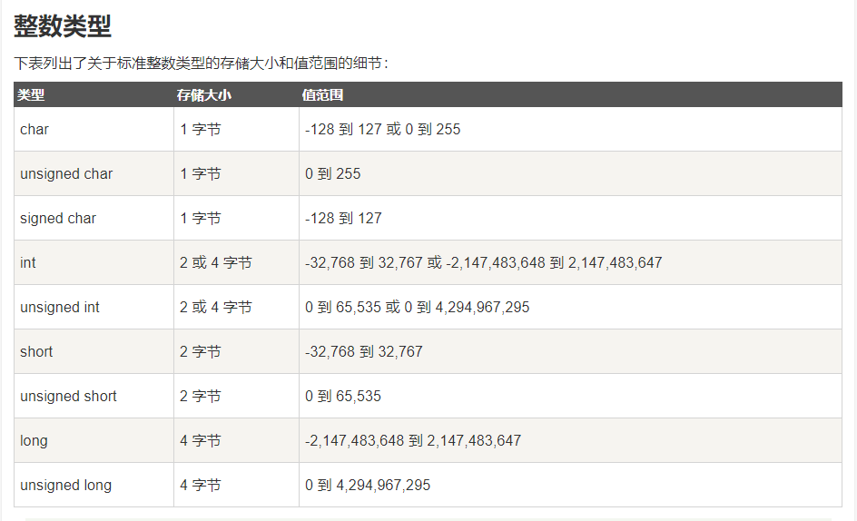
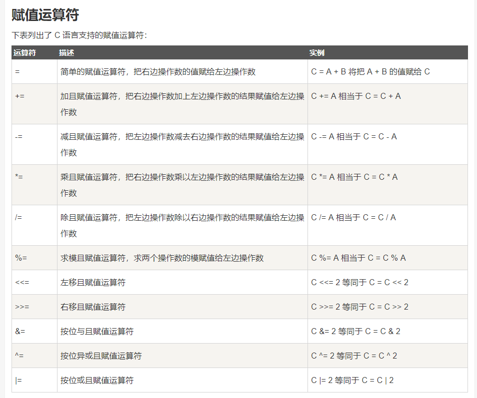
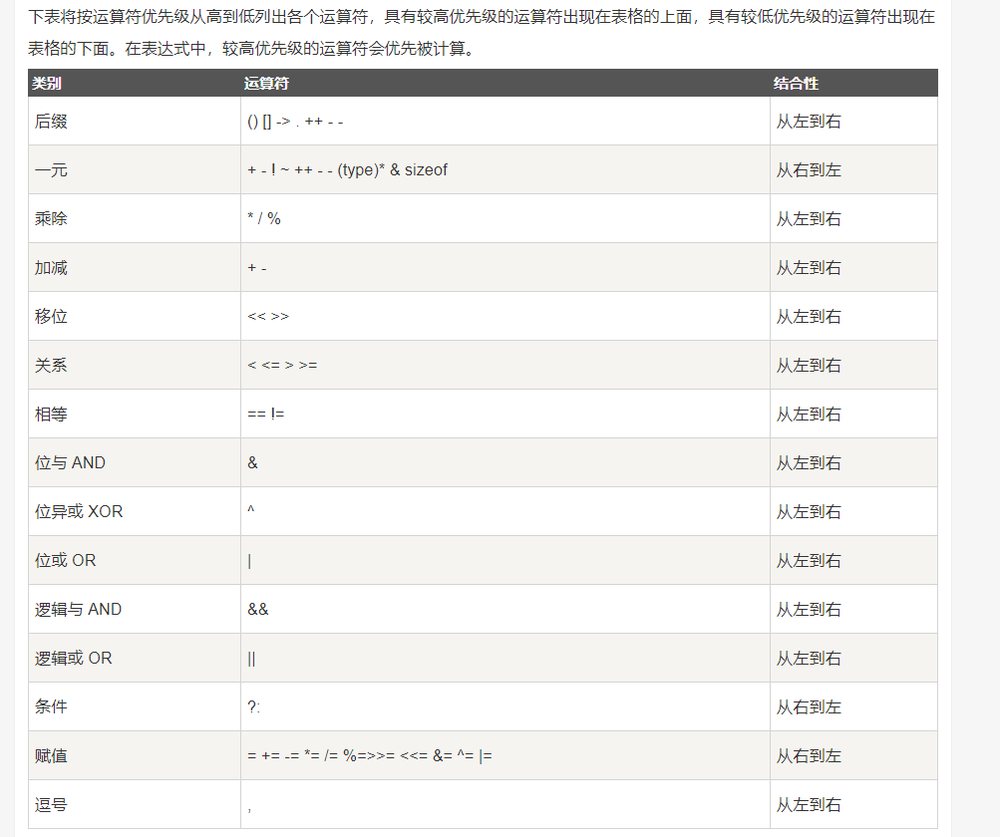
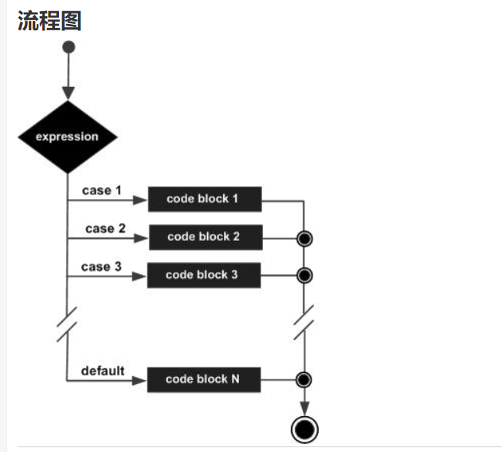
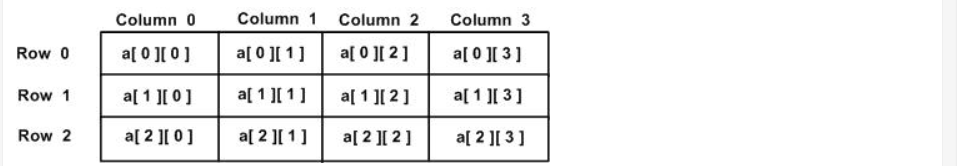
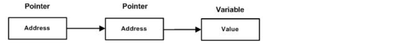
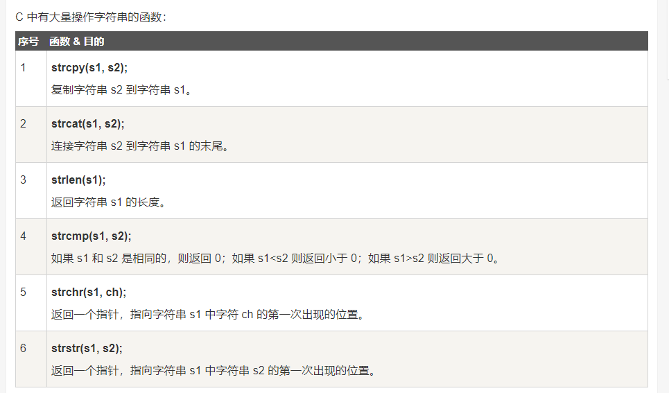

[toc]
# C语言

## 1.介绍与C编译器：

C语言是一门==面向过程==的计算机编程语言,与C++，Java等==面向对象==的编程语言有所不同。

### 1.C 编译器：
源代码是人类可读的代码，它需要"被编译"，转为机器语言，这样 CPU 可以按给定的机器语言指令执行程序。
==C 语言编译器用于把源代码编译成最终的可执行程序。==

## 2.第一个hello world：

①：创建hello.cpp文件：

<font color="red">
注意：.c后缀是C语言的源程序文件，.cpp后缀是C++语言的源程序文件。c++兼容c语言的绝大部分语法特性。
</font>


hello.cpp
```c
#include <stdio.h>     // #include <stdio.h> 是预处理器指令，告诉 C 编译器在实际编译之前要包含 stdio.h 文件。
 
int main()        //int main() 是主函数，程序从main函数开始执行。
{
    /*  这是一段注释 , 此处的内容会被编译器忽略. */

   printf("Hello, World! \n");   
   
   //printf(...) 是C中一个的函数，用于把内容打印到控制台上。
   //  \n ： 表示换行输出。
   
   return 0;    // return 0; 用于终止 main() 函数，并返回值 0。
}
```

②：编译 & 执行 C 程序：

当你执行程序后，您可以看到在控制台屏幕上显示 "Hello World".


## 3.基本语法：

### 1. 分号 ;

分号是语句结束符。也就是说，每个语句必须以分号结束。它表明一个逻辑实体的结束。

### 2. 注释:

注释是程序中的帮助文本，它们会被编译器忽略。

①：单行注释：
`//`

②：多行注释：
`/* ...  */`


### 3. 标识符

标识符是用来标识变量、函数，或任何其他用户自定义的名称。

==一个标识符以字母 A-Z 或 a-z 或下划线 _ 开始，后跟零个或多个字母、下划线和数字（0-9）。==

<font color="red">
C 是区分大小写的编程语言。因此，在 C 中，Manpower 和 manpower 是两个不同的标识符。
</font>


### 4.数据类型：
==变量的数据类型决定了变量存储占用的空间，以及如何解释存储的位模式。==

<font color="red">函数的类型指的是函数返回值的类型</font>

数据类型分为4种：
1. 基本类型 ----  它们是算术类型，包括两种类型：整数类型和浮点类型。

2. 枚举类型 ----  它们也是算术类型，被用来定义在程序中只能赋予其一定的离散整数值的变量。

3. void类型 ----  void 表明没有可用的值。

4. 派生类型 ----  它们包括：指针类型、数组类型、结构类型、共用体类型和函数类型。


①：整数类型：




②：浮点类型：


③：void 类型：


### 5.变量★★★：
==变量其实只不过是程序可操作的存储区的名称（使用变量好记忆）。每个变量都有特定的数据类型，类型决定了变量存储的大小和布局。==

<font color="red">变量的名称可以由字母、数字和下划线字符组成。它必须以字母或下划线开头。大写字母和小写字母是不同的，因为 C 是大小写敏感的。</font>


①：变量定义：
变量定义就是告诉编译器在何处创建变量的存储，以及如何通过数据类型创建变量的存储大小。

②：变量初始化：
变量可以在声明的时候被初始化（指定一个初始值）。
<font color="red">
注：
若变量没有初始化，则变量值根据数据类型的不同，而不同。为0或null或未定义
</font>


```c
int    i, j, k;   //此处定义一个int类型变量i,j,k。 
char   c, ch;
float  f, salary;   
double d;  
int b=10;    //定义一个变量b，并初始化为 10（在b的存储空间存放数据10）

```


### 6.常量：
常量是固定值，在程序执行期间不会改变。
常量可以是任何的基本数据类型。
常量就像是常规的变量，只不过常量的值在定义后不能进行修改。
==通常把常量定义为大写字母形式.==

①：定义常量：
在 C 中，有两种简单的定义常量的方式：
1. 使用 #define 预处理器。
2. 使用 const 关键字。

```c
#include <stdio.h>
 
#define A 10      //使用#define预处理器 定义一个常量 a,a的值为10 
#define B 5

int main()
{
   const int C = 20;     //用const关键字， 定义一个常量c,c的值为10 
	
   int s;  
   s = A * B;
   printf("value of s : %d", s);
   printf("\n");                       //换行 
   printf("value of C : %d", C);
 
   return 0;
}
```

<font color="red">
PS：
const 并不是去定义一个常量，而是去改变一个变量的存储类，把该变量所占的内存变为只读。
</font>


#### 1.整数常量：
整数常量可以是十进制、八进制或十六进制的常量。前缀指定基数：0x 或 0X 表示十六进制，0 表示八进制，不带前缀则默认表示十进制。

DEMO:
```c
85         /* 十进制 */
0213       /* 八进制 */
0x4b       /* 十六进制 */
30         /* 整数 */
30u        /* 无符号整数 , u 表示无符号整数（unsigned）*/
30l        /* 长整数  , l 表示长整数（long）*/
30ul       /* 无符号长整数 */

```


#### 2.浮点常量:
浮点常量由整数部分、小数点、小数部分和指数部分组成。

DEMO：
```c
3.14159       /* 合法的 */
314159E-5L    /* 合法的 */
510E          /* 非法的：不完整的指数 */
210f          /* 非法的：没有小数或指数 */
.e55          /* 非法的：缺少整数或分数 */
```


#### 3.字符常量(单个字符):
1. ==字符常量是括在单引号中==，例如，'x' 可以存储在 char 类型的简单变量中。
2. 字符常量可以是一个普通的字符（例如 'x'）、一个转义序列（例如 '\t'），或一个通用的字符（例如 '\u02C0'）。


#### 4.字符串常量（多个字符）：
==字符串字面值或常量是括在双引号 "" 中的。==


### 7.运算符：

运算符是一种告诉编译器执行特定的数学或逻辑操作的符号。

> ①：算术运算符：


<font color="red">
a++ 与 ++a 的区别：

1. a++ 是先赋值后运算
2. ++a 是先运算后赋值
</font>

```c
#include <stdio.h>
 
int main()
{
   int c;
   int a = 10;
   printf(" a的初始值是 10 \n");
   printf(" a++,a-- 是先赋值后运算：\n");

   c = a++; 
   printf(" c = a++ 的c值是 %d\n", c );
   printf(" a 的值是 %d\n", a );
   
   a = 10;
   c = a--; 
   printf(" c = a-- 的c值是 %d\n", c );
   printf(" a 的值是 %d\n", a );
 

   printf("++a ,--a 是先运算后赋值：\n");

   a = 10;
   c = ++a; 
   printf(" c = ++a 的c值是 %d\n", c );
   printf(" a 的值是 %d\n", a );
   
   a = 10;
   c = --a; 
   printf("  c = --a 的c值是 %d\n", c );
   printf(" a 的值是 %d\n", a );
 
}
```


> ②：关系运算符:
假设变量 A 的值为 10，变量 B 的值为 20，则：


> ③：逻辑运算符：
假设变量 A 的值为 1，变量 B 的值为 0，则：


> ④：赋值运算符：




> ⑤：杂项运算符：


DEMO:
```c
#include <stdio.h>
 
int main()
{
   int a;
   int b;

   /* 三元运算符实例 */
   a = 10;
   b = (a == 1) ? 20: 30;
   printf( "b 的值是 %d\n", b );    //b 的值是 30
 
   b = (a == 10) ? 20: 30;
   printf( "b 的值是 %d\n", b );   //b 的值是 20
}
```


> ⑥：C 中的运算符优先级（下图是从高到低排列）：

==运算符的优先级确定表达式中项的组合。这会影响到一个表达式如何计算。==




## 4.判断语句：

==C 语言把任何非零和非空的值假定为 true，把零或 null 假定为 false。==

### 1. if 语句:


Demo:
```c
#include <stdio.h>
 
int main ()
{
   int a = 10;
 
   /* 使用 if 语句检查布尔条件 */
   if( a < 20 )
   {
       /* 如果条件为真，则输出下面的语句 */
       printf("a 小于 20\n" );
   }
   printf("a 的值是 %d\n", a);
 
   return 0;
}
```


### 2. if...else 语句:


DEMO：
```c
#include <stdio.h>
 
int main ()
{
   /* 局部变量定义 */
   int a = 100;
 
   /* 检查布尔条件 */
   if( a < 20 )
   {
       /* 如果条件为真，则输出下面的语句 */
       printf("a 小于 20\n" );
   }
   else
   {
       /* 如果条件为假，则输出下面的语句 */
       printf("a 大于 20\n" );
   }
   printf("a 的值是 %d\n", a);
 
   return 0;
}
```

<h4>①：一个 if 语句后可跟一个可选的 else if...else 语句，这可用于测试多种条件.</h4>

DEMO:
```c
if(boolean_expression 1)
{
   /* 当布尔表达式 1 为真时执行 */
}
else if( boolean_expression 2)
{
   /* 当布尔表达式 2 为真时执行 */
}
else if( boolean_expression 3)
{
   /* 当布尔表达式 3 为真时执行 */
}
else 
{
   /* 当上面条件都不为真时执行 */
}
```


<font color="red">

当使用 if...else if...else 语句时，以下几点需要注意：

1. 一个 if 后可跟零个或一个 else，else 必须在所有 else if 之后。
2. 一个 if 后可跟零个或多个 else if，else if 必须在 else 之前。
3. 一旦某个 else if 匹配成功，其他的 else if 或 else 将不会被测试。
</font>


<h4>②：嵌套 if 语句：一个 if 或 else if 语句内使用另一个 if 或 else if 语句</h4>

DEMO:
```c
if( boolean_expression 1)
{
   /* 当布尔表达式 1 为真时执行 */
   if(boolean_expression 2)
   {
      /* 当布尔表达式 2 为真时执行 */
   }
}
```

### 3. switch 语句:

==一个 switch 语句允许测试一个变量等于多个值时的情况。每个值称为一个 case，且被测试的变量会对每个 switch case 进行检查。==





语法：
```c
switch(expression){
    case constant-expression  :
       statement(s);
       break; /* 可选的 */
    case constant-expression  :
       statement(s);
       break; /* 可选的 */
  
    /* 您可以有任意数量的 case 语句 */
    default : /* 可选的 */
       statement(s);
}
```

<font color="red">

switch 语句必须遵循下面的规则：

1. switch 语句中的 expression 是一个常量表达式，必须是一个整型或枚举类型。
2. 在一个 switch 中可以有任意数量的 case 语句。每个 case 后跟一个要比较的值和一个冒号。
3. case 的 constant-expression 必须与 switch 中的变量具有相同的数据类型，且必须是一个常量或字面量。
4. 当被测试的变量等于 case 中的常量时，case 后跟的语句将被执行，直到遇到 break 语句为止。
5. 当遇到 break 语句时，switch 终止，控制流将跳转到 switch 语句后的下一行。
6. 不是每一个 case 都需要包含 break。如果 case 语句不包含 break，控制流将会 继续 后续的 case，直到遇到 break 为止。
7. 一个 switch 语句可以有一个可选的 default，出现在 switch 的结尾。default可用于在上面所有 case 都不为真时执行一个任务。default 中的 break 语句不是必需的。
</font>


<h4>①：嵌套 switch 语句:</h4>

==把一个 switch 作为一个外部 switch 的语句序列的一部分，即可以在一个 switch 语句内使用另一个 switch 语句。即使内部和外部 switch 的 case 常量包含共同的值，也没有矛盾。==

DEMO:
```c
switch(ch1) {
    case 'A': 
      printf("这个 A 是外部 switch 的一部分" );
      switch(ch2) {
         case 'A':
            printf("这个 A 是内部 switch 的一部分" );
            break;
         case 'B': /* 内部 B case 代码 */
      }
      break;
    case 'B': /* 外部 B case 代码 */
}
```


### 4. 三目运算符（? : 运算符）:

语法：
`Exp1 ? Exp2 : Exp3;`


## 5.循环语句：


### 1.while 循环：

==只要给定的条件为真，C 语言中的 while 循环语句会重复执行一个目标语句。==


<font color="red">
while 循环的关键点是: 循环可能一次都不会执行。当条件为 false 时，会跳过循环主体，直接执行紧接着 while 循环的下一条语句。
</font>

DEMO:
```c
#include <stdio.h>
 
int main ()
{
  
   int a = 10;

   /* while 循环执行 */
   while( a < 20 )
   {
      printf("a 的值： %d\n", a);
      a++;
   }
 
   return 0;
}
```


### 2. for 循环:

==for 循环允许您编写一个执行指定次数的循环控制结构。==

语法：
```c
for ( init; condition; increment )
{
   statement(s);
}
```

<h3>
注意：

1. init 会首先被执行，且只会执行一次。==也可以不在这里写任何语句，只要有一个分号出现即可。==

2. 接下来，会判断 condition。如果为真，则执行循环主体。如果为假，则跳出循环。

<br/>

3. 在执行完 for 循环主体一次后，会跳回上面的 increment 语句。该语句允许您更新循环控制变量。==该语句可以留空，只要在条件后有一个分号出现即可。==

4. 条件再次被判断。如果为真，则执行循环，这个过程会不断重复（==循环主体，然后增加步值，再然后重新判断条件==）。在条件变为假时，for 循环终止。

</h3>


DEMO：
```c
#include <stdio.h>
 
int main ()
{
   /* for 循环执行 */
   for( int a = 10; a < 20; a = a + 1 )
   {
      printf("a 的值： %d\n", a);
   }
 
   return 0;
}
```

运行结果：
```
a 的值： 10
a 的值： 11
a 的值： 12
a 的值： 13
a 的值： 14
a 的值： 15
a 的值： 16
a 的值： 17
a 的值： 18
a 的值： 19
```


### 3. do...while 循环:

==do...while 循环是在循环的尾部检查它的条件。do...while 循环会确保至少执行一次循环==


DEMO：
```c
#include <stdio.h>
 
int main ()
{
  
   int a = 10;

   /* do 循环执行 */
   do
   {
       printf("a 的值： %d\n", a);
       a = a + 1;
   }while( a < 20 );
 
   return 0;
}
```


### 4.嵌套循环:

==C 语言允许在一个循环内使用另一个循环。循环之间可以是不同类型的==

#### 1. 嵌套 for 循环:

语法：
```c
for (initialization; condition; increment/decrement)
{
    statement(s);

    /* 内部循环*/

    for (initialization; condition; increment/decrement)
    {
        statement(s);
        ... ... ...
    }
    ... ... ...
}
```


#### 2. 嵌套 while 循环:

语法：
```c
while (condition1)
{
    statement(s);

    while (condition2)     /* 内部循环*/
    {
        statement(s);
        ... ... ...
    }
    ... ... ...
}
```


#### 3.嵌套 do...while 循环：

语法：
```c
do
{
    statement(s);

                      /* 内部循环*/
    do
    {
        statement(s);
        ... ... ...
    }while (condition2);
    ... ... ...
    
}while (condition1);
```


### 5.循环控制语句：

==循环控制语句改变你代码的执行顺序。通过它你可以实现代码的跳转。==


#### 1.break 语句:

==终止循环或 switch 语句，程序流将继续执行循环或 switch 的下一条语句。==

<font color="red">
break 语句注意：

1. 当 break 语句出现在一个循环内时，循环会立即终止，且程序流将跳出循环。
2. 它可用于终止 switch 语句中的一个 case。

3. 如果您使用的是嵌套循环，break 语句会停止执行最内层的循环，然后开始执行该块之后的下一行代码。

</font>


DEMO:
```c
#include <stdio.h>
 
int main ()
{
  
   int a = 10;

 
   while( a < 20 )
   {
      printf("a 的值： %d\n", a);
      a++;
      if( a > 15)
      {
                         /* 使用 break 语句终止while循环 */
          break;
      }
   }
 
   return 0;
}
```


#### 2.continue 语句:

==continue 会跳过当前循环中的代码，强迫开始下一次循环。==

<font color="red">
continue 语句注意：

1. 对于 for 循环，continue 语句执行后自增语句仍然会执行。
2. 对于 while 和 do...while 循环，continue 语句重新执行条件判断语句。

</font>


DEMO:
```c
#include <stdio.h>
 
int main ()
{
  
   int a = 10;

   /* do..while 循环执行 */
   do
   {
      if( a == 15)
      {
        
         a = a + 1;
         continue;    /* continue 语句 */
      }
      printf("a 的值： %d\n", a);
      a++;
     
   }while( a < 20 );
 
   return 0;
}
```


运行结果：<font color="red">没有15</font>
```
a 的值： 10
a 的值： 11
a 的值： 12
a 的值： 13
a 的值： 14
a 的值： 16
a 的值： 17
a 的值： 18
a 的值： 19
```


#### 3.goto 语句：★★★ 不建议使用：

==goto 语句允许把控制无条件转移到同一函数内的被标记的语句。==

语法：
```c
goto label;

..
..
..

label: statement;
```

<font color="red">
注意：
label 可以是任何除 C 关键字以外的纯文本，它可以设置在 C 程序中 goto 语句的前面或者后面。
</font>


DEMO:
```c
#include <stdio.h>
 
int main ()
{
   
   int a = 10;

  
   LOOP:do         //这里为LOOP，是do循环
   {
      if( a == 15)
      {
         
         a = a + 1;
         goto LOOP;    //使用goto 语句，跳到 LOOP 哪里。
      }
      printf("a 的值： %d\n", a);
      a++;
     
   }while( a < 20 );
 
   return 0;
}

```


运行结果：<font color="red">没有15</font>
```
a 的值： 10
a 的值： 11
a 的值： 12
a 的值： 13
a 的值： 14
a 的值： 16
a 的值： 17
a 的值： 18
a 的值： 19
```


### 6.无限循环：

==for 循环在传统意义上可用于实现无限循环。==

```c
#include <stdio.h>
 
int main ()
{
   for( ; ; )
   {
      printf("该循环会永远执行下去！\n");
   }
   return 0;
}
```

<font color="red">
注意：您可以在命令窗口中按 Ctrl + C 键终止无限循环。
</font>


---


## 6. 函数：

==函数是一组一起执行一个特定功能的语句。每个 C 程序都至少有一个main（）主函数。==


### 1.创建函数：

语法：
```c
return_type function_name( parameter list )
{
   body of the function;

   return return_type;    //返回返回值，类型与函数的类型相同。
}
```

<font color="red">
注意：

1. return_type  ：函数返回的值的数据类型,当 return_type 是void时，函数不需要返回值。

2. function_name ：函数名称。函数名和参数列表要一起看。区别同名函数要看参数列表。

3. parameter list ：参数列表，类似函数暴露在外的接口，可以通过该接口向函数传递一个值。==参数是可选的，也就是说，函数可能不包含参数。==

4.  body of the function ：函数主体包含一组执行特定功能的语句
</font>


DEMO：
```c
/* 函数返回两个数中较大的那个数 */
int max(int num1, int num2)    //函数通过参数列表，可以从函数外部获取数据。然后再函数内部加工这些数据
{
   /* 局部变量声明 */
   int result;
 
   if (num1 > num2)
      result = num1;
   else
      result = num2;
 
   return result;            //通过返回值，把加工好的数据放到函数外。
}
```


### 2. 函数声明:

==函数声明 ：告诉编译器函数名称及如何调用函数，一般写在开头==。
<font color="red">函数的实际主体可以单独定义。</font>

方式①：
```c
int max(int num1, int num2);
```


方式②：（<font color="red">函数声明中，参数的名称并不重要，只有参数的类型是必需的。</font>）
```c
int max(int, int);
```

### 3. 调用函数:

==通过调用函数来完成已特定的功能==

DEMO：
```c
#include <stdio.h>
 
/* 函数声明 */
int max(int num1, int num2);
 
int main ()
{
  
   int a = 100;
   int b = 200;
   int ret;
 
   ret = max(a, b);          /* 调用函数来获取最大值 */
 
   printf( "Max value is : %d\n", ret );
 
   return 0;
}
 

/* max函数 */
int max(int num1, int num2) 
{
   int result;
 
   if (num1 > num2)
      result = num1;
   else
      result = num2;
 
   return result; 
}
```


### 4.两种向函数传递参数的方式：

#### 1.传值方式：

==把参数的实际值复制给函数的形式参数。==
<font color="red">
注意： 函数内形式参数值的变化不会改变用于调用函数的实际参数。
</font>

DEMO；
```c
#include <stdio.h>
 
/* 函数声明 */
void swap(int x, int y);
 
int main ()
{
   int a = 100;
   int b = 200;
 
   printf("交换前，a 的值： %d\n", a );
   printf("交换前，b 的值： %d\n", b );
 
   /* 调用函数来交换值 */
   swap(a, b);
 
   printf("交换后，a 的值： %d\n", a );
   printf("交换后，b 的值： %d\n", b );
 
   return 0;
}


/* 函数定义 */
void swap(int x, int y)
{
   int temp;

   temp = x; /* 保存 x 的值 */
   x = y;    /* 把 y 赋值给 x */
   y = temp; /* 把 temp 赋值给 y */
  
   return;
}
```

运行结果：(==虽然在函数内改变了 a 和 b 的值，但是实际上 a 和 b 的值没有发生变化。==)
```
交换前，a 的值： 100
交换前，b 的值： 200
交换后，a 的值： 100
交换后，b 的值： 200
```

<h3><font color="red">
分析：

1. 主函数向swap函数，传递a,b的值。传递的只是数值，不是变量本身。
2. 实际上是 a,b的实际数值复制给函数的形式参数x,y.
3. 因此上面的程序中a,b的值始终没有改变。

</font></h3>


#### 2. 引用方式(这里涉及到指针的内容，请先了解指针):

==通过指针传递方式，当对形参的指向操作时，就相当于对实参本身进行的操作。==

<font color="red">形参为指向实参地址的指针。=====当改变形参的值，就相当与改变实参地址上的数据，就相当于改变实参的数值。</font>

DEMO：
```c
#include <stdio.h>
 
/* 引用方式的函数声明 */
void swap(int *x, int *y);
 
int main ()
{
  
   int a = 100;
   int b = 200;
 
   printf("交换前，a 的值： %d\n", a );
   printf("交换前，b 的值： %d\n", b );
 
   /* 调用函数来交换值
    * &a 表示指向 a 的指针，即变量 a 的地址 
    * &b 表示指向 b 的指针，即变量 b 的地址 
   */
   swap(&a, &b);
 
   printf("交换后，a 的值： %d\n", a );
   printf("交换后，b 的值： %d\n", b );
 
   return 0;
}


void swap(int *x, int *y)
{
   int temp;
   temp = *x;    /* 保存地址 x 的值 */
   *x = *y;      /* 把 y 赋值给 x */
   *y = temp;    /* 把 temp 赋值给 y */
  
   return;
}
```

运行结果：(==引用调用在函数内改变了 a 和 b 的值，实际上也改变了函数外 a 和 b 的值。==)
```
交换前，a 的值： 100
交换前，b 的值： 200
交换后，a 的值： 200
交换后，b 的值： 100
```


---


## 7. 变量作用域：


==作用域是变量所存在的能够生效的区域，超过该区域变量就不能被访问==

<font color="red">
C 语言中有三个地方可以声明变量：

1. 在函数或块内部的声明的变量-----局部变量。
2. 在所有函数外部的声明的变量，包括主函数main -----全局变量。
3. 函数的形参。
</font>


> ①：当局部变量被定义时，系统不会对其初始化，您必须自行对其初始化。
> ②：定义全局变量时，系统会自动对其初始化，


### 1. 局部变量：

==局部变量只能被最近函数或该代码块内部的语句使用,局部变量在函数外部是不可知的。==

DEMO(<font color="red">该运行程序会报错</font>):
```c
#include <stdio.h>
 
int main ()
{
  /* 局部变量声明 */
  int a, b;
  
  {
   int c=100;       //变量c在代码快中，代码块外部访问不到该变量c
  }
  
  /* 实际初始化 */
  a = 10;
  b = 20;

  printf ("value of a = %d, b = %d and c = %d\n", a, b, c);
 
  return 0;
}
```


### 2. 全局变量：

==全局变量在整个程序生命周期内都是有效的，在任意的函数内部能访问全局变量。==

DEMO；
```c
#include <stdio.h>
 
/* 全局变量声明 */
int g;
 
int main ()
{
  /* 局部变量声明 */
  int a, b;
 
  /* 实际初始化 */
  a = 10;
  b = 20;
  g = a + b;
 
  printf ("value of a = %d, b = %d and g = %d\n", a, b, g);
 
  return 0;
}
```


<h4><font color="red">
PS:局部变量和全局变量的名称可以相同，但是在函数内，局部变量的值会覆盖全局变量的值。
</font></h4>


### 3. 形式参数:

==函数的参数，形式参数，被当作该函数内的局部变量，它们会优先覆盖全局变量。==

DEMO；
```c
#include <stdio.h>
 
/* 全局变量声明 */
int a = 20;
 
int main ()
{
  /* 在主函数中的局部变量声明 */
  int a = 10;
  int b = 20;
  int c = 0;
  int sum(int, int);
 
  printf ("value of a in main() = %d\n",  a);
  c = sum( a, b);
  printf ("value of c in main() = %d\n",  c);
 
  return 0;
}
 
/* 添加两个整数的函数 */
int sum(int a, int b)
{
    printf ("value of a in sum() = %d\n",  a);
    printf ("value of b in sum() = %d\n",  b);
 
    return a + b;
}

```


---

## 8. 数组：

==数组可以存储一个固定大小的相同类型元素的顺序集合。数组是用来存储一系列数据。==

> 1. 数组中的特定元素可以通过索引访问。
> 2. 所有的数组都是由连续的内存位置组成。最低的地址对应第一个元素，最高的地址对应最后一个元素。


---

### 1. 声明数组(3种):

①：指定大小的数组，不初始化列表：
`int a[10];  //数组大小为10`

②：不指定大小的数组，数组大小由初始化列表元素个数决定：
`int a[] = {1,2,4};   //数组初始化元素为 1，2，4，因此数组大小为3 `

③：指定数组大小，但初始化列表不完全时，系统将未初始化列表的元素初始化为0：
`int a[10] = {1,2};   //数组大小为10，数组初始化元素为1，2 ，其余8个初始化元素为0`


### 2. 访问数组元素：


语法：
`double salary = balance[9];   //把数组中第 10 个元素的值赋给 salary 变量`


```c
#include <stdio.h>
 
int main ()
{
   int n[ 10 ]; /* n 是一个包含 10 个整数的数组 */
   int i,j;
 
   /* 初始化数组元素 */         
   for ( i = 0; i < 10; i++ )
   {
      n[ i ] = i + 100; /* 设置元素 i 为 i + 100 */
   }
   
   /* 输出数组中每个元素的值 */
   for (j = 0; j < 10; j++ )
   {
      printf("Element[%d] = %d\n", j, n[j] );
   }
 
   return 0;
}
```

---


### 3. 多维数组：

==多维数组最简单的形式是二维数组。一个二维数组，在本质上，是一个一维数组的列表。==

语法：
```c
type arrayName [ 3 ][ 4 ];   //声明一个 3 行 4 列的二维整型数组.
```




<font color="red">
数组中的每个元素是使用形式为 a[ i , j ] 的元素名称来标识的，其中 a 是数组名称，i 和 j 是唯一标识 a 中每个元素的下标.
</font>

---


> ①：初始化二维数组:

```c
int a[3][4];

int b[3][4] = {  
 {0, 1, 2, 3} ,   /*  初始化索引号为 0 的行 */
 {4, 5, 6, 7} ,   /*  初始化索引号为 1 的行 */
 {8, 9, 10, 11}   /*  初始化索引号为 2 的行 */
};

int a[3][4] = {0,1,2,3,4,5,6,7,8,9,10,11};  

```

<font color="red">
内部嵌套的括号是可选的，第三个的初始化与第二个是等同的：
</font>

---

> ②：访问二维数组元素：

==二维数组中的元素是通过使用下标（即数组的行索引和列索引）来访问的。==


`int val = a[2][3];  //获取数组中第 3 行第 4 个元素`


---

### 4. 传递数组给函数(3种):

==可以通过指定不带索引的数组名称来给函数传递一个指向数组的指针。==


①：形式参数是一个指针.
```c
void functionName(int *param){ }
```

②：形式参数是一个已定义大小的数组.
```c
void functionName(int param[10]){ }
```

③：形式参数是一个未定义大小的数组.
```c
void functionName(int param[]){ }
```

DEMO:
```c
#include <stdio.h>
 
/* 函数声明 */
double getAverage(int arr[], int size);
 
int main ()
{
   /* 带有 5 个元素的整型数组 */
   int balance[5] = {1000, 2, 3, 17, 50};
   double avg;
 
   /* 传递一个指向数组的指针作为参数 */
   avg = getAverage( balance, 5 ) ;
 
   /* 输出返回值 */
   printf( "平均值是： %f ", avg );
    
   return 0;
}
 
double getAverage(int arr[], int size)
{
  int    i;
  double avg;
  double sum;
 
  for (i = 0; i < size; ++i)
  {
    sum += arr[i];
  }
 
  avg = sum / size;
 
  return avg;
}
```


---


### 5. 从函数返回数组:

==从函数返回一个一维数组，您必须声明一个返回指针的函数，==

`int * myFunction(){} `


DEMO---(==C 不支持在函数外返回局部变量的地址，除非定义局部变量为 static 变量==)：
```c
#include <stdio.h>
#include <stdlib.h>
#include <time.h>
 
/* 要生成和返回随机数 数组的函数 */
int * getRandom( )
{
  static int  r[10];
  int i;
 
  for ( i = 0; i < 10; ++i)
  {
     r[i] = rand();
     printf( "r[%d] = %d\n", i, r[i]);
 
  }
 
  return r;
}
 
/* 要调用上面定义函数的主函数 */
int main ()
{
   /* 一个指向整数的指针 */
   int *p;
   int i;
 
   p = getRandom();
   for ( i = 0; i < 10; i++ )
   {
       printf( "*(p + %d) : %d\n", i, *(p + i));
   }
 
   return 0;
}
```

---

### 6. 指向数组的指针：

==通过指定不带索引的数组名称来生成一个指向数组中第一个元素的指针。==

> 数组名是一个指向数组中第一个元素的常量指针.

```c
double a[50];     //a 是一个指向 &a[0] 的指针，即数组 a 的第一个元素的地址。
```


```c
double *p;         //声明指针p

double a[10];      // 声明数组a
 
p = a;            //指针p 指向 数组a
```

<font color="red">
可以使用 *p)、*(p+2) 等来访问数组、*(p+1元素
</font>


## 9. 指针：


### 1. & 取地址符：

==每一个变量都有一个内存位置，每一个内存位置都定义了可使用连字号（&）运算符访问的地址，它表示了在内存中的一个地址。==

```c
int  var1;
printf("var1 变量的地址： %p\n", &var1  );
```

---

### 2. 指针的介绍与使用：

==指针是一个变量，其值为另一个变量的地址，即，内存位置的直接地址。==

<font color="red">星号是用来指定一个变量是指针，不同数据类型的指针之间的区别是，指针所指向的变量或常量的数据类型不同。</font>
```c
int    *ip;    /* 一个整型的指针 */
double *dp;    /* 一个 double 型的指针 */
float  *fp;    /* 一个浮点型的指针 */
char   *ch;     /* 一个字符型的指针 */
```


使用步骤：
1. 定义一个指针变量。
2. 把变量地址赋值给指针。
3. 访问指针变量中可用地址的值


```C
   int  var = 20;   /* 实际变量的声明 */
   int  *ip;        /* 指针变量的声明 */
 
   ip = &var;  /* 在指针变量中存储 var 的地址 */
   /* 使用指针访问值 */
   printf("Value of *ip variable: %d\n", *ip );
```

---


### 3. NULL空指针：

==赋为 NULL 值的指针被称为空指针。==

```c
int  *a = NULL;
 
printf("a 的值是 %p\n", a  );   // a 的值是 0
 
```

<font color="red">
PS:
如果指针包含空值（零值）,表明该指针不指向一个可访问的内存位置
</font>


### 4. 指针的算术&关系运算:

==可以对指针进行四种算术运算：++、--、+、-。==


#### 1. ++ 递增一个指针


```c
  int *a;
  printf ("value of &a %d\n", a);
  
  a++;
  
  printf ("value of &a++ %d\n", a); 
  return 0;

```


<font color="red">
注意：

1. 若指针是 int 类型（4个字节），上例中a的初始地址为1,递增后，a的地址变为5。

2. 若指针为 char 类型（1个字节），则递增后，a的地址为2

3. ==根据指针类型的不同，指针指针递增后的地址也不同。==
</font>


#### 2. -- 递减一个指针:

> 对指针进行递减运算，即把值减去其数据类型的字节数


#### 3. 指针的比较：

> 指针可以用关系运算符进行比较，如 ==、< 和 >。
> 如果 p1 和 p2 指向两个相关的变量，比如同一个数组中的不同元素，则可对 p1 和 p2 进行大小比较。


---

### 5. 指针数组:

==想要让数组存储指向 int 或 char 或其他数据类型的指针。==

```c
int *a[10];   //a 中的每个元素，都是一个指向 int 值的指针。
```

DEMO:
```c
   int  var[] = {10, 100, 200};
   int i, *ptr[MAX];
 
   for ( i = 0; i < MAX; i++)
   {
      ptr[i] = &var[i]; /* 赋值为整数的地址 */
   }

   for ( i = 0; i < MAX; i++)
   {
      printf(" %d\n", *ptr[i] );
   }
```


---


### 6. 指向指针的指针:

==指向指针的指针是一种多级间接寻址的形式，或者说是一个指针链。==




<font color="red">第一个指针包含了第二个指针的地址，第二个指针指向包含实际值的位置</font>


语法：
```c
int **a;     //声明了一个指向 int 类型指针的指针a
```

DEMO:
```c
   int  var;
   int  *ptr;
   int  **pptr;

   var = 3000;

   /* 获取 var 的地址 */
   ptr = &var;

   /* 使用运算符 & 获取 ptr 的地址 */
   pptr = &ptr;

   /* 使用 pptr 获取值 */
   printf("Value of var = %d\n", var );
   printf("Value available at *ptr = %d\n", *ptr );
   printf("Value available at **pptr = %d\n", **pptr);

```

运行结果：
```
Value of var = 3000
Value available at *ptr = 3000
Value available at **pptr = 3000
```

---

### 7. 传递指针给函数(通过引用或地址传递参数)：

==C 语言允许传递指针给函数，只需要简单地声明函数参数为指针类型即可。==

```c
#include <stdio.h>
/* 函数声明 */
double getAverage(int *arr);

int main ()
{
   /* 带有 5 个元素的整型数组  */
   int balance[5] = {1000, 2, 3, 17, 50};
 
   /* 传递一个指向数组的指针作为参数 */
   double avg = getAverage(balance) ;
 
    
   return 0;
}

double getAverage(int *arr)
{
   //....
}
```


### 8. 函数返回指针

==C 允许您从函数返回指针,必须声明一个返回指针的函数。==

语法：
```c
int * myFunction(){   }     //返回类型为指针
```


DEMO：
```c
/* 要生成和返回随机数的函数 */
int * getRandom( )
{
   static int r[10];
   
   //...

   return r;
}
```


### 9. 函数指针与回调函数(？？？)

尚未更新，耐心等待！！！


---


## 10. 字符串：

==在 C 语言中，字符串实际上是使用 null 字符 '\0' 终止的一维字符数组。==

<font color="red">C 编译器会在初始化数组时，自动把 '\0' 放在字符串的末尾</font>

```c
char greeting[] = "Hello";
```


<br/>


> 关于字符串的函数：

