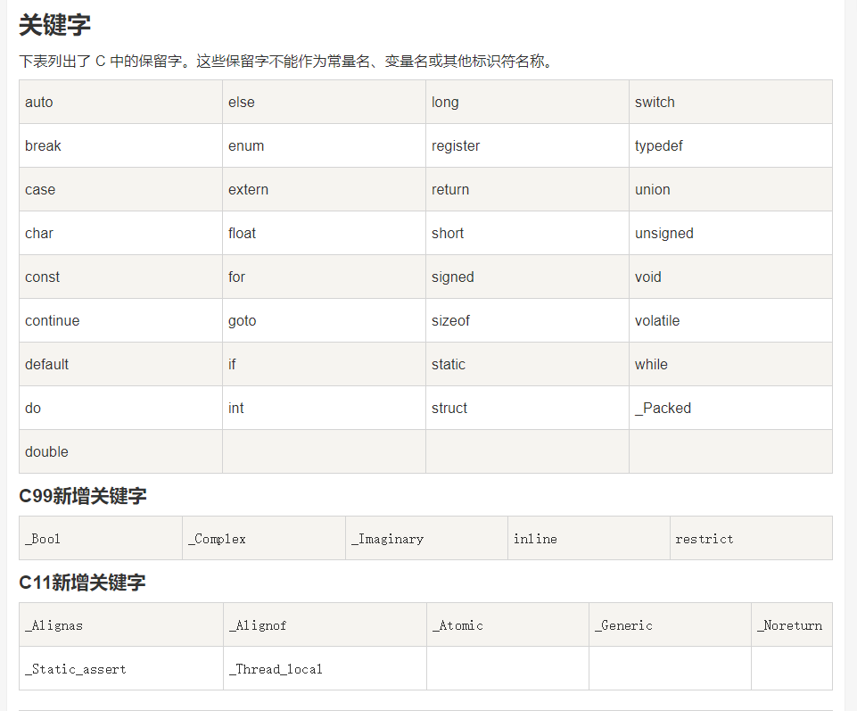
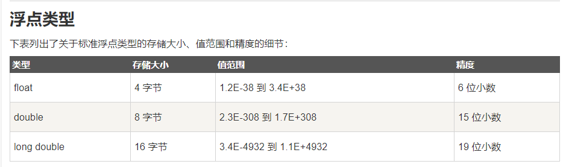
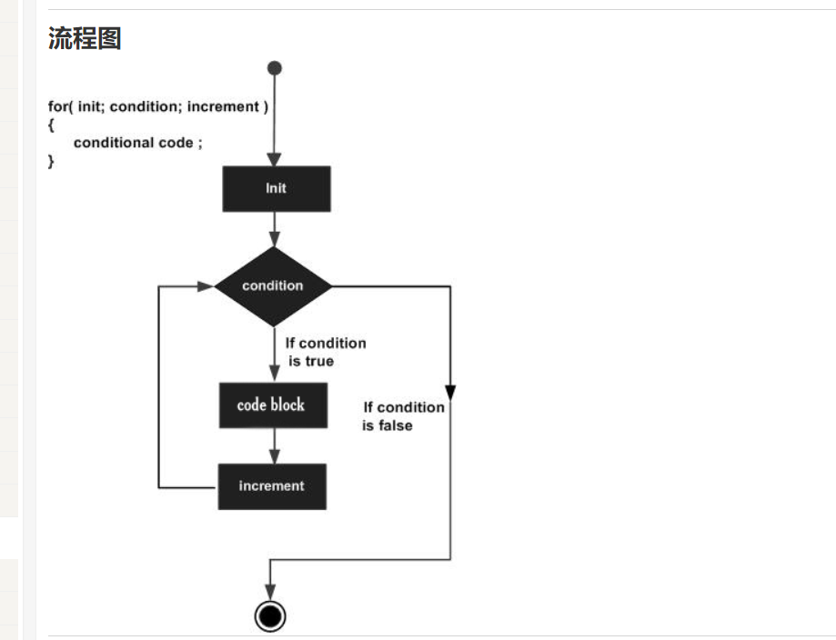
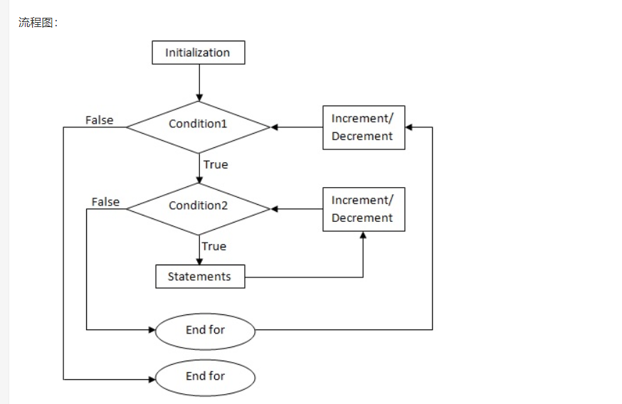
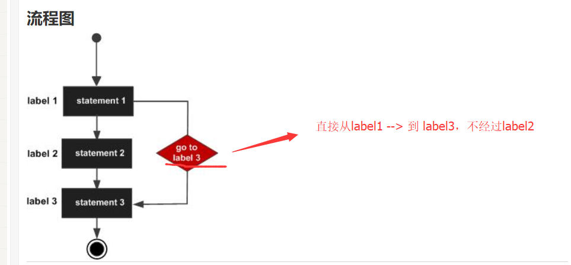

[toc]
# C语言

## 1.介绍与C编译器：

C语言是一门面向过程的计算机编程语言,与C++，Java等面向对象的编程语言有所不同。

### 1.C 编译器：
源代码是人类可读的代码，它需要"被编译"，转为机器语言，这样 CPU 可以按给定的机器语言指令执行程序。
==C 语言编译器用于把源代码编译成最终的可执行程序。==

## 2.第一个hello world：

①：创建hello.cpp文件：

<font color="red">
注意：.c后缀是C语言的源程序文件，.cpp后缀是C++语言的源程序文件。c++兼容c语言的绝大部分语法特性。
</font>


hello.cpp
```c
#include <stdio.h>     // #include <stdio.h> 是预处理器指令，告诉 C 编译器在实际编译之前要包含 stdio.h 文件。
 
int main()        //int main() 是主函数，程序从main函数开始执行。
{
    /*  这是一段注释 , 此处的内容会被编译器忽略. */

   printf("Hello, World! \n");   
   
   //printf(...) 是C中一个的函数，用于把内容打印到控制台上。
   //  \n ： 表示换行输出。
   
   return 0;    // return 0; 用于终止 main() 函数，并返回值 0。
}
```

②：编译 & 执行 C 程序：

当你执行程序后，您可以看到在控制台屏幕上显示 "Hello World".


## 3.基本语法：

### 1. 分号 ;

分号是语句结束符。也就是说，每个语句必须以分号结束。它表明一个逻辑实体的结束。

### 2. 注释:

注释是程序中的帮助文本，它们会被编译器忽略。

①：单行注释：
`//`

②：多行注释：
`/* ...  */`


### 3. 标识符

标识符是用来标识变量、函数，或任何其他用户自定义的名称。

==一个标识符以字母 A-Z 或 a-z 或下划线 _ 开始，后跟零个或多个字母、下划线和数字（0-9）。==

<font color="red">
C 是区分大小写的编程语言。因此，在 C 中，Manpower 和 manpower 是两个不同的标识符。
</font>




### 4.数据类型：
==变量的数据类型决定了变量存储占用的空间，以及如何解释存储的位模式。==

<font color="red">函数的类型指的是函数返回值的类型</font>

数据类型分为4种：
1. 基本类型 ----  它们是算术类型，包括两种类型：整数类型和浮点类型。

2. 枚举类型 ----  它们也是算术类型，被用来定义在程序中只能赋予其一定的离散整数值的变量。

3. void类型 ----  void 表明没有可用的值。

4. 派生类型 ----  它们包括：指针类型、数组类型、结构类型、共用体类型和函数类型。


①：整数类型：


②：浮点类型：




③：void 类型：


### 5.变量★★★：
==变量其实只不过是程序可操作的存储区的名称（使用变量好记忆）。每个变量都有特定的数据类型，类型决定了变量存储的大小和布局。==

<font color="red">变量的名称可以由字母、数字和下划线字符组成。它必须以字母或下划线开头。大写字母和小写字母是不同的，因为 C 是大小写敏感的。</font>


①：变量定义：
变量定义就是告诉编译器在何处创建变量的存储，以及如何通过数据类型创建变量的存储大小。

②：变量初始化：
变量可以在声明的时候被初始化（指定一个初始值）。
<font color="red">
注：
若变量没有初始化，则变量值根据数据类型的不同，而不同。为0或null或未定义
</font>


```c
int    i, j, k;   //此处定义一个int类型变量i,j,k。 
char   c, ch;
float  f, salary;   
double d;  
int b=10;    //定义一个变量b，并初始化为 10（在b的存储空间存放数据10）

```


### 6.常量：
常量是固定值，在程序执行期间不会改变。
常量可以是任何的基本数据类型。
常量就像是常规的变量，只不过常量的值在定义后不能进行修改。
==通常把常量定义为大写字母形式.==

①：定义常量：
在 C 中，有两种简单的定义常量的方式：
1. 使用 #define 预处理器。
2. 使用 const 关键字。

```c
#include <stdio.h>
 
#define A 10      //使用#define预处理器 定义一个常量 a,a的值为10 
#define B 5

int main()
{
   const int C = 20;     //用const关键字， 定义一个常量c,c的值为10 
	
   int s;  
   s = A * B;
   printf("value of s : %d", s);
   printf("\n");                       //换行 
   printf("value of C : %d", C);
 
   return 0;
}
```

<font color="red">
PS：
const 并不是去定义一个常量，而是去改变一个变量的存储类，把该变量所占的内存变为只读。
</font>


#### 1.整数常量：
整数常量可以是十进制、八进制或十六进制的常量。前缀指定基数：0x 或 0X 表示十六进制，0 表示八进制，不带前缀则默认表示十进制。

DEMO:
```c
85         /* 十进制 */
0213       /* 八进制 */
0x4b       /* 十六进制 */
30         /* 整数 */
30u        /* 无符号整数 , u 表示无符号整数（unsigned）*/
30l        /* 长整数  , l 表示长整数（long）*/
30ul       /* 无符号长整数 */

```


#### 2.浮点常量:
浮点常量由整数部分、小数点、小数部分和指数部分组成。

DEMO：
```c
3.14159       /* 合法的 */
314159E-5L    /* 合法的 */
510E          /* 非法的：不完整的指数 */
210f          /* 非法的：没有小数或指数 */
.e55          /* 非法的：缺少整数或分数 */
```


#### 3.字符常量(单个字符):
1. ==字符常量是括在单引号中==，例如，'x' 可以存储在 char 类型的简单变量中。
2. 字符常量可以是一个普通的字符（例如 'x'）、一个转义序列（例如 '\t'），或一个通用的字符（例如 '\u02C0'）。


#### 4.字符串常量（多个字符）：
==字符串字面值或常量是括在双引号 "" 中的。==


### 7.运算符：

运算符是一种告诉编译器执行特定的数学或逻辑操作的符号。

> ①：算术运算符：


<font color="red">
a++ 与 ++a 的区别：

1. a++ 是先赋值后运算
2. ++a 是先运算后赋值
</font>

```c
#include <stdio.h>
 
int main()
{
   int c;
   int a = 10;
   printf(" a的初始值是 10 \n");
   printf(" a++,a-- 是先赋值后运算：\n");

   c = a++; 
   printf(" c = a++ 的c值是 %d\n", c );
   printf(" a 的值是 %d\n", a );
   
   a = 10;
   c = a--; 
   printf(" c = a-- 的c值是 %d\n", c );
   printf(" a 的值是 %d\n", a );
 

   printf("++a ,--a 是先运算后赋值：\n");

   a = 10;
   c = ++a; 
   printf(" c = ++a 的c值是 %d\n", c );
   printf(" a 的值是 %d\n", a );
   
   a = 10;
   c = --a; 
   printf("  c = --a 的c值是 %d\n", c );
   printf(" a 的值是 %d\n", a );
 
}
```


> ②：关系运算符:
假设变量 A 的值为 10，变量 B 的值为 20，则：


> ③：逻辑运算符：
假设变量 A 的值为 1，变量 B 的值为 0，则：


> ④：赋值运算符：


> ⑤：杂项运算符：


DEMO:
```c
#include <stdio.h>
 
int main()
{
   int a;
   int b;

   /* 三元运算符实例 */
   a = 10;
   b = (a == 1) ? 20: 30;
   printf( "b 的值是 %d\n", b );    //b 的值是 30
 
   b = (a == 10) ? 20: 30;
   printf( "b 的值是 %d\n", b );   //b 的值是 20
}
```


> ⑥：C 中的运算符优先级（下图是从高到低排列）：

==运算符的优先级确定表达式中项的组合。这会影响到一个表达式如何计算。==


## 8.判断语句：

==C 语言把任何非零和非空的值假定为 true，把零或 null 假定为 false。==

### 1. if 语句:


Demo:
```c
#include <stdio.h>
 
int main ()
{
   int a = 10;
 
   /* 使用 if 语句检查布尔条件 */
   if( a < 20 )
   {
       /* 如果条件为真，则输出下面的语句 */
       printf("a 小于 20\n" );
   }
   printf("a 的值是 %d\n", a);
 
   return 0;
}
```


### 2. if...else 语句:


DEMO：
```c
#include <stdio.h>
 
int main ()
{
   /* 局部变量定义 */
   int a = 100;
 
   /* 检查布尔条件 */
   if( a < 20 )
   {
       /* 如果条件为真，则输出下面的语句 */
       printf("a 小于 20\n" );
   }
   else
   {
       /* 如果条件为假，则输出下面的语句 */
       printf("a 大于 20\n" );
   }
   printf("a 的值是 %d\n", a);
 
   return 0;
}
```

<h4>①：一个 if 语句后可跟一个可选的 else if...else 语句，这可用于测试多种条件.</h4>

DEMO:
```c
if(boolean_expression 1)
{
   /* 当布尔表达式 1 为真时执行 */
}
else if( boolean_expression 2)
{
   /* 当布尔表达式 2 为真时执行 */
}
else if( boolean_expression 3)
{
   /* 当布尔表达式 3 为真时执行 */
}
else 
{
   /* 当上面条件都不为真时执行 */
}
```


<font color="red">

当使用 if...else if...else 语句时，以下几点需要注意：

1. 一个 if 后可跟零个或一个 else，else 必须在所有 else if 之后。
2. 一个 if 后可跟零个或多个 else if，else if 必须在 else 之前。
3. 一旦某个 else if 匹配成功，其他的 else if 或 else 将不会被测试。
</font>


<h4>②：嵌套 if 语句：一个 if 或 else if 语句内使用另一个 if 或 else if 语句</h4>

DEMO:
```c
if( boolean_expression 1)
{
   /* 当布尔表达式 1 为真时执行 */
   if(boolean_expression 2)
   {
      /* 当布尔表达式 2 为真时执行 */
   }
}
```

### 3. switch 语句:

==一个 switch 语句允许测试一个变量等于多个值时的情况。每个值称为一个 case，且被测试的变量会对每个 switch case 进行检查。==


语法：
```c
switch(expression){
    case constant-expression  :
       statement(s);
       break; /* 可选的 */
    case constant-expression  :
       statement(s);
       break; /* 可选的 */
  
    /* 您可以有任意数量的 case 语句 */
    default : /* 可选的 */
       statement(s);
}
```

<font color="red">

switch 语句必须遵循下面的规则：

1. switch 语句中的 expression 是一个常量表达式，必须是一个整型或枚举类型。
2. 在一个 switch 中可以有任意数量的 case 语句。每个 case 后跟一个要比较的值和一个冒号。
3. case 的 constant-expression 必须与 switch 中的变量具有相同的数据类型，且必须是一个常量或字面量。
4. 当被测试的变量等于 case 中的常量时，case 后跟的语句将被执行，直到遇到 break 语句为止。
5. 当遇到 break 语句时，switch 终止，控制流将跳转到 switch 语句后的下一行。
6. 不是每一个 case 都需要包含 break。如果 case 语句不包含 break，控制流将会 继续 后续的 case，直到遇到 break 为止。
7. 一个 switch 语句可以有一个可选的 default，出现在 switch 的结尾。default可用于在上面所有 case 都不为真时执行一个任务。default 中的 break 语句不是必需的。
</font>


<h4>①：嵌套 switch 语句:</h4>

==把一个 switch 作为一个外部 switch 的语句序列的一部分，即可以在一个 switch 语句内使用另一个 switch 语句。即使内部和外部 switch 的 case 常量包含共同的值，也没有矛盾。==

DEMO:
```c
switch(ch1) {
    case 'A': 
      printf("这个 A 是外部 switch 的一部分" );
      switch(ch2) {
         case 'A':
            printf("这个 A 是内部 switch 的一部分" );
            break;
         case 'B': /* 内部 B case 代码 */
      }
      break;
    case 'B': /* 外部 B case 代码 */
}
```


### 4. 三目运算符（? : 运算符）:

语法：
`Exp1 ? Exp2 : Exp3;`


## 9.循环语句：


### 1.while 循环：

==只要给定的条件为真，C 语言中的 while 循环语句会重复执行一个目标语句。==


<font color="red">
while 循环的关键点是: 循环可能一次都不会执行。当条件为 false 时，会跳过循环主体，直接执行紧接着 while 循环的下一条语句。
</font>

DEMO:
```c
#include <stdio.h>
 
int main ()
{
  
   int a = 10;

   /* while 循环执行 */
   while( a < 20 )
   {
      printf("a 的值： %d\n", a);
      a++;
   }
 
   return 0;
}
```


### 2. for 循环:

==for 循环允许您编写一个执行指定次数的循环控制结构。==

语法：
```c
for ( init; condition; increment )
{
   statement(s);
}
```

<h3>
注意：

1. init 会首先被执行，且只会执行一次。==也可以不在这里写任何语句，只要有一个分号出现即可。==

2. 接下来，会判断 condition。如果为真，则执行循环主体。如果为假，则跳出循环。

<br/>

3. 在执行完 for 循环主体一次后，会跳回上面的 increment 语句。该语句允许您更新循环控制变量。==该语句可以留空，只要在条件后有一个分号出现即可。==

4. 条件再次被判断。如果为真，则执行循环，这个过程会不断重复（==循环主体，然后增加步值，再然后重新判断条件==）。在条件变为假时，for 循环终止。

</h3>





DEMO：
```c
#include <stdio.h>
 
int main ()
{
   /* for 循环执行 */
   for( int a = 10; a < 20; a = a + 1 )
   {
      printf("a 的值： %d\n", a);
   }
 
   return 0;
}
```

运行结果：
```
a 的值： 10
a 的值： 11
a 的值： 12
a 的值： 13
a 的值： 14
a 的值： 15
a 的值： 16
a 的值： 17
a 的值： 18
a 的值： 19
```


### 3. do...while 循环:

==do...while 循环是在循环的尾部检查它的条件。do...while 循环会确保至少执行一次循环==


DEMO：
```c
#include <stdio.h>
 
int main ()
{
  
   int a = 10;

   /* do 循环执行 */
   do
   {
       printf("a 的值： %d\n", a);
       a = a + 1;
   }while( a < 20 );
 
   return 0;
}
```


### 4.嵌套循环:

==C 语言允许在一个循环内使用另一个循环。循环之间可以是不同类型的==

#### 1. 嵌套 for 循环:

语法：
```c
for (initialization; condition; increment/decrement)
{
    statement(s);

    /* 内部循环*/

    for (initialization; condition; increment/decrement)
    {
        statement(s);
        ... ... ...
    }
    ... ... ...
}
```





#### 2. 嵌套 while 循环:

语法：
```c
while (condition1)
{
    statement(s);

    while (condition2)     /* 内部循环*/
    {
        statement(s);
        ... ... ...
    }
    ... ... ...
}
```


#### 3.嵌套 do...while 循环：

语法：
```c
do
{
    statement(s);

                      /* 内部循环*/
    do
    {
        statement(s);
        ... ... ...
    }while (condition2);
    ... ... ...
    
}while (condition1);
```


### 5.循环控制语句：

==循环控制语句改变你代码的执行顺序。通过它你可以实现代码的跳转。==


#### 1.break 语句:

==终止循环或 switch 语句，程序流将继续执行循环或 switch 的下一条语句。==

<font color="red">
break 语句注意：

1. 当 break 语句出现在一个循环内时，循环会立即终止，且程序流将跳出循环。
2. 它可用于终止 switch 语句中的一个 case。

3. 如果您使用的是嵌套循环，break 语句会停止执行最内层的循环，然后开始执行该块之后的下一行代码。

</font>


DEMO:
```c
#include <stdio.h>
 
int main ()
{
  
   int a = 10;

 
   while( a < 20 )
   {
      printf("a 的值： %d\n", a);
      a++;
      if( a > 15)
      {
                         /* 使用 break 语句终止while循环 */
          break;
      }
   }
 
   return 0;
}
```


#### 2.continue 语句:

==continue 会跳过当前循环中的代码，强迫开始下一次循环。==

<font color="red">
continue 语句注意：

1. 对于 for 循环，continue 语句执行后自增语句仍然会执行。
2. 对于 while 和 do...while 循环，continue 语句重新执行条件判断语句。

</font>


DEMO:
```c
#include <stdio.h>
 
int main ()
{
  
   int a = 10;

   /* do..while 循环执行 */
   do
   {
      if( a == 15)
      {
        
         a = a + 1;
         continue;    /* continue 语句 */
      }
      printf("a 的值： %d\n", a);
      a++;
     
   }while( a < 20 );
 
   return 0;
}
```


运行结果：<font color="red">没有15</font>
```
a 的值： 10
a 的值： 11
a 的值： 12
a 的值： 13
a 的值： 14
a 的值： 16
a 的值： 17
a 的值： 18
a 的值： 19
```


#### 3.goto 语句：★★★ 不建议使用：

==goto 语句允许把控制无条件转移到同一函数内的被标记的语句。==

语法：
```c
goto label;

..
..
..

label: statement;
```

<font color="red">
注意：
label 可以是任何除 C 关键字以外的纯文本，它可以设置在 C 程序中 goto 语句的前面或者后面。
</font>





DEMO:
```c
#include <stdio.h>
 
int main ()
{
   
   int a = 10;

  
   LOOP:do         //这里为LOOP，是do循环
   {
      if( a == 15)
      {
         
         a = a + 1;
         goto LOOP;    //使用goto 语句，跳到 LOOP 哪里。
      }
      printf("a 的值： %d\n", a);
      a++;
     
   }while( a < 20 );
 
   return 0;
}

```


运行结果：<font color="red">没有15</font>
```
a 的值： 10
a 的值： 11
a 的值： 12
a 的值： 13
a 的值： 14
a 的值： 16
a 的值： 17
a 的值： 18
a 的值： 19
```


### 6.无限循环：

==for 循环在传统意义上可用于实现无限循环。==

```c
#include <stdio.h>
 
int main ()
{
   for( ; ; )
   {
      printf("该循环会永远执行下去！\n");
   }
   return 0;
}
```

<font color="red">
注意：您可以在命令窗口中按 Ctrl + C 键终止无限循环。
</font>