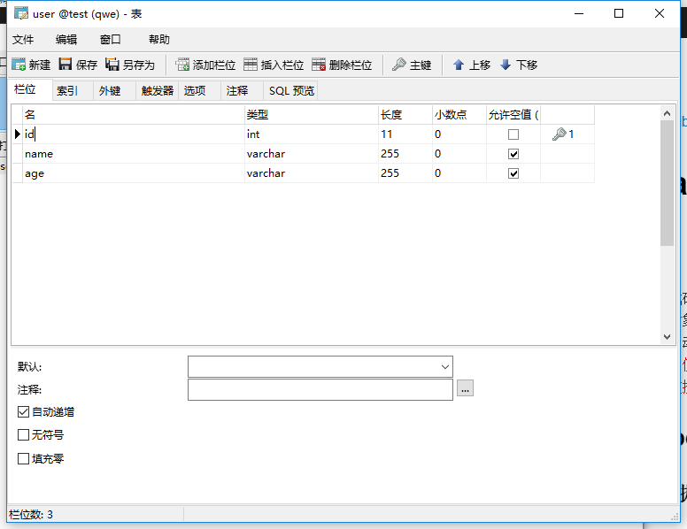

[toc]
# Hibernate
## 概述：
&emsp;&emsp;一个开放源代码的对象关系映射框架，它对JDBC进行了非常轻量级的对象封装，它将POJO与数据库表建立映射关系，是一个全自动的orm框架,<font color="red">hibernate可以自动生成SQL语句，自动执行，使得Java程序员可以随心所欲的使用对象编程思维来操纵数据库。</font>

## 第一个Hibernate的CRUD 例子

<h3>工程目录：</h3>


<h3>①：准备数据库环境</h3>
<font color="red">在test数据库中创建user表.</font>




<h3>②：准备Hibernate 环境</h3>

1. 创建工程项目文件。
2. 到官网上，下载Hibernate 文件（目前最新的稳定版为5.2.12）

    [Hibernate下载路径](http://hibernate.org/orm/releases/5.2/)

3. 导入hobernate 需要的jar包到工程文件的classpath 下。
需要的jar包所在是路径：hibernate-release-5.2.12.Final\lib\required


4. 导入mysql的jdbc驱动包到工程文件的classpath下：
mysql-connector-java-5.1.42-bin.jar


<h3>③：创建Hibernate 配置文件</h3>

hibernate.cfg.xml
```xml

<?xml version='1.0' encoding='utf-8'?>
<!DOCTYPE hibernate-configuration PUBLIC
"-//Hibernate/Hibernate Configuration DTD 3.0//EN"
"http://www.hibernate.org/dtd/hibernate-configuration-3.0.dtd">
<hibernate-configuration>
    <session-factory>
        <!-- 数据库连接信息 -->
        <property name="connection.url">jdbc:mysql://localhost:3306/test</property>
        <property name="connection.username">root</property>
        <property name="connection.password">123456</property>
        <property name="connection.driver_class">com.mysql.jdbc.Driver</property>
 
 		<!-- 告訴hibernate 使用什么数据库,  dialect（方言） -->
        <property name="dialect">org.hibernate.dialect.MySQLInnoDBDialect</property>
        
         <!-- 执行操作时，是否在控制台打印sql语句-->
        <property name="show_sql">true</property>
        
        <!-- 是否 对在控制台打印的sql语句进行格式化 -->
        <property name="format_sql">true</property>
        
        <!-- 指定程序运行时，是否在数据库中自动生成数据表 -->
        <property name="hbm2ddl.auto">update</property>
   
       <!-- 告诉hibernate 去哪找 映射文件（默认后缀为 .hbm.xml文件） ，resource： 表示路径为目录结构形式-->
        <mapping resource="com/hbm/xml/User.hbm.xml" />
      
        
    </session-factory>
</hibernate-configuration>

```


<h3>④：创建持久化类（实体类）</h3>

User.java
```java
package com.entity;
public class User{
 
	private Integer id;
	private String name;
	private Integer age;
	
	public User(){}

	public User(String name, Integer age) {
		super();
		this.name = name;
		this.age = age;
	}

	public Integer getId() {
		return id;
	}

	public void setId(Integer id) {
		this.id = id;
	}

	public String getName() {
		return name;
	}

	public void setName(String name) {
		this.name = name;
	}

	public Integer getAge() {
		return age;
	}

	public void setAge(Integer age) {
		this.age = age;
	}

	@Override
	public String toString() {
		return "User [id=" + id + ", name=" + name + ", age=" + age + "]";
	}
	
}

```


<h3>⑤：创建对象——关系映射文件（Object Relational Mapping,ORM）</h3>
<font color="red">注意：映射文件的扩展名：" .hbm.xml "</font>

User.hbm.xml
```xml
<?xml version="1.0" encoding="UTF-8"?>  
<!DOCTYPE hibernate-mapping PUBLIC "-//Hibernate/Hibernate Mapping DTD 3.0//EN"    
"http://hibernate.sourceforge.net/hibernate-mapping-3.0.dtd">  
<hibernate-mapping>  
  <class name="com.entity.User" table="user">   <!-- name 为持久化类的全类名 -->
     <id name="id" type="java.lang.Integer" column="id">     <!--  指定主键的生成方式，native：使用数据库本地的方式-->
     	<generator class="native"/> 
     </id>  

     <property name="name" type="java.lang.String" column="name"></property>  
     <property name="age" type="java.lang.Integer" column="age"></property>  
  </class>  
  
</hibernate-mapping>


```

<h3>⑥：test</h3>

hibernate_test.java
```java
package com.test;

import static org.junit.Assert.*;

import java.util.List;

import org.hibernate.Session;
import org.hibernate.SessionFactory;
import org.hibernate.Transaction;
import org.hibernate.boot.MetadataSources;
import org.hibernate.boot.registry.StandardServiceRegistry;
import org.hibernate.boot.registry.StandardServiceRegistryBuilder;
import org.hibernate.cfg.Configuration;

import org.junit.Test;

import com.entity.User;

public class hibernate_test {
	
	private static SessionFactory sessionFactory=null;
	private static Session session=null;
	
	/*
	 * 通过静态代码块创建Session对象
	 * */
	static{
		/*
		 * 1.创建Configuration对象，调用configure()方法，加载 hibernate.cfg.xml配置文件. 
		 *  	注意：configure()方法 会默认加载 名字叫 hibernate.cfg.xml 的文件。
		 * 	   	 所以配置文件的名字最好叫hibernate.cfg.xml
		 * 2.创建StandardServiceRegistry 对象，hibernate的所有配置与服务都需要在该对象中注册才能有效。
		   3.创建SessionFactory对象。
		   4.创建Session对象
		 * 
		 * */
		Configuration cfg = new Configuration().configure();
	    sessionFactory=cfg.buildSessionFactory();
	
		/*这种生成 sessionFactory 的方式也可以：
 		 * 
		 * StandardServiceRegistry serviceRegistry=new StandardServiceRegistryBuilder().configure().build();
		   SessionFactory sessionFactory=new MetadataSources(serviceRegistry).buildMetadata().buildSessionFactory();
		 * 
		 * */
	    
	    session=sessionFactory.openSession();
		
	}
	
	
	/*
	 * 插入数据
	 * */
	@Test
	public void insert(){
		/*
		 * 1.创建Configuration对象，调用configure()方法，加载 hibernate.cfg.xml配置文件. 
		 * 	    注意：configure()方法 会默认加载 名字叫 hibernate.cfg.xml 的文件。
		 * 	    所以配置文件的名字最好叫hibernate.cfg.xml。
		 * 2.创建StandardServiceRegistry 对象，hibernate的所有配置与服务都需要在该对象中注册才能有效。
		 * 3.创建SessionFactory对象。
		 * 4.创建Session对象
		 * 5.开启事务
		 * 6.执行插入操作：
		 * 7.提交事务
		 * 8.关闭session，sessionFactory
		 * */
		
		
		Transaction transaction=session.beginTransaction();   //开启事务
		
		User user=new User("xiaoming",44);
		session.save(user);        //插入数据
		
		transaction.commit();       //提交事务
		
		session.close();
		sessionFactory.close();
	}
	
	
	/*
	 * session.update(user);  默认以id来更新数据，如果对象没有id值（或id=null,或数据库没有该id值）,则无法 更新
	 * */
	@Test
	public void update(){
		
		Transaction transaction=session.beginTransaction();   //开启事务
		User user=new User("xiaoho",11);
		user.setId(8);
		
		session.update(user);
		
		transaction.commit();
		
		session.close();
		sessionFactory.close();
		
	}
	
	/*
	 * session.delete(user);  默认以id来删除数据，如果对象没有id值（或id=null,或数据库没有该id值）,则无法删除
	 * */
	@Test
	public void delete(){
		Transaction transaction=session.beginTransaction();   //开启事务
		User user=new User();   
		user.setId(1);
		
		session.delete(user);
		transaction.commit();
		
		session.close();
		sessionFactory.close();

	}
	
	/*
	 * 查询操作，不需要提交事务
	 * 
	 * 	session.get(User.class, 7);    //参数1:需要查询的类对应的clas文件  , 参数2： 查询条件（唯一标识，id值）
	 * */
	@Test
	public void selectone(){
		User user =session.get(User.class,7);
		
		session.close();
		sessionFactory.close();
		
		System.out.println(user);
	
	}

	
	/*
	 * 多条查询，不需要提交事务。
	 * */
	@Test
	public void selectAll(){
		/*
		 * 通过hibernate提供的查询语句进行查询
		 * 此处Users是类名，而不是数据库的表名, select * 不写
		 * */
	    String hql = "from User";   
	    
		//执行hql语句
	    List<User> user_list=session.createQuery(hql).list();
		
	    for (User user : user_list) {
			System.out.println(user);
		}
	    
		session.close();
		sessionFactory.close();
	}
	
}


```

<h3>⑦：解析：</h3>
 
在Hibernate的配置文件 hibernate.cfg.xml 中：
```xml
 <!-- 指定程序运行时，是否在数据库中自动生成数据表 -->
  <property name="hbm2ddl.auto">update</property>
```

==name属性：有4种取值。create , update, create-drop, validate。==

> 1. create
会根据.hbm.xml的文件来生成数据表，但是每次运行都会删除上一次的表，重新生成表，即使表之前之后没有任何改变。

> 2. create-drop:
会根据 .hbm.xml 文件生成表，但是SessionFactory 一旦关闭，表就自动删除。

> 3. update（最常用）：
<font color="red">会根据 .hbm.xml 文件生成表，若 .hbm.xml 文件和数据库的对应的数据表的结构不同，Hibernate 会更新数据表的结构，但不会删除之前存在的数据或结构。</font>

> 4. validate：
会与数据库的表进行比较，若 .hbm.xml文件的列在数据表中不存在，抛出异常。


##  缓存：
缓存是关于应用程序性能的优化，<font color="red">降低了应用程序对物理数据源访问的频次</font>，从而提高应用程序的运行性能。

Hibernate的缓存分为一级缓存，二级缓存。

### 一级缓存（session级别，默认缓存）：
一级缓存是 Session 级别缓存并且是一种强制性的缓存。它随session的创建被创建，随session的销毁被销毁。<font color="red">不同的session之间无法共享一级缓存。</font>

<font color="blue">当程序使用session的加载持久化对象时。session首先会根据加载的数据类和唯一的标识（id）在缓存中查找曾经是否执行过的例子。若存在，则把曾经的例子作为结果返回，若不存在，session会在二级缓存中查找。若还不存在，则session加载新的持久化对象（session直接访问数据库）。</font>

```java
/*
	 * 查询操作，不需要提交事务
	 * 
	 * 	session.get(User.class, 7);    //参数1:需要查询的类对应的clas文件  , 参数2： 查询条件（唯一标识，id值）
	 * */
	@Test
	public void selectone(){
		User user =session.get(User.class,7);
		System.out.println(user);
		
		User user2 =session.get(User.class,7);
		System.out.println(user2);
		
		session.close();
		sessionFactory.close();
		
	}

```


==查询了两次数据库，但只打印了一次sql 语句。说明，第二次查询，是调用了一级缓存中之前查的结果。==


### 二级缓存（SessionFactory 级别，不是默认的需要开启）：
当session加载持久化对象在一级缓存找不到匹配的缓存实例时，session会向二级缓存查找该实例对象。若找不到，session直接访问数据库。

<font color="red">由于Hibernate 本身没有提供二级缓存的实现方式。所以需要引入第三方的插件来实现Hibernate的二级缓存。</font>

**这里以EHCache 作为Hibernate的二级缓存：**


## Hibernate 配置文件：

### 1.配置C3P0数据源连接池：

1. 导入C3P0jar包，加入到类路径中：
一般在你下载的Hibernate的文件夹的
hibernate-release-5.2.12.Final\lib\optional\c3p0

> c3p0-0.9.5.2.jar
> hibernate-c3p0-5.2.12.Final.jar
> mchange-commons-java-0.2.11.jar

2. 添加配置文件信息：

hibernate.cfg.xml
```xml

        <!-- 配置C3P0数据库连接池
        	hibernate.c3p0.max_size:  最大连接数 
        	hibernate.c3p0.min_size： 最小连接数 
        	c3p0.acquire_increment：  当连接池里面的连接快用完的时候，C3P0同一时刻内可以同时获取的新的连接数的数量
        
        	c3p0.idle_test_period： 每隔2秒检查连接池里的连接对象是否超时，若超时，会有专门的线程每隔一段时间销毁超时的连接对象.
        	c3p0.timeout:  连接数多长时间没有使用后，被销毁
        	
        	c3p0.max_statements: 缓存的Statement的最大数量
         -->
       <property name="hibernate.c3p0.max_size">10</property>
       <property name="hibernate.c3p0.min_size">5</property>
       <property name="c3p0.acquire_increment">2</property>
        
       <property name="c3p0.idle_test_period">2000</property>
       <property name="c3p0.timeout">2000</property>
       <property name="c3p0.max_statements">10</property>
   
```


### 2.配置批量操作（CRUD）的属性（主要适用于Oracle数据库）：

hibernate.cfg.xml
```xml
<!-- 
   			这两个属性主要适用于Oracle数据库， Mysql数据库不支持fetch_size特性
   		
   			hibernate.jdbc.fetch_size:  该属性 设定jdbc的Statement 读取数据的时候每次从数据库取出的记录条数。
   			例如：当一次性查询10000条数据时，一条一条的查询，内存消耗小，但速度慢。
   			而100条100条的查询，速度快，但内存消耗大。因此取合适的值100。
   			
   			hibernate.jdbc.batch_size： 对数据库进行批量删除，更新，插入时的每个批次的数量大小。
   		
   		
   		 -->
   		<property name="hibernate.jdbc.fetch_size">100</property>
   		<property name="hibernate.jdbc.batch_size">50</property>
```