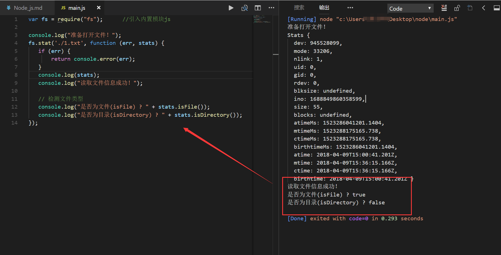
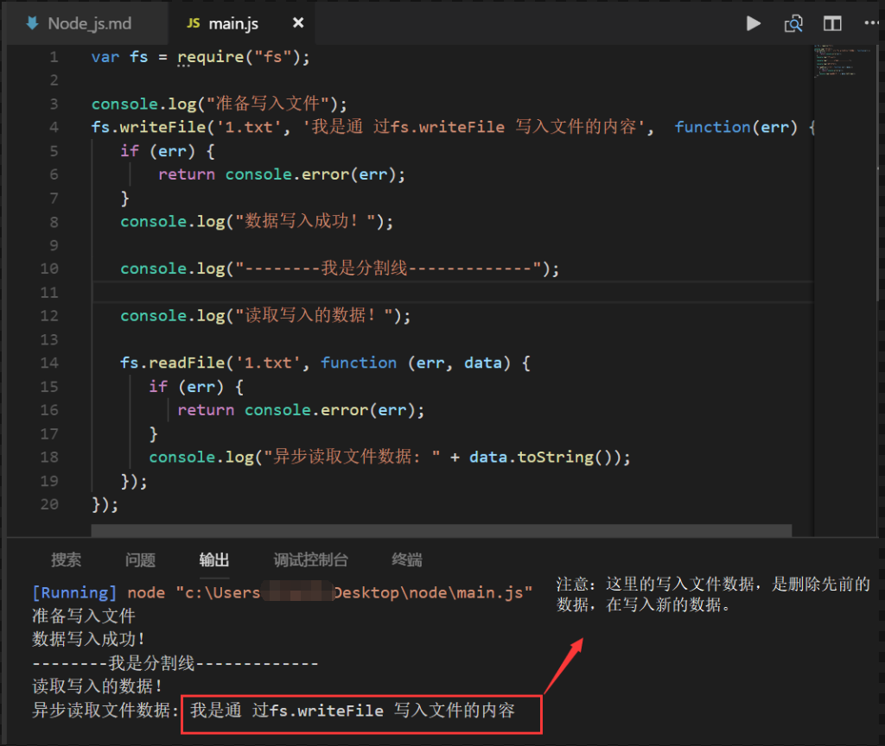
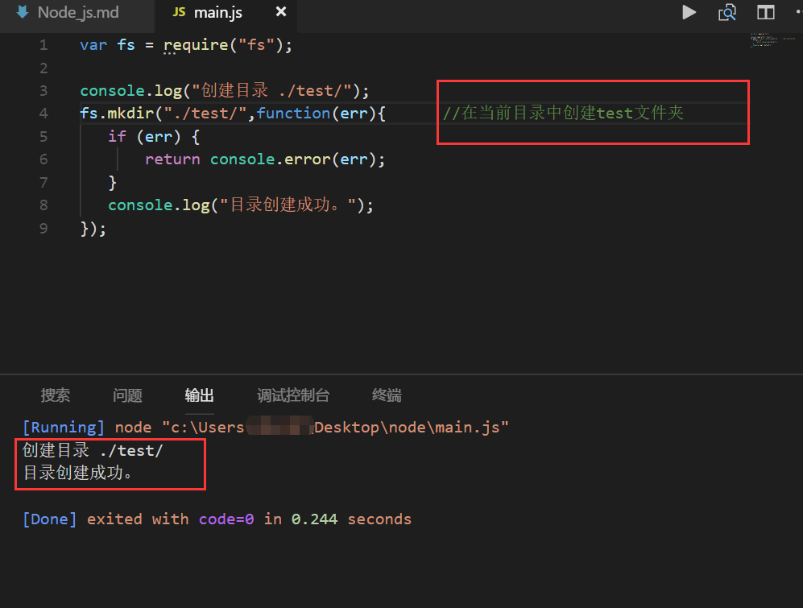
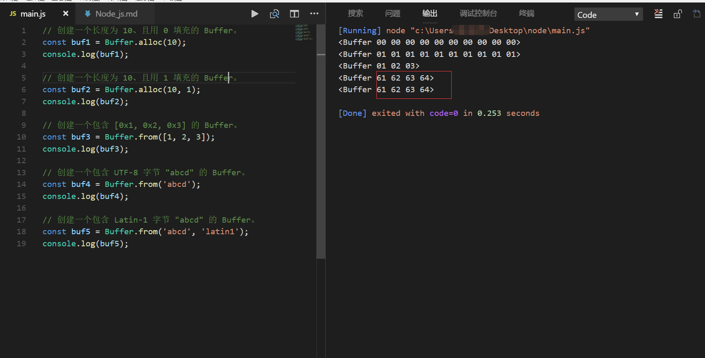
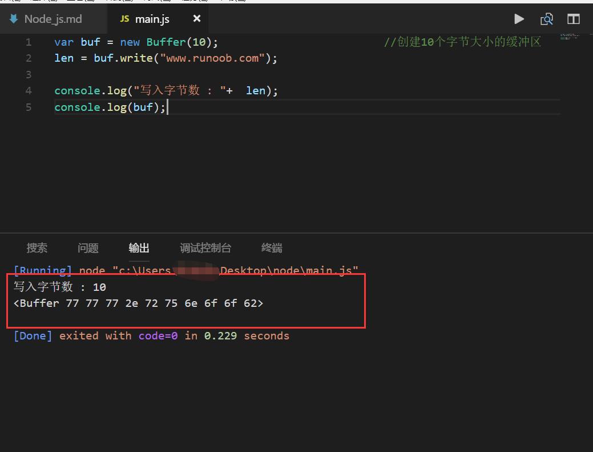

[toc]
# Node.Js
Node.js 就是运行在服务端的 JavaScript。
Node.js 是一个基于Chrome JavaScript 运行时建立的一个平台。
Node.js 是一个事件驱动I/O服务端JavaScript环境，基于Google的V8引擎，V8引擎执行Javascript的速度非常快，性能非常好。

## 1.安装Node.js

1. 下载Node.js:
[Node.js中文网](http://nodejs.cn/)

2. 安装node.js：
<font color="red">在Windows上安装时务必选择全部组件，包括勾选==Add to Path==</font>

3. 执行语句：
在Windows环境下，打开命令提示符，然后输入node -v，出现版本号，表示安装正常。
```
C:\Users\IEUser>node -v
v8.11.1

```

---

## 2.NPM

### 1.认识NPM：

npm其实是Node.js的包管理工具（node.js package manager）。

> 当我们在Node.js上开发时，会用到很多别人写的JavaScript代码。

> 如果我们要使用别人写的某个包，每次都根据名称搜索一下官方网站，下载代码，解压，再使用，非常繁琐。

> 于是一个集中管理的工具应运而生：大家都把自己开发的模块打包后放到npm官网上，如果要使用，直接通过npm安装就可以直接用，不用管代码存在哪，应该从哪下载。

> 如果我们要使用模块A，而模块A又依赖于模块B，模块B又依赖于模块X和模块Y，npm可以根据依赖关系，把所有依赖的包都下载下来并管理起来。否则，靠我们自己手动管理，肯定既麻烦又容易出错。


> 常见的使用场景有以下几种：
①：允许用户从NPM服务器下载别人编写的三方包到本地使用。
②：允许用户从NPM服务器下载并安装别人编写的命令行程序到本地使用。
③：允许用户将自己编写的包或命令行程序上传到NPM服务器供别人使用。


==npm已经在Node.js安装的时候顺带装好了==

```
C:\>npm -v
5.6.0
```

```
C:\>npm
Usage: npm <command>

where <command> is one of:
    access, adduser, bin, bugs, c, cache, completion, config,
    ddp, dedupe, deprecate, dist-tag, docs, doctor, edit,
    explore, get, help, help-search, i, init, install,
    install-test, it, link, list, ln, login, logout, ls,
   ..........

```


### 2.使用NPM：

[NPM官网](https://www.npmjs.com/)

#### 1.下载第三方包：
```
$ npm install 包名
```

<font color="red">
下载好之后，第三方包就放在了工程目录下的node_modules目录中，因此在代码中只需要通过`require('包名')`的方式就好，无需指定三方包路径。
</font>


---


## 3.命令行运行node程序：

1. 编写hello.js文件：
```js
'use strict';  //以严格模式运行JavaScript代码，避免各种潜在陷阱。

console.log('Hello, world.');
```

2. 命令行运行该js文件：
```
C:\nodejs>node hello.js

Hello, world
```


## 4.使用严格模式

==严格模式通过在脚本或函数的头部添加 "use strict"; 表达式来声明。==

①：为什么使用严格模式:

1. 消除Javascript语法的一些不合理、不严谨之处，减少一些怪异行为;
2. 消除代码运行的一些不安全之处，保证代码运行的安全；
3. 提高编译器效率，增加运行速度；
4. 为未来新版本的Javascript做好铺垫。


②：使用严格模式：

> 如果在JavaScript文件开头写上'use strict';，那么Node在执行该JavaScript时将使用严格模式。

> 在服务器环境下，如果有很多JavaScript文件，每个文件都写上'use strict';很麻烦。我们可以给Nodejs传递一个参数，让Node直接为所有js文件开启严格模式：

`node --use_strict calc.js`


## 5.Node.js集成开发环境 : Visual Studio Code

[视频演示](https://www.bilibili.com/video/av5827351/)

<font color="red">
VsCode中运行nodeJs代码的简单方法-->安装 Code Runner插件。 
</font>


## 6.模块
在Node环境中，一个.js文件就称之为一个模块（module）。

<font color="red">在编写每个模块时，都有require、exports、module三个预先定义好的变量可供使用。</font>


> ==编写模块的好处==：
> ①：当一个模块编写完毕，就可以被其他地方引用。我们在编写程序的时候，也经常引用其他模块，包括Node内置的模块和来自第三方的模块。
> ②：使用模块还可以避免函数名和变量名冲突。相同名字的函数和变量完全可以分别存在不同的模块中，因此，我们自己在编写模块时，不必考虑名字会与其他模块冲突。

<h3>DEMO：</h3>

①：编写hello 模块：
> hello.js
```js
'use strict';
var s = 'Hello';

console.info(s);

function greet(name) {
    console.log(s + ', ' + name + '!');
}

module.exports = greet;
```

② 编写main模块，并调用hello模块：
>main.js:
```js
'use strict';
// 引入hello模块:
var greet = require('./hello');   // 不要忘了写相对目录!

var s = 'Michael';

greet(s); // Hello, Michael!
```

### 1.require 变量：

1. 加载模块（js文件）：
require函数用于在当前模块中加载别的模块，传入一个模块名，返回一个模块导出对象。模块名可使用相对路径（以./开头），或者是绝对路径（以/或C:之类的盘符开头）。
==另外，模块名中的.js扩展名可以省略。==

```js
var he1 = require('./hello');
var he2 = require('./hello.js');
```


2. 加载json文件：
`var data = require('./data.json');`

---

### 2. exports 变量：
exports对象用于导出模块公有方法和属性。==别的模块通过require函数使用当前模块时得到的就是当前模块的exports对象。==

<font color="red">module.exports 与 exports 具有相同功能。因为exports是module的属性之一。</font>

```js
function greet(name) {
    console.log(s + ', ' + name + '!');
}

module.exports = greet;   //导出一个函数


exports.hello = function () {     //导出一个匿名函数
    console.log('Hello World!');
};

var a="sss";
exports=a;      //导出一个变量
```


---


### 3.module变量：
通过module对象可以访问到当前模块的一些相关信息，==但最多的用途是替换当前模块的导出对象。==

```js
module.exports = function () {    //模块默认导出对象被替换为一个函数。
    console.log('Hello World!');
};
```


### 4.小结：

> 模块初始化:
一个模块中的JS代码仅在模块第一次被使用时执行一次，并在执行过程中初始化模块的导出对象。之后，缓存起来的导出对象被重复利用。

> 主模块:
通过命令行参数传递给NodeJS以启动程序的模块被称为主模块。主模块负责调度组成整个程序的其它模块完成工作。


---

## 7.包：

JS模块的基本单位是单个JS文件，但复杂些的模块往往由多个子模块组成。为了便于管理和使用，我们可以==把由多个子模块组成的大模块称做包，并把所有子模块放在同一个目录里。==

> <font color="red">在组成一个包的所有子模块中，需要有一个入口模块，入口模块的导出对象被作为包的导出对象。</font>


例如有以下目录结构(lib文件下有cat文件，该文件里有三个模块):
```
- /home/user/lib/
    - cat/
        head.js
        body.js
        main.js
```

main.js作为入口模块，其内容如下：
```js
var head = require('./head');     //导入head模块
var body = require('./body');     //导入body模块

exports.create = function (name) {    //把main模块的暴露出去
    return {
        name: name,
        head: head.create(),
        body: body.create()
    };
};
```

其他文件中使用：
`require('/home/user/lib/cat/main')`


## 8.标准工程目录：
一个标准的工程目录都看起来像下边这样:
```
- /home/user/workspace/node-echo/   # 工程目录
    - bin/                          # 存放命令行相关代码
        node-echo
    + doc/                          # 存放文档
    - lib/                          # 存放API相关代码
        echo.js
    - node_modules/                 # 存放三方包
        + argv/
    + tests/                        # 存放测试用例
    package.json                    # 元数据文件
    README.md                       # 说明文件
```

---

## 9. global全局对象，process进程对象：

①：global全局对象:

在Node.js环境中，也有唯一的全局对象，叫global，这个对象的属性和方法也和浏览器环境的window不同。进入Node.js交互环境，可以直接输入：

```
> global.console
Console {
  log: [Function: bound ],
  info: [Function: bound ],
  warn: [Function: bound ],
  error: [Function: bound ],
  dir: [Function: bound ],
  time: [Function: bound ],
  timeEnd: [Function: bound ],
  trace: [Function: bound trace],
  assert: [Function: bound ],
  Console: [Function: Console] }

```


②：process进程对象:

process也是Node.js提供的一个对象，它代表当前Node.js进程。通过process对象可以拿到许多有用信息：

```
> process === global.process;
true
> process.version;
'v5.2.0'
> process.platform;
'darwin'
> process.arch;
'x64'
> process.cwd();                   //返回当前工作目录
'/Users/michael'
> process.chdir('/private/tmp');   // 切换当前工作目录
undefined
> process.cwd();
'/private/tmp'

```

---

## 10. Node.js 常用功能：

### 1.fs 内置模块---文件系统模块：

Node.js 文件系统（fs 模块）模块中的方法均有异步和同步版本。

#### 1.读取文件数据：

①：在同目录下创建 1.txt文件：
> 1.txt:
```
this is a 1.txt file
```

②：读取1.txt文件：
> main.js
```js
var fs = require("fs");

// 异步读取
fs.readFile('1.txt', function (err, data) {
   if (err) {
       return console.error(err);
   }
   console.log("异步读取: " + data.toString());
});


// 同步读取
var data = fs.readFileSync('1.txt');
console.log("同步读取: " + data.toString());

console.log("程序执行完毕。");
```

③：运行结果：


---


#### 2.获取文件属性：

语法
以下为通过==异步模式==获取文件信息的语法格式：
`fs.stat(path, callback);`

> path: 文件路径。
> callback ：回调函数。带有两个参数如：(err, stats), stats 是 fs.Stats 对象。


Demo:
```js
var fs = require("fs");      //引入内置模块js

console.log("准备打开文件！");
fs.stat('./1.txt', function (err, stats) {
   if (err) {
       return console.error(err);
   }
   console.log(stats);
   console.log("读取文件信息成功！");
   
   // 检测文件类型
   console.log("是否为文件(isFile) ? " + stats.isFile());
   console.log("是否为目录(isDirectory) ? " + stats.isDirectory());    
});
```




#### 3.写入文件：
>异步模式下写入文件的语法格式(==[...]表示参数可有可无==)：
```js
fs.writeFile(filename, data, [options], [callback(err)])
```

参数名称解析：
> filename - (String) - 文件名称

> data    - (String | Buffer) -  将要写入的内容，可以使字符串 或 buffer数据。

> options  - (Object) -  option数组对象，包含：
> ----encoding - (string)  - 可选值，默认 ‘utf8′，当data使buffer时，该值应该为 ignored。
> ----mode  - (Number) - 文件读写权限，默认值 438
> ----flag - (String) - 默认值 ‘w'

> callback -  {Function} - 回调，传递一个异常参数err。


==writeFile 直接写入文件默认是 w 模式，所以如果文件存在，该方法写入的内容会覆盖旧的文件内容。==


<h3>DEMO:</h3>
```js
var fs = require("fs");

console.log("准备写入文件");
fs.writeFile('./1.txt', '我是通 过fs.writeFile 写入文件的内容',  function(err) {
   if (err) {
       return console.error(err);
   }
   console.log("数据写入成功！");

   console.log("--------我是分割线-------------");

   console.log("读取写入的数据！");

   fs.readFile('./1.txt', function (err, data) {
      if (err) {
         return console.error(err);
      }
      console.log("异步读取文件数据: " + data.toString());
   });
});

```
<h3>
<font color="red">
ps:这里的写入文件数据是把之前的数据删除，在重新写入数据。因为options参数的flag的属性的默认值为 "w",如果文件存在，该方法写入的内容会覆盖旧的文件内容。
</font>
</h3>


运行结果：



#### 4. 删除文件：
语法
以下为删除文件的语法格式：
`fs.unlink(path, callback);`

> path - 文件路径。
> callback - 回调函数，没有参数。

DEMO:
```js
var fs = require("fs");

console.log("准备删除文件！");
fs.unlink('./1.txt', function(err) {
   if (err) {
       return console.error(err);
   }
   console.log("文件删除成功！");
});
```


#### 5.创建目录：
语法
以下为创建目录的语法格式：

`fs.mkdir(path,[mode], callback)`

> path - 文件路径。
> mode - 设置目录权限，默认为 0777。
> callback - 回调函数，没有参数。

DEMO：
```js
var fs = require("fs");

console.log("创建目录 ./testA/testB/");
fs.mkdir("./testA/testB/",function(err){
   if (err) {
       return console.error(err);
   }
   console.log("目录创建成功。");
});
```




#### 6.读取目录信息：
语法
以下为读取目录的语法格式：
`fs.readdir(path, callback);`

> path - 文件路径。
> callback - 回调函数,有两个参数(err, files)，err 为错误信息，files 为 目录下的文件数组列表。

DEMO:
```js
var fs = require("fs");

console.log("查看 /test 目录");
fs.readdir("./test/",function(err, files){     
   if (err) {
       return console.error(err);
   }
   files.forEach( function (file){     //循环输出文件信息列表
       console.log(file);
   });
});
```


#### 7.删除空的目录:
语法
以下为删除目录的语法格式：
`fs.rmdir(path, callback);`
> path - 文件路径。
> callback - 回调函数，没有参数。

==ps:该方法为删除空的目录。==

DEMO:
```js
var fs = require("fs");
// 执行前创建一个空的 ./test 目录
console.log("准备删除目录 ./test");
fs.rmdir("./test",function(err){      //删除当前目录下的test文件夹
   if (err) {
       return console.error(err);
   }else{
       console.log("删除成功");
   }
});
```


---


### 2.Buffer(缓冲区)：
在==处理像TCP流或文件流时，必须使用到二进制数据==。因此在 Node.js中，定义了一个 Buffer 类，该类用来创建一个专门存放二进制数据的缓存区。


#### 1.创建Buffer类：

Buffer 提供了以下 API 来创建 Buffer 类：
```js
Buffer.alloc(size[fill],[encoding]);  // 返回一个指定大小的 Buffer 实例，如果没有设置 fill，则默认填满 0
Buffer.allocUnsafe(size);  // 返回一个指定大小的 Buffer 实例，但是它不会被初始化，所以它可能包含敏感的数据
Buffer.allocUnsafeSlow(size);
Buffer.from(array);  // 返回一个被 array 的值初始化的新的 Buffer 实例（传入的 array 的元素只能是数字，不然就会自动被 0 覆盖）
Buffer.from(arrayBuffer,[byteOffset],[length]);   //返回一个新建的与给定的 ArrayBuffer 共享同一内存的 Buffer。 
Buffer.from(buffer); //复制传入的 Buffer 实例的数据，并返回一个新的 Buffer 实例
Buffer.from(string,[encoding]);   //返回一个被 string 的值初始化的新的 Buffer 实例

```


DEMO:

```js
// 创建一个长度为 10、且用 0 填充的 Buffer。
const buf1 = Buffer.alloc(10);
console.log(buf1);

// 创建一个长度为 10、且用 1 填充的 Buffer。 
const buf2 = Buffer.alloc(10, 1);
console.log(buf2);

// 创建一个包含 [0x1, 0x2, 0x3] 的 Buffer。
const buf3 = Buffer.from([1, 2, 3]);
console.log(buf3);

// 创建一个包含 UTF-8 字节 "abcd" 的 Buffer。
const buf4 = Buffer.from('abcd');
console.log(buf4);

// 创建一个包含 Latin-1 字节 "abcd" 的 Buffer。
const buf5 = Buffer.from('abcd', 'latin1');
console.log(buf5);
```

运行结果：



<h2><font color="red">PS:还有一些被废弃的创建Buffer的方法，如下所示</font></h2>


> 方法 1
以下是创建10个字节的Buffer缓冲的语法：
`var buf = new Buffer(10);`

> 方法 2
下面是用来从给定数组创建一个缓冲区的语法：
`var buf = new Buffer([10, 20, 30, 40, 50]);`

> 方法 3
下面是用来从给定的字符串和可选的编码类型创建缓冲区的语法：
`var buf = new Buffer("Simply Easy Learning", "utf-8");`

==“UTF8”是默认的编码，其它的编码:"ascii", "utf8", "utf16le", "ucs2", "base64" 或 "hex".==


#### 2.向缓冲区写入数据：
语法
写入 Node 缓冲区的语法如下所示：
```js
var buf = Buffer.alloc(10);;                         //创建10个字节大小的缓冲区
buf.write(string,[offset],[length],[encoding]);   //[]表示该参数可有可无
```   

> string - 写入缓冲区的字符串。

> offset - 缓冲区开始写入的索引值，默认为 0 。

> length - 写入的字节数，默认为 buffer.length

> encoding - 使用的编码。默认为 'utf8' 。


<font color="red">
根据 encoding 的字符编码写入 string 到 buf缓冲区 中的 offset 位置。 length 参数是写入的字节数。 如果 buf 没有足够的空间保存整个字符串，则只会写入 string 的一部分。 其他部分解码的字符不会被写入。
</font>


DEMO:
```js
var buf = Buffer.alloc(10);;                         //创建10个字节大小的缓冲区
len = buf.write("www.runoob.com");

console.log("写入字节数 : "+  len);

```




#### 3.从缓冲区读取数据：
语法
读取 Node 缓冲区数据的语法如下所示：
`buf.toString([encoding],[start],[end]);    //[]表示该参数可有可无`

> encoding - 使用的编码。默认为 'utf8' 。
> start - 指定开始读取的索引位置，默认为 0。
> end - 结束位置，默认为缓冲区的末尾。

DEMO:
```js
var buf = Buffer.alloc(20);; 
 buf.write("www.runoob.一二三四五六");    //向缓冲区写入数据


console.log( buf.toString('ascii'));       // 读取数据以ascii编码的方式 
console.log( buf.toString('ascii',0,5));   // 读取数据从第0个到第4个，以ascii编码的方式
console.log( buf.toString('utf8',0,5));   
console.log( buf.toString(undefined,0,5));
```


#### 4.缓冲区合并:
语法
Node 缓冲区合并的语法如下所示：
`Buffer.concat(list,[totalLength]);`

> list - 用于合并的 Buffer 对象数组列表。

> totalLength - 指定合并后Buffer对象的总长度。

DEMO:
```js
var buffer1 = Buffer.from(('菜鸟教程'));
var buffer2 = Buffer.from(('www.runoob.com'));
var buffer3 = Buffer.concat([buffer1,buffer2]);
console.log("buffer3 内容: " + buffer3.toString());
```

运行结果：
`buffer3 内容: 菜鸟教程www.runoob.com`


#### 5.拷贝缓冲区:
语法
Node 缓冲区拷贝语法如下所示：
```js
buf.copy(targetBuffer,[targetStart],[sourceStart],[sourceEnd]);
```

> targetBuffer - 要拷贝的 Buffer 对象。
> targetStart - 数字, 可选, 默认: 0
> sourceStart - 数字, 可选, 默认: 0
> sourceEnd - 数字, 可选, 默认: buffer.length
> 没有返回值


DEMO:
```js
var buf1 = Buffer.from('abc');
var buf2 = Buffer.from('RUNOOB');

//将 buf2 插入到 buf1 指定位置上
buf2.copy(buf1, 2);
console.log(buf1.toString());
```

运行结果:`abRUNOOB`


#### 6.缓冲区剪切：
Node 缓冲区剪切语法如下所示：
`buf.slice([start],[end]);`

> start - 数字, 可选, 默认: 0
> end - 数字, 可选, 默认: buffer.length

> 返回一个新的缓冲区，它和旧缓冲区指向同一块内存，但是从索引 start 到 end 的位置剪切。

DEMO:
```js
var buffer1 = Buffer.from('runoob');
// 剪切缓冲区
var buffer2 = buffer1.slice(0,2);    //从索引第0-1个进行剪切。
console.log("buffer2 content: " + buffer2.toString());
```

运行结果：`buffer2 content: ru`


#### 7.缓冲区长度:
语法：
`buf.length;`

DEMO:
```js
var buffer = Buffer.from('www.runoob.com');
//  缓冲区长度
console.log("buffer length: " + buffer.length);
```

运行结果：`buffer length: 14`


