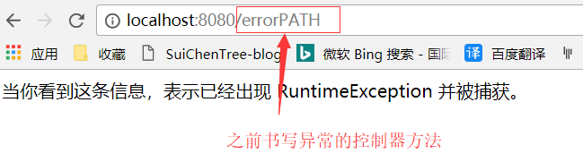
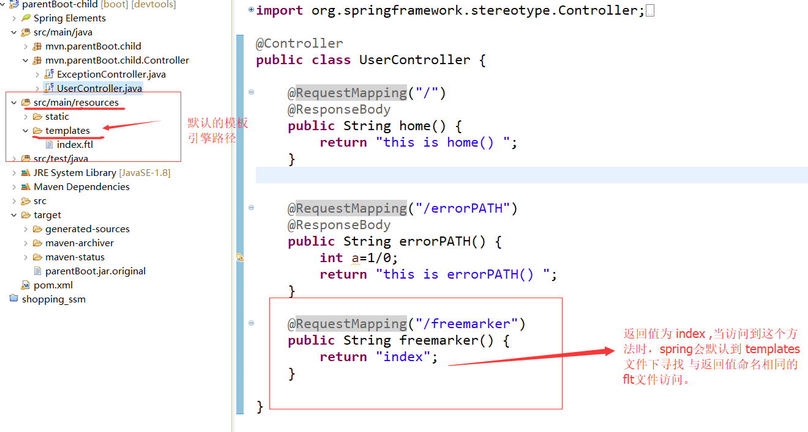
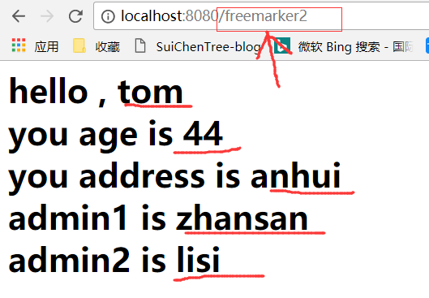
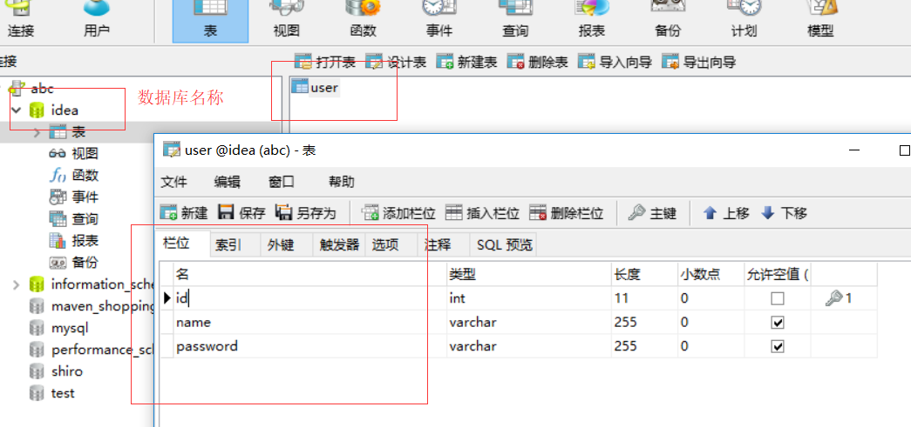
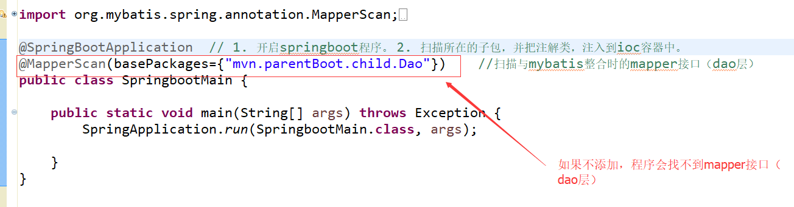
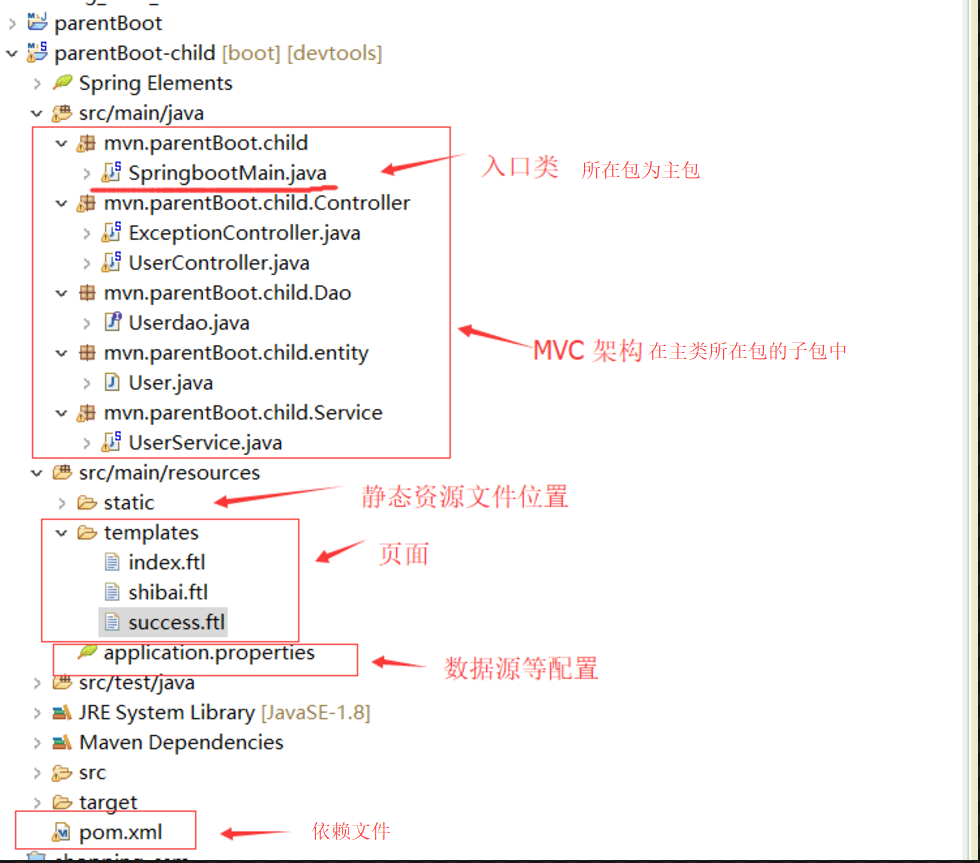
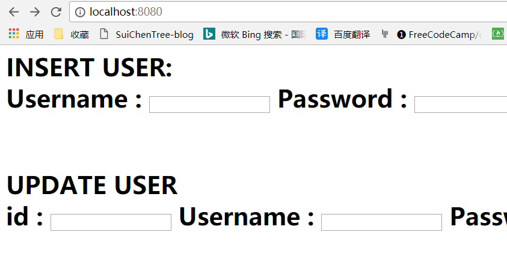

[toc]
# Spring Boot 
Spring Boot是用来简化新Spring应用的初始搭建以及开发过程。该框架使用了特定的方式来进行配置，从而==使开发人员不再需要定义重复，繁杂==的配置。

## 1.SpiringBoot的快速开始：

1. 创建maven项目：
<font color="red">
注意：
①：建立的是quickstart项目不是webapp项目
②：maven项目的 JRE 与使用版本一致等常见创建maven项目问题.
</font>

<br/>

2. 修改pom.xml文件：

添加以下代码到pom.xml文件中：


```xml
<!-- 引入springboot 父类依赖-->
<parent>
    <groupId>org.springframework.boot</groupId>
    <artifactId>spring-boot-starter-parent</artifactId>
    <version>2.0.0.RELEASE</version>
</parent>


<!--添加sping boot的 jar包依赖:
        该依赖包含spring框架中许多常用的Web 开发依赖.
-->
<dependencies>
    <dependency>
        <groupId>org.springframework.boot</groupId>
        <artifactId>spring-boot-starter-web</artifactId>
    </dependency>
</dependencies>
```

3. 在src/main/java目录下建立包，然后创建springboot运行的开始类。

<font color="red"><h4>★★★★★注意代码注释</h4></font>

```java
package mvn.springboot_1;

//@RestController  可以取@Controller注解，当添加这个注解时，它会为每个方法添加@ResponseBody注解
@Controller
@EnableAutoConfiguration  //该注解表示开启自动配置处理，是springboot的启动程序注解
public class SampleController {
    //spring boot 运行的入口类

    @RequestMapping("/")
    @ResponseBody   //该注解的作用时，把方法的返回值作为相应的内容，而不是页面的名称
    public String home() {
        return "Hello Ssss!";
    }
    public static void main(String[] args) throws Exception {
/*
 * 1.SpringApplication是Spring Boot框架中描述spring应用的类，
 *  它的run()方法会创建一个应用上下文（Application Context），
 *  然后它判断类路径上的依赖，比如我们引入了spring-boot-starter-web，
 *  然后它会判断当前应用程序为一个web程序，然后启动内置Servlet容器（默认tomcat服务器）来处理HTTP请求。

   2.SpringWebMvc会将接收到的HTTP请求分发给controller控制器，
    这里的@ResponseBody，它会直接将返回值作为HTTP Response的body部分返回浏览器。

   3.@RequestMapping("/")就是我们经常写的处理请求的URL路径，可以引导程序处理正确的请求路径。
    
    
 * */
    	
    SpringApplication.run(SampleController.class, args);
    	
    }
}

```

<br/>

+ @EnableAutoConfiguration 用于自动配置。简单的说，<font color="red">它会根据你的pom配置（实际上应该是根据具体的依赖）来判断这是一个什么应用，并创建相应的环境。</font>
在上面这个例子中，@EnableAutoConfiguration 会判断出这是一个web应用，所以会创建相应的web环境。

<br/>

+ SpringApplication 则是用于从main方法启动Spring应用的类。默认，它会执行以下步骤：

  + 1. 创建一个合适的ApplicationContext实例 （取决于classpath）。
  + 2. 注册一个CommandLinePropertySource，以便将命令行参数作为Spring properties。
  + 3. 刷新application context，加载所有单例beans。
  + 4. 激活所有CommandLineRunner beans。
  + 5. 默认，直接使用SpringApplication 的静态方法run()即可。但也可以创建实例，并自行配置需要的设置。


<br/>

4. 运行第一个SpringBoot 程序：

①：如果使用 STS（spring-tool-suite）开发工具，则可以直接单击右键run as - > spring boot app 启动程序。然后打开浏览器，输入 localhost:8080 来查看。

②：也可以使用maven命令的方式运行spring boot 程序，单击右键 Run as -> maven build , ==输入命令  spring-boot:run== 来启动程序。然后打开浏览器，输入 localhost:8080 来查看。


## 2.建立统一的父pom文件:

<font color="red">在实际的maven项目中，我们需要建立以统一的父pom文件,来方便对maven项目的许多模块公共配置进行统一管理。</font>


①：重新建立一个maven项目（名称：parentBoot），作为父项目，然后删除除了pom.xml文件的所有文件，删除干净后，==到maven仓库引入这个spring-boot-dependencies 依赖，并把pom文件中的packaging标签的值改为pom形式。==


```xml
<project xmlns="http://maven.apache.org/POM/4.0.0" xmlns:xsi="http://www.w3.org/2001/XMLSchema-instance"
  xsi:schemaLocation="http://maven.apache.org/POM/4.0.0 http://maven.apache.org/xsd/maven-4.0.0.xsd">
  <modelVersion>4.0.0</modelVersion>

  <groupId>mvn</groupId>
  <artifactId>parentBoot</artifactId>
  <version>0.0.1-SNAPSHOT</version>
  <packaging>pom</packaging>

  <name>parentBoot</name>
  <url>http://maven.apache.org</url>
  <properties>
    <project.build.sourceEncoding>UTF-8</project.build.sourceEncoding>
  </properties>

  <dependencyManagement>
  <dependencies>
  		<!-- 父pom 文件支持 -->
		<dependency>
		    <groupId>org.springframework.boot</groupId>
		    <artifactId>spring-boot-dependencies</artifactId>
		    <version>2.0.0.RELEASE</version>
		    <type>pom</type>
		    <scope>import</scope>
		</dependency>

  </dependencies>
  </dependencyManagement>
  
  <!--装配maven的插件-->
    <build>
      <finalName>parentBoot</finalName> 
    <!--spring boot 打包插件-->
      <plugins>
        <plugin>
          <groupId>org.apache.maven.plugins</groupId>
          <artifactId>maven-compiler-plugin</artifactId>
          <configuration>
            <source>1.8</source>
            <target>1.8</target>
          </configuration>
        </plugin>
      </plugins>
  </build>
    <modules>
    	<module>parentBoot-child</module>
    </modules>
</project>

```


②：建立之前建立的父项目的子模块（名称：parentBoot-child）：

1. 右键父项目，在父项目上新建子模块（Maven Module ）


2. 修改子模块的pom.xml 文件,添加springboot的jar 包依赖：

```xml
<?xml version="1.0"?>
<project xsi:schemaLocation="http://maven.apache.org/POM/4.0.0 http://maven.apache.org/xsd/maven-4.0.0.xsd" xmlns="http://maven.apache.org/POM/4.0.0"
    xmlns:xsi="http://www.w3.org/2001/XMLSchema-instance">
  <modelVersion>4.0.0</modelVersion>
  <parent>
    <groupId>mvn</groupId>
    <artifactId>parentBoot</artifactId>
    <version>0.0.1-SNAPSHOT</version>
  </parent>
  <artifactId>parentBoot-child</artifactId>
  <name>parentBoot-child</name>
  <url>http://maven.apache.org</url>
  
  <properties>
    <project.build.sourceEncoding>UTF-8</project.build.sourceEncoding>
  </properties>
  <dependencies>
    
    <!--添加springboot的依赖 -->
     <dependency>
        <groupId>org.springframework.boot</groupId>
        <artifactId>spring-boot-starter-web</artifactId>
    </dependency>

  </dependencies>
</project>

```

3. 在src/main/java目录下建立包，然后创建springboot运行的开始类：

```java
package mvn.parentBoot.child;

//@RestController  可以取@Controller注解，当添加这个注解时，它会为每个方法添加@ResponseBody注解
@Controller
@EnableAutoConfiguration   //该注解表示开启自动配置处理，是springboot的启动程序注解
public class SampleController {

    @RequestMapping("/")
    @ResponseBody       //该注解的作用时，把方法的返回值作为相应的内容，而不是页面的名称
    String home() {
        return "ssss";
    }

    public static void main(String[] args) throws Exception {
        SpringApplication.run(SampleController.class, args);
    }
}


```


③：运行子模块的springboot的程序。


## 3.热部署(spring boot 项目自动读取配置，更新代码）：

<font color="red">
当我们修改文件和创建文件时，都需要重新启动项目。这样频繁的操作很浪费时间，配置热部署可以让项目自动加载变化的文件，省去的手动操作。
</font>

>     


**这是简单的springboot项目配置标志（不能自动读取配置，更新代码）。**

解决方法： ==给子模块Maven项目的pom.xml文件添加两个依赖jar库（在maven仓库中寻找)==

```xml

<dependency>
    <groupId>org.springframework</groupId>
    <artifactId>springloaded</artifactId>
    <version>1.2.8.RELEASE</version>
</dependency>

<dependency>
    <groupId>org.springframework.boot</groupId>
    <artifactId>spring-boot-devtools</artifactId>
    <version>2.0.0.RELEASE</version>
</dependency>

```

 
 
**表示该项目变成热部署（自动更新状态,当你修改代码时，不需要重新启动。）**

<br/>

## 4.Spring Boot 的开发建议（其余所有程序类的包都要放在主类（入口类）的子包下） ★★★★★

<font color="red"><h3>Spring 官方建议：其余所有程序类的包都要放在主类（入口类）的子包下，做到主类在主包中，控制器类在控制器子包中等。</h3></font>


①：修改主类：

```java
package mvn.parentBoot.child;

@SpringBootApplication      
public class SpringbootMain {
    
    public static void main(String[] args) throws Exception {
        SpringApplication.run(SpringbootMain.class, args);
    }
}

```


②：创建子包（控制器包），创建控制器类：


```java
package mvn.parentBoot.child.Controller;

@Controller
public class UserController {
		
	@RequestMapping("/")
    @ResponseBody       //该注解的作用时，把方法的返回值作为相应的内容，而不是页面的名称
    public String home() {
        return "this is home() ";
    }
	
}

```

③：运行程序

## 5.springboot的项目打包,部署：

### 1.打包：

==Springboot的项目打包，只需要在父项目（不是子模块）的pom.xml 文件中配置插件就可以了。==


①：在父 pom.xml 文件中装配打包发布部署处理插件：
```xml
<!-- 该插件的主要功能是对项目的打包发布处理 -->
        <plugin>
          <groupId>org.springframework.boot</groupId>
          <artifactId>spring-boot-maven-plugin</artifactId>
          <configuration>  <!-- 设置程序主类的位置（springboot主方法所在的类） -->
            <mainClass>mvn.parentBoot.child.SpringbootMain</mainClass>
          </configuration>
          <executions>
          		<execution>
          			<goals>
          				<goal>repackage</goal>
          			</goals>
          		</execution>
          </executions>
        </plugin>
``` 


②：对当前的项目或者子模块先进行maven 更新，后执行“  ==clean package==  ” maven打包命令 。


③：在项目的target目录中会出现打包好的jar或war 包。


### 2.部署：
①：把打包好的jar包，随便放到某个路径下
②：以命令行的形式输入命令
③：在浏览器中输入网址。


----

## 6.Springboot 访问静态资源：

在web开发中，静态资源的访问是必不可少的，如：图片、js、css 等资源的访问。

①：Spring Boot 对静态资源映射提供了默认配置

<font color="red">Spring Boot 默认将 /** 所有访问映射到以下目录：</font>
> classpath:/static
> classpath:/public
> classpath:/resources
> classpath:/META-INF/resources

==所以静态资源目录名称需要符合以下规则： static 或 public 等。==

<br/>


==Spring Boot 默认会挨个从 public static 文件里面找是否存在相应的资源，如果有则直接返回。==


## 7.全局捕获异常：
在一个项目中出现的全部异常我们我们都会统一进行处理的，那么如何进行统一进行处理呢？

①：创建异常处理控制器类 ExceptionController：


```java
package mvn.parentBoot.child.Controller;

//ExceptionController 异常控制器类，处理所有捕获异常后的操作。

@ControllerAdvice   //使用spring 面向切面编程的异常通知的原理。作为全局捕获异常的使用注解
public class ExceptionController {

	@ExceptionHandler(RuntimeException.class)   //当拦截指定异常时，执行的方法
	@ResponseBody  //返回json格式的异常信息。如果想要返回给指定的错误页面，不需要加该注解
	public String catchExcepetion() {
		return "当你看到这条信息，表示已经出现 RuntimeException 并被捕获。";
	}
}


```

②：在某个控制器方法中制造一个异常：


<br/>

③：运行程序，并访问之前书写异常的控制器方法



## 8.整合Freemarker模板引擎用来渲染web视图  (注意：springboot 不建议使用jsp作为web视图):

<font color="red"><h3>注意：springboot 不建议使用jsp作为页面格式</h3></font>

Freemarker : 是一款模板引擎： 即一种基于模板和要改变的数据，	并用来生成输出文本（HTML网页、电子邮件、配置文件、源代码等）的通用工具。

[Freemarker更多信息](https://baike.baidu.com/item/freemarker/9489366?fr=aladdin)


①：pom文件添加Freemarker依赖：

```xml
<dependency>
    <groupId>org.springframework.boot</groupId>
    <artifactId>spring-boot-starter-freemarker</artifactId>
    <version>2.0.0.RELEASE</version>
</dependency>
```

②：在 src/main/resources下  创建application.properties文件进行的freemarker的基本配置：

application.properties:
```
##freemarker
spring.freemarker.cache=false
spring.freemarker.charset=UTF-8  
spring.freemarker.check-template-location=true
spring.freemarker.content-type=text/html
spring.freemarker.enabled=true
spring.freemarker.suffix=.ftl
spring.freemarker.template-loader-path=classpath:/templates
```

<br/>

③：在src/java/resources目录下创建templates文件夹并创建index.ftl文件：

index.flt:
> `this is freemarker file`

<font color="red"><h4>注意：springboot 对于模板引擎默认的配置路径为：src/java/resources/templates</h4></font>

④：编写控制器方法去访问freemarker模板页面：




==若templates文件中没有与返回值相同的页面，则报404错误。==


<font color="red"><h1>PS:</h1></font>


<br/>

index.ftl:
```html
<!DOCTYPE>
<html>
<head>
    <title>
       index.flt
    </title>
</head>
<body>
<h1>
hello , ${username} 
<br/>
you age is ${age}
<br/>
you address is ${address}  
<br/>
admin1 is ${admin.admin1}
<br/>
admin2 is ${admin.admin2}
</h1>
</body>

```




## 9. SpringBoot 整合 mybatis

### 1.在pom文件中导入mybatis，mysql依赖：

```xml
 <!-- 加入 mybatis依赖 -->
	  <dependency>
	    <groupId>org.mybatis.spring.boot</groupId>
	    <artifactId>mybatis-spring-boot-starter</artifactId>
	    <version>1.3.1</version>
	  </dependency>

      <dependency>
            <groupId>mysql</groupId>
            <artifactId>mysql-connector-java</artifactId>
      </dependency>
```

### 2. 创建数据库：



### 3. 编写代码：

①：在src/main/resources 下创建 application.properties文件。并编写数据源配置：

```
## dataSource config
spring.datasource.url=jdbc:mysql://localhost:3306/idea
spring.datasource.username=root
spring.datasource.password=root
spring.datasource.driver-class-name=com.mysql.jdbc.Driver

```


②：编写实体类：
```java
package mvn.parentBoot.child.entity;

public class User {
		
	private int id;
	private String name;
	private String password;
	
	public User() {}

    //....省略一部分
}

```

③：编写Mapper接口（Dao层）：
```java
package mvn.parentBoot.child.Dao;

public interface Userdao {
	
	@Insert("insert into user(name,password) values(#{name},#{password})")
	public int insert(User u);
	
	@Delete(" delete from user where id=#{id}")
	public int delete(User u);
	
	@Update("update user set name=#{name},password=#{password} where id=#{id}")
	public int updateByid(User u);
	
	@Select("select * from user where id=#{id}")
	public User selectByid(User u);
	
}

```


④：编写Service层：
```java
package mvn.parentBoot.child.Service;

@Service
public class UserService {
	@Autowired     //获取容器中的dao
	private Userdao userdao;
	
	public int insert(User u) {
		return userdao.insert(u);
	}
	
	public int delete(User u) {
		return userdao.delete(u);
	}
	
	public int updateByid(User u) {
		return userdao.updateByid(u);
	}
	
	public User selectByid(User u) {
		return userdao.selectByid(u);
	}
	
}

```


⑤：编写Controller层：
```java
package mvn.parentBoot.child.Controller;

@Controller
public class UserController {
	
	@Autowired   //获取容器中的service
	private UserService userService;
	
	@RequestMapping("/")     //使项目一运行就是一个页面
	public String Index() {
		return "index";
	}
	
	
	@RequestMapping("/insertUser")
	@ResponseBody
	public String insert(User user) {
		System.out.println("this is insert");
		int a=userService.insert(user);
		if(a==1) {
			return "success";
		}else {
			return "shibai";
		}
		
	}
	
	@RequestMapping(value="/updateUser")
	public String update(User user) {
		System.out.println("this is update User");
		int a=userService.updateByid(user);
		if(a==1) {
			return "success";
		}else {
			return "shibai";
		}
	}
	
	@RequestMapping(value="/SeleceUser")
	public String select(User user) {
		System.out.println("this is select User");
		User a=userService.selectByid(user);
		if(a!=null) {
			System.out.println("select :"+a);
			return "success";
		}else {
			return "shibai";
		}
	}
	
	@RequestMapping(value="/deleteUser")
	public String delete(User user) {
		System.out.println("this is delete User");
		int a=userService.delete(user);
		if(a==1) {
			return "success";
		}else {
			return "shibai";
		}
	}
	
	
}

```


⑥：编写项目入口类（==注意要加@MapperScan注解==）：
```java
package mvn.parentBoot.child;

@SpringBootApplication   // 1. 开启springboot程序。 2. 扫描所在的子包，并把注解类，注入到ioc容器中。
@MapperScan(basePackages={"mvn.parentBoot.child.Dao"})    //扫描与mybatis整合时的mapper接口（dao层）
public class SpringbootMain {
    
    public static void main(String[] args) throws Exception {
        SpringApplication.run(SpringbootMain.class, args);
    }
}
```




### 4.编写页面：

> index.ftl:
```html
<!DOCTYPE>
<html>
<head>
    <title>
       index.flt
    </title>
</head>
<body>
<h1>

INSERT USER:
<form action="insertUser" method="post">
Username : <input type="text" name="name"/>
Password : <input type="text" name="password"/>
<input type="submit" value="tijiao"/>
</form>
<br/>

UPDATE USER
<form action="updateUser" method="post">
id : <input tye="text" name="id"/>
Username : <input type="text" name="name"/>
Password : <input type="text" name="password"/>
<input type="submit" value="tijiao"/>
</form>
<br/>

SELECT USER
<form action="SeleceUser" method="post">
id : <input tye="text" name="id"/>
<input type="submit" value="tijiao"/>
</form>
<br/>

DELETE USER
<form action="deleteUser" method="post">
id : <input tye="text" name="id"/>
<input type="submit" value="tijiao"/>
</form>
</h1>
</body>

```

> shibai.ftl:
`this is shibai`


> success.ftl:
`this  is  success`


### 5.运行程序：




## 10.SpringBoot 整合 springData Jpa :
文件结构图：


①：创建数据库：


②：添加springDate JPA 的依赖：
```xml
<!-- 添加 spring jpa 的依赖 -->  
	<dependency>
	    <groupId>org.springframework.boot</groupId>
	    <artifactId>spring-boot-starter-data-jpa</artifactId>
	</dependency>

<!--添加mysql 依赖-->
    <dependency>
            <groupId>mysql</groupId>
            <artifactId>mysql-connector-java</artifactId>
    </dependency>
```

③：增加spring Data JPA 的配置（在application.properties中）：

```
## dataSource config
spring.datasource.url=jdbc:mysql://localhost:3306/idea
spring.datasource.username=root
spring.datasource.password=root
spring.datasource.driver-class-name=com.mysql.jdbc.Driver


### Jpa  config
spring.jpa.database=mysql
spring.jpa.show-sql=true
spring.jpa.hibernate.hbm2ddl-auto=update
spring.jpa.hibernate.naming.implicit-strategy=org.hibernate.boot.model.naming.ImplicitNamingStrategyLegacyJpaImpl
spring.jpa.hibernate.naming.physical-strategy=org.hibernate.boot.model.naming.PhysicalNamingStrategyStandardImpl
spring.jpa.properties.hibernate.dialect=org.hibernate.dialect.MySQL5InnoDBDialect
```

④：编写实体类：
```java
package mvn.parentBoot.child.entity;

import javax.persistence.Column;
import javax.persistence.Entity;
import javax.persistence.GeneratedValue;
import javax.persistence.Id;
import javax.persistence.Table;
/*
 * @Entity注释指名这是一个实体Bean，
 * @Table注释指定了Entity所要映射带数据库表，其中@Table.name()用来指定映射表的表名。
 * 如果缺省@Table注释，系统默认采用类名作为映射表的表名。
 * 
 * */
@Table(name="student")
@Entity
public class Student {
	@GeneratedValue
	@Id
	private Integer id;
	@Column
	private String name;
	@Column
	private Integer age;
	
	public Student() {}

	// 省略 get/set 方法
	
}

```


⑤：编写dao,Service,Controller层代码：

> StudentDao.java:
```java
package mvn.parentBoot.child.Dao;

import org.springframework.data.jpa.repository.JpaRepository;
import mvn.parentBoot.child.entity.Student;
public interface StudentDao extends JpaRepository<Student, Integer>{
		// 在springdata jpa 中 dao层接口继承这个方法，该方法里面已经写好了各种操作表的CRUD方法。
}

```

> StudentService.java
```java
package mvn.parentBoot.child.Service;

@Service
public class StudentService {
	@Autowired
	private StudentDao studao;

	public Student insert(Student stu) {
		Student stu1 = studao.save(stu);    //stu1是该数据在表中的最新数据
		System.out.println(stu1 + "this is StudentService insert()");
		return stu1;
	}
	
	public Student update(Student stu) {
		Student stu1 = studao.save(stu);    
		System.out.println(stu1 + "this is StudentService update()");
		return stu1;
	}
	
	public void delete(Integer id) {
		studao.deleteById(id);
		System.out.println("this is StudentService deleteById()");
	}
	
	public Object select(Integer id) {
		Object stu = studao.findById(id);
		return stu;
	}
}

```

>StudentController.java:
```java
package mvn.parentBoot.child.Controller;

@Controller
public class StudentController {
	@Autowired
	private StudentService studentService;
	// 由于 JPA 是通过对象的变化，来改变对数据库的数据。
	// 所有 新增数据 与 更新数据 在本质上是一样的。
	@RequestMapping("/insertStu")
	@ResponseBody
	public String insertStu() {
		System.out.println("this is StudentController insertStu()");
		
		Student student=new Student();
		student.setName("asdadsadsadsa");
		student.setAge(88);
		
		Student s = studentService.insert(student);
		if(s==null) {
			return "shibai";
		}else {
			return "success";
		}
	}
	
	@RequestMapping("/updateStu")
	@ResponseBody
	public String updateStu() {
		System.out.println("this is StudentController updateStu()");
		
		Student student=new Student();
		student.setId(2);
		student.setName("asdadsadsadsa");
		student.setAge(88);
		
		Student s = studentService.update(student);
		if(s==null) {
			return "shibai";
		}else {
			return "success";
		}
	}
	
	@RequestMapping("/deleteStu")
	@ResponseBody
	public String deleteStu() {
		System.out.println("this is StudentController deleteStu()");
		studentService.delete(1);
		return "success";
	}
	
	@RequestMapping("/selectStu")
	@ResponseBody
	public String selectStu() {
		System.out.println("this is StudentController selectStu()");
		Object stu = studentService.select(2);
		System.out.println("selectStu return is "+stu);
		return "success";
	}
}

```


⑥：运行程序：
