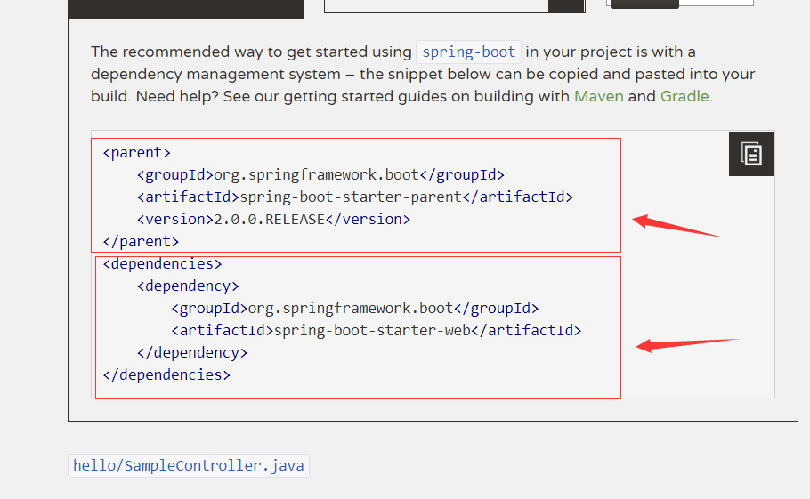
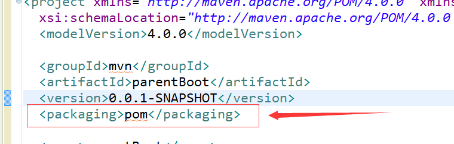
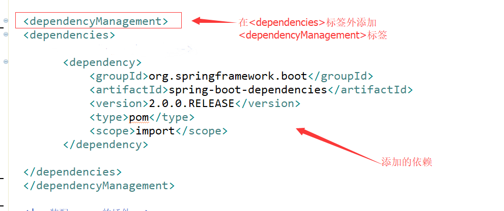
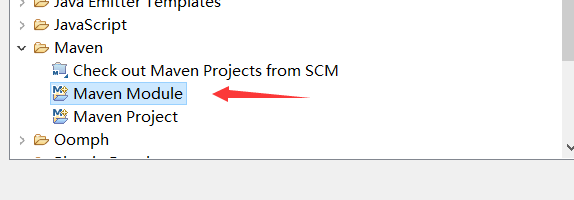
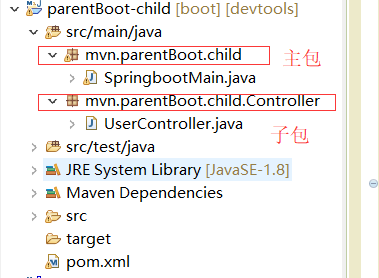
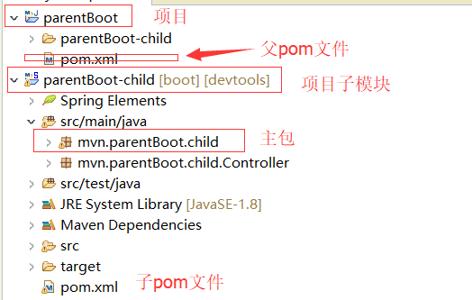

[toc]
# Spring Boot 
Spring Boot是用来简化新Spring应用的初始搭建以及开发过程。该框架使用了特定的方式来进行配置，从而==使开发人员不再需要定义重复，繁杂==的配置。

## 1.SpiringBoot的快速开始：

1. 创建maven项目：
<font color="red">
注意：
①：建立的是quickstart项目不是webapp项目
②：maven项目的 JRE 与使用版本一致等常见创建maven项目问题.
</font>

<br/>

2. 修改pom.xml文件：

添加以下代码到pom.xml文件中：



```xml
<!--装配 父pom.xml-->
<parent>
    <groupId>org.springframework.boot</groupId>
    <artifactId>spring-boot-starter-parent</artifactId>
    <version>2.0.0.RELEASE</version>
</parent>

<!--添加sping boot的 jar包依赖-->
<dependencies>
    <dependency>
        <groupId>org.springframework.boot</groupId>
        <artifactId>spring-boot-starter-web</artifactId>
    </dependency>
</dependencies>
```

3. 在src/main/java目录下建立包，然后创建springboot运行的开始类。

<font color="red"><h4>★★★★★注意代码注释</h4></font>

```java
package mvn.springboot_1;

//@RestController  可以取@Controller注解，当添加这个注解时，它会为每个方法添加@ResponseBody注解
@Controller
@EnableAutoConfiguration  //该注解表示开启自动配置处理，是springboot的启动程序注解
public class SampleController {
    //spring boot 运行的入口类

    @RequestMapping("/")
    @ResponseBody   //该注解的作用时，把方法的返回值作为相应的内容，而不是页面的名称
    public String home() {
        return "Hello Ssss!";
    }
    public static void main(String[] args) throws Exception {
/*
 * 1.SpringApplication是Spring Boot框架中描述spring应用的类，
 *  它的run()方法会创建一个应用上下文（Application Context），
 *  然后它判断类路径上的依赖，比如我们引入了spring-boot-starter-web，
 *  然后它会判断当前应用程序为一个web程序，然后启动内置Servlet容器（默认tomcat服务器）来处理HTTP请求。

   2.SpringWebMvc会将接收到的HTTP请求分发给controller控制器，
    这里的@ResponseBody，它会直接将返回值作为HTTP Response的body部分返回浏览器。

   3.@RequestMapping("/")就是我们经常写的处理请求的URL路径，可以引导程序处理正确的请求路径。
    
    
 * */
    	
    SpringApplication.run(SampleController.class, args);
    	
    }
}

```


4. 运行第一个SpringBoot 程序：

①：如果使用 STS（spring-tool-suite）开发工具，则可以直接单击右键run as - > spring boot app 启动程序。然后打开浏览器，输入 localhost:8080 来查看。

②：也可以使用maven命令的方式运行spring boot 程序，单击右键 Run as -> maven build , ==输入命令  spring-boot:run== 来启动程序。然后打开浏览器，输入 localhost:8080 来查看。


## 2.建立统一的父pom文件:

<font color="red">在实际的maven项目中，我们需要建立以统一的父pom文件,来方便对maven项目的许多模块公共配置进行统一管理。</font>


①：重新建立一个maven项目（名称：parentBoot），作为父项目，然后删除除了pom.xml文件的所有文件，删除干净后，==到maven仓库引入这个spring-boot-dependencies 依赖，并把pom文件中的packaging标签的值改为pom形式。==






```xml
<project xmlns="http://maven.apache.org/POM/4.0.0" xmlns:xsi="http://www.w3.org/2001/XMLSchema-instance"
  xsi:schemaLocation="http://maven.apache.org/POM/4.0.0 http://maven.apache.org/xsd/maven-4.0.0.xsd">
  <modelVersion>4.0.0</modelVersion>

  <groupId>mvn</groupId>
  <artifactId>parentBoot</artifactId>
  <version>0.0.1-SNAPSHOT</version>
  <packaging>pom</packaging>

  <name>parentBoot</name>
  <url>http://maven.apache.org</url>
  <properties>
    <project.build.sourceEncoding>UTF-8</project.build.sourceEncoding>
  </properties>

  <dependencyManagement>
  <dependencies>
  		<!-- 父pom 文件支持 -->
		<dependency>
		    <groupId>org.springframework.boot</groupId>
		    <artifactId>spring-boot-dependencies</artifactId>
		    <version>2.0.0.RELEASE</version>
		    <type>pom</type>
		    <scope>import</scope>
		</dependency>

  </dependencies>
  </dependencyManagement>
  
  <!--装配maven的插件-->
    <build>
      <finalName>parentBoot</finalName> 
    <!-- 配置java版本 不配置的话默认父类配置的是1.6-->
      <plugins>
        <plugin>
          <groupId>org.apache.maven.plugins</groupId>
          <artifactId>maven-compiler-plugin</artifactId>
          <configuration>
            <source>1.8</source>
            <target>1.8</target>
          </configuration>
        </plugin>
      </plugins>
  </build>
    <modules>
    	<module>parentBoot-child</module>
    </modules>
</project>

```


②：建立之前建立的父项目的子模块（名称：parentBoot-child）：

1. 右键父项目，在父项目上新建子模块（Maven Module ）



2. 修改子模块的pom.xml 文件,添加springboot的jar 包依赖：

```xml
<?xml version="1.0"?>
<project xsi:schemaLocation="http://maven.apache.org/POM/4.0.0 http://maven.apache.org/xsd/maven-4.0.0.xsd" xmlns="http://maven.apache.org/POM/4.0.0"
    xmlns:xsi="http://www.w3.org/2001/XMLSchema-instance">
  <modelVersion>4.0.0</modelVersion>
  <parent>
    <groupId>mvn</groupId>
    <artifactId>parentBoot</artifactId>
    <version>0.0.1-SNAPSHOT</version>
  </parent>
  <artifactId>parentBoot-child</artifactId>
  <name>parentBoot-child</name>
  <url>http://maven.apache.org</url>
  
  <properties>
    <project.build.sourceEncoding>UTF-8</project.build.sourceEncoding>
  </properties>
  <dependencies>
    
    <!--添加springboot的依赖 -->
     <dependency>
        <groupId>org.springframework.boot</groupId>
        <artifactId>spring-boot-starter-web</artifactId>
    </dependency>

  </dependencies>
</project>

```

3. 在src/main/java目录下建立包，然后创建springboot运行的开始类：

```java
package mvn.parentBoot.child;

//@RestController  可以取@Controller注解，当添加这个注解时，它会为每个方法添加@ResponseBody注解
@Controller
@EnableAutoConfiguration   //该注解表示开启自动配置处理，是springboot的启动程序注解
public class SampleController {

    @RequestMapping("/")
    @ResponseBody       //该注解的作用时，把方法的返回值作为相应的内容，而不是页面的名称
    String home() {
        return "ssss";
    }

    public static void main(String[] args) throws Exception {
        SpringApplication.run(SampleController.class, args);
    }
}


```


③：运行子模块的springboot的程序。


## 3.spring boot 项目自动读取配置，更新代码：
<font color="red">spring boot 项目自动读取配置是用于解决，当修改代码时，需要不断重启服务器才能读取最新配置,最新更新代码的问题。</font>

>    


**这是简单的springboot项目配置标志（不能自动读取配置，更新代码）。**


解决方法：  给子模块Maven项目的pom.xml文件添加两个依赖jar库（在maven仓库中寻找）  

```xml

<dependency>
    <groupId>org.springframework</groupId>
    <artifactId>springloaded</artifactId>
    <version>1.2.8.RELEASE</version>
</dependency>

<dependency>
    <groupId>org.springframework.boot</groupId>
    <artifactId>spring-boot-devtools</artifactId>
    <version>2.0.0.RELEASE</version>
</dependency>

```

 
 
**表示该项目变成自动更新状态,当你修改代码时，不需要重新启动。**


## 4.Spring Boot 的开发建议（其余所有程序类的包都要放在主类（入口类）的子包下） ★★★★★

<font color="red"><h3>Spring 官方建议：其余所有程序类的包都要放在主类（入口类）的子包下，做到主类在主包中，控制器类在控制器子包中等。</h3></font>


①：修改主类：

```java
package mvn.parentBoot.child;

@SpringBootApplication      
public class SpringbootMain {
    
    public static void main(String[] args) throws Exception {
        SpringApplication.run(SpringbootMain.class, args);
    }
}

```


②：创建子包（控制器包），创建控制器类：




```java
package mvn.parentBoot.child.Controller;

@Controller
public class UserController {
		
	@RequestMapping("/")
    @ResponseBody       //该注解的作用时，把方法的返回值作为相应的内容，而不是页面的名称
    public String home() {
        return "this is home() ";
    }
	
}

```

③：运行程序

## 5.springboot的项目打包,部署：

### 1.打包：

==Springboot的项目打包，只需要在父项目（不是子模块）的pom.xml 文件中配置插件就可以了。==



①：在父 pom.xml 文件中装配打包发布部署处理插件：
```xml
<!-- 该插件的主要功能是对项目的打包发布处理 -->
        <plugin>
          <groupId>org.springframework.boot</groupId>
          <artifactId>spring-boot-maven-plugin</artifactId>
          <configuration>  <!-- 设置程序主类的位置（springboot主方法所在的类） -->
            <mainClass>mvn.parentBoot.child.SpringbootMain</mainClass>
          </configuration>
          <executions>
          		<execution>
          			<goals>
          				<goal>repackage</goal>
          			</goals>
          		</execution>
          </executions>
        </plugin>
``` 


②：对当前的项目或者子模块先进行maven 更新，后执行“  ==clean package==  ” maven打包命令 。


③：在项目的target目录中会出现打包好的jar或war 包。


### 2.部署：
①：把打包好的jar包，随便放到某个路径下
②：以命令行的形式输入命令
③：在浏览器中输入网址。

