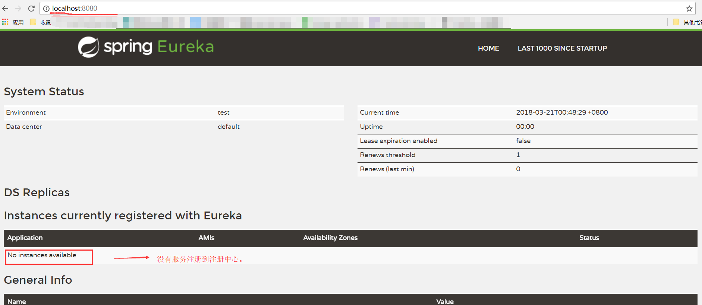
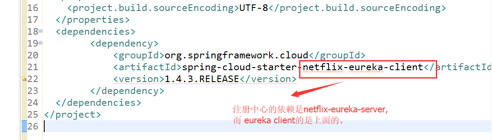
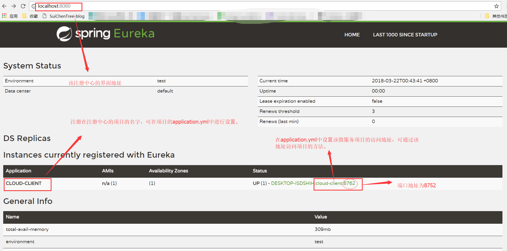
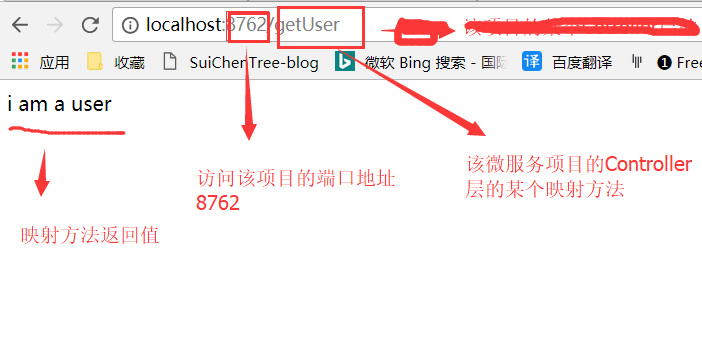

[toc]
# Spring Cloud
Spring Cloud是==一系列框架的有序集合，它利用Spring Boot的开发便利性巧妙地简化了分布式系统基础设施的开发==。它为开发者提供了在<font color="red">分布式系统（配置管理，服务发现，熔断，路由，微代理，控制总线，一次性token，全居琐，leader选举，分布式session，集群状态等）</font>中快速构建的工具，使用Spring Cloud的开发者可以快速的启动服务或构建应用、同时能够快速和云平台资源进行对接。


<h3>Spring Cloud有许多子项目，分别负责不同的功能：</h3>

> Spring Cloud Netflix
>　　是对Netflix开发的一套分布式服务框架的封装，包括服务的发现和注册，负载均衡、断路器、REST客户端、请求路由等。


> Spring Cloud Config:
>　　将配置信息中央化保存, 配置Spring Cloud Bus可以实现动态修改配置文件


> Spring Cloud Bus
>　　分布式消息队列，是对Kafka, MQ的封装


> Spring Cloud Security
>　　对Spring Security的封装，并能配合Netflix使用

>Spring Cloud Zookeeper
>　　对Zookeeper的封装，使之能配置其它Spring Cloud的子项目使用


>Spring Cloud Eureka
> 是 Spring Cloud Netflix 微服务套件中的一部分，它基于Netflix Eureka 做了二次封装，主要负责完成微服务架构中的服务治理功能。

---

## 0.Springcloud 与Springboot的关系：

1. Spring boot 是 Spring 的一套快速配置脚手架，可以基于spring boot 快速开发单个微服务，Spring Cloud是一个基于Spring Boot实现的云应用开发工具；

2. Spring boot专注于快速、方便集成的单个个体，Spring Cloud是关注全局的服务治理框架；

3. spring boot使用了默认大于配置的理念，很多集成方案已经帮你选择好了，能不配置就不配置，==Spring Cloud很大的一部分是基于Spring boot来实现,可以不基于Spring boot吗？不可以==。

4. Spring boot可以离开Spring Cloud独立使用开发项目，但是Spring Cloud离不开Spring boot，属于依赖的关系。

> spring -> spring booot > spring cloud 这样的关系。


---

## 1.SpringCloud建立基础依赖（创建Maven父pom项目）：
<font color="red">在实际的SpringCloud项目中，我们需要建立统一的父pom文件,来方便对SpringCloud的子项目的公共配置进行统一管理。</font>

==一个maven项目（SpringcCloud的基础配置），多个maven module 用于对应不同的子项目==

①：建立一个maven项目（名称：springcloud-parent），作为父项目，然后删除除了pom.xml文件的所有文件，删除干净后，==添加以下依赖：==


pom.xml:
```xml
 <parent>    
    <groupId>org.springframework.boot</groupId>    
    <artifactId>spring-boot-starter-parent</artifactId>    
    <version>2.0.0.RELEASE</version>    
</parent>    
  
<!-- 管理依赖  -->    
<dependencyManagement>    
    <dependencies>    
        <dependency>    
            <groupId>org.springframework.cloud</groupId>    
            <artifactId>spring-cloud-dependencies</artifactId>    
            <version>Finchley.M8</version>    
            <type>pom</type>    
            <scope>import</scope>    
        </dependency>    
    </dependencies>    
</dependencyManagement>    
  
<!-- 注意： 这里必须要添加， 否者各种依赖有问题  -->    
<repositories>    
    <repository>    
        <id>spring-milestones</id>    
        <name>Spring Milestones</name>    
        <url>https://repo.spring.io/libs-milestone</url>    
        <snapshots>    
            <enabled>false</enabled>    
        </snapshots>    
    </repository>    
</repositories>    
  
<build>    
    <plugins>    
        <plugin>    
            <groupId>org.springframework.boot</groupId>    
            <artifactId>spring-boot-maven-plugin</artifactId>    
        </plugin>    
    </plugins>    
</build>   

```

②：基本的spring-boot 和 spring-cloud 的基础依赖就添加好了。


## 2.搭建注册中心eureka模块：

### 1.介绍：

Eureka包含两个组件：==Eureka Server和Eureka Client。==


### 2.DEMO:

①：==在上面maven的基础上，新建一个maven module，取名为 springcloud-child-eureka==。

②：在module的pom文件添加依赖：

```xml
<dependency>    
    <groupId>org.springframework.cloud</groupId>    
    <artifactId>spring-cloud-starter-netflix-eureka-server</artifactId>    
</dependency>    
```


> <font color="red"><h3>注意： 引入的是xxx-eureka-server 依赖</h3></font>


③：创建EurekaServerApplication.class 添加如下内容：


> EurekaServerApplication.class:
```java
@SpringBootApplication  
@EnableEurekaServer  //开启eureka服务中心，启动一个服务注册中心提供给其他应用进行对话
public class EurekaApplication {  
    public static void main(String[] args) {  
        SpringApplication.run(EurekaApplication.class, args);  
    }  
}  

```


④：创建application.yml添加如下内容：

> application.yml :
```
server:  
  port: 8080  
eureka:  
  instance:  
    hostname: localhost  #表示是否将自己注册到Eureka Server，默认为true。
  client:  
    registerWithEureka: false   #表示是否从Eureka Server获取注册信息，默认为true。
    fetcahRegistry: false  
    serviceUrl:  
      defaultZone: http://${eureka.instance.hostname}:${server.port}/eureka/  
      # 设置与Eureka Server交互的地址，查询服务和注册服务都需要依赖这个地址。多个地址可使用 , 分隔。 
```


⑤：运行程序，并输入 http://localhost:8080/，将会出现以下画面：



### 3.通过Eureka client 来注册服务到Eureka Server上：
---

①：在maven父项目中新建module，取名为eureka-UserClient:

<h2>★★★★★PS:</h2>
<font color="red">
当你在maven项目中创建第二个module模块时，可能会导致父pom文件的改变（例如，maven父项目，两个子module的pom文件都报错，原因是，父pom的maven依赖代码片段消失了，你应该重新添加maven依赖）。此时，你应该修改父pom文件。把它修改之前的模样。

</font>

---

②：在module的pom文件添加依赖：


> pom.xml:
```xml
<dependency>
		<groupId>org.springframework.cloud</groupId>
		<artifactId>spring-cloud-starter-netflix-eureka-client</artifactId>
		<version>1.4.3.RELEASE</version>
</dependency>   
```


③：创建UserController类：
```java
@RestController
public class userController {
	
	@RequestMapping(value="/getUser")
	public String getUser() {
		return "i am a user";
	}
}
```


④：创建application.yml:
```
eureka:
  client:
    serviceUrl:
      defaultZone: http://localhost:8080/eureka/             #eureka注册中心的网络地址 
spring:
  application:
    name: cloud-client    #为你的当前项目的微服务起个名字，该名字所代表的项目将注册到eureka注册中心
    
server:
  port: 8762   #当前项目的端口地址，可通过该地址，来访问该项目，执行该项目的功能。
```

⑤：创建MainStart.class 添加如下内容：


> EurekaServerApplication.class:
```java
@EnableEurekaClient   //设置该项目入口类为 eureka的client，从而把当前项目注入到eureka server（注册中心）中
@SpringBootApplication
public class MainStart {

    public static void main(String[] args) {
        SpringApplication.run(MainStart.class, args);
    }

}

```


⑥：<font color="red"><h3>先运行 eureka-server的程序，在运行eureka-client的程序</h3></font>


