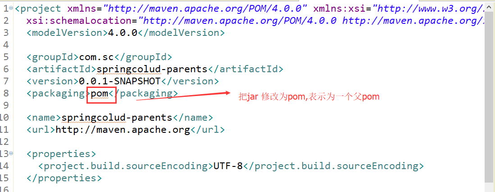

# Spring Cloud
Spring Cloud是==一系列框架的有序集合==。它利用Spring Boot的开发便利性巧妙地简化了分布式系统基础设施的开发，如<font color="red">服务发现注册、配置中心、消息总线、负载均衡、断路器、数据监控等</font>，都可以用Spring Boot的开发风格做到一键启动和部署。

**PS:SpringCloud 是基于SpringBoot上的**

## 1.SpringCloud建立基础依赖（创建Maven的父pom项目）：
<font color="red">在实际的SpringCloud项目中，我们需要建立统一的父pom文件,来方便对SpringCloud的子项目的公共配置进行统一管理。</font>

==一个maven项目（SpringcCloud的基础配置），多个maven module 用于对应不同的子项目==

①：建立一个maven项目（名称：springcloud-parent），作为父项目，然后删除除了pom.xml文件的所有文件，删除干净后，==添加以下依赖：==



pom.xml:
```xml
 <parent>    
    <groupId>org.springframework.boot</groupId>    
    <artifactId>spring-boot-starter-parent</artifactId>    
    <version>2.0.0.RELEASE</version>    
</parent>    
  
<!-- 管理依赖  -->    
<dependencyManagement>    
    <dependencies>    
        <dependency>    
            <groupId>org.springframework.cloud</groupId>    
            <artifactId>spring-cloud-dependencies</artifactId>    
            <version>Finchley.M8</version>    
            <type>pom</type>    
            <scope>import</scope>    
        </dependency>    
    </dependencies>    
</dependencyManagement>    
  
<!-- 注意： 这里必须要添加， 否者各种依赖有问题  -->    
<repositories>    
    <repository>    
        <id>spring-milestones</id>    
        <name>Spring Milestones</name>    
        <url>https://repo.spring.io/libs-milestone</url>    
        <snapshots>    
            <enabled>false</enabled>    
        </snapshots>    
    </repository>    
</repositories>    
  
<build>    
    <plugins>    
        <plugin>    
            <groupId>org.springframework.boot</groupId>    
            <artifactId>spring-boot-maven-plugin</artifactId>    
        </plugin>    
    </plugins>    
</build>   

```

②：基本的spring-boot 和 spring-cloud 的基础依赖就添加好了。


## 2.整合注册中心eureka模块：

①：==在上面maven的基础上，新建一个maven module，取名为 springcloud-child-eureka==。

②：在module的pom文件添加依赖：

```xml
<dependency>    
    <groupId>org.springframework.cloud</groupId>    
    <artifactId>spring-cloud-starter-netflix-eureka-server</artifactId>    
</dependency>    
```

③：创建EurekaServerApplication.class 添加如下内容：

> EurekaServerApplication.class:
```java
@SpringBootApplication  
@EnableEurekaServer  
public class EurekaApplication {  
    public static void main(String[] args) {  
        SpringApplication.run(EurekaApplication.class, args);  
    }  
}  

```


④：创建application.yml添加如下内容：

> application.yml :
```
server:  
  port: 8080  
eureka:  
  instance:  
    hostname: localhost  #表示是否将自己注册到Eureka Server，默认为true。
  client:  
    registerWithEureka: false   #表示是否从Eureka Server获取注册信息，默认为true。
    fetcahRegistry: false  
    serviceUrl:  
      defaultZone: http://${eureka.instance.hostname}:${server.port}/eureka/  
      # 设置与Eureka Server交互的地址，查询服务和注册服务都需要依赖这个地址。多个地址可使用 , 分隔。 
```


⑤：运行程序，并输入 http://localhost:8080/，将会出现以下画面：


