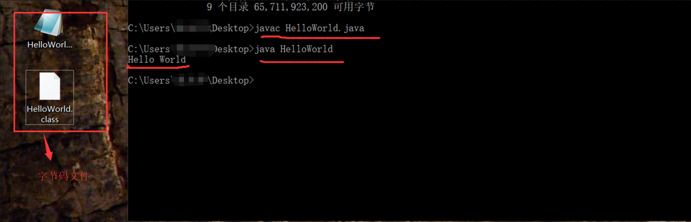
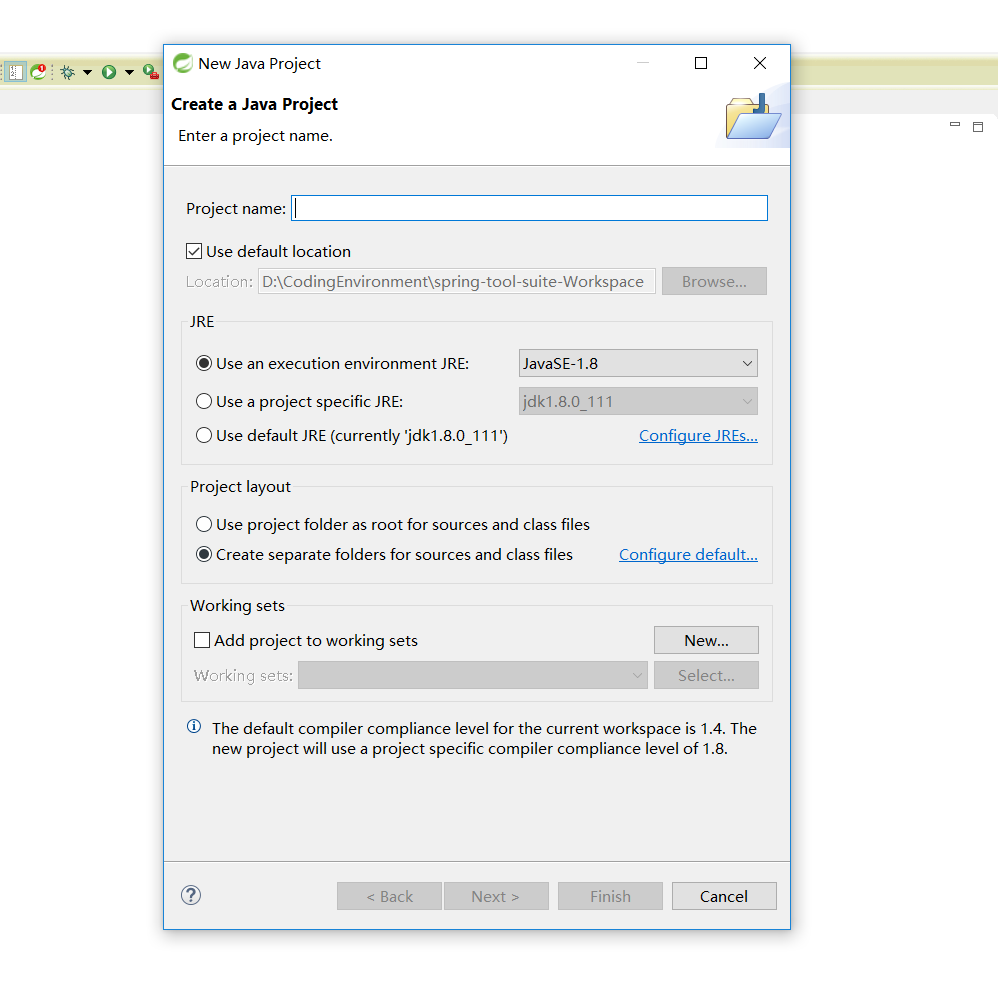

[toc]
# Java

java语言是一门面向对象程序设计语言

资料来源：[菜鸟教程](http://www.runoob.com/java/java-tutorial.html)

## 1. 开发环境配置：

<h3>百度一下</h3>

<h3>java语言的IDE工具：</h3> 

1. eclipse。
2. Spring Tool Suite (STS)：spring团队创建的对eclipse工具的强化版。
3. IDEA


<h3>
<font color="red">
以上几种工具，要学会使用其中一种。请自行百度。

<p></p>

注意：
下面所有示例主要用STS 运行java代码。
</font>
</h3>


---


## 2. 第一个java程序 ---helloworld ：


### 1. 使用命令行运行程序：

①：创建文件：HelloWorld.java

②：在文件中编写代码：
```java
public class HelloWorld {
    /* 第一个Java程序
     * 它将打印字符串 Hello World
     */
    public static void main(String []args) {
        System.out.println("Hello World"); // 打印 Hello World
    }
}
```

③：打开命令行窗口:

1. 找到HelloWorld.java在那个路径下：
2. 执行命令(假如文件在c盘下)：
```
C : > javac HelloWorld.java    //编译文件，产生.class的字节码文件
C : > java HelloWorld      //运行字节码文件，执行程序源代码
```

④：运行结果：




### 2. 使用STS运行Java程序：

①：创建java project：


②：创建package包，class类


③：在类中编写源代码：
```java
package Hello1;

public class HelloWorld {
    /* 第一个Java程序
     * 它将打印字符串 Hello World
     */
    public static void main(String []args) {
        System.out.println("Hello World"); // 打印 Hello World
    }
}
```


④：运行程序。（右键 --> RunAs --> Java application）


### 3. 第一个java程序解析：
源代码：
```c
package Hello1;

public class HelloWorld {
    /* 第一个Java程序
     * 它将打印字符串 Hello World
     */
    public static void main(String []args) {
        System.out.println("Hello World"); // 打印 Hello World
    }
}

/*
 public static void main(String []args) { ... }

所有的java程序都是由这个main方式开始执行的。

String []args ：

1.String[] args是main函数的形式参数。


*/
```


<font color="red">
解析：

1.  public static void main(String []args) { ... }

所有的java程序都是由这个main方法开始执行的。


2. String []args 

String[] args是main函数的形式参数。当使用命令行运行程序时，可以用来获取命令行用户输入进去的参数。==java 本身不存在不带String args[]的main函数,所以在程序中去掉String args[]会出现错误。==

例如：

①：创建Test.java :
```c
public class Test {
    public static void main(String[] args) {
        System.out.println(args[0]);
    }
}
```

②：在命令行窗口中比如运行 Test.class 文件：
```
C : > javac Test.java    
C : > java Test
```

③：运行结果：
```
Test  
```
</font>