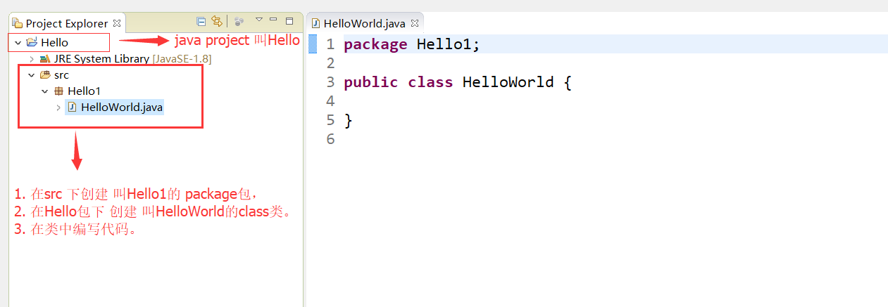
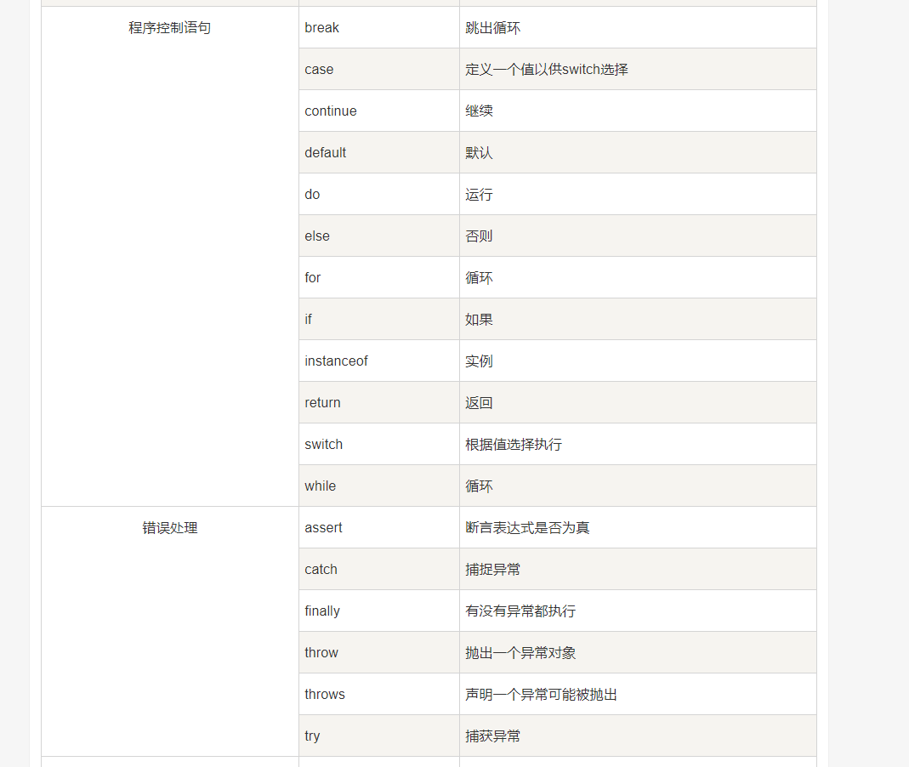
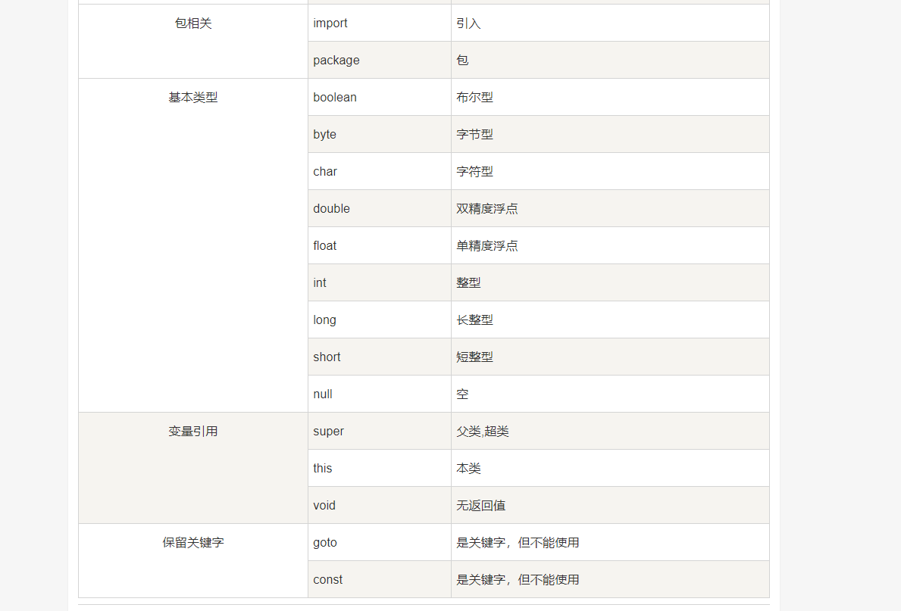
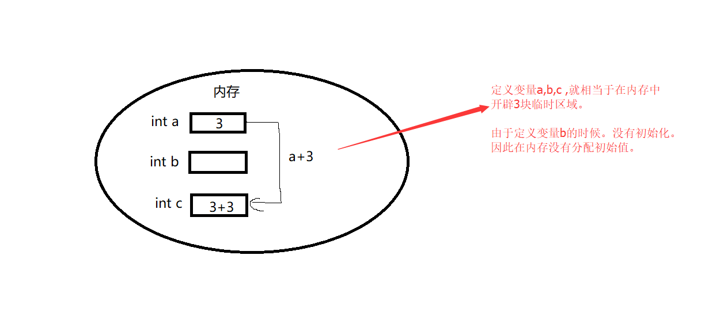

[toc]
# Java

java语言是一门面向对象程序设计语言


## 1. 开发环境配置：

<h3>百度一下</h3>

<h3>java语言的IDE工具：</h3> 

1. eclipse。
2. Spring Tool Suite (STS)：spring团队创建的对eclipse工具的强化版。
3. IDEA


<h3>
<font color="red">
以上几种工具，要学会使用其中一种。请自行百度。

<p></p>

注意：
下面所有示例主要用STS 运行java代码。
</font>
</h3>


---


## 2. 第一个java程序 ---helloworld ：


### 1. 使用命令行运行程序：

①：创建文件：HelloWorld.java

②：在文件中编写代码：
```java
public class HelloWorld {
    /* 第一个Java程序
     * 它将打印字符串 Hello World
     */
    public static void main(String []args) {
        System.out.println("Hello World"); // 打印 Hello World
    }
}
```

③：打开命令行窗口:

1. 找到HelloWorld.java在那个路径下：
2. 执行命令(假如文件在c盘下)：
```
C : > javac HelloWorld.java    //编译文件，产生.class的字节码文件
C : > java HelloWorld      //运行字节码文件，执行程序源代码
```

④：运行结果：


### 2. 使用IDE运行Java程序：

①：创建java project：


②：创建package包，class类


③：在类中编写源代码：
```java
package Hello1;

public class HelloWorld {
    /* 第一个Java程序
     * 它将打印字符串 Hello World
     */
    public static void main(String []args) {
        System.out.println("Hello World"); // 打印 Hello World
    }
}
```


④：运行程序。（右键 --> RunAs --> Java application）


### 3. 第一个java程序解析：
源代码：
```c
package Hello1;

public class HelloWorld {
    /* 第一个Java程序
     * 它将打印字符串 Hello World
     */
    public static void main(String []args) {
        System.out.println("Hello World"); // 打印 Hello World
    }
}


```


<font color="red">
解析：

1. package Hello1;   //声明包名

2. class 关键字用于在java中声明一个类。

3. public 关键字是一个表示可见性的访问修饰符，它表示对所有人可见。

4. static是一个关键字,表示该方法为静态方法。==main方法由JVM执行，因此它不需要创建对象来调用main方法。所以它节省了内存==。

5. void是方法的返回类型，它意味着它不返回任何值。

6. main表示程序开始(执行的入口)。

7.  public static void main(String []args) { ... }

所有的java程序都是由这个main方法开始执行的。

8. String []args 

String[] args是main函数的形式参数。当使用命令行运行程序时，可以用来获取命令行用户输入进去的参数。==java 本身不存在不带String args[]的main函数,所以在程序中去掉String args[]会出现错误。==

例如：

①：创建Test.java :
```c
public class Test {
    public static void main(String[] args) {
        System.out.println(args[0]);
    }
}
```

②：在命令行窗口中比如运行 Test.class 文件：
```
C : > javac Test.java    
C : > java Test
```

③：运行结果：
```
Test  
```
</font>


### 4. 程序运行时的内部细节（★★★）：


1. 在编译时，java文件(.java)准换为字节码文件（.class），并将java代码转换为字节码.

2. 类加载器(Classloader)：是用于加载类文件的JVM的子系统。

3. 字节码校验器(Bytecode Verifier)：检查代码中是否存在错误代码。


### 5. 常见问题解答（★★★★★）：

#### 1. 一个java源文件中可以有多个类吗？

==可以，但只能有一个 public 类==


#### 2. JVM:

JVM(Java虚拟机)是一个抽象机器。它是一个提供可以执行Java字节码的运行时环境的规范。

==字节码文件(.class)并不直接与机器的操作系统相对应，而是经过虚拟机间接与操作系统交互，由虚拟机将程序解释给本地系统执行。
因此，JVM屏蔽了与具体操作系统平台相关的信息，使得Java程序只需生成在Java虚拟机上运行的目标代码（字节码），就可以在多种平台上不加修改地运行。==

JVM执行以下主要任务：

提供运行时环境(JRE) ---> 加载代码 ---> 验证代码 ---> 执行代码 


#### 3. JRE:

JRE是Java Runtime Environment的缩写。用于提供java程序运行时环境。==它包含一组运行java程序库和JVM==。


#### 4. JDK：

JDK是Java开发工具包。
JDK包括了Java运行环境JRE、Java工具和Java基础类库。


---


## 2. java基础：

### 1. java代码的基本语法：


#### 1. 基本格式与要点：

==①：java中的所有程序代码都必须放在类中。可以大概理解为一个.java文件代表一个类==

类的定义：
```
修饰符 class 类名{

    程序代码;
}
```

==②：编写java代码注意：==

> 1. java程序中每条语句都必须用分号（;）结束。

> 2. Java是大小写敏感的，这就意味着标识符Hello与hello是不同的。

> 3. java程序中，一句连续的字符串不能分开在两行写。要把两行用 + 号连起来。
```java
 System.out.println("this is a 
     java 程序");                  //这是错误示例

System.out.println("this is a"+ 
    "java 程序");                  //这是正确示例
```


> 4. <font color="red">类名的首字母应该大写。</font>如果类名由若干单词组成，那么每个单词的首字母应该大写，例如 MyFirstJavaClass 


> 5. <font color="red">方法名都应该以小写字母开头</font>。如果方法名含有若干单词，则后面的每个单词首字母大写。例如 myFirstJava

> 6. 源文件名(.java文件名)必须和公共类名（public class 类名）相同。

> 7. 主方法入口:所有的Java 程序由public static void main(String []args)方法开始执行.


---


#### 2. 注释：

Java支持单行以及多行注释。==注释中的字符将被Java编译器忽略。==

①：单行注释： 以 `//` 两个字符作为一行注释的开始.

②：多行注释： 它以 `/*` 开始，并以 `*/` 结束.

③：文档注释：看下例。==在STS的快捷键：ALT + SHIFT +J==

```java

int a=10;    //这是单行注释

/*
int b=10;
int c=10;

这是多行注释
*/

/**
 * 文档注释，用于为代码编写帮助文档 
 *
 */

```

<font color="red">
注意：

1. 多行注释 可以嵌套单行注释。

2. 多行注释 不能嵌套多行注释。
</font>


#### 3. 标识符：

==java程序中，类名、变量名以及方法名等都被称为标识符。==

> 关于Java标识符，有以下几点需要注意：

1. 所有的标识符都应该以字母（A-Z或者a-z）,美元符（$）、或者下划线（_）开始。（<font color="red">不能以数字开头</font>）


2. 首字符之后可以是字母（A-Z或者a-z）,美元符（$）、下划线（_）或数字的任何字符组合

3. ==关键字不能用作标识符.==

4. 标识符是大小写敏感的

5. 合法标识符举例：age、$salary、_value、__1_value

6. 非法标识符举例：123abc、-salary


#### 4. java 关键字：

==这些关键字不能用于常量、变量、和任何标识符的名称。==

<font color="red">所有的关键字都是小写的。</font>







### 2. java 变量：

#### 1.变量的定义：

```java
int a=3;
int b;
int c=a+3;

```



```java
int c=a+3;  
```
<font color="red">
在内存中的表现是：程序首先取出变量a的值，与3相加后，把结果赋值给变量c。
</font>


#### 2. 变量的数据类型：

<font color="red">

1. 在java中，定义变量时必须声明变量的数据类型。

2. 为变量赋值时，必须赋予和变量相同类型的值。

3. 变量的数据类型有8个。
</font>

> 整数类型（byte ， short ， int , long）
> byte ：占1个字节（8位），==范围：-128（-2^7）~ 127（2^7-1）==
> short ：占2个字节（16位），==范围：-32768（-2^15）~ 32767（2^15 - 1）==
> int : 占4个字节（32位），==范围: -2^31 ~ 2^31 - 1==
> long : 占8个字节（64位），==范围：-2^63 ~ 2^63 -1==


> 浮点数类型（float ， double）


> 字符型（char）
> char : ==最小值是 \u0000（即为0）；最大值是 \uffff（即为65,535）==

> 布尔型（boolean）
> boolean : ==只有两个取值：true 和 false；==


DEMO:
```java
byte a = 100;
short s = 1000;
int a = 100000;
long a = 100000L;
float f1 = 234.5f;
double d1 = 123.4;
boolean one = true;
char letter = 'A';
```