[toc]
# javaweb

## 概述：
&emsp;&emsp;Java Web，是用Java技术来解决相关web互联网领域的技术总和。web包括：web服务器和web客户端两部分。Java在客户端的应用有java applet，不过使用得很少，Java在服务器端的应用非常的丰富，比如Servlet，JSP和第三方框架等等。Java技术对Web领域的发展注入了强大的动力。

&emsp;&emsp;Java的Web框架虽然各不相同，但基本也都是遵循特定的路数的：<font color="red">使用Servlet或者Filter拦截请求，使用MVC的思想设计架构，使用约定，XML或 Annotation实现配置，运用Java面向对象的特点，面向对象实现请求和响应的流程，</font>支持Jsp，Freemarker，Velocity等视图。


## javaBean

&emsp;&emsp;javabean是一种带有特定写法的java类。
具有一些规范：
①：公共无参构造方法
②: 私有类型属性
③：公共类型属性的getter / setter 方法
④：Javabean应该直接或间接实现 java.io.Serializable 接口，以支持序列化接口。

<font color="red">建议javabean 属性的命名 使用驼峰命名法。</font>

<font color="blue">驼峰命名法：</font>
&emsp;&emsp;**第一个单词首字母小写，之后每个单词的首字母大写。例如：userName,myFirstName 等**


## jsp

### 1.概述：
&emsp;&emsp;JSP全名为Java Server Pages，中文名叫java服务器页面，其根本是一个简化的Servlet设计.<font color="blue">它是一种动态网页技术标准</font>。JSP技术有点类似ASP技术，<font color="red">它是在传统的网页HTML文件中插入Java程序段和JSP标记(tag)，从而形成JSP文件，后缀名为(*.jsp)。</font>
1. 它使用JSP标签在HTML网页中插入Java代码。标签通常以<%开头以%>结束。
2. JSP通过网页表单获取用户输入数据、访问数据库及其他数据源，然后动态地创建网页。
3. JSP标签有多种功能，比如访问数据库、记录用户选择信息、访问JavaBeans组件等，还可以在不同的网页中传递控制信息和共享信息。

### 2.jsp原理及使用：

#### 1.jsp容器：
&emsp;&emsp;网络服务器需要一个JSP引擎，也就是一个容器来处理JSP页面。容器负责截获对JSP页面的请求。

本教程使用<font color="red">内嵌JSP容器的Apache</font>来支持JSP开发。
JSP容器与Web服务器协同合作，为JSP的正常运行提供必要的运行环境和其他服务，并且能够正确识别专属于JSP网页的特殊元素。

下图显示了JSP容器和JSP文件在Web应用中所处的位置。

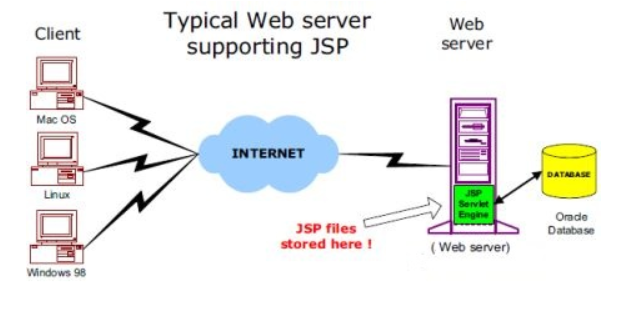

#### 2.jsp的处理：
以下步骤表明了Web服务器是如何使用JSP来创建网页的：
1. 就像其他普通的网页一样，您的浏览器发送一个HTTP请求给服务器。
2. Web服务器识别出这是一个对JSP网页的请求，并且将该请求传递给内部的JSP引擎。通过使用URL或者.jsp文件来完成。
3. JSP引擎从磁盘中载入JSP文件，然后将它们<font color="red">转化为servlet。这种转化只是简单地将所有模板文本改用println()语句，并且将所有的JSP元素转化成Java代码。</font>
4. JSP引擎将servlet编译成可执行类，并且将原始请求传递给servlet引擎。
5. Web服务器的某组件将会调用servlet引擎，然后载入并执行servlet类。在执行过程中，servlet产生HTML格式的输出并将其内嵌于HTTP response中上交给Web服务器。
6. <font color="red">Web服务器以静态HTML网页的形式将HTTP response返回到您的浏览器中。</font>
7. 最终，Web浏览器处理HTTP response中动态产生的HTML网页，就好像在处理静态网页一样。

以上提及到的步骤可以用下图来表示：

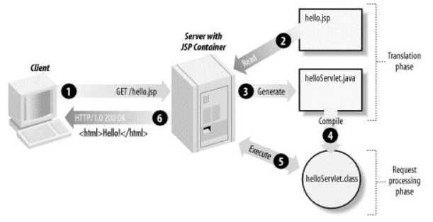


#### 3.jsp生命周期：
JSP生命周期就是从创建到销毁的整个过程，类似于servlet生命周期，区别在于JSP生命周期还包括将JSP文件编译成servlet。

以下是JSP生命周期中所走过的几个阶段：
1. 编译阶段：
servlet容器编译servlet源文件，生成servlet类
2. 初始化阶段：
加载与JSP对应的servlet类，创建其实例，并调用它的初始化方法
3. 执行阶段：
调用与JSP对应的servlet实例的服务方法
4. 销毁阶段：
调用与JSP对应的servlet实例的销毁方法，然后销毁servlet实例.

**JSP初始化：**

容器载入JSP文件后，它会在为请求提供任何服务前调用jspInit()方法。如果您需要执行自定义的JSP初始化任务，复写jspInit()方法就行了，就像下面这样：
```java
public void jspInit(){
  // 初始化代码
}
```
<font color="red">通常情况下您可以在jspInit()方法中初始化数据库连接、打开文件和查询数据表。</font>

**JSP销毁：**

JSP生命周期的销毁阶段描述了当一个JSP网页从容器中被移除时所发生的一切。
jspDestroy()方法在JSP中等价于servlet中的销毁方法。当您需要执行任何清理工作时复写jspDestroy()方法，比如释放数据库连接或者关闭文件夹等等。
jspDestroy()方法：
```java
public void jspDestroy()
{
   // 清理代码
}
```

#### 4.jsp的简单使用：

1. 安装Tomcat 服务器（jsp 引擎/jsp 容器）并配置：
详细过程自己百度。
<br/>
2. 把eclipse 与 tomcat 关联。
<br/>
3. 在eclipse中创建动态web 项目工程("File-->New-->Dynamic Web Project")，并选择运行环境为之前安装的tomcat 服务器 与 JDK。
<font color="red">注意:在下一步中勾选生成 web.xml 文件.</font>
详细过程自己百度。
<br/>
4. 工程目录(**使用的eclipse 的 氧气 版本,不同版本的工程目录可能有所差别**)：
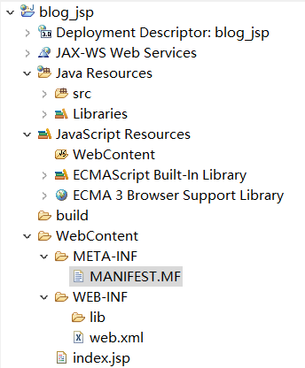

上图中各个目录解析：
deployment descriptor：部署的描述。
lib：**自己需要的jar包可以放在里面，eclipse会自动加入到类路径。**
build：放入编译之后的文件。
WebContent:放进写入的jsp页面。


5. 在jsp页面写上html 标签
```jsp
<%@ page language="java" contentType="text/html; charset=UTF-8"
    pageEncoding="UTF-8"%>
<!DOCTYPE html PUBLIC "-//W3C//DTD HTML 4.01 Transitional//EN" "http://www.w3.org/TR/html4/loose.dtd">
<html>
<head>
<meta http-equiv="Content-Type" content="text/html; charset=UTF-8">
<title>Insert title here</title>
</head>
<body>
	<h2>this is  h2 title</h2>
	<span style="color:red">this is red code</span>
</body>
</html>
```

6. 启动tomcat 服务器，在浏览器 输入网址：http://localhost:8080/ 项目工程名 / jsp页面名称.jsp 。
<br/>
7. 效果图：
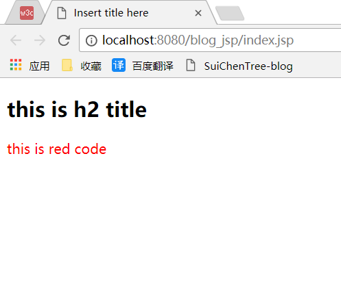


### 3.jsp的基本语法：

#### 1.嵌入Java代码（脚本代码）：
在jsp页面可以嵌入Java的代码段来完成业务处理。
语法格式：
`<% 编写Java代码 %>`

1. 打印九九乘法表：
```jsp
<body>
  <%
  	for(int i=0;i<10;i++){
  		for(int j=0;j<=i;j++){
  			String s=j+" * "+i+" = "+i*j;
  			out.print(s+"    ");    //每个式子有空格
  		}
  		out.print("<br/>");
  	}
  
  %>
</body> 
```
结果：
0 * 0 = 0 
0 * 1 = 0 1 * 1 = 1 
0 * 2 = 0 1 * 2 = 2 2 * 2 = 4 
0 * 3 = 0 1 * 3 = 3 2 * 3 = 6 3 * 3 = 9 
0 * 4 = 0 1 * 4 = 4 2 * 4 = 8 3 * 4 = 12 4 * 4 = 16 
0 * 5 = 0 1 * 5 = 5 2 * 5 = 10 3 * 5 = 15 4 * 5 = 20 5 * 5 = 25 
0 * 6 = 0 1 * 6 = 6 2 * 6 = 12 3 * 6 = 18 4 * 6 = 24 5 * 6 = 30 6 * 6 = 36 
0 * 7 = 0 1 * 7 = 7 2 * 7 = 14 3 * 7 = 21 4 * 7 = 28 5 * 7 = 35 6 * 7 = 42 7 * 7 = 49 
0 * 8 = 0 1 * 8 = 8 2 * 8 = 16 3 * 8 = 24 4 * 8 = 32 5 * 8 = 40 6 * 8 = 48 7 * 8 = 56 8 * 8 = 64 
0 * 9 = 0 1 * 9 = 9 2 * 9 = 18 3 * 9 = 27 4 * 9 = 36 5 * 9 = 45 6 * 9 = 54 7 * 9 = 63 8 * 9 = 72 9 * 9 = 81 


2. 判断语句：
```
<%!int day = 3;%>
	
  <%
  if (day == 1 | day == 7) {
	%>
	
  <p>Today is weekend</p>
	
  <%
	} else {
	%>
	
  <p>Today is not weekend</p>
	
  <%
		}
	%>
```

3. switch…case块:
```jsp
<%  
switch(day) { 
case 0:    
  out.println("It\'s Sunday.");    
  break; 
case 1:    
  out.println("It\'s Monday.");    
  break; 
case 2:    
  out.println("It\'s Tuesday.");    
  break; 
case 3:    
  out.println("It\'s Wednesday.");    
  break; 
case 4:    
  out.println("It\'s Thursday.");    
  break; 
case 5:    
  out.println("It\'s Friday.");    
  break; 
default:    
  out.println("It's Saturday."); 
} 
%>
```


#### 2.jsp表达式：
&emsp;&emsp;表达式元素中可以包含任何符合Java语言规范的表达式，但是不能使用分号来结束表达式。
&emsp;&emsp;**表达式中的内容先被转化成String，然后插入到表达式出现的地方。**
<font color="red">由于表达式的值会被转化成String，所以您可以在一个文本行中使用表达式而不用去管它是否是HTML标签。</font>

JSP表达式的语法格式：
<%= 表达式 %>

例子：
```jsp
<%@ page language="java" contentType="text/html; charset=UTF-8"
    pageEncoding="UTF-8"%>
<!DOCTYPE html PUBLIC "-//W3C//DTD HTML 4.01 Transitional//EN" "http://www.w3.org/TR/html4/loose.dtd">
<html>
<head>
<meta http-equiv="Content-Type" content="text/html; charset=UTF-8">
<title>Insert title here</title>
</head>
<body>
<p>   
  Today's date: <%= (new java.util.Date()).toLocaleString()%>
</p>
</body> 
</html>
```

运行后得到以下结果：
`Today's date: 2017-11-30 18:40:35`

#### 3.jsp注释：
JSP注释的语法格式：
```jsp
<%-- 这里可以填写 JSP 注释 --%>
```
<br/>

#### 4.jsp指令标签（注意：<%@ ~~ %>中@与%不能分离 ，属性值不能以';' 号结尾）：
JSP指令用来设置与整个JSP页面相关的属性。 
JSP指令语法格式：
```jsp
<%@ 指令名称 指令属性="value" %>
```

<font color="red">三种指令标签：</font>
<%@ page ... %>	: 定义页面的依赖属性，比如脚本语言、error页面、缓存需求等等
<%@ include ... %>	: 包含其他文件
<%@ taglib ... %>	: 引入标签库,jar包的定义，可以是自定义标签。

##### 1. page指令：

import 属性：	导入要使用的Java类.
` <%@ page import="java.util.*" %> `

contentType 属性 ：指定当前JSP页面的MIME类型和字符编码。
errorPage 属性：指定当JSP页面发生异常时需要转向的错误处理页面。
isErrorPage 属性：指定当前页面是否可以作为另一个JSP页面的错误处理页面.

language 属性：定义JSP页面所用的脚本语言，默认是Java。
session 属性：指定JSP页面是否使用session.
~ ~ ~

##### 2. Include指令
<font color="red">JSP可以通过include指令来包含其他文件。被包含的文件可以是JSP文件、HTML文件或文本文件.</font>包含的文件就好像是该JSP文件的一部分，会被同时编译执行。

Include指令的语法格式如下：
`<%@ include file="url" %>`


##### 3. Taglib指令
JSP API允许用户自定义标签，一个自定义标签库就是自定义标签的集合。
<font color="red">Taglib指令引入一个自定义标签集合的定义，包括库路径、自定义标签。</font>

Taglib指令的语法：
`<%@ taglib url="url" prefix="prefixOfTag" %>`
url属性确定标签库的位置，prefix属性指定被引用的标签库的使用前缀。

例子,引入 jstl 标签库：
`<%@ taglib prefix="c" uri="http://java.sun.com/jsp/jstl/core" %>`


#### 5.jsp动作标签(更多信息，自行百度)：
JSP动作标签在请求处理阶段起作用。JSP动作标签是用XML语法写成的。

语法：
`<jsp:标签名 属性名="value" />`

**常用的动作标签如下：**

jsp:include	：在页面被请求的时候引入一个文件。
jsp:useBean	：寻找或者实例化一个JavaBean。
jsp:setProperty	：设置JavaBean的属性。
jsp:getProperty	：输出某个JavaBean的属性。
jsp:forward	：把请求转到一个新的页面。

<font color="red">所有的动作要素都有两个属性：id属性和scope属性。</font>
①：id属性：
id属性是动作元素的唯一标识，可以在JSP页面中引用。动作元素创建的id值可以通过PageContext来调用。
②：scope属性：
该属性用于识别动作元素的生命周期。 id属性和scope属性有直接关系，scope属性定义了相关联id对象的寿命。 scope属性有四个可能的值： (1) page, (2)request, (3)session, 和 (4) application。


##### 1. &lt; jsp:include &gt;动作标签：
该动作标签用来包含静态和动态的文件。把指定文件插入正在生成的页面。语法格式如下：
`<jsp:include page="URL" flush="true" />`

main.jsp：
```jsp
<%-- flush	布尔属性，定义在包含目标资源前是否刷新缓存区。 --%>
<jsp:include page="date.jsp" flush="true" /> 
```

##### 2. &lt; jsp:useBean &gt;动作元素
用来装载一个将在JSP页面中使用的JavaBean。
这个功能非常有用，因为它使得我们既可以发挥Java组件重用的优势，同时也避免了损失JSP区别于Servlet的方便性。
jsp:useBean动作最简单的语法为：
```jsp
<%-- class	指定Bean的完整包名。 --%>
<jsp:useBean id="name" class="package.class" />

```

<font color="red">在类载入后，我们既可以通过 jsp:setProperty 和 jsp:getProperty 动作标签来修改和检索bean的属性。</font>


##### 3.  jsp:setProperty,  jsp:getProperty动作标签:
jsp:getProperty动作提取指定Bean属性的值，转换成字符串，然后输出。
jsp:setProperty用来设置已经实例化的Bean对象的属性.


例子如下：
```jsp
<%--  name	要检索的Bean属性名称。Bean必须已定义。。
      property	表示要提取Bean属性的值.
      class	指定Bean的完整包名。
 --%>

<jsp:useBean id="test" class="action.TestBean" />
 
<jsp:setProperty name="test" property="message"  value="Hello JSP..." />
 
<jsp:getProperty name="test" property="message" />
```

运行结果：
```
Hello JSP...
```

##### 4.&lt; jsp:forward &gt;动作元素
jsp:forward动作把请求转到另外的页面。jsp:forward标记只有一个属性page。
语法格式如下所示：
`<jsp:forward page="URL" />`


##### 5.&lt; jsp:param &gt;动作标签
用于其他标签的子标签，为其他标签传递参数。
```jsp
<%--
  name : 指定参数名称 。
  这段代码：在转发请求到addUser.jsp 页面的同时，传递参数 useName
--%>
<jsp:forward page="addUser.jsp">
  <jsp:param name="userName" value="xiaoming">
</jsp:forward>

```


#### 6.jsp九大内置对象：
<font color="red">在任何一个jsp 页面中，都包含了输出，请求，回应，应用上下文 ，异常处理 等一些概念</font>，jsp把这些具有公共特性的功能抽象，封装为一个个jsp的内置对象。

内置对象：是JSP容器为每个页面提供的Java对象，开发者可以直接使用它们而不用显式声明。

##### 1.out 输出对象：
在jsp的java代码段中。主要用于向客户端的浏览器输出信息。
```jsp
<%
out.print("i am jsp");
out.println("i am jsp");
%>

```


##### 2.request 请求对象
request对象是javax.servlet.http.HttpServletRequest 类的实例。

request对象提供了一系列方法来获取客户端请求的HTTP头信息，cookies，HTTP方法等等。

1. 获取请求参数：
&emsp;&emsp;在一次请求中，可以在URL上通过使用' ? ' 的方式来传递参数。后通过request 对象的getParameter() 方法获取参数的值。

```html
<a href="a.jsp?id=1">点击</a>
```
a.jsp :
```jsp
<%
String id=request.getParameter("id");
%>
<%-- 返回此request中id指定的参数的参数值，若不存在则返回null --%>
```


2. 获取form 表单的信息：
<font color="red">form表单的复选框，下拉列表框中被选定的值，要使用 request 对象的getParameterValues() 方法获取被选中参数的值。</font>其他表单组件可以用getParameter() 方法获取参数的值。
```html
<body>
<form action="main.jsp" method="POST" target="_blank">
<!--
  爱好复选框 
-->
<div>
<input type="checkbox" name="like" value="Maths"/> Maths
<input type="checkbox" name="like" value="Physics"/> Physics
<input type="checkbox" name="like" value="Chemistry"/> Chemistry
</div>

<input type="submit" value="提交" />

</form>
</body>

```

```jsp
<!--
  获取多个复选框的值。

-->
String[] like=request.getParameterValues("like");

```

3. 获取请求客户端的信息（**自行百度**）
<br/>
4. 在作用域中管理属性：
通过使用 <font color="red">setAttribute() </font>方法可以在 request 对象的属性列表中添加一个属性，然后在request 对象中的作用域中使用它。用 <font color="red">getAttribute() </font>方法将属性取出。用 <font color="red">removeAttribute() </font>方法把属性删除。

```jsp
<body>
<%
  request.setAttribute("time",new Date());  //在request对象中添加一个属性 time，属性值为当前系统时间。

%>

获取time 的属性值：<%=request.getAttribute("time") %>
<!--删除属性 time -->
<%
request.removeAttribute("time");
%>
再次获取time 的属性值：<%=request.getAttribute("time") %>
</body>
```

<font color="red">注意：设置的属性超出request作用域就失效。</font>


5. 解决中文乱码问题：
在通过request 对象请求参数时，若参数值为中文，则有可能 获取的参数值为乱码。

①：若在获取请求参数时乱码：
```jsp
String usrename=new String(request.getParameter("username").getBytes("iso-8859-1"),"UTF-8")
```

②：获取表单提交的数据为乱码：
设置jsp页面的编码格式为utf-8。
```jsp

<%
request.setCharacterEncoding("UTF-8");   //注意该方法，要在页面上没有调用任何request对象的方法中使用。
%>
```


##### 3.response 响应对象
<font color="red">用于响应客户请求，向客户端输出信息</font>


1. 重定向网页：
通过使用该对象的 sendRedirect() 方法，把原先的目标网页重定向到另一个网页。<font color="red">重定向可以把地址重新定向到不同的主机上，用户可以从浏览器上看到跳转后的地址。并且在重定向操作后，request 中的属性失效，并且进入一个新的request 对象。</font>

`response.sendRedirect("http://www.baidu.com");`
**URL可以是相对路径或绝对路径。**

<font color="red">在该方法后面，不要继续存在脚本代码。因为重定向后，进入另一个页面，原先页面的脚本代码没有用处，可能还会产生异常。</font>

2. 处理HTTP文件头信息：
setHeader(String headname,String value) 方法同过两个参数————头名称 和 参数值 来设置HTTP 文件头信息。
```jsp
<%

response.setHeader("refresh","5");  //设置网页每5秒刷新一次
response.setHeader("refresh","2;URL=aa.jsp");  //设置2秒后，自动跳转到 aa.jsp页面。

%>

```


3. 设置页面响应类型：
默认情况下，jsp页面的内容类型是 text/html,就是html或文本数据，此值不是固定的。
`response.setContentType("text/html");`

可选值有：text/html , application/x_msexcel , application/msword ,.....

<br/>


##### 4.session 会话对象（在同一个浏览器中共享数据）

**由于HTTP协议是一种无状态协议（客户发出请求，服务器接受请求并响应，一个流程就结束。）服务器无法一直保存请求响应信息。而session 对象用于保存该类信息。**

<font color="red">session 对象内部使用Map类来保存数据，数据格式为“ key / value”</font>.

1. 创建及获取session 信息：
setAttribute(String key,Object obj)方法：用于把信息保存到session 范围中。
getAttribute(String key)方法，用于获取session范围的信息。

```jsp
<%
String s="i am session";
session.setAttribute("ms",s);

out.println(session.getAttribute("ms"));
%>
```
2. 设置session的有效时间：

<font color="red">注意：如果客户端长期不向服务器发送请求，session对象会消失。session在服务器的默认存储时间为30 分钟。超过30分钟，session 存储的信息失效，此时调用getAttribute（） 方法，会产生异常。 </font>

`session.setMaxInactiveInterval(10000);`
可以通过手动设置session的有效时间。


3. 移除session中的对象，手动销毁session对象。

removeAttribute(String key) 方法 ： 移除存储在session的对象。

`session.removeAttribute("ms");   //若移除的session已经失效，报异常。`

invalidate()方法，删除session 对象。

`session.invalidate(); `   
<font color="red">若session对象 销毁后，在调用该session对象，则产生异常。</font>


##### 5.application对象（在同一个应用程序中共享数据）
&emsp;&emsp;application对象的信息保存在服务器中，直到服务器关闭，否则 application对象保存的信息都有效。与session 对象相比 application 对象生命期更长，相当于系统的 “全局变量”。

1. application 中数据的操作：
```jsp
<%
application.setAttribute(String name,Object obj);  //创建一个application 范围内有效的属性。

application.getAttribute(String name);  //获取application 对象中的某个属性。

application.getAttributeNames();    //获取application 对象的所有属性；

application.removeAttribute(String name);   //把某个属性从application对象中移除。

%>

```


2. 例子（实现网页计数的功能，记录网页的来访数量）
```jsp
<body>
<%

Integer a=(Integer)application.getAttribute("visitorCount"); //获取当前访客数量

if(a==null){       //如果当前访客数量为 null，表示为第一个访客
	a=1;
}else{
	a++;
}

application.setAttribute("visitorCount",a);   //把最新的访客数量 设为applciation对象的属性，使得页面共享这个数据

%>
<p>第<%=a %>位访客</p> 
</body>
```


##### 6.page对象
page对象代表jsp页面本身，只在jsp页面内有效。类似于Java类中的this关键字。

方法：
```jsp

<%
page.getClass();       //返回当前Object的类
page.hashCode();       //返回Object的哈希码；
page.toString();       //转换成字符串
page.equals(Object obj);    //比较
%>

```

##### 7.pageContent对象（很少使用）
pageContent对象的创建与初始化都有容器完成。可以通过该对象可以获得jsp 页面的其他内置对象。很少使用，因为通过pageContent对象调用其它对象很麻烦。

```jsp
<%
 pageContent.getRequest();  //获取request 对象
 pageContent.getsession();  //获取session对象
 ~ ~ ~


%>

```


##### 8.config 对象（获取web.xml 配置信息）
```jsp
<%
config.getServletName();   //它返回包含在<servlet-name>元素中servlet名字，
//注意，<servlet-name>元素在 WEB-INF\web.xml 文件中定义。

config.getInitParameter(); //获取服务器所有的初始参数名称

%>

```

##### 9.exception对象（获取异常信息）
exception对象 用来处理jsp 文件执行时发生的所有错误与异常，<font color="red">只有在page 指令中的 isErrorPage 属性值为 true 的jsp 页面中使用。</font>

运行流程：
**当jsp 页面出现没有捕获的异常时，jsp 会生成exception 对象，并把exception 对象传送到 page指令中设定的错误页面，然后在错误页面处理相应的exception 对象。**
```jsp
<%
exception.getMessage();   //返回exception对象的异常信息字符串

exception.getLocalizedmessage();  //返回本地化的异常错误

exception.toString();   //返回异常错误信息的描述

%>
```


##### 补充：
在超链接中传递多个参数值(使用‘ & ’)：
`<a href="user.jsp?userid=1&name=tom&age=12&gender=woman">超链接</a>`


### 4.jsp与javaBean的混合：
1. 实例化javabean对象：

```jsp

<jsp:useBean id="beanName" scope="作用域" class="bean的类路径" />
<!--
scope的取值：
    page:当前页面有效。
    request： 请求范围内有效。
    session： session范围内有效。
    application： 服务器内有效。

-->

```

2. 访问bean的属性：
使用jsp:getProperty 与 jsp:getProperty 标签。

```jsp
<jsp:useBean id="students" class="com.entity.StudentsBean"> 
<!--
  name属性: jsp:useBean标签的 id值。property属性：想要调用的getter或setter方法。
-->

   <jsp:setProperty name="students" property="firstName" value="Zara"/>
   <jsp:setProperty name="students" property="lastName"  value="Ali"/>
   <jsp:setProperty name="students" property="age"       value="10"/>
</jsp:useBean>

<!--
  name属性: jsp:useBean标签的 id值。property属性：想要调用的getter或setter方法。
-->
<p>Student First Name: 
   <jsp:getProperty name="students" property="firstName"/>
</p>
<p>Student Last Name: 
   <jsp:getProperty name="students" property="lastName"/>
</p>
<p>Student Age: 
   <jsp:getProperty name="students" property="age"/>
</p>
```


## Servlet（继承，实现了Servlet接口的，Java类）

### 1.概述：
<font color="red">Servlet 是运行在带有支持Servlet 规范的解释器的 web 服务器上的 Java 类，</font>是作为来自 Web 浏览器或其他 HTTP 客户端的请求和 HTTP 服务器上的数据库或应用程序之间的中间层。
**使用 Servlet，您可以收集来自网页表单的用户输入，呈现来自数据库或者其他源的记录，还可以动态创建网页。**

**注意：**<font color="blue">一个jsp文件最终将会转换为Servlet 后运行的。Web容器（Tomcat）最终运行的是一个Servlet文件，而不是 jsp文件。</font>

### 2. 原理与继承关系：
<font color="red">从http协议中的请求和响应可以得知，浏览器发出的请求是一个请求文本，而浏览器接收到的也应该是一个响应文本。并不知道是其中的内部细节。只知道浏览器发送过来的请求也就是request，我们响应回去的就用response。</font>


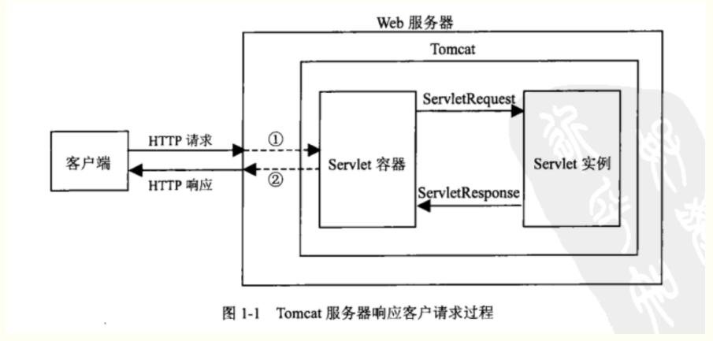

> ①：Tomcat将http请求文本接收并解析，然后封装成HttpServletRequest类型的request对象，所有的HTTP头数据读可以通过request对象调用对应的方法查询到。

> ②：Tomcat同时会要响应的信息封装为HttpServletResponse类型的response对象，通过设置response属性就可以控制要输出到浏览器的内容，然后将response交给tomcat，tomcat就会将其变成响应文本的格式发送给浏览器


> Java Servlet API 是Tomcat和servlet之间的接口，它定义了serlvet的各种方法，还定义了Servlet容器（==Tomcat==）传送给Servlet的对象类，其中最重要的就是==ServletRequest和ServletResponse==。所以说我们在编写servlet时，需要实现Servlet接口，按照其规范进行操作。


> <font color="red">通常情况下，编写一个Java类,继承HttpServlet类（实现的servlet接口），相当于把该java类与Tomcat（Servlet容器）进行了关联。</font>


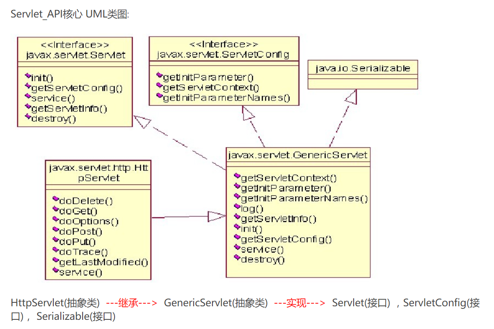


### 3.创建Servlet,与配置Servlet（把servlet对象注入到Servlet容器中）：

1. 创建Servlet（继承HttpServlet类，并重写该类的方法）：

```java
public class myservlet extends HttpServlet{

	@Override
	protected void doGet(HttpServletRequest request, HttpServletResponse response) throws ServletException, IOException {
		System.out.println("this is 重写HttpServlet的方法,  处理get类型的请求");
	}

	@Override
	protected void doPost(HttpServletRequest request, HttpServletResponse response) throws ServletException, IOException {
		System.out.println("this is 重写HttpServlet的方法， 处理post类型的请求");
	}

	@Override
	public void init() throws ServletException {
		System.out.println("this is 重写GenericServlet的方法，  Servlet对象的初始化方法");
	}

	@Override
	public void destroy() {
		System.out.println("this is 重写GenericServlet的方法 , Servlet对象的销毁方法");
	}
	
	
}
```


2. 配置Servlet(在web.xml文件):
<font color="red">配置Servlet，主要用于把创建的Servlet注入到Servlet容器（Tomcat）中。
让浏览器发出的请求知道到达哪个servlet，也就是让tomcat将封装好的request找到对应的servlet让其使用
</font>


web.xml
```xml
<!--
配置格式：
  <servlet>
  	<servlet-name> servlet的名称 </servlet-name>
  	<servlet-class> servlet的完整类名 </servlet-class>
  </servlet>
  
  <servlet-mapping>
  	<servlet-name> servlet的名称 </servlet-name>
  	<url-pattern>  访问的 url 的地址,浏览器通过它找到对应的servlet </url-pattern>
  </servlet-mapping>

-->

  <servlet>
  	<servlet-name>myservlet</servlet-name>
  	<servlet-class>com.servlet.myservlet</servlet-class>
  </servlet>
  
  <servlet-mapping>
  	<servlet-name>myservlet</servlet-name>
  	<url-pattern>/mys</url-pattern>
  </servlet-mapping>
```

**浏览器 调用servlet的步骤：**
&emsp;&emsp;①：首先浏览器通过http://localhost:8080/blog_jsp/mys来找到web.xml中的url-pattern。
&emsp;&emsp;②：匹配到了url-pattern后，就会找到servlet的名字myservlet，知道了名字，就可以通过servlet-name找到第三步。
&emsp;&emsp;③：到了第三步，也就能够知道servlet类的位置了。然后到其中找到对应的处理方式进行处理。


3. 使用Servlet处理表单数据：
  
①：创建servlet（修改上面例子中的servlet）
```java
public class myservlet extends HttpServlet{

	@Override
	protected void doGet(HttpServletRequest request, HttpServletResponse response) throws ServletException, IOException {
		System.out.println("this is 重写HttpServlet的方法,  处理get类型的请求");
	}

	@Override
	protected void doPost(HttpServletRequest request, HttpServletResponse response) throws ServletException, IOException {
		request.setCharacterEncoding("utf-8");                      //设置请求的编码格式,防止中文乱码。
		response.setContentType("text/html;charset=utf-8");         //设置响应的编码格式,防止中文乱码。
		
		String name=request.getParameter("name");
		Integer age=Integer.valueOf(request.getParameter("age"));
		
		System.out.println("姓名 ："+name+",  年龄："+age);
		
		PrintWriter outp = response.getWriter();      //从response 中获取输出流对象。
		outp.println("姓名 ："+name+",  年龄："+age);     //输出字符串给浏览器
		
		outp.flush();                                 //刷新输出流
		outp.close();         						  //关闭输出流		
		
	}

}
```

②：编写jsp中的表单：

```jsp
<form action="mys" method="post">

名字：<input type="text" name="name">
年龄：<input type="text" name="age" />
<input type="submit" value="提交" />

</form>
```


<font color="red">注意：action属性的值 是 表单提交的servlet的地址，即配置文件（web.xml）中的Servlet的 URL 映射值</font>

```xml
 <servlet-mapping>
  	<servlet-name>myservlet</servlet-name>
  	<url-pattern>/mys</url-pattern>
  </servlet-mapping>
  
```


③: 运行
开启tomcat 服务器，运行index.jsp文件。
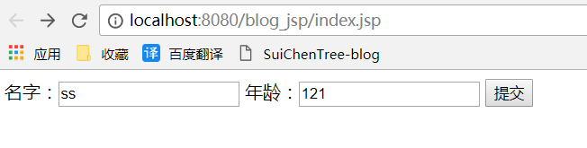


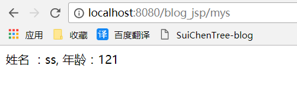


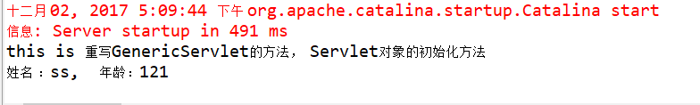

<font color="red">注意：浏览器的地址变化，从blog_jsp/index.jsp  ----> blog_jsp/mys</font>


④：补充
>当tomcat服务器启动，服务器会根据web.xml的信息，通过调用servlet的初始化方法，来创建servlet。


### 4.servlet的生命周期：
Servlet 生命周期可被定义为从创建直到毁灭的整个过程。以下是 Servlet 遵循的过程：
①：Servlet 通过调用 init () 方法进行初始化。
②：Servlet 调用 service() 方法来处理客户端的请求。
③：Servlet 通过调用 destroy() 方法终止（结束）。
④：最后，Servlet 是由 JVM 的垃圾回收器进行垃圾回收的。


服务器启动时(web.xml中配置load-on-startup=1，默认为0)或者第一次请求该servlet时，就会初始化一个Servlet对象，也就是会执行初始化方法init(ServletConfig conf).

该servlet对象去处理所有客户端请求，在service(ServletRequest req，ServletResponse res)方法中执行

最后服务器关闭时，才会销毁这个servlet对象，执行destroy()方法。

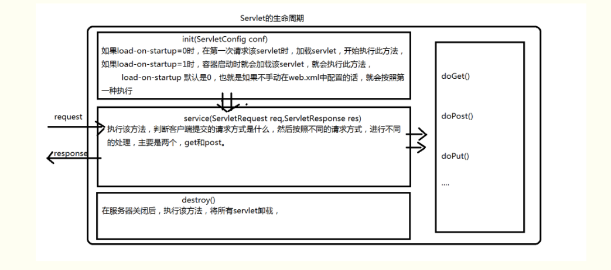


### 5.servlet编写过滤器（Filter 过滤器）：
Servlet 过滤器是可用于 Servlet 编程的 Java 类，有以下目的：
①：在客户端的请求访问数据库，后端资源之前，拦截这些请求。
②：在服务器的响应发送回客户端之前，处理这些响应。

<font color="red">过滤器被部署在配置在 web.xml 中，然后映射到web.xml中的 Servlet。
当 Web 容器启动 Web 应用程序时，它会为您在web.xml中声明的每一个过滤器创建一个实例。
该过滤器执行的顺序是按它们在部署描述符中声明的顺序。</font>

1. 创建过滤器并配置：
**过滤器是一个实现了 javax.servlet.Filter 接口的 Java 类。**

```java
public class LogFilter implements Filter{

	@Override
	public void destroy() {
		System.out.println("LogFilter  destroy");
		
	}
	
	/*
	 * 在该方法中实现过滤操作。
	 * 请求过滤后，需要把请求释放，向下传递。
	 * */
	@Override
	public void doFilter(ServletRequest request, ServletResponse response, FilterChain chain)
			throws IOException, ServletException {
		System.out.println("LogFilter  doFilter");
		
		chain.doFilter(request, response);            //把过滤器拦截的请求释放，向下传递
		
	}

	@Override
	public void init(FilterConfig arg0) throws ServletException {
		System.out.println("LogFilter  init");
		
	}

}
```

web.xml
```xml
<filter>
	<filter-name>LoginFilter</filter-name>
	<filter-class>com.filter.LogFilter</filter-class>
</filter>

<filter-mapping>
   <filter-name>LoginFilter</filter-name>
   <url-pattern>/*</url-pattern>
   <!--过滤器的URL映射-->
</filter-mapping>
```

注意：
<font color="blue">filter-mapping标签用于把过滤器和URL关联，而URL 又与servlet 关联。</font>

①：/* 表示对所有是servlet 都进行过滤。在少数的 Servlet 上应用过滤器，可以指定一个特定的 Servlet 路径

②：<font color="red">web.xml 中的 filter-mapping 元素的顺序决定了 Web 容器应用过滤器到 Servlet 的顺序。若要反转过滤器的顺序，您只需要在 web.xml 文件中反转 filter-mapping 元素即可。


<br/>

2. 多个过滤器的运行流程：
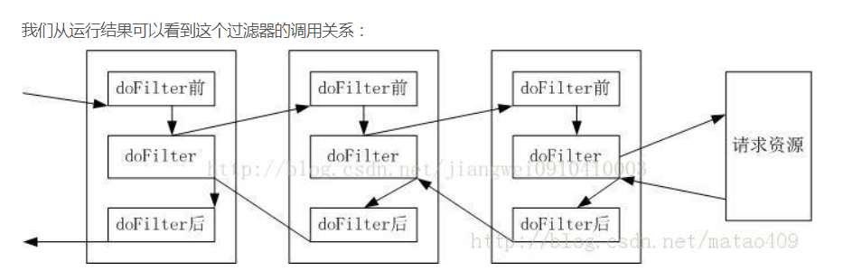

<br/>


3. 实现字符编码过滤器：

①：创建过滤器（修改上面的过滤器）：
```java
public class LogFilter implements Filter{

	@Override
	public void destroy() {
		System.out.println("LogFilter  destroy");
		
	}
	
	/*
	 * 在该方法中实现过滤操作。
	 * 请求过滤后，需要把请求释放，向下传递。
	 * */
	@Override
	public void doFilter(ServletRequest request, ServletResponse response, FilterChain chain)
			throws IOException, ServletException {
		System.out.println("LogFilter  doFilter");
		
		request.setCharacterEncoding("utf-8");     //设置request的编码格式
		response.setContentType("text/html;charset=utf-8");
		
		
		chain.doFilter(request, response);            //把过滤器拦截的请求释放，向下传递
		
	}

	@Override
	public void init(FilterConfig arg0) throws ServletException {
		System.out.println("LogFilter  init");
		
	}

}
```

②：创建jsp：
```jsp
<form action="mys" method="post">

名字：<input type="text" name="name">
年龄：<input type="text" name="age" />
<input type="submit" value="提交" />

</form>
```


③：编写servlet：
```java
public class myservlet extends HttpServlet{

	@Override
	protected void doGet(HttpServletRequest request, HttpServletResponse response) throws ServletException, IOException {
		System.out.println("this is 重写HttpServlet的方法,  处理get类型的请求");
	}

	@Override
	protected void doPost(HttpServletRequest request, HttpServletResponse response) throws ServletException, IOException {
	
		
		String name=request.getParameter("name");
		Integer age=Integer.valueOf(request.getParameter("age"));
		
		System.out.println("姓名 ："+name+",  年龄："+age);
		
		PrintWriter outp = response.getWriter();      //从response 中获取输出流对象。
		outp.println("姓名 ："+name+",  年龄："+age);     //输出字符串给浏览器
		
		outp.flush();                                 //刷新输出流
		outp.close();         						  //关闭输出流		
		
	}

	@Override
	public void init() throws ServletException {
		System.out.println("this is 重写GenericServlet的方法，  Servlet对象的初始化方法");
	}

	@Override
	public void destroy() {
		System.out.println("this is 重写GenericServlet的方法 , Servlet对象的销毁方法");
	}
	
	
}
```


④：运行结果：
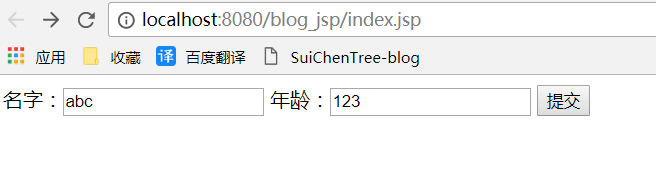

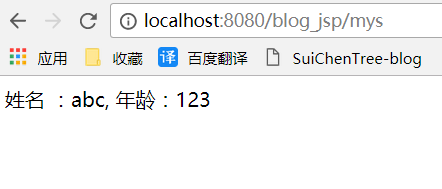

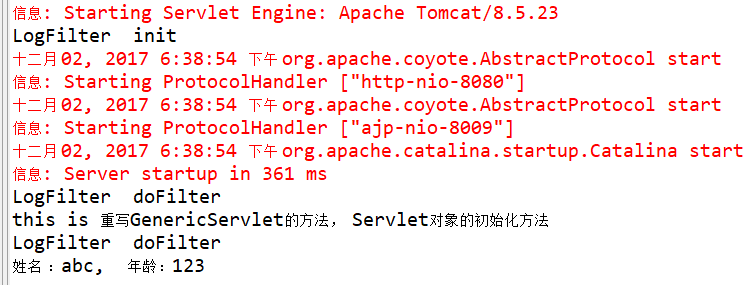

<br/>

4. 补充：
**在doFilter() 方法中，当业务逻辑处理完成。需要通过FilterChain 对象的 doFilter（）方法将请求传递到下一个过滤器或目标资源中，否则出现错误。**


### 6.servlet 对于异常的处理：
当一个 Servlet 抛出一个异常时。web.xml 使用 error-page 元素来指定对特定异常 或 HTTP 状态码 作出相应的 Servlet 调用。

web.xml
```xml
  <servlet>
  	<servlet-name>myservlet</servlet-name>
  	<servlet-class>com.servlet.myservlet</servlet-class>
  </servlet>
  
  <servlet-mapping>
  	<servlet-name>myservlet</servlet-name>
  	<url-pattern>/mys</url-pattern>
  </servlet-mapping>


<!-- error-code 相关的错误页面 
	当状态码为404 时，URL映射为 /mys 的servlet 将被调用

-->
<error-page>
    <error-code>404</error-code>
    <location>/mys</location>
</error-page>

<!-- exception-type 相关的错误页面
	当该servlet 出现 IOException时，URL映射为 /mys 的servlet 将被调用
 -->
<error-page>
    <exception-type>java.io.IOException</exception-type >
    <location>/mys</location>
</error-page>
```

<font color="red">如果您想对所有的异常有一个通用的错误处理程序，那么应该定义下面的 error-page，而不是为每个异常定义单独的 error-page 元素.</font>

```xml
<error-page>
    <exception-type>java.lang.Throwable</exception-type >
    <location>/mys</location>
</error-page>
```

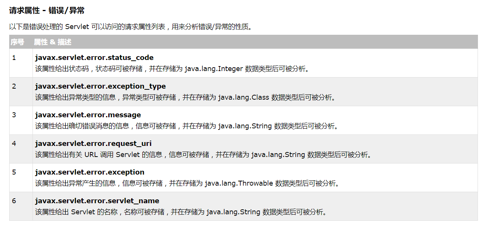


## EL表达式 与 JSTL标签库：

### 1.EL(表达式语言，Epression Language)
EL主要用于简化jsp中对 对象的引用。

1. EL表达式语法（中间为合法的表达式）：
`${~ ~ ~}  `  

例如：在jsp页面上显示一段话。
以前：`out.print("i am xiaoming");`
现在：`${"i am xiaoming"}`


2. EL的运算符：
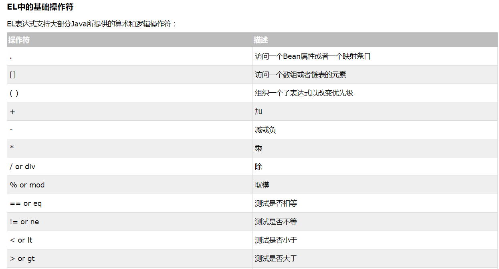
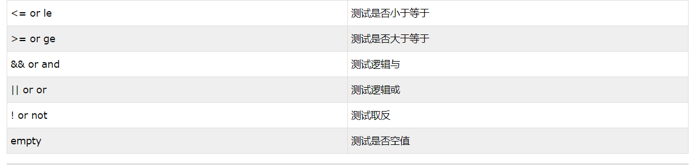
<font color="red">注意：EL的 “ + ”运算符，不能把两个字符串连接。若两个字符串无法转化为int 类型，则抛出异常。</font>

<br/>

3. EL 操作jsp的内置对象：
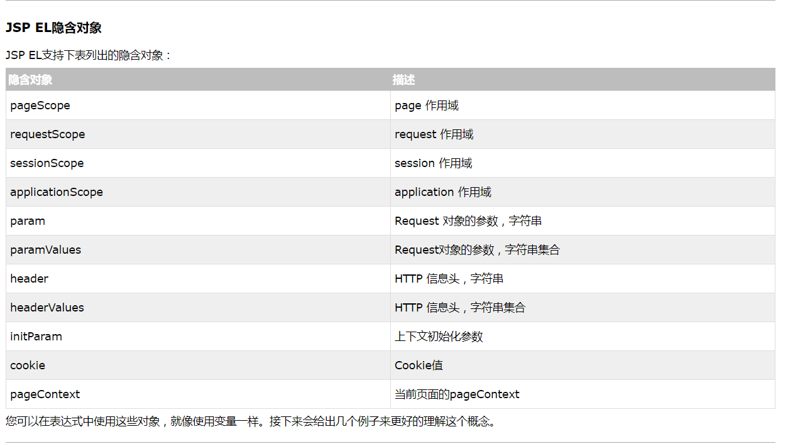


```jsp
<body>

${1+2}
${requestScope.user}    <!--获取request 作用域的 user属性-->

</body> 
```


### 2.JSTL
JSP 标准标签库（jstl）,是一个JSP标签集合，它封装了JSP应用的通用核心功能。

1. 使用前提：
①：在WEB-INF下的lib文件夹中加入<font color="red">jstl-1.2.jar 和 standard-1.1.2.jar</font>
②：在需要使用jstl的jsp页面上要引入：
<%@ tagliburi="http://java.sun.com/jsp/jstl/core" prefix="c"%> 
③：使用jstl

<br/>

2. 核心标签：
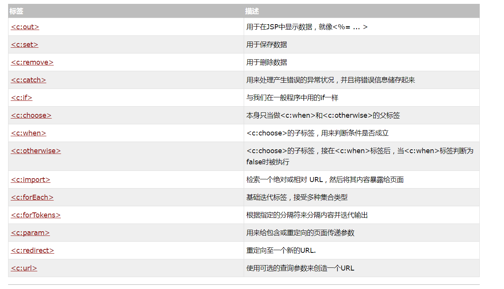

```jsp
	
	<!--c:out标签
		格式： <c:out value="表达式">
	
	 -->
	<c:out value="123"/>
	
	<!--c:set 变量设置标签, c:remove 标签
	格式：<c:set var="变量名" value="变量值" scope="变量的作用域，默认为page"/>

	<c:remove var="移除的变量名" scope="该变量的范围"/>
	-->
	<c:set value="root" var="userid"/>
	userid:${userid }
	<c:remove var="userid"/>
	userid:${userid }


<!--
	流程控制标签：

<c:if> ：判断表达式的值，如果表达式的值为真则执行其主体内容。

<c:choose>和<c:when>和<c:otherwise> 标签：
	<c:choose>标签与Java switch语句的功能一样，用于在众多选项中做出选择。
	switch语句中有case，而<c:choose>标签中对应有<c:when>，
	switch语句中有default，而<c:choose>标签中有<c:otherwise>。
	
	<c:when>标签的test属性，用于条件判断。

	
-->

<c:set var="salary" scope="session" value="${2000*2}"/>
<c:if test="${salary > 2000}">
   <p>我的工资为: <c:out value="${salary}"/><p>
</c:if>


<c:set var="salary" scope="session" value="${2000*2}"/>
<p>你的工资为 : <c:out value="${salary}"/></p>
<c:choose>
    <c:when test="${salary <= 0}">
       太惨了。
    </c:when>
    <c:when test="${salary > 1000}">
       不错的薪水，还能生活。
    </c:when>
    <c:otherwise>
        什么都没有。
    </c:otherwise>
</c:choose>


<!--
循环标签：<c:forEach>  ,  <c:forTokens>
	这两个标签封装了Java中的for，while，do-while循环。
	相比而言，<c:forEach>标签是更加通用的标签，因为它迭代一个集合中的对象。
	<c:forTokens>标签将字符串分隔为一个子串数组然后迭代它们。


-->

<c:forEach var="i" begin="1" end="5">
   Item <c:out value="${i}"/><p>
</c:forEach>


<c:forTokens items="google,w3cschool,taobao" delims="," var="name">
   <c:out value="${name}"/><p>
</c:forTokens>

```

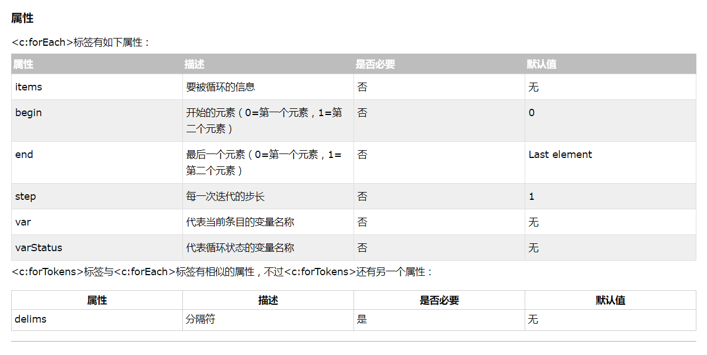


3. 补充：
jstl 与 el 没有什么关系，但一般把它们配合在一起使用。jstl 与 el 的配合对于简化jsp页面比单独使用更强大。


## 参考资料：
[Java Web(一) Servlet详解！！- - 一杯凉茶 - 博客园](http://www.cnblogs.com/whgk/p/6399262.html)
[Java Web(一) Servlet过滤器详解！！- - 一杯凉茶 - 博客园](http://blog.csdn.net/jiangwei0910410003/article/details/23372847)
[w3school](https://www.w3cschool.cn/)